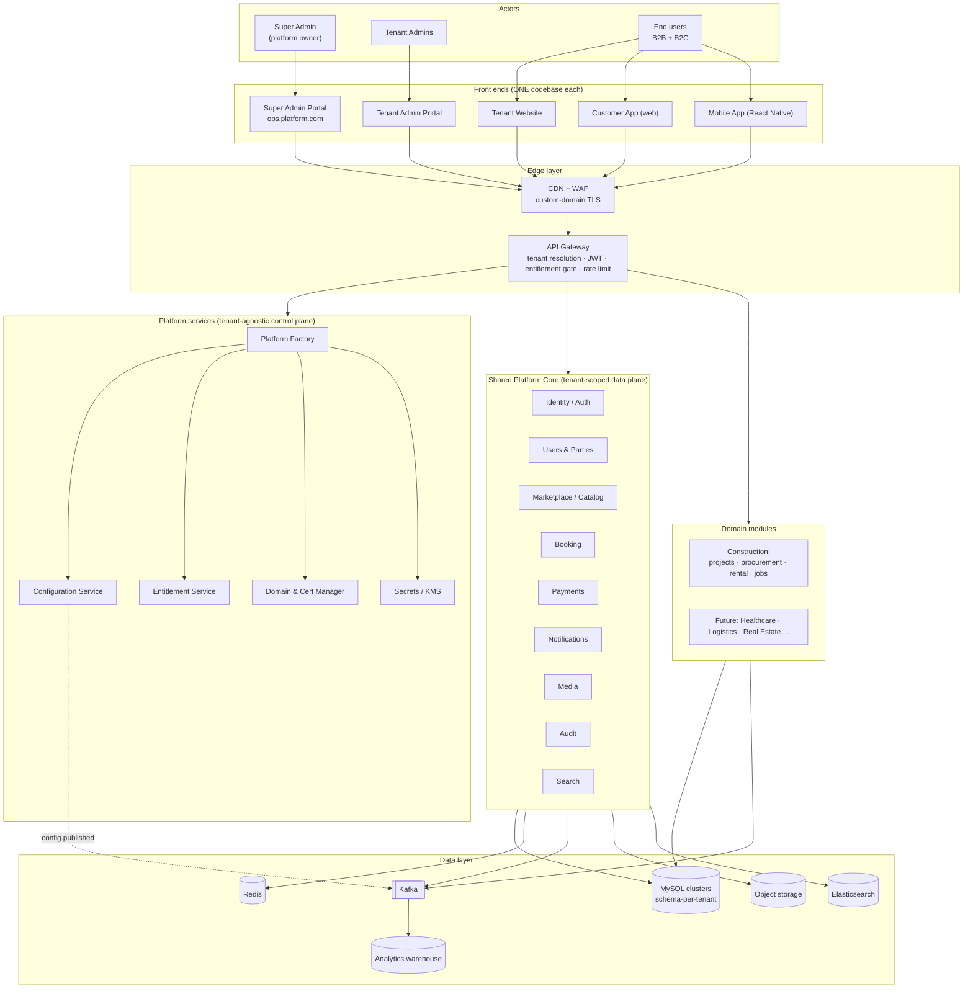
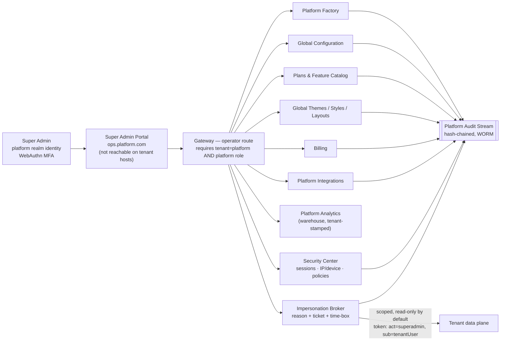
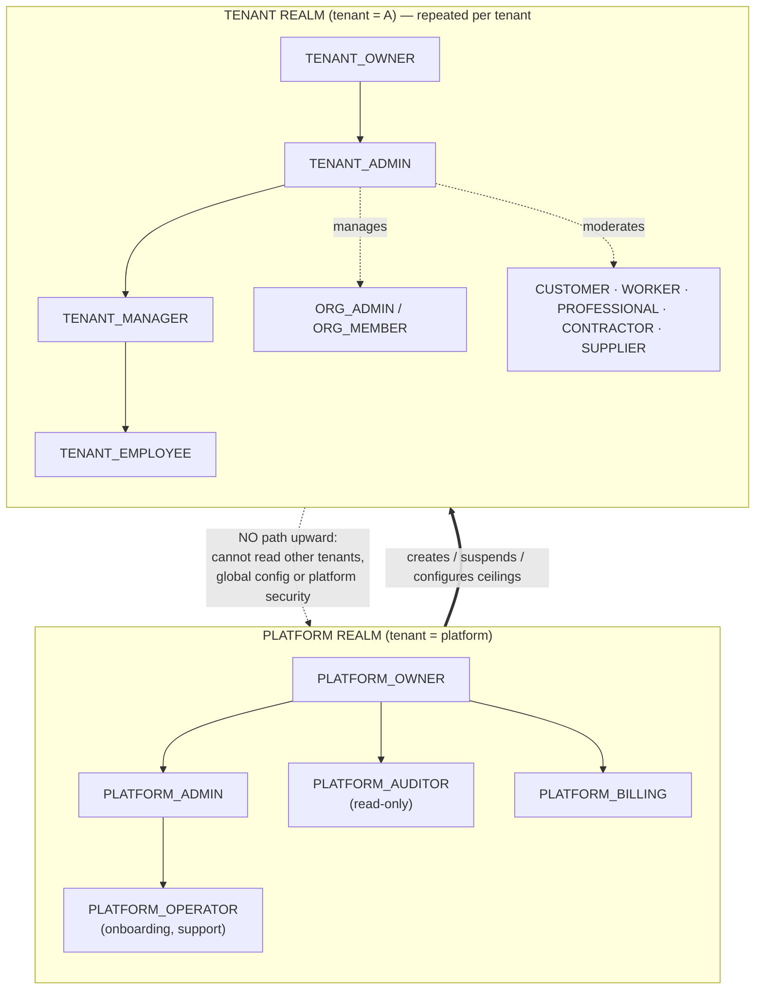

# 01 — Architecture Overview, Business Architecture & Admin Experience

## 1. Architecture overview

### 1.1 Architectural style

| Concern | Decision | Why | Alternatives considered |
|---|---|---|---|
| Deployment topology | **Microservices** (Spring Boot 3 / Java 21), the existing set plus four new platform services | These already exist and are verified live. Tenancy primitives (`tenant-common`) are already a shared starter. | A modular monolith would be simpler to operate, but the migration cost now outweighs the benefit. |
| Tenancy | **Pooled compute with isolated data**: shared service instances, schema-per-tenant data, and a promotion path to dedicated DBs and cells | Gives strong isolation at pooled cost. A missed filter fails loudly (wrong schema) instead of silently. | Silo-per-tenant (cost prohibitive for small tenants); pure pooled shared-schema (weakest isolation). See 02 §6. |
| Customisation | **Configuration, not code**: registry-by-key for UI, typed config documents for rules | Keeps one build. Onboarding needs no deploy. | Per-tenant forks or branches fail at N > 3. Plugin code per tenant is a security and ops risk. |
| Integration | **Synchronous REST** through the gateway for queries and commands, **Kafka** events for state propagation | Already in use. Tenant headers propagate through both (Feign interceptor, Kafka interceptors). | — |
| Industry extensibility | **Domain modules** on a domain-agnostic core | R15: construction is the first domain, not the only one | Hard-coding construction concepts into the core |

### 1.2 Service landscape (target)

| Layer | Service | Status | Responsibility |
|---|---|---|---|
| Edge | CDN + WAF, Nginx/Ingress | exists (nginx) | TLS, custom-domain certificates, static assets, WAF, DDoS protection |
| Edge | `api-gateway` | exists | Tenant resolution, JWT validation, tenant claim cross-check, entitlement gate, rate limiting |
| Platform | `tenant-service` → **Platform Factory Service** | evolve | Tenant registry, lifecycle, wizard drafts, provisioning orchestration |
| Platform | **Configuration Service** (evolved from admin-service `uiconfig`) | new/evolve | Versioned config documents, the scope hierarchy, resolution, publish and rollback |
| Platform | **Entitlement Service** | new (can start inside Platform Factory) | Plans, subscriptions, feature catalog, entitlements, quotas |
| Platform | **Domain & Certificate Manager** | new (can start inside Platform Factory) | Custom domain verification, ACME issuance, the host → tenant map |
| Platform | **Secrets broker** (Vault / cloud KMS) | new infra | Tenant integration credentials, envelope keys |
| Platform | **Media Service** | new | Tenant-scoped object storage, signed URLs, scanning |
| Core | `auth-service` (Identity) | exists | Realms, credentials, MFA, sessions, tokens |
| Core | `user-service`, `notification-service`, `payment-service`, `messaging-service`, `support-service`, `audit-service`, `search-service` | exist | Horizontal capabilities |
| Domain (Construction) | `booking-service`, `project-service`, `review-service`, plus new `procurement-service`, `catalog-service`, `rental-service`, `jobs-service` | partial | Construction marketplace and B2B flows |

---

## 2. Diagram 1 — Overall Platform Architecture



**How to read it.** The *control plane* (Platform Factory, Configuration, Entitlement, Domain,
Secrets) decides *what a tenant is*. The *data plane* (Core and Domain modules) serves *what a
tenant does*. Control-plane services hold global and cross-tenant records. Data-plane services hold
only tenant-scoped records. This split is the first line of isolation: a data-plane bug cannot
enumerate tenants, because the data plane has no access to the registry beyond its own context.

---

## 3. Business architecture

### 3.1 Business actors and value streams

| Actor | Level | Goal | Value stream |
|---|---|---|---|
| Platform owner (Super Admin) | PLATFORM/GLOBAL | Run many tenant platforms profitably | *Sell plan → onboard tenant → operate → bill → renew* |
| Tenant (company) | TENANT | Run a branded construction marketplace or business network | *Configure brand → onboard supply → attract demand → transact → earn commission* |
| Tenant Admin / Manager / Employee | TENANT | Operate the tenant's business | *Verify parties → moderate → resolve disputes → report* |
| Organization (supplier, contractor, manufacturer...) | TENANT → ORGANIZATION | Sell to or buy from other organizations and consumers | *RFQ → quote → PO → deliver → invoice → collect* |
| Individual provider (worker, engineer, architect...) | TENANT → USER | Get booked | *Profile → verified → booked → deliver → reviewed → paid* |
| Customer (B2C) | TENANT → USER | Get construction work done | *Search → compare → quote/book → pay → review* |

### 3.2 Revenue model (the platform owner's business)

| Stream | Mechanism | Architectural implication |
|---|---|---|
| Subscription | Plan per tenant (Starter/Professional/Enterprise/Custom) | Entitlement Service, billing integration (08) |
| Add-ons | Per-feature (AI, WhatsApp, Video) | Add-on entitlements with independent lifecycles |
| Usage | Metered quotas (bookings/month, SMS, storage, AI tokens) | Usage metering pipeline (08 §6) |
| Take rate (optional) | Platform share of the tenant's commission | Commission split rules at GLOBAL level, locked from tenant override |
| Dedicated infrastructure | Enterprise isolated tier | Tiered deployment (02 §6) |

### 3.3 Business capability map

```
Platform capabilities (owned by Super Admin)
├── Tenant Management ........ create, configure, publish, suspend, archive
├── Commercial ............... plans, add-ons, billing, invoicing tenants
├── Global Configuration ..... defaults, themes, styles, layouts, templates, master data
├── Platform Security ........ identity realms, policies, audit, compliance
└── Platform Operations ...... observability, capacity, DR, support escalation

Tenant capabilities (owned by Tenant Admin)
├── Brand & Experience ....... branding, theme selection, layout, navigation, content
├── Party Management ......... customers, organizations, workers, professionals, KYC
├── Catalog .................. services, products, materials, machinery
├── Commerce ................. bookings, quotations, orders, POs, invoices, payments
├── Engagement ............... reviews, social content, messaging, notifications
├── Rules .................... commission, cancellation, refund, tax, approvals
└── Insight .................. reports, analytics
```

---

## 4. Diagram 2 — Super Admin Architecture



**Key decisions**

1. **Super Admin is a separate identity realm** (`platform`), not a role inside a tenant. A tenant's
   `SUPER_ADMIN` role, which exists today in seed data, is renamed `TENANT_OWNER` in the target
   model so the two are never confused. See 06 §2.
2. **The Super Admin portal has its own host** and is served only there. Tenant hosts do not route
   to operator APIs at all. They return 404, not 403, which avoids advertising that the endpoints exist.
3. **The Super Admin never edits tenant business data directly.** Access to the data plane goes
   only through the Impersonation Broker, which is audited with both identities (actor and subject).
4. **Platform analytics read the warehouse, not tenant schemas.** This removes the need for
   cross-schema queries in production OLTP.

---

## 5. Diagram 19 — Super Admin vs Tenant Admin



| Dimension | Super Admin (platform realm) | Tenant Admin (tenant realm) |
|---|---|---|
| Identity store | Platform realm. Separate user table and separate signing key id (`kid`). | Tenant realm, in the tenant's identity schema |
| Login host | `ops.platform.com` only | Tenant host(s): `admin.tenant-a.platform.com`, `admin.company-a.com` |
| MFA | Mandatory, phishing-resistant (WebAuthn/passkey). TOTP only as break-glass. | Policy: required for admin roles, optional or required for others per tenant setting |
| Scope | All tenants' *control-plane* records. Data plane only via impersonation. | Own tenant only, bounded by plan entitlements |
| Can change | Global config, plans, catalog, themes library, tenant lifecycle, platform security | Tenant config keys whose policy allows TENANT level, own users and roles, own rules within global bounds |
| Cannot change | Tenant business data without impersonation. Audit records, ever. | Other tenants, global config, platform security, own plan, locked keys |
| Session | 15 min idle, 8 h absolute, IP/device bound, re-auth for sensitive actions | Tenant policy within platform ceilings |
| Audit | Platform audit stream (every action) | Tenant audit stream (configuration and privileged actions) |

---

## 6. Admin experience

### 6.1 Super Admin Portal: information architecture

| Section | Pages | Notes |
|---|---|---|
| Home | Platform health, tenant counts by state, MRR, incidents, pending approvals | |
| **Tenants** | List (filter by state, plan, tier, cell), Create Platform wizard, Tenant detail (tabs: Overview, Domains, Branding, Experience, Features, Rules, Integrations, Subscription, Users-summary, Versions, Audit), Lifecycle actions | Detail pages show *effective* config with the provenance of each value (global/domain/tenant) |
| Plans & Features | Feature catalog, plans, add-ons, plan-to-feature matrix, quotas | Plan versions are immutable once subscribed |
| Experience Library | Themes (token sets), UI style packs, layout templates, navigation templates, notification templates | Global assets that tenants select from |
| Global Configuration | Config keys by domain, with override policy editor | Each key shows which tenants override it |
| Domains | Master data (countries, currencies, units, construction categories) | GLOBAL data (02 §3) |
| Security | Platform users, roles, sessions, IP allowlists, policies, impersonation log | |
| Billing | Invoices to tenants, dunning, usage | |
| Integrations | Platform-level providers (default email, SMS, maps) | Tenants may inherit or bring their own |
| Analytics | Cross-tenant KPIs from the warehouse | |
| Audit | Platform audit explorer with chain-verification status | |

### 6.2 Tenant Admin Portal: information architecture

| Section | Pages | Gated by |
|---|---|---|
| Dashboard | KPIs configured by the tenant's dashboard layout | — |
| Company | Tenant profile, legal details, tax IDs | — |
| Users & Roles | Users, invitations, roles, permission sets, MFA policy | — |
| Organizations | Suppliers, contractors, manufacturers..., relationships, verification | `b2b` |
| Customers | B2C customers | `b2c` |
| Workforce | Workers, professionals, employees, KYC queue | `marketplace` |
| Catalog | Services, products, materials, machinery, categories, pricing | per module |
| Operations | Bookings, quotations, orders, POs, deliveries, invoices, disputes | per module |
| Experience | Branding, theme (select + tune), UI style, layouts per surface, navigation, pages (CMS), forms | the plan's `experience.*` entitlements |
| Features | Toggle features *within* entitlement, see locked/upsell | Entitlement Service |
| Business Rules | Commission, cancellation, refund, tax, approvals, verification, pricing | Keys whose override policy allows TENANT |
| Notifications | Templates, channels, sender identities, preferences defaults | per channel entitlement |
| Integrations | Payment, email, SMS, WhatsApp, maps, storage, AI (BYO credentials) | per integration entitlement |
| Reports & Analytics | Tenant-scoped only | `analytics` |
| Versions & Audit | Configuration history, diff, rollback request, tenant audit log | — |

**UX principle for both portals:** every configuration screen shows three things side by side:
the *current effective value*, *where it comes from* (inherited or overridden, and at which level),
and *the draft value*. Admins must never have to guess why something looks the way it does.
