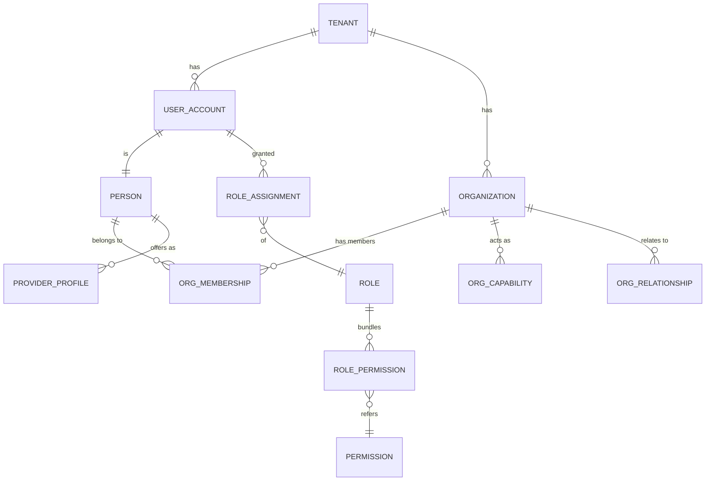
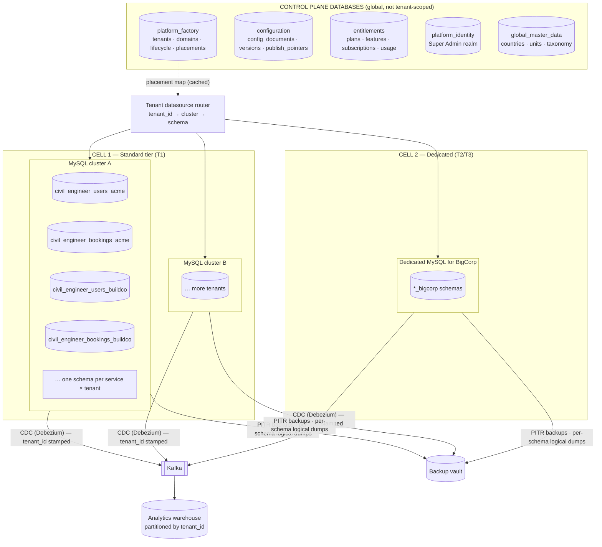

# 02 — Tenant Architecture, Data Architecture & Database Strategy

## 1. Tenant model

A **tenant** is the unit of isolation, configuration, billing and lifecycle. Every tenant has:

| Attribute | Mutability | Purpose |
|---|---|---|
| `tenant_id` | **Immutable.** An opaque ULID generated by the platform. | Primary identity in every tenant-owned record, token, cache key, storage path and event |
| `tenant_key` | **Immutable.** A slug, `[a-z][a-z0-9]{1,30}`. | Names schemas (`<prefix>_<tenant_key>`), as today. Human-readable. |
| Subdomain(s), custom domain(s) | Mutable (via the Domain Manager) | Routing only. **Never** used as identity. |
| Display name, legal name, branding | Mutable, versioned | Experience |
| `status` | Lifecycle state machine | Gates traffic |
| `tier` | `STANDARD` / `DEDICATED_DB` / `DEDICATED_CELL` | Placement |
| `cell_id` | Changes only via a controlled migration | Which deployment stamp serves it |

> **Why both an id and a key?** The existing system uses `tenant_key` as identity. That works
> because the key is immutable. Adding an opaque `tenant_id` means that renaming what the business
> sees (subdomain, brand) never touches identity. It also means that data exported to the warehouse,
> logs and third parties does not leak the customer's name. Until migration is complete, `tenant_key`
> keeps working as a secondary identifier, and the two are mapped 1:1 in the registry.

---

## 2. Diagram 6 — Tenant Isolation (defence in depth)

```mermaid
flowchart TB
    R["Incoming request<br/>Host: admin.company-a.com"] --> L1

    subgraph L1["Layer 1 — Edge"]
        E1["Host → tenant_id lookup<br/>unknown host → 404"]
        E2["Strip any client-supplied<br/>X-Tenant-* headers"]
    end
    L1 --> L2
    subgraph L2["Layer 2 — Gateway"]
        G1["JWT tenant claim == resolved tenant<br/>else 403"]
        G2["Tenant status ACTIVE<br/>else 403/423"]
        G3["Module/feature entitled<br/>else 404"]
        G4["Mint signed internal context token<br/>(tenant, user, roles, perms)"]
    end
    L2 --> L3
    subgraph L3["Layer 3 — Service"]
        S1["Verify internal token signature<br/>(reject raw headers)"]
        S2["TenantContext bound<br/>(no ambient default)"]
        S3["Permission check<br/>(RBAC + resource ownership)"]
    end
    L3 --> L4
    subgraph L4["Layer 4 — Persistence"]
        D1["Connection switched to tenant schema<br/>reset on release"]
        D2["Entity tenant_id asserted on write<br/>Hibernate filter on read"]
        D3["DB user may only access<br/>its tenant-pattern schemas"]
    end
    L4 --> L5
    subgraph L5["Layer 5 — Side channels"]
        X1["Cache keys prefixed t:{tenantId}"]
        X2["Storage prefix tenants/{tenantId}/ + signed URLs"]
        X3["Kafka tenant header required, missing → drop"]
        X4["Search index filter / index-per-tenant"]
        X5["Logs & traces carry tenant_id"]
    end
    L5 --> AUD[["Audit: cross-tenant attempt events → security alert"]]
```

**Principle:** each layer must independently stop a cross-tenant access, *assuming every other
layer has failed*. Layers 1–4 already exist in part (see README §4). The additions are the signed
internal context (L2.4/L3.1), the `tenant_id` assertion (L4.2) and the systematic side-channel
controls (L5).

### 2.1 Isolation matrix by data class

| Record type | Isolation mechanism | `tenant_id` column | Notes |
|---|---|---|---|
| Users, credentials, sessions | Tenant identity schema | **Mandatory** | Same email may exist in many tenants. This is independent identities, by design. |
| Organizations (companies inside a tenant) | Tenant schema | **Mandatory** | Plus `organization_id` for organization-scoped rows |
| Workers, professionals, contractors (profiles) | Tenant schema | **Mandatory** | |
| Services, products, materials, machinery | Tenant schema | **Mandatory** | May reference GLOBAL master data by code |
| Bookings, quotations, orders, POs, deliveries | Tenant schema | **Mandatory** | |
| Payments, invoices, wallets, escrow | Tenant schema | **Mandatory** | Payment provider refs also stored per tenant |
| Reviews, social content | Tenant schema | **Mandatory** | |
| Media metadata | Tenant schema; bytes in `tenants/{tenantId}/` | **Mandatory** | |
| Notifications, templates (tenant overrides) | Tenant schema | **Mandatory** | |
| CMS content, forms | Tenant schema | **Mandatory** | |
| Reports, analytics facts | Warehouse | **Mandatory** (partition/cluster key) | Row-level policy in the BI layer |
| Tenant audit events | Audit store, tenant-partitioned | **Mandatory** | |
| Tenant configuration (overrides) | Configuration Service store | **Mandatory** (as the scope) | Control plane. See §3. |
| Tenant registry, domains, subscriptions | Platform Factory store | It *is* the tenant row, or an FK to it | Control plane |

---

## 3. Data classification

| Class | Definition | Has `tenant_id`? | Who writes | Who reads | Examples |
|---|---|---|---|---|---|
| **GLOBAL DATA** | Owned by the platform and identical for all tenants. Not customer data. | **No.** Adding one would imply ownership and invite accidental tenant filtering. | Super Admin / engineering | Everyone (read-only for tenants) | Countries, states, currencies, timezones, languages, units of measure, construction category taxonomy, HSN/SAC codes, the feature catalog, plans, theme/style/layout library, default templates |
| **TENANT DATA** | Created by or for one tenant. Never visible to another. | **Yes, mandatory, NOT NULL, indexed, immutable after insert** | The tenant's users and services | That tenant only (+ Super Admin via impersonation or the warehouse) | Everything in §2.1 |
| **SHARED DATA** | Platform-owned records that *reference* tenants but are about the relationship between platform and tenant | Yes, as an FK. Stored in the control plane, not in tenant schemas. | Platform services | Platform, plus the owning tenant for its own row (read-only projection) | Tenant registry, subscriptions, invoices *to* tenants, domain records, usage meters, the platform audit stream |
| **TENANT OVERRIDE DATA** | A tenant's sparse overlay on a GLOBAL/DOMAIN default | Yes, as the scope key | Tenant Admin (within policy) / Super Admin | Configuration resolver | `primary_color = #0057FF` for Tenant A; a custom "Plastering" category label; a tenant-customised booking-confirmation template |

### 3.1 Rules for implementers

1. **A table either always has `tenant_id` or never has it.** Nullable `tenant_id` meaning "global"
   is **forbidden**. It turns every query into a tri-state problem, and a missed `IS NULL` branch
   leaks global rows as if they were tenant rows (or the reverse). Global and tenant variants live
   in **separate tables or stores** and are merged by the resolver.
2. Tenant data may **reference** global data by stable *code* (for example `category_code =
   "CIVIL.PLASTERING"`), never by surrogate ID. Global surrogate IDs differ between environments.
3. Tenant *extensions* of global master data (an extra category) live in a tenant table with the
   same code namespace plus a `TENANT.` prefix, so they can never collide with a later global addition.
4. Overrides are **sparse**. A tenant stores only the keys it changes. Never copy global defaults
   into a tenant at creation (see 04 §10).

### 3.2 Why also keep `tenant_id` when the schema already isolates?

| Benefit | Explanation |
|---|---|
| Defence in depth | If a pooled connection is ever handed back pointing at the wrong schema, which is the exact failure `tenant-common` guards against, the `tenant_id` assertion on write and the filter on read make it a loud error instead of a silent leak. |
| Tier mobility | Moving a tenant from schema-per-tenant to a dedicated DB, or into a pooled shared-schema tier for micro-tenants, needs no data rewrite. |
| Analytics | CDC events arrive in the warehouse already tenant-stamped. |
| Forensics | Backups, exports and logs are self-describing. |

Cost: 8–16 bytes per row and an index. This is accepted.

---

## 4. Tenant user model

### 4.1 Party model (one model for B2B and B2C)

- **USER_ACCOUNT**: a login identity in one tenant realm.
- **PERSON**: the human, with name, contact and KYC.
- **ORGANIZATION**: a company *inside* the tenant (a contractor firm, supplier, manufacturer). It is **not a tenant**.
- **ORG_CAPABILITY**: `BUYER`, `SELLER`, `SUPPLIER`, `CONTRACTOR`, `SUBCONTRACTOR`,
  `MANUFACTURER`, `DISTRIBUTOR`, `DEALER`, `SERVICE_PROVIDER`, `EQUIPMENT_PROVIDER`. An organization
  can hold many. Capabilities are verified separately.
- **PROVIDER_PROFILE**: an individual acting as `WORKER`, `LABOUR`, `CIVIL_ENGINEER`, `ARCHITECT`,
  `SURVEYOR`, `CONTRACTOR` and so on. Each has its own verification, rates and availability.

> **Decision:** "Worker", "Supplier", "Contractor" and the rest are **capabilities or profiles on a
> party**, not user *types*. A single person can be a customer on Monday and a hired surveyor on
> Tuesday. A single firm can be a buyer of cement and a seller of formwork rental. Modelling these
> as exclusive user types (the common mistake) forces duplicate accounts and breaks B2B + B2C
> coexistence (R14).

### 4.2 Tenant roles (RBAC)

Roles are **tenant-defined**. They are seeded from a GLOBAL role template, so a tenant starts with
sensible roles and may customise them. Permissions are **platform-defined** (code owns the verbs)
and gated by entitlement.

| Seeded role | Scope | Typical permissions |
|---|---|---|
| `TENANT_OWNER` | Tenant | Everything the plan permits, including billing view and transfer of ownership. Exactly one or two per tenant. |
| `TENANT_ADMIN` | Tenant | Users, roles, config, catalog, operations. No ownership transfer. |
| `TENANT_MANAGER` | Tenant or region | Operations, approvals, reports |
| `TENANT_EMPLOYEE` | Tenant or assigned queue | Assigned operational tasks (KYC review, support) |
| `ORG_ADMIN` | Organization | Manage own organization, members, catalog, quotes, POs |
| `ORG_MEMBER` | Organization | Act for the organization within assigned permissions (for example buyer-only) |
| `CUSTOMER` | Self | Search, book, pay, review |
| `PROVIDER` (+ profile type) | Self | Manage profile, availability, accept jobs |

**Permission format:** `<module>.<resource>.<action>[:<scope>]`, for example
`procurement.purchase_order.approve:org`, `booking.booking.read:own`,
`config.theme.publish:tenant`.

**Scope qualifiers:** `own` (records I created or am party to), `org` (my organization's),
`tenant` (the whole tenant), `region:{id}`.

**Separation from platform roles:** the platform realm's permission namespace is `platform.*` and
is **not assignable** in a tenant realm. The role editor never lists it, the API rejects it, and
tokens from a tenant realm are never accepted on platform routes regardless of their claims.

### 4.3 Authorization evaluation order

1. The token's realm matches the route's realm (platform vs tenant).
2. The feature is entitled and enabled for the tenant (08 §5).
3. The role grants the permission (RBAC).
4. The scope is satisfied: ownership or membership check (ReBAC-style) in the service.
5. Business-rule guards, for example "PO approval above ₹5L requires two approvers" (04 §11).

---

## 5. Tenant lifecycle

See [03 §4](03-platform-factory.md) for the state machine (Diagram 5) and the allowed-action matrix.

---

## 6. Multi-tenant database strategy

### 6.1 Comparison

| Criterion | Shared DB / Shared schema (`tenant_id` column) | Shared DB / Separate schema (**current**) | Separate database (per tenant) | Hybrid (tiered) |
|---|---|---|---|---|
| Isolation strength | Weakest. One missed predicate leaks silently. Needs RLS, which MySQL lacks. | Strong logical isolation. A wrong schema fails loudly. | Strongest short of separate hardware | Per tier |
| Cost per tenant | Lowest | Low–medium | High | Matched to plan |
| Tenant count ceiling | Very high (100k+) | Thousands per cluster (catalog, file handle and Flyway cost scale with tenants × services) | Hundreds per ops team | Very high |
| Migrations | One run | N runs per service. Needs orchestration and tolerance of partial failure. | N runs, each isolated | Mixed |
| Noisy neighbour | Worst | Shared buffer pool and IO | None | Controllable |
| Per-tenant backup/restore | Hard (row extraction) | Easy (schema dump) | Trivial | Easy |
| Data residency | Hard | Cluster-level | Easy | Easy |
| Cross-tenant analytics | Trivial SQL | Needs a fan-out or a warehouse | Needs a warehouse | Warehouse |
| Enterprise sales requirement ("our own DB") | No | Partial | Yes | Yes |

### 6.2 Recommendation: tiered hybrid, anchored on the model that already works

| Tier | For | Data placement | Compute | Upgrade trigger |
|---|---|---|---|---|
| **T0 Pooled-Micro** (future, optional) | Free trials, very small tenants when count > ~5k | Shared schema with `tenant_id` + mandatory Hibernate filter + automated leak tests | Shared | Plan upgrade or volume |
| **T1 Standard** (**default, current**) | Starter / Professional | Schema-per-tenant on a shared MySQL cluster in a shared cell | Shared | Volume or noisy-neighbour signals, Enterprise plan |
| **T2 Dedicated-DB** | Enterprise, high-volume | Tenant schemas on a dedicated MySQL cluster | Shared services, a separate connection pool per tenant datasource | Residency, compliance or scale |
| **T3 Dedicated-Cell** | Regulated or very large enterprise | A full stamp: services, DB, Redis, Kafka topics, storage bucket, optionally a separate region | Dedicated | Contract |

**Why not start T0 now?** It reintroduces the "one missed filter" risk that the schema model was
chosen to remove. That risk is only worth taking when the per-schema overhead actually hurts. The
`tenant_id` column (§3.2) keeps the option open at no extra design cost.

**Evolution path.**

1. **Now:** T1 only. Add `tenant_id` columns, the write assertion and the read filter.
2. **Next:** multiple T1 clusters. The tenant registry stores `db_cluster_id`, and the connection
   provider picks a datasource by tenant, then a schema. This is the **routing** step.
3. **Then:** T2 is just a T1 cluster with one tenant on it. No code change beyond placement.
4. **Then:** cells (T3). The global edge routes a host to a cell. Control-plane records are
   replicated read-only to cells.
5. **Optional:** T0 for the long tail, behind the same repository abstraction.

**Tenant move procedure (between clusters or tiers):** snapshot the schema → restore on the target
→ CDC catch-up → put the tenant in `MAINTENANCE` (writes blocked, reads allowed, seconds long) →
final sync → flip the registry placement → invalidate the routing cache → resume. Rehearse it
quarterly.

### 6.3 Migration orchestration (schema-per-tenant at scale)

The current behaviour, where Flyway runs for all tenants at service boot, does not scale past a few
hundred tenants: boot time becomes linear in the tenant count, and one bad tenant blocks startup.

**Target:**

- **Expand/contract only.** Migrations must be backward compatible with the previous service
  version (additive columns, dual-write, backfill, then contract in a later release).
- A **migration controller** job per service per release applies migrations tenant by tenant with
  concurrency limits. It records `(tenant, service, version, status)`, retries failures and alerts.
- A service instance starts when the **global** migration is applied. It refuses a tenant's
  requests (`503 TENANT_MIGRATING`) only if *that tenant's* schema is behind the minimum version the
  code requires.
- Canary: migrate the operator tenant, then internal test tenants, then 5%, then everyone.

---

## 7. Diagram 20 — Database Architecture

### 7.1 Database-level controls

| Control | Detail |
|---|---|
| Least-privilege DB users | One DB user per service per cluster, granted on its own `<prefix>_%` pattern only (as today). T2/T3: one user per tenant. |
| No cross-schema SQL | Static analysis bans fully qualified `schema.table` references in repositories. |
| Connection hygiene | The catalog is switched on checkout and **reset on release** (existing). Add a pool validation query asserting the catalog is the neutral one. |
| Encryption | TDE at rest. Per-tenant keys for T2/T3. Field-level encryption for PAN, bank account and GST where required. |
| Soft delete | Business records use `deleted_at`. Tenant deletion is a schema drop after retention (03 §4). |

---

## 8. Cross-tenant reporting (resolves "No cross-tenant admin views")

| Option | Verdict |
|---|---|
| Fan-out query across schemas, merged in memory | Acceptable only for *small operational lists* (for example "tenants with failed migrations"). Never for analytics. |
| **CDC to warehouse (recommended)** | Debezium reads the binlog, the tenant is derived from the schema name, and events land in Kafka and then in a columnar store partitioned by `tenant_id`. The Super Admin sees platform KPIs. Tenant Admins see only their partition through a row-level-secured semantic layer. |
| Dual-write events to an analytics topic | Fragile. Misses corrections and backfills. |

Warehouse data is **SHARED/derived** data. It holds PII only where necessary, and PII columns are
tokenised. A tenant's warehouse partition is deleted with the tenant.
