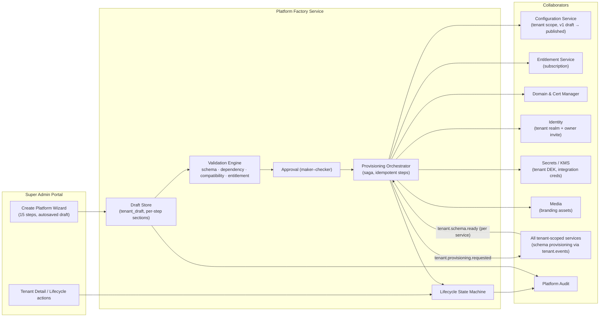
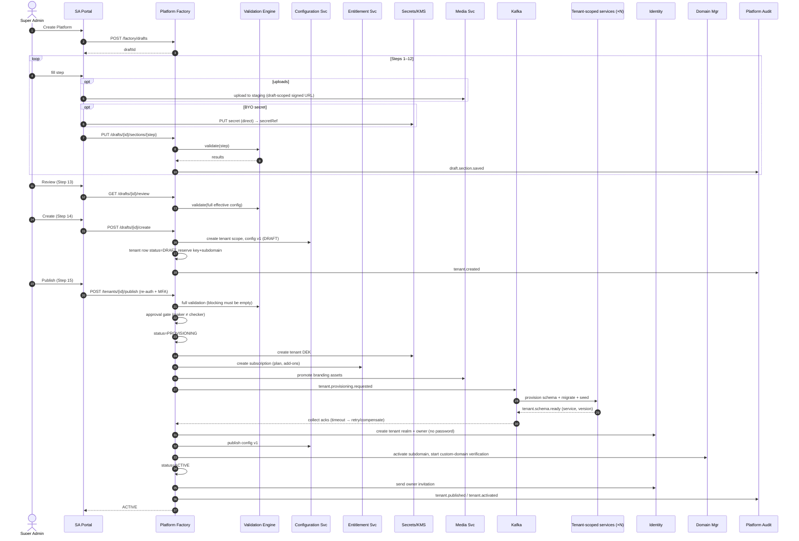
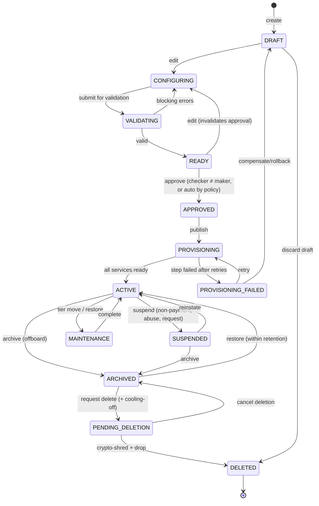
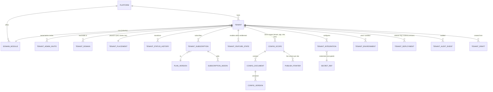

# 03 — Platform Factory Architecture

The Platform Factory is the Super Admin subsystem that turns a commercial agreement into a running,
branded tenant platform. It does this **without a deployment**. It is available only in the
platform realm (README §2, 06 §2).

## 1. Diagram 3 — Platform Factory

### 1.1 Responsibilities

| Component | Responsibility | Notes |
|---|---|---|
| Draft Store | Holds the wizard state per step, versioned on every save | A draft is **not** a tenant. It holds no schemas and no domain, and it consumes nothing. |
| Validation Engine | Runs the validators in 04 §6 against the *would-be effective* configuration | Also runs on every step save (step-local) and at publish (full) |
| Approval | Optional four-eyes check. A policy decides whether it is required (for example Enterprise tier or custom domain). | The maker cannot approve their own tenant. |
| Provisioning Orchestrator | A saga of idempotent steps with compensation | See §5 |
| Lifecycle State Machine | The only component allowed to change `tenant.status` | All transitions are audited |

---

## 2. Tenant Creation Wizard (15 steps)

**Wizard mechanics (all steps)**

- Every step is a **section of the draft document** with its own JSON schema. "Next" saves and runs
  step validation. "Back" never loses data.
- Steps 1–3 are mandatory before any later step can be saved, because they establish identity,
  owner and address. Steps 4–12 may be skipped: a skipped step **inherits GLOBAL/DOMAIN defaults**.
  The review step shows which values are inherited.
- Drafts autosave every change. Concurrent editing uses optimistic locking (`draft_version`). A
  second editor sees "edited by X, reload".
- Each field has a **provenance badge**: *Default (Global)*, *Default (Construction)* or *Set here*.
- Sensitive fields (passwords, secrets) are **never** written to the draft. See Steps 2 and 12.

### Step 1 — Platform Information

| Field | Type / validation | Level stored | Notes |
|---|---|---|---|
| Platform Name | 2–60 chars, unique among non-deleted tenants | Registry | Internal name |
| Tenant key | Generated from the platform name and editable **until publish**, then immutable. `[a-z][a-z0-9]{1,30}`. Reserved words blocked (`platform`, `admin`, `www`, `api`, `ops`, `static`...). | Registry | Names schemas |
| Display Name | 2–60 | Tenant config `branding.displayName` | Shown to users |
| Legal Company Name | 2–200 | Registry (SHARED) | Invoices to the tenant |
| Company Type | Enum: Pvt Ltd, LLP, Partnership, Proprietorship, Public Ltd, Govt, Other | Registry | |
| Industry | Enum from GLOBAL master, default `CONSTRUCTION` | Registry → selects the **Domain module** | Decides the DOMAIN config layer |
| Business Type | Multi: B2B, B2C | Seeds Step 10 | |
| Registration Number (CIN/LLPIN) | Country-specific regex | Registry | |
| GST | 15-char GSTIN with checksum; state code must match the address state | Registry | Optional per country |
| PAN | `[A-Z]{5}[0-9]{4}[A-Z]`; must equal GSTIN chars 3–12 when both are present | Registry, **field-encrypted** | |
| Company Email / Phone / Alternate Phone | RFC 5322 / E.164 | Registry | Email verified by link before publish |
| Website | URL | Registry | |
| Address, Country, State, City, Postal Code | Country drives state list and postal regex | Registry | GLOBAL master data by code |
| Timezone | IANA TZ | Tenant config `locale.timezone` | |
| Currency | ISO 4217 | Tenant config `locale.currency` | **Immutable after the first financial transaction.** Changing currency is a migration, not a setting. |
| Default Language | BCP 47 | Tenant config `locale.defaultLanguage` | |

### Step 2 — Tenant Admin (Owner)

| Field | Validation |
|---|---|
| First / Last Name | 1–60 |
| Email | Unique **within the new tenant realm** (may exist in other tenants) |
| Mobile | E.164, OTP-verified at first login |
| Username | Optional; defaults to the email |
| Role | Defaults to `TENANT_OWNER`. May pick `TENANT_ADMIN` if an owner already exists. |
| Permissions | Role template. Customisation is shown as a diff from the template. |
| MFA requirement | `REQUIRED` (default and enforced for owner/admin roles), `OPTIONAL` only for non-admin roles |

**Secure password handling (a deliberate deviation from "Password / Confirm Password").**

| Option | Verdict |
|---|---|
| Super Admin types the tenant owner's password | **Not recommended.** The Super Admin would know a credential for another party's account, which breaks non-repudiation. The password also transits and sits in the draft. |
| **Invitation (recommended, default)** | At publish, Identity creates the owner account with **no password** and sends a single-use, 72-hour, hashed-at-rest invitation token to the verified email. The owner sets a password and enrols MFA. |
| Initial password (fallback, policy-gated) | Allowed only when email delivery is impossible. The password field posts **directly to Identity** (never the draft). It is hashed immediately (Argon2id; BCrypt-12 accepted during transition), flagged `must_change_on_first_login`, expires in 24 h, and the Super Admin must re-authenticate before submitting. |

The password policy (length ≥ 12, breached-password check against a k-anonymity range API, no
composition rules beyond that, per NIST 800-63B) is **PLATFORM** level with TENANT-level tightening
allowed (never loosening).

### Step 3 — Domain

| Field | Example | Rules |
|---|---|---|
| Platform subdomain | `tenant-a` → `tenant-a.platform.com` | Defaults to the tenant key. DNS label rules and a reserved list apply. Unique. |
| Admin URL | `admin.tenant-a.platform.com` | Derived automatically |
| API URL | `api.platform.com` with the tenant resolved from the token and origin, **or** `api.tenant-a.platform.com` | Recommendation: **one shared API host** for mobile (tenant from the app's embedded tenant id plus the token), and host-derived for web |
| Custom domain (optional) | `www.company-a.com`, `admin.company-a.com` | Verified before activation. See 06 §5. Publish does **not** wait for it: the tenant goes live on the subdomain and the custom domain activates when verified. |

### Step 4 — Branding

Logos (primary, mobile, login, light, dark, email, app icon, favicon), splash screen, brand images,
company name, tagline and description.

- Uploads go to `tenants/{draftId}/branding/staging/` and are **promoted** to
  `tenants/{tenantId}/branding/v{n}/` at publish. See 09 §2.
- Validation: SVG is sanitised (scripts, external references and event handlers stripped) or
  rasterised. PNG/WebP max 2 MB. Favicon ICO/PNG at 32/180/512. App icon 1024² with no alpha (iOS).
  Minimum dimensions per slot. Contrast check of the logo against the header background.
- Derived renditions (sizes, WebP/AVIF, email-safe PNG) are generated by the Media Service.
- Any empty slot falls back to its parent slot (for example dark logo → primary logo), then to the global placeholder.

### Step 5 — Theme

Select a **theme (colour tokens)** and a **UI style pack** separately. Why they are separate is
explained in 05 §2. The wizard shows a live preview (§2.1).

### Step 6 — Colors

Primary, Secondary, Accent, Background, Surface, Text, Muted Text, Border, Success, Warning, Error,
Info, **each for light and dark mode**.

- Pick from the theme's palette or override per token.
- The dark palette may be *derived* (tonal shift) or set explicitly.
- **Blocking validation:** WCAG 2.2 AA contrast (4.5:1 body text on background/surface, 3:1 for
  large text, UI components and focus indicators). Failures show which pairs fail and suggest the
  nearest passing tone.

### Step 7 — Website Layout · Step 8 — Customer App Layout · Step 9 — Admin Portal Layout

Select a layout template per surface from the Layout Library (05 §5). The compatibility validator
blocks incompatible combinations (for example the Bottom Navigation layout on the admin portal
surface, or a Booking website layout when `booking` is not enabled).

### Step 10 — Features

- The plan is chosen here (or pre-filled from the commercial record). This sets **entitlements**.
- Within entitlements, the Super Admin toggles the initial **enabled** set.
- The dependency engine (04 §6.2) runs live. Enabling `whatsapp` marks the WhatsApp provider in
  Step 12 as *required*.
- The B2B / B2C mode is set here: `b2b`, `b2c`, or both.

### Step 11 — Business Rules

Typed rule documents (04 §11): commission, booking, cancellation, refund, payment, tax, approval,
verification, pricing, subscription, lead and marketplace rules. Each starts from the DOMAIN
default. The wizard lists only the keys where the override policy allows TENANT.

### Step 12 — Integrations

Payment gateway, email, SMS, WhatsApp, maps, storage, AI, analytics and social providers.

- For each capability, the wizard follows the ownership table in 06 §9.1. **Payments, SMS (DLT)
  and WhatsApp require the tenant's own IDs and tokens.** Email, push, maps, AI and storage may use
  a platform-shared provider on the tenant's behalf (tenant sender identity, usage metered to the
  tenant) or **Bring Your Own** credentials. The platform's own (Super Admin) credentials are never
  offered here.
- BYO secrets are posted to the Secrets broker **directly from the form**. The draft stores only an
  opaque `secretRef`. The UI shows `•••• last4`, never the value, and there is no endpoint that
  returns a secret.
- "Test connection" runs server-side with the stored ref.

### Step 13 — Review

A full summary grouped by step. Each value shows its provenance. Validation results are listed as
**Blocking**, **Warning** or **Info**. It shows a diff against the GLOBAL/DOMAIN defaults, and
provides a *preview in a sandboxed tab* using a signed preview token (05 §3.3).

### Step 14 — Create (→ DRAFT tenant)

Creates the **tenant record** in `DRAFT`, reserves the key and subdomain, and writes the
configuration as **version 1 in DRAFT state** in the Configuration Service. **Nothing is
provisioned yet.** No schemas, no identity, no traffic.

### Step 15 — Publish (→ ACTIVE)

Full validation, then approval if the policy requires it, then the provisioning saga (§5), then
`ACTIVE`. The owner invitation is sent as the last step so the owner never receives a link to a
half-built tenant.

### 2.1 Wizard preview

The preview renders the real customer app and website shells in an iframe with the **draft
configuration bundle**, using mock data from the DOMAIN fixture pack. This is how the "same
application, different experience" principle becomes visible to the Super Admin before publish.

---

## 3. Diagram 4 — Tenant Creation

---

## 4. Diagram 5 — Tenant Lifecycle

The two lifecycles in the brief (CREATE…DELETED and DRAFT…ARCHIVED) are reconciled into one
state machine. `CREATE`, `CONFIGURE`, `VALIDATE`, `APPROVE` and `PUBLISH` are **actions**. The
states are below.

### 4.1 Allowed actions per state

| State | Traffic | Tenant Admin login | Config edits | Billing | Data | Allowed Super Admin actions |
|---|---|---|---|---|---|---|
| DRAFT / CONFIGURING | None | No (no realm yet) | Super Admin only | None | None exists | Edit, validate, discard |
| VALIDATING | None | No | Locked | None | None | Wait, cancel |
| READY | None | No | Edit (resets to CONFIGURING) | None | None | Approve, edit |
| APPROVED | None | No | Locked | None | None | Publish, revoke approval |
| PROVISIONING | None | No | Locked | Subscription created, not billed | Being created | Monitor, retry, abort |
| **ACTIVE** | Full | Yes | Tenant Admin (policy-bounded) and Super Admin; versioned publish | Billed | Read/write | Suspend, archive, change plan, impersonate (audited), move tier |
| MAINTENANCE | Read-only (writes return 503 with Retry-After) | Yes, read-only | Locked | Billed | Read | Complete/abort maintenance |
| **SUSPENDED** | Public site shows a "temporarily unavailable" page in tenant branding. APIs return 423. Webhooks from providers are still accepted and queued. | Tenant **Owner** only, to billing/export | Locked | Dunning | Retained, read-only for export | Reinstate, archive |
| **ARCHIVED** | None. Domains unbound (prevents subdomain takeover). | No | Locked | Stopped | Retained for the contractual period (default 90 days). Export is available on Super Admin request. | Restore, request deletion |
| PENDING_DELETION | None | No | Locked | Stopped | Retained, 14-day cooling-off | Cancel deletion |
| **DELETED** | None | No | — | Final invoice | **Crypto-shredded** (tenant DEK destroyed), schemas dropped, storage prefix purged, cache purged, warehouse partition dropped. The registry keeps a tombstone (id, key, dates) so the key can never be reused. | None |

**Mapping to the current enum:** `PENDING` → `PROVISIONING`. `ACTIVE`, `SUSPENDED` and `ARCHIVED`
are unchanged. The new states are additive, so the migration is safe.

**Backup caveat for deletion:** backups are immutable, so they cannot be edited. Because the tenant
DEK is destroyed, a restored backup's encrypted tenant fields are unreadable. The retention window
for backups is published in the DPA.

---

## 5. Provisioning saga

| # | Step | Idempotency key | Compensation |
|---|---|---|---|
| 1 | Create tenant DEK in KMS | `tenantId` | Schedule key deletion |
| 2 | Create subscription | `tenantId+planVersion` | Cancel subscription |
| 3 | Promote branding assets | `tenantId+assetHash` | Delete promoted prefix |
| 4 | Emit `tenant.provisioning.requested`; each service creates its schema, migrates and seeds | `tenantId+service+schemaVersion` | `tenant.provisioning.aborted` → services drop *empty* schemas |
| 5 | Wait for N acks (timeout 10 min, 3 retries) | — | → PROVISIONING_FAILED |
| 6 | Create the identity realm and owner account | `tenantId+ownerEmail` | Disable realm |
| 7 | Publish config v1 | `configVersionId` | Unpublish |
| 8 | Bind subdomain (registry host map) | `host` | Unbind |
| 9 | Status → ACTIVE, send invitation | — | — |

The saga state is persisted, so a crashed orchestrator resumes where it stopped. Every step emits
a platform audit event.

---

## 6. Diagram (supporting) — Platform Factory data model

This is the conceptual model. Physical design follows after approval.

| Entity | Class | Key attributes (conceptual) |
|---|---|---|
| **Platform** | GLOBAL | Singleton: platform name, base domains, default cell |
| **Tenant** | SHARED | tenant_id, tenant_key, names, legal details, industry/domain module, status, tier, created_by, timestamps |
| **Tenant Admin** | TENANT (identity realm) | Created via an invite. The registry keeps only `owner_user_ref` for contact. |
| **Tenant Domain** | SHARED | host, type (SUBDOMAIN/CUSTOM), surface (web/admin/api), verification state, cert state, primary flag |
| **Tenant Branding** | TENANT OVERRIDE (config document `branding`) | Asset refs, names, tagline, social links |
| **Tenant Theme** | TENANT OVERRIDE (`theme`) | Theme key + version, token overrides light/dark, style pack key |
| **Tenant Layout** | TENANT OVERRIDE (`layout.{surface}`) | Layout template key + version, slot overrides |
| **Tenant Feature** | SHARED | feature_key, enabled, enabled_by, reason. Always ≤ entitlement. |
| **Tenant Subscription** | SHARED | plan_version, term, status, add-ons, overrides (grants) |
| **Tenant Configuration** | TENANT OVERRIDE | Documents per scope, versions, publish pointer |
| **Tenant Business Rules** | TENANT OVERRIDE (`rules.*`) | Typed rule sets, effective dates |
| **Tenant Integration** | TENANT OVERRIDE + SECRET | provider key, mode (platform/BYO), non-secret settings, secret_ref, health |
| **Tenant User / Role / Permission** | TENANT | In the tenant identity schema. Permissions come from the GLOBAL permission catalog. |
| **Tenant Environment** | SHARED | PRODUCTION, SANDBOX (Enterprise: a full sandbox tenant linked to prod for config trial and promotion) |
| **Tenant Version** | SHARED | Aggregate "release" of the tenant's config: the set of document versions published together |
| **Tenant Deployment** | SHARED | Release ring (canary/early/general), per-service schema version |
| **Tenant Status** | SHARED | Current plus history with actor, reason and ticket |
| **Tenant Audit** | Audit store | See 06 §10 |
