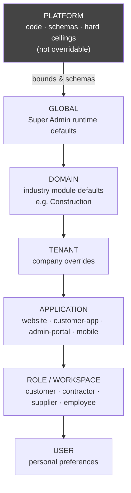
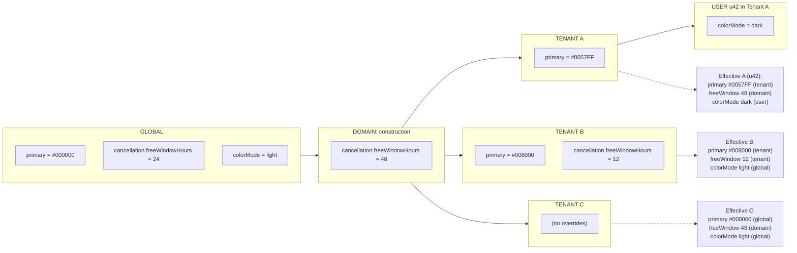
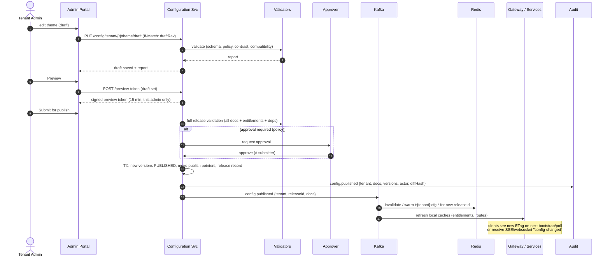
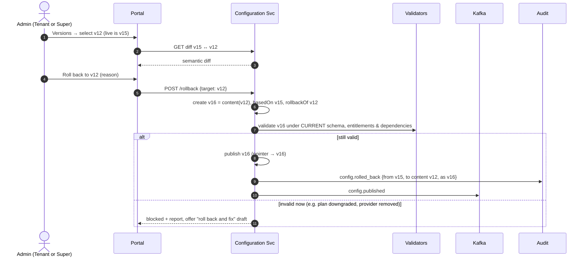

# 04 — Configuration Architecture

Configuration is the substance of the Tenant Experience Layer. This document defines how it is
structured, inherited, validated, versioned, published and rolled back.

## 1. Configuration model

### 1.1 Building blocks

| Concept | Definition |
|---|---|
| **Config key** | A dotted path inside a document, for example `theme.tokens.light.primary` or `rules.cancellation.freeWindowHours` |
| **Config document** | A named, schema-validated JSON document such as `branding`, `theme`, `style`, `layout.website`, `navigation.customer-app`, `rules.cancellation`, `notifications.templates`, `locale`, `forms.registration` |
| **Document schema** | A JSON Schema, *owned by code*, per document type and version. The schema declares each key's type, constraints and **override policy**. |
| **Scope** | Where a value is set: `PLATFORM` (code), `GLOBAL`, `DOMAIN:{module}`, `TENANT:{id}`, `TENANT:{id}/APP:{surface}`, `TENANT:{id}/ROLE:{role}`, `TENANT:{id}/USER:{userId}` |
| **Version** | An immutable snapshot of one document in one scope |
| **Publish pointer** | `(scope, document) → versionId`. It determines what is live. |
| **Release** | A set of versions across documents published atomically (a "Tenant Version") |
| **Effective configuration** | The result of resolving all scopes for a given (tenant, app, role, user) context |

### 1.2 Override policy (per key, declared in the schema)

```
key: theme.tokens.*.primary
  type: color
  default@GLOBAL: "#000000"
  overridableAt: [DOMAIN, TENANT, APPLICATION]    # USER cannot change brand colour
  lockableBy: SUPER_ADMIN                          # can freeze at a tenant
  entitlement: experience.customTheme              # plan must allow
  validators: [wcagContrast(against: background, min: 4.5)]
```

| Policy attribute | Meaning |
|---|---|
| `overridableAt` | The levels allowed to set this key. Default: `[GLOBAL]` only (secure by default). |
| `lockedAt` | A Super Admin may lock a key at a scope. Levels below cannot override it (for example, lock `rules.commission.platformShare` for all tenants). |
| `entitlement` | A feature key that must be entitled for an override to be stored or honoured |
| `bounds` | Min/max/enum that narrower levels must respect (for example tenant `cancellation.freeWindowHours` ∈ [0, 72]) |
| `mergeStrategy` | `replace` (scalars and default arrays), `deepMerge` (objects), `keyedMerge(by: "key")` (menus, lists of named items), `append` (rare, explicit) |
| `sensitivity` | `public` (can be sent to anonymous clients), `authenticated`, `server-only`, `secret-ref` |

---

## 2. Diagram 7 — Configuration Hierarchy



Precedence, most specific first:

```
User override ▸ Role override ▸ Application override ▸ Tenant override ▸ Domain default ▸ Global default
                                   (each honoured only if the key's policy allows that level
                                    and no higher level has locked it; always within PLATFORM bounds)
```

---

## 3. Diagram 8 — Configuration Inheritance (worked example)



---

## 4. Resolution algorithm (normative)

For context `ctx = (tenantId, domainModule, surface, roles[], userId)` and a document `doc`:

1. Load the **published** version of `doc` at each scope in the chain: GLOBAL, DOMAIN, TENANT,
   APP, ROLE (for each of the user's roles, ordered by role priority), USER. Missing scopes are
   skipped.
2. Start from the code-shipped **PLATFORM default** (the schema default). This means a brand-new
   key works before anyone configures it.
3. Walk from least to most specific. For each key present at a scope:
   - skip it if the scope level ∉ `overridableAt` (and log a *policy violation*, since this should
     not happen because writes are validated too),
   - skip it if a less specific scope has `lockedAt` for this key,
   - skip it if `entitlement` is not satisfied for the tenant (the value is kept stored but *dormant*;
     it reactivates on upgrade),
   - clamp or reject by `bounds` (reject at write time, clamp at read time as a last defence),
   - apply it using `mergeStrategy`.
4. **Explicit null versus absent:** *absent* means "inherit". An explicit `null` is legal only where
   the schema allows it (for example "no tagline") and means "set to nothing". "Reset to inherited"
   in the UI **deletes the key** from the scope. It never writes null.
5. **Multiple roles:** for conflicting role overrides, the higher-priority role wins. Menus use
   `keyedMerge`, so a user with two roles sees the union of their items.
6. Attach **provenance** per key (`{value, source: "TENANT", versionId}`) in admin and debug responses
   only. Runtime bundles for end users omit provenance.
7. Compute a **bundle ETag** = hash(the version ids of all contributing scopes and the entitlement
   version). Clients and caches key on it.

**Complexity and caching:** resolution is deterministic and pure. The tenant-level result (GLOBAL →
DOMAIN → TENANT → APP) is cached per `(tenant, surface, publishedReleaseId)`. The role and user
overlays are small and applied per request (09 §1).

---

## 5. Where each kind of configuration lives

| Kind | Store | Rationale |
|---|---|---|
| PLATFORM invariants | Code and Config Server (`config-repo`) | Changing them requires engineering review and a deployment |
| Operational service settings (timeouts, pool sizes) | Config Server | Not tenant-facing |
| GLOBAL/DOMAIN/TENANT/APP/ROLE/USER documents | **Configuration Service** | Versioned, auditable, resolvable |
| Feature entitlements | Entitlement Service | Commercial data with its own lifecycle (08) |
| Secrets | Secrets broker. Config holds only `secretRef`. | R12 |
| High-churn user state (last-viewed tab) | The client, or user-service | Not configuration. Never version it. |

> **Anti-pattern to avoid:** putting everything in one giant tenant JSON blob. Separate
> documents give fine-grained permissions (who may edit `rules.refund`), independent versioning
> (roll back the theme without rolling back rules), and bounded cache invalidation.

---

## 6. Configuration validation

### 6.1 Validator pipeline (runs on save for the document and on publish for the release)

| # | Validator | Examples | Severity |
|---|---|---|---|
| 1 | **Schema** | Types, required fields, regex, enums | Blocking |
| 2 | **Policy** | Level allowed, not locked, within bounds | Blocking |
| 3 | **Required fields** | Legal name, currency, timezone, owner email, primary logo (or global fallback) | Blocking |
| 4 | **Colour values** | Valid hex, alpha rules, **WCAG contrast pairs** for light *and* dark | Blocking (AA), Warning (AAA) |
| 5 | **Theme compatibility** | The style pack supports the colour mode (Neumorphism requires low-contrast surface tints; Glass requires a background image or gradient token) | Blocking |
| 6 | **Layout compatibility** | The layout is available for the surface. Its required modules are enabled (a Booking layout requires `booking`). Navigation item count fits the layout (bottom navigation ≤ 5). | Blocking |
| 7 | **Feature dependencies** | §6.2 | Blocking |
| 8 | **Integration configuration** | Provider selected for each enabled channel. `secretRef` exists. Last connection test passed within 24 h. | Blocking at publish, Warning in draft |
| 9 | **Domain configuration** | Subdomain valid and unique. A custom domain may be pending (Warning, not Blocking). | Mixed |
| 10 | **Security configuration** | MFA required for admin roles. Password policy ≥ platform floor. Session limits ≤ ceilings. | Blocking |
| 11 | **Subscription limits** | Enabled features ⊆ entitlements. Configured counts ≤ quotas (for example number of custom roles, languages). | Blocking |
| 12 | **Business rules** | Refund % ≤ 100. Cancellation tiers are monotonic. Commission + platform share ≤ 100%. Tax rules reference valid tax codes. No overlapping effective-date ranges. | Blocking |
| 13 | **Reference integrity** | Menu items point at routes that exist for enabled modules. Templates reference existing variables. | Blocking |
| 14 | **Lint / advisory** | Unused overrides, overrides equal to the inherited value (suggest removing), very large images | Info |

Validation results are **stored with the draft version**, so the approver sees exactly what was validated.

### 6.2 Configuration Dependency Engine

Dependencies are declared as data, in the Feature Catalog and document schemas, and evaluated
as a graph.

```
feature.ai                 REQUIRES integration.ai.provider         CONFIGURED
feature.whatsapp           REQUIRES integration.whatsapp.provider   CONFIGURED
                           REQUIRES feature.notifications           ENABLED
feature.b2b                REQUIRES capability.organizations        ENABLED
feature.procurement        REQUIRES feature.b2b                     ENABLED
feature.payments           REQUIRES integration.payment.provider    CONFIGURED
                           REQUIRES company.gst                     PRESENT   (country = IN)
feature.video              REQUIRES integration.storage             CONFIGURED
                           CONFLICTS plan.tier                       = STARTER
layout.website=booking     REQUIRES feature.booking                 ENABLED
style=glassmorphism        REQUIRES theme.tokens.backgroundImage    PRESENT | theme.gradient PRESENT
```

| Engine behaviour | Rule |
|---|---|
| Relation types | `REQUIRES`, `CONFLICTS`, `IMPLIES` (auto-enable, shown to the user), `RECOMMENDS` (warning) |
| Evaluation | Topological order. Cycles are rejected when the catalog is edited, not at runtime. |
| Enabling | Enabling X with unmet `REQUIRES` offers "enable X and its dependencies" or shows the blocking list. |
| Disabling | Disabling Y that others require lists the dependents and asks for cascade confirmation. **Data is never deleted** when a feature is disabled. It becomes dormant. |
| Runtime drift | If a dependency breaks later (an integration credential is revoked), the feature enters `DEGRADED`. It is not silently disabled. The Tenant Admin is alerted and the UI shows a maintenance state for that feature. |

---

## 7. Configuration versioning

Every document version records: `versionId`, `scope`, `document`, `schemaVersion`, `content`,
`state` (DRAFT/PENDING_APPROVAL/APPROVED/PUBLISHED/SUPERSEDED/REJECTED), `basedOnVersionId`,
`createdBy/At`, `updatedBy/At`, `submittedBy`, `approvedBy/At`, `publishedBy/At`, `changeNote`,
`validationReport`, `contentHash`.

| Rule | Detail |
|---|---|
| Immutability | PUBLISHED and SUPERSEDED versions are never modified. Edits create a new DRAFT based on the live one. |
| One open draft per (scope, document) | Prevents divergent drafts. Collaborators edit the same draft with optimistic locking. |
| Rebase on conflict | If the live version changes while a draft is open (for example a Super Admin hotfix), the draft is flagged *stale* and a three-way diff is offered. |
| Schema evolution | Documents carry `schemaVersion`. Upcasters migrate old versions **on read**. Stored versions are never rewritten. This keeps rollback targets valid. |
| Retention | All published versions are kept indefinitely (they are small). Drafts expire after 90 days of inactivity. |
| Diff | Semantic diff per key, with provenance, shown in both admin portals |

---

## 8. Diagram 25 — Configuration Publishing



| Publishing option | When |
|---|---|
| **Immediate** | Default |
| **Scheduled** (`effectiveAt`) | Rule changes aligned to a business date (for example new commission from the 1st of the month) |
| **Staged** | Enterprise: publish to the SANDBOX environment first, then promote the identical release to PRODUCTION |

**Approval policy** (configurable GLOBAL policy per document type and tier): for example
`rules.commission`, `rules.refund` and `integration.payment` require approval by a second Tenant
Admin; `theme` and `branding` do not; any Super Admin edit to a tenant's config notifies the Tenant
Owner.

---

## 9. Diagram 26 — Configuration Rollback



**Design choices**

- **Rollback is roll-forward.** It creates a new version with old content. It does not rewind the
  pointer to an old version id. History stays linear and auditable ("who rolled back what, when").
- **Rollback re-validates.** Old content may no longer be valid. For example, it may reference a
  retired layout or a feature the plan no longer includes.
- **Release-level rollback:** roll back all documents of a release together (for example theme,
  style and layout changed as one redesign).
- **Emergency rollback:** a Super Admin may skip the approval step (never validation), with
  mandatory reason and incident id. It is audited as a privileged action.
- **Transactional data is not rolled back.** Bookings created under commission v15 keep v15's terms
  (§11.2).

---

## 10. Default configuration and inheritance at onboarding

- A new tenant **inherits** GLOBAL and DOMAIN documents by reference. Its TENANT scope starts
  **empty** except for the values set in the wizard.
- There is no copying of defaults. So when the Super Admin improves a global notification template,
  every tenant that has not overridden it receives the improvement on the next publish.
- **Global change impact analysis:** before publishing a GLOBAL/DOMAIN change, the Configuration
  Service reports *how many tenants inherit this key* and *which tenants override it*. It then runs
  validators for every inheriting tenant. For example, a new global background colour might break
  a tenant's primary/background contrast. Offending tenants are listed, and publish is blocked or
  warned per severity.
- **Global rollout rings:** global changes can be published to a ring (internal tenants → 10% →
  all) through the same release mechanism.
- **Seeded, tenant-owned data is different from config.** Starter content (sample categories, role
  templates, CMS pages) that the tenant is *expected to edit* is **copied** at provisioning as TENANT
  DATA, because it will diverge. The distinction: *configuration inherits, content is copied.*

---

## 11. Business Rules Engine

### 11.1 Approach

| Option | Verdict |
|---|---|
| Hard-coded rules with tenant `if`s | Forbidden (R1) |
| General rules engine (Drools/DMN) exposed to tenants | Too powerful for Tenant Admins, hard to validate and test, and risky for performance |
| **Typed rule documents + decision tables (recommended)** | Each rule family has a schema (parameters, tiers, conditions over a *fixed* fact model). The evaluation logic lives in code. Tenants change parameters and table rows only. |
| DMN for Enterprise custom rules (later) | Add-on, sandbox-evaluated, with a time budget |

### 11.2 Rule families (construction domain defaults, tenant-overridable within bounds)

| Family | Parameters (examples) | Evaluated by |
|---|---|---|
| Commission | % by category/party type/order value band, min/max fee, platform share (**GLOBAL-locked**) | payment-service at settlement |
| Booking | Lead time, working hours, max concurrent bookings per provider, site-visit requirement | booking-service |
| Cancellation | Tiered windows (hours before start → fee %), who can cancel in which state | booking/order |
| Refund | % by reason and state, escrow release rules, auto-refund thresholds | payment-service |
| Payment | Advance %, milestone plans, allowed methods, credit terms for B2B (Net 15/30/45) | payment/procurement |
| Tax | GST treatment per category (HSN/SAC), place-of-supply rules, TDS/TCS applicability | tax component |
| Approval | PO/quote approval matrix by amount and role, counts required | workflow |
| Verification | Which KYC documents are required per capability or profile, expiry, re-verification | user-service |
| Pricing | Surge/seasonal, minimum charge, distance-based transport fee | catalog/booking |
| Subscription | For tenants that sell memberships to their own users | billing module |
| Lead | Lead routing (nearest/best-rated/round-robin), lead price, expiry | marketplace |
| Marketplace | Listing moderation, allowed categories, max quotes per RFQ | marketplace |

**Rule snapshotting (critical for correctness).** Every transaction records the `ruleVersionId`s
that were applied, for example `booking.appliedRules = {commission: v7, cancellation: v3}`. Later
cancellations and refunds evaluate **against the snapshotted versions**, never against the current
ones. Without this, a Tenant Admin changing the cancellation policy would retroactively change the
terms of existing contracts. That is a legal problem as well as a bug.

---

## 12. Workflow, forms and CMS engines (summary)

| Engine | Scope of configurability | Boundaries |
|---|---|---|
| **Workflow** | Per-tenant variants of **code-defined** state machines: optional states (for example "site survey"), approval steps, SLA timers, notifications per transition | Tenants cannot create arbitrary states that services don't understand. Variants are selected, and parameters set. |
| **Dynamic Forms** | Extra fields on registration, KYC, quote request and profile. Field types, validation, conditional visibility, sections. | Stored as `custom_attributes` (JSON, indexed selectively). Core fields cannot be removed, only hidden where optional. Max fields per form (quota). |
| **CMS** | Website pages composed of **blocks** from a code-shipped block library (hero, category grid, testimonials, FAQ, CTA) | No raw HTML or script from tenants. Rich text is sanitised. Custom CSS is **not** allowed. It breaks upgrades and enables UI redress. |
| **Integration** | Provider selection and settings per capability | Providers are code-shipped adapters. Tenants choose and configure. |
