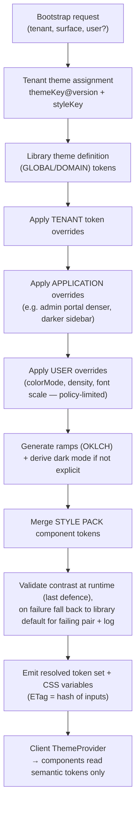
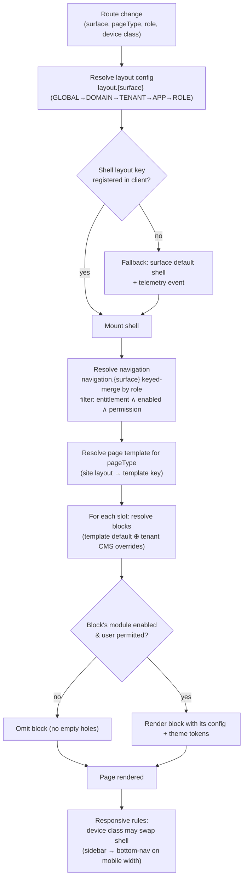
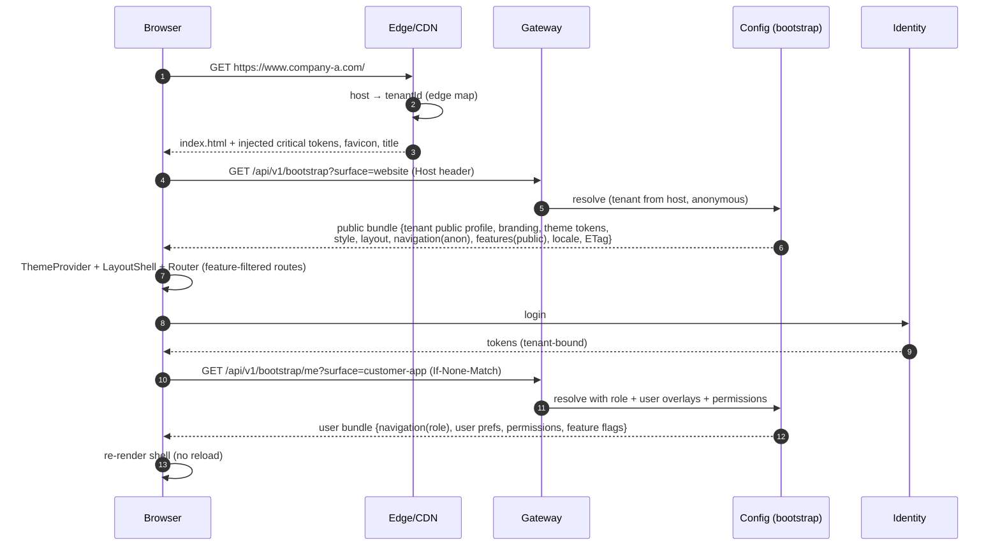

# 05 — Tenant Experience Engines & Frontend Configuration Architecture

> **Principle (restated):** a tenant's style is not a separate application. The frontend ships
> *every* theme renderer, style pack and layout template **as code in one bundle**. Configuration
> only *selects and parameterises* them. No tenant name, colour, logo or layout decision exists in
> source code.

## 1. The four independent axes of a tenant's look

Tenant A = *Blue + Glass + Marketplace*. Tenant B = *Green + Material + Corporate*. Tenant C =
*Black + Luxury + E-Commerce*. Each is a combination of **independent** choices:

| Axis | Engine | Question it answers | Examples | Stored as |
|---|---|---|---|---|
| **Brand** | Branding Engine | *Who* is this? | Logo, name, tagline, images, social links | `branding` document + media assets |
| **Colour & typography** | Theme Engine | *What palette and type?* | Blue primary, Inter font, dark-mode palette | `theme` document (design tokens) |
| **Visual style** | UI Style Engine | *What do surfaces feel like?* | Glassmorphism, Material, Neumorphism, Neo-Brutalism, Luxury, Flat | `style` document (style-pack key + parameters) |
| **Structure** | Layout Engine | *Where do things go?* | Marketplace, Corporate, E-Commerce, sidebar vs bottom nav | `layout.{surface}` + `navigation.{surface}` documents |

**Why the brief's theme list is decomposed.** "Glassmorphism", "Material", "Neo Brutalism" and
"Claymorphism" are **styles**. "Dark Mode" and "Light Mode" are **colour modes** that every theme
must support. "Corporate" and "Marketplace" are **layouts**. "Gradient" is a token capability.
Treating them as one list would force N × M × K hand-built combinations. Treating them as
orthogonal axes gives any combination for free, validated by the compatibility rules (04 §6.1).

| Brief's item | Classified as |
|---|---|
| Glassmorphism, Neumorphism, Material, Fluent, Apple HIG, Minimal, Luxury, Aurora, Bento, Cyberpunk, Neo Brutalism, Claymorphism, Flat, 3D | **UI style packs** (Bento and Aurora are also layout/background variants) |
| Dark Mode, Light Mode | **Colour mode** (user-overridable where permitted) |
| Gradient | Theme token feature (`gradient.*` tokens) |
| Corporate, Marketplace | **Layout templates**, and optionally a named *preset* bundling theme + style + layout |
| Custom | A tenant-tuned theme/style derived from a base |

**Presets.** For onboarding speed, the library offers named **Experience Presets** (for example
"Aurora Marketplace" = theme `aurora-blue` + style `glass` + layout `marketplace`). A preset is only
a starting point. Once applied, the tenant's documents hold the values, and the preset key is kept
only as bookkeeping. This matches the existing `presetKey` behaviour in `TenantBranding`.

---

## 2. Theme Engine

### 2.1 Token architecture (three tiers)

```
Primitive tokens     blue.500 = #0057FF, gray.900 = #111827, radius.md = 12, font.sans = "Inter"
       ↓ referenced by
Semantic tokens      color.primary = {blue.500}, color.surface = {gray.0}, color.text = {gray.900}
                     (defined per mode: light / dark / high-contrast)
       ↓ referenced by
Component tokens     button.primary.bg = {color.primary}, card.radius = {radius.md}
                     (mostly defined by the STYLE PACK, not the tenant)
```

- Tenants override **semantic** tokens (the 12 colours in wizard Step 6, the font, the base radius).
  Primitive ramps (50–950) are **generated** from the semantic seeds with a perceptual colour space
  (OKLCH), so hover, pressed and disabled tones are consistent without the tenant picking 60 colours.
- Component tokens belong to the style pack. Enterprise may override selected component tokens
  (an `experience.advancedTheming` entitlement).
- The token format follows the W3C Design Tokens Community Group JSON format, so it can be exported
  to Figma and native platforms.

### 2.2 Theme lifecycle features

| Capability | Implementation |
|---|---|
| Versioning | `theme` documents versioned per scope (04 §7). Library themes have their own versions. A tenant pins `themeKey@version` or tracks `latest-minor`. |
| Preview | Signed preview token renders the real app with the draft bundle (§3.3) |
| Draft | Standard config draft |
| Publishing | Standard publish (04 §8) |
| Rollback | Standard roll-forward rollback (04 §9) |
| Inheritance | Tenant theme `extends` a library theme. It stores only the tokens it changes. |
| Override | Per key, bounded by policy (for example users may change `colorMode` only) |

## 3. Diagram 9 — Theme Resolution



### 3.1 Rendering on the web

- The resolved theme is delivered as **CSS custom properties** (`--color-primary`, `--radius-md`...)
  plus a small JSON copy for JS consumers (charts, maps).
- The **component library** (the existing MUI-based components, via a theme adapter) reads only
  semantic and component tokens. A **lint rule forbids literal colours** in components.
- **No flash of wrong branding:** the edge (CDN worker or Nginx `sub_filter`) injects a `<style>`
  block with the tenant's critical tokens and the favicon/title into `index.html` for the resolved
  host, cached per `(host, bundleETag)`. The full bundle is fetched on boot.

### 3.2 Rendering on mobile (React Native)

- The same token JSON is mapped to the RN theme object. Style packs have RN implementations. Some
  web-only effects degrade gracefully: `backdrop-filter` glass becomes a translucent surface on
  Android devices without blur support.
- The last-known-good bundle is persisted in secure storage for offline and cold start. It is
  refreshed in the background, and the new ETag is applied on next launch or through a soft reload.

### 3.3 Preview

A preview token is a short-lived, signed JWT that contains `(tenantId, draftVersionIds[], adminId,
exp ≤ 15 min)`. Clients that receive `?preview=<token>` fetch the draft bundle instead of the live
one. The preview token is never accepted by transactional APIs. The preview shows a banner, and
cannot be shared across tenants because the token is bound to the host.

---

## 4. UI Style Engine

A **style pack** is code plus tokens:

| Part | Content | Example: Glassmorphism | Example: Material | Example: Neo-Brutalism |
|---|---|---|---|---|
| Surface tokens | Elevation, blur, translucency, border | blur 16, surface α 0.6, 1px light border | elevation shadows 1–5 | 0 blur, 3px black border, hard offset shadow |
| Shape | Radius scale | 16–24 | 4–12 | 0 |
| Motion | Durations, easing | soft 250 ms | standard 200 ms | none / snap |
| Component variants | Which variant each component uses | Buttons `soft`, cards `frosted` | Buttons `contained` | Buttons `outlined-heavy` |
| Background | Background treatment | Gradient/image required | Flat | Flat, high contrast |
| Constraints | Compatibility | Needs gradient or image tokens; AA contrast measured on the composited surface | — | — |
| Accessibility | `prefers-reduced-motion` and `prefers-reduced-transparency` fallbacks | Transparency → solid surface | — | — |

- **Adding a new style** is a frontend release (code). **Selecting one** is configuration. That
  boundary is intentional: styles are code, the choice of style is data.
- The existing closed sets in `TenantBranding` (`UI_STYLES = default|flat|elevated`, `BUTTON_STYLES`,
  `LAYOUT_STYLES`, `DENSITIES`) become **registry-backed**. The Configuration Service serves the list
  of style keys that the *currently deployed* frontend version supports (a registry manifest
  published with each frontend build). Validation rejects a key the deployed client cannot render.

---

## 5. Layout Engine

### 5.1 Concepts

| Concept | Definition |
|---|---|
| **Surface** | `website`, `customer-app`, `admin-portal`, `mobile` |
| **Shell layout** | App frame: navigation placement and chrome. Examples: `top-nav`, `sidebar-left`, `sidebar-right`, `bottom-nav`, `hybrid`, `compact-sidebar`, `full-screen`, `command-center`, `enterprise-dashboard`. |
| **Page template** | Region/slot arrangement for a *page type*: `home`, `login`, `registration`, `marketplace`, `product`, `service`, `booking`, `profile`, `checkout`, `payment`, `reports`, `dashboard` |
| **Slot** | Named region inside a template (`hero`, `primary`, `aside`, `footer`) that accepts **blocks** |
| **Block** | Code-shipped UI unit (search bar, category grid, provider card list, KPI tile) with a config schema |
| **Site layout** | For `website`, a set of page templates: `e-commerce`, `marketplace`, `service-marketplace`, `corporate`, `directory`, `booking`, `social`, `dashboard`, `magazine`, `bento`, `minimal`, `custom` |
| **Navigation** | Menu tree per surface and role (existing `ui_menu_items` / workspace menu generalised) |

### 5.2 Diagram 10 — Layout Resolution



### 5.3 Rules

- The **device class** can override the shell per layout definition. For example the
  `marketplace` layout uses `top-nav` on desktop and `bottom-nav` below 768 px. Tenants choose the
  layout, and the layout owns the responsive behaviour. Tenants do not pick breakpoints.
- Navigation items are **filtered three times**: by entitlement, by the tenant enabling the
  feature, and by user permission. Hiding is a UX courtesy. The gateway and services still enforce
  each of these (R5).
- `landingPath` (existing) becomes a key in `layout.{surface}.landing`, validated against the
  resolved navigation.

---

## 6. Branding Engine

| Asset / setting | Slots and fallbacks | Consumers |
|---|---|---|
| Logos | `primary` → `light`/`dark` → `mobile` → `login` → `email` (each falls back to its parent) | Web shell, login, mobile, email templates, PDF invoices |
| Favicon / app icon / splash | Generated renditions | Browser, PWA manifest, native builds |
| Names | `displayName`, `legalName` (invoices), `shortName` (≤ 12 chars, app label) | All |
| Tagline, description | Localised per language | Website, SEO meta, app store listing |
| Brand images, banners | Media library refs with alt text (required) | CMS blocks |
| Social links | Typed list | Footer, emails |
| Email branding | Header logo, colours (from tokens), footer legal text, sender name | Notification service |
| Notification branding | SMS sender id / WhatsApp business profile per tenant | Notification service (09 §3) |
| Mobile branding | Icon, splash, store metadata | App factory (§7.3) |
| SEO | Title template, OG image, `robots`, sitemap per tenant host | Website SSR/edge |

Branding is a `branding` config document (versioned) plus immutable, content-hashed media assets
(`tenants/{tenantId}/branding/{hash}.webp`). Publishing points the document to new hashes, so CDN
caching is safe with immutable URLs, and rollback is instant.

---

## 7. Frontend Configuration Architecture

### 7.1 Startup sequence (web)



### 7.2 Bootstrap contract (conceptual)

| Bundle | Auth | Sensitivity allowed | Contents |
|---|---|---|---|
| `public` | None (host-resolved) | `public` keys only | `tenant: {id, displayName, locale, currency}`, `branding`, `theme`, `style`, `layout`, `navigation.anon`, `features.public` (for example `b2c: true`), `legal links`, `bundleETag` |
| `me` | Tenant token | `public` + `authenticated` | Role navigation, permissions (coarse, for UI), user preferences, feature flags for this user, quota hints |
| `admin` | Admin role | + admin-only keys | Provenance, draft status, validation warnings |

`server-only` and `secret-ref` keys **never** leave the backend. The resolver enforces this by the
key's `sensitivity` attribute, not by per-endpoint code.

### 7.3 Web and mobile specifics

| Topic | Web (React) | Mobile (React Native) |
|---|---|---|
| Tenant resolution | From the host (edge) | **Decision needed** (10 §3). (a) *White-label builds*: one binary per tenant, with `tenantId` embedded at build time by an **App Factory** CI pipeline that reads the tenant's `branding`/`mobile` config and produces store builds. (b) *Container app*: one binary; the user picks or deep-links a tenant. Recommendation: (a) for tenants whose plan includes `mobile.whiteLabel`, (b) as the default. |
| Config fetch | Bootstrap on load, SSE `config-changed` → refetch by ETag | Bootstrap on launch, silent refresh, push "config-changed" |
| Offline | Service worker caches the last bundle per host | Secure storage caches the last-good bundle |
| Code-registry | `registry/{themes,styles,layouts,blocks}` maps keys to components | Same registry pattern, RN implementations |
| Store assets | — | Icons and splash cannot change at runtime on iOS/Android. They require an App Factory rebuild. In-app splash overlays can use runtime branding. |

### 7.4 Frontend rules (enforced in CI)

1. No tenant identifiers, brand names, hex colours or logo paths in source code. An ESLint rule
   plus a CI grep gate for `#[0-9a-f]{3,8}` outside `tokens/defaults` and the test fixtures.
2. Components consume tokens via the theme API only. There are no inline styles with literals.
3. Every registry key has a **fallback** and a telemetry event when it is missing.
4. Feature checks go through one hook (`useFeature(key)`) backed by the bundle. There are no ad-hoc
   config reads.
5. The mapping from routes to modules is declared once. The router drops routes whose module is not
   enabled.
6. Visual regression tests run a **matrix of reference configurations** (for example Tenant A/B/C
   presets in light and dark, desktop and mobile) against the same build.

---

## 8. Experience-layer risks

| Risk | Impact | Mitigation |
|---|---|---|
| Combinatorial explosion (themes × styles × layouts) breaks visuals | Ugly or unusable tenant sites | Compatibility rules, a reference-configuration visual test matrix, runtime contrast fallback |
| Tenant picks inaccessible colours | Legal (accessibility) and UX risk | Blocking WCAG validation, generated ramps |
| Config references a key an older client doesn't know (during rollout) | Blank UI | Registry manifest per client build, fallbacks, validation against the *minimum supported* client version |
| Large bundles slow first paint | Performance | Split public/me bundles, ETag, edge-injected critical tokens, target < 15 KB gzip public bundle |
| Custom CSS/HTML requests from tenants | XSS, upgrade breakage | Not supported. Offer blocks and tokens instead. Enterprise-only "custom block" is built by the platform team. |
| Branding flash / wrong tenant on shared devices | Trust | Edge injection keyed by host. Clear the cached bundle on host change (mobile container app). |
