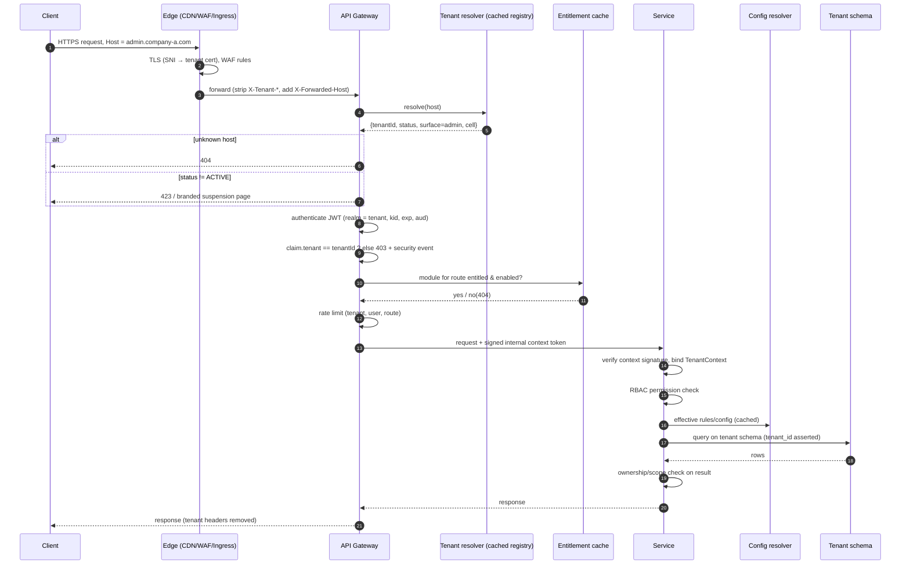
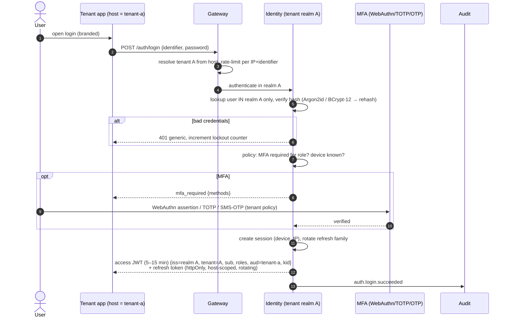
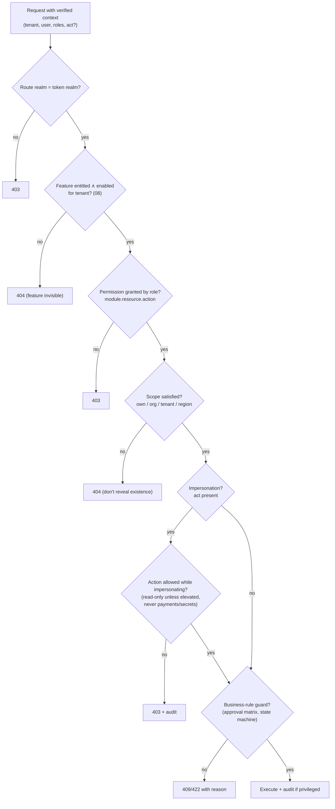

# 06 — Security Architecture

## 1. Threat model summary

| Threat | Actor | Primary control | Secondary controls |
|---|---|---|---|
| Cross-tenant data access (IDOR, missing filter, pooled-connection leak) | Malicious tenant user, buggy code | Schema-per-tenant + gateway claim check | `tenant_id` assertion, signed internal context, automated leak tests |
| Token replay across tenants | Attacker holding a valid token for tenant A | JWT `tenant` claim == host tenant (existing) | Audience per tenant, `kid` per realm |
| Header spoofing (`X-Tenant-Id`, `X-User-Role`) | Anyone reaching a service directly | Gateway strips client headers (existing) | **Signed internal context token**, network policy (services unreachable except via the gateway/mesh) |
| Tenant admin escalating to platform | Malicious tenant admin | Separate realm, `platform.*` permissions unassignable | Operator routes only on the operator host |
| Compromised Super Admin | Phishing, insider | WebAuthn MFA, JIT elevation, maker–checker for destructive actions | Device binding, anomaly alerts, immutable audit |
| Secrets exfiltration | Insider, DB dump | Envelope encryption, Vault/KMS, write-only APIs | Per-tenant DEKs, access logging on decrypt |
| Malicious uploads (SVG XSS, malware) | Tenant or end user | Sanitise/rasterise SVG, AV scan, content-type sniffing | Separate media domain (cookieless), CSP |
| Subdomain / custom-domain takeover | External attacker | Unbind hosts on archive, verify ownership periodically | Monitor dangling CNAMEs |
| Noisy neighbour DoS | One heavy tenant | Per-tenant rate limits and quotas | Tier promotion, bulkheads |
| Config injection (templates, CMS) | Tenant admin | No raw HTML/CSS/JS, sandboxed template language (logic-less) | CSP, output encoding |

---

## 2. Super Admin security

| Control | Requirement |
|---|---|
| Identity realm | A separate `platform` realm with its own user store and signing key. A tenant realm token is never valid on platform routes. |
| Authentication | Password + **WebAuthn/passkey** (phishing-resistant) is mandatory. TOTP is allowed only as registered break-glass, with alerting. No SMS OTP. |
| Access path | Only `ops.platform.com`, optionally restricted to a corporate IP allowlist or ZTNA. Not served on tenant hosts. |
| Session | 15 min idle / 8 h absolute. Bound to device fingerprint and IP range. Concurrent sessions limited (1–2). Visible and revocable in the Security Center. |
| Step-up | Re-authentication with WebAuthn within the last 5 min for: publish, suspend, archive, delete, plan change, integration/secret change, impersonation, role changes, global config publish |
| Least privilege | Platform roles (01 §5). **JIT elevation**: `PLATFORM_ADMIN` rights are requested per task, time-boxed (≤ 4 h) and approved by a second person for destructive scopes. |
| Maker–checker | Tenant delete, global security-policy change, and bulk suspend require a second platform admin |
| Impersonation | Requires a reason, a ticket id and a time box (≤ 60 min). **Read-only by default**, and write requires additional approval. The token carries `act` (actor) and `sub` (impersonated user). The tenant UI shows a persistent banner. The tenant's owner is notified (configurable for Enterprise contracts: notify always / on request). Payment actions and secret views are forbidden while impersonating. |
| Monitoring | Login anomalies (new device or geo), impossible travel, off-hours privileged actions, and mass reads trigger real-time alerts to the security channel |
| Break-glass | A sealed emergency account, credentials split among two custodians, every use paged |

### 2.1 Privileged action audit (examples, all mandatory)

`tenant.created`, `tenant.published`, `tenant.suspended`, `tenant.reinstated`, `tenant.archived`,
`tenant.deleted`, `tenant.config.changed` (with diff hash), `tenant.admin.created`,
`tenant.admin.reset`, `theme.changed`, `feature.enabled`, `feature.disabled`, `plan.changed`,
`integration.changed`, `secret.rotated`, `impersonation.started`, `impersonation.ended`,
`platform.role.granted`, `platform.policy.changed`, `global.config.published`, `breakglass.used`.

---

## 3. Tenant security (defence in depth)

Guarantees: a tenant can **never** access, modify or view another tenant's users, payments or
configuration, and can never modify global configuration or platform security.

| Layer | Control | Status |
|---|---|---|
| Edge | Host → tenant map. Unknown host → 404. Client `X-Tenant-*` headers stripped. | exists (gateway) |
| Authentication | Tenant realm per tenant. Token `tenant` and `aud` claims. | partial (claim exists) |
| Gateway | Claim == host tenant. Tenant status check. Module entitlement gate. Per-tenant rate limit. | partial |
| **Service trust** | Gateway mints a **short-lived signed internal context JWT** (`tenant`, `sub`, `roles`, `perms-version`, `act`), and services verify it. Today services trust plain `X-User-*` headers, which is safe only while nothing can reach a service except through the gateway. This must be guaranteed by network policy **and** by signature. | **new** |
| Tenant context | `TenantContext` bound from the verified context. No ambient default. Untenanted requests get 400. | exists |
| Authorization | RBAC + ownership/membership checks in services (02 §4.3) | partial |
| Repository | Schema switch, **`tenant_id` assertion on write, filter on read** | schema exists, assertion **new** |
| Database | Least-privilege users per service and pattern | exists |
| Async | Kafka tenant header stamped and required. Missing → drop and alert. | exists |
| Scheduled jobs | `CrossTenantRunner` sets the context per tenant | exists |
| Cache / storage / search | Namespaced keys, prefix policy, index filter | **new**/partial |
| Configuration | Scope derived from the verified context, **never** from request parameters. The Tenant Admin API has no `tenantId` path parameter. | **new** |
| Audit | Cross-tenant attempts (claim mismatch, wrong-tenant resource id) → `security.cross_tenant_attempt` → alert | **new** |

**Testing obligations** (see 10 §5): every tenant-scoped endpoint has an automated test that (a) calls
it with tenant B's token for tenant A's resource id and expects 404, and (b) calls it on tenant A's
host with tenant B's token and expects 403. A CI job enumerates the gateway routes and fails if any
tenant-scoped route lacks these tests.

---

## 4. Diagram 15 — Tenant Request Resolution (complete lifecycle)



---

## 5. Diagram 16 — Domain Resolution (and custom-domain activation)

```mermaid
flowchart TB
    subgraph Resolve["Runtime resolution"]
        H["Host header"] --> N["Normalise: lowercase, strip port, IDNA"]
        N --> P{"*.platform.com ?"}
        P -- yes --> S["Parse labels:<br/>admin.tenant-a → surface=admin, sub=tenant-a<br/>tenant-a → surface=web"]
        P -- no --> CM["Custom domain map lookup<br/>(host → tenantId, surface)"]
        S --> L["Subdomain map lookup"]
        L --> R{"found & ACTIVE binding?"}
        CM --> R
        R -- no --> X["404 (generic, no tenant hints)"]
        R -- yes --> OK["TenantContext(tenantId, surface, cell)"]
    end

    subgraph Activate["Custom domain activation (Domain Manager)"]
        A1["Tenant adds www.company-a.com"] --> A2["Issue TXT challenge<br/>_platform-verify.company-a.com = token"]
        A2 --> A3["Tenant sets TXT + CNAME → edge.platform.com"]
        A3 --> A4{"Poll DNS (backoff, 72h max)"}
        A4 -- verified --> A5["ACME issue cert (HTTP-01/DNS-01)<br/>store in cert manager"]
        A4 -- timeout --> AF["FAILED → notify"]
        A5 --> A6["Bind host in edge map → ACTIVE"]
        A6 --> A7["Daily re-verify: CNAME still points here?<br/>cert renew at 30 days"]
        A7 -- broken --> A8["DEGRADED → alert → unbind after grace"]
    end
```



| State | Meaning |
|---|---|
| `PENDING_VERIFICATION` | Awaiting DNS records |
| `VERIFIED` | TXT matched |
| `CERT_ISSUING` | ACME in progress |
| `ACTIVE` | Serving |
| `DEGRADED` | Verification or cert renewal failing, still serving within the grace period |
| `FAILED` / `REMOVED` | Not serving. Removed from the edge map. |

**Rules:** the host map is replicated to the edge with a TTL ≤ 60 s. There is one *primary* host per
surface, and other hosts 301-redirect to it (SEO). Wildcard certificates cover `*.platform.com` and
`*.admin…` patterns. Cookies are scoped to the exact host (never `.platform.com`), so one tenant's
subdomain cannot read or set another's cookies. Both `platform.com` and tenant subdomains are listed
in the **Public Suffix List** submission plan to strengthen browser-level cookie isolation.

---

## 6. Diagram 17 — Authentication Flow



| Topic | Decision |
|---|---|
| Password hashing | **Argon2id** (m=19 MiB, t=2, p=1 minimum) for new hashes. Existing BCrypt-12 hashes are upgraded transparently at next login. PLATFORM policy. |
| Tokens | Access JWT 5–15 min. Refresh tokens rotating with reuse detection (revoke the family). Signing key per realm (`kid`), rotated every 90 days, JWKS published per realm. |
| Social / SSO | Per tenant: Google, Apple and enterprise OIDC/SAML (Enterprise plan). The IdP configuration is a tenant integration. The IdP subject is bound to a tenant realm user. |
| OTP login (common in India) | Tenant policy. OTP hashed in Redis with a 5-min TTL, 5 attempts, per-number throttling. OTP alone is **not** allowed for admin roles. |
| Account enumeration | Generic errors, constant-time checks, rate limits |
| Lockout | Progressive delay rather than hard lockout (avoids DoS on known usernames). Alert on credential stuffing patterns. |
| Same person, many tenants | Independent accounts per tenant (by design, as today). A future "platform passport" for cross-tenant single identity is out of scope, see 10 §3. |

---

## 7. Diagram 18 — Authorization Flow



**Permission caching:** role → permission sets are cached per `(tenant, role, permsVersion)`. A
role edit bumps `permsVersion`, and the context token carries it, so stale caches are detected. Very
fine-grained permissions are *not* put in the JWT. The token carries roles and the version, which
keeps it small.

---

## 8. Data protection & privacy

| Item | Control |
|---|---|
| PII inventory | Each field is tagged `pii: none/basic/sensitive` in the entity metadata. Drives logging redaction, warehouse tokenisation and export. |
| Encryption in transit | TLS 1.2+ everywhere. mTLS inside the cluster (service mesh). |
| Encryption at rest | Storage-level for all data. **Field-level** for PAN, Aadhaar reference, bank accounts and GST documents, using the tenant DEK. |
| Data subject rights (DPDP Act 2023 India / GDPR) | Per-tenant export and erasure workflows. The tenant is the *Data Fiduciary/Controller* for its users, and the platform is the *processor*. Contracts (DPA) reflect this. |
| Residency | Tier T2/T3 can be pinned to a region |
| Logging | No secrets, tokens or full PII in logs. The `tenant_id` and `trace_id` fields are always present. |

---

## 9. Secrets management

```
Tenant integration secret ─► Secrets broker (Vault KV v2 / cloud Secrets Manager)
                               path: tenants/{tenantId}/integrations/{provider}
                               encrypted with tenant DEK ◄─ wrapped by platform KEK in KMS/HSM
Configuration document stores: { provider: "razorpay", mode: "BYO", secretRef: "sec_01H…", last4: "9XkQ" }
```

| Rule | Detail |
|---|---|
| Write-only | Secrets are posted directly to the broker. No API returns a secret. Rotation replaces it. |
| Access | Only the adapter service that needs a secret may read it, by policy `(service, tenant)`. Reads are logged. |
| Rotation | Platform credentials rotated every 90 days. BYO credentials get expiry reminders. Webhook signing secrets are per tenant. |
| Crypto-shredding | Deleting a tenant destroys its DEK, which renders its secrets and field-encrypted data unreadable, including in backups |
| Development | No production secrets in `config-repo`. The existing Config Server holds only non-secret settings plus references. |

### 9.1 Credential ownership: tenant credentials vs platform credentials

**Rule: every external ID, key and token is resolved from the tenant context of the operation.**
Code never reads a provider credential from a global property. It asks the integration resolver for
`(tenantId, capability)` and receives a `secretRef` plus non-secret settings. The **Super Admin
(platform) has its own, completely separate set** under `platform/…`, used only for the platform's
own business. Tenant operations must never fall through to it by accident.

```
Operation in tenant A ──► IntegrationResolver(tenantA, "payment")
                             ├─ tenant A has its own (BYO) credential ──► tenants/A/integrations/payment
                             ├─ else, capability allows a platform-shared provider AND plan permits
                             │     ──► platform-shared credential, used ON BEHALF OF tenant A
                             │         (tenant A's sender name, branding, usage metered to A)
                             └─ else ──► feature not configured ──► DEGRADED / blocked (never a silent default)

Platform operation (bill tenant, Super Admin OTP) ──► platform/integrations/{capability}   (Super Admin only)
```

| Capability | Tenant-owned ID / token (per tenant) | Can a platform-shared provider be used? | Platform's own (Super Admin) credential used for |
|---|---|---|---|
| **Payments** | Merchant account / Key ID + Secret, **webhook secret**, linked/sub-merchant account id, settlement bank account | **No for tenant customer money.** Each tenant uses its own merchant account, or a sub-merchant/linked account under a marketplace product (for example Razorpay Route or Cashfree Easy Split). If the platform itself collects end-customer money for tenants, it needs RBI Payment Aggregator authorisation. Avoid that. | Collecting **subscription fees from tenants** |
| **Email** | Sender domain + DKIM/SPF records, SMTP/API key (if BYO), from-address, reply-to | Yes: platform ESP account, sending as `tenant-a@mail.platform.com` with tenant A's display name and branding | Platform mails to Super Admins and tenant owners (invoices, security alerts) |
| **SMS** | DLT entity id, **DLT header (sender id)**, DLT template ids, provider API key | Only with the tenant's own DLT registration (TRAI requirement). The transport account may be shared. | Super Admin OTP and platform alerts |
| **WhatsApp** | WABA id, phone number id, access token, approved template names, webhook verify token | No. Meta ties the business profile to the tenant's own WABA. A platform tech-provider or BSP may *host* it. | Platform support number |
| **Push (FCM/APNs)** | Firebase project/service account, APNs key, bundle id (white-label apps) | Yes, for the shared container app | Super Admin portal notifications |
| **Maps** | API key restricted to the tenant's domains/apps (if BYO) | Yes, with usage metered per tenant | Platform console |
| **AI** | API key (if BYO) | Yes, with token usage metered per tenant | Platform features |
| **Storage** | Own bucket + KMS key (T2/T3 only) | Yes. Default `tenants/{tenantId}/` prefix in the platform bucket (09 §2). | Platform assets, backups |
| **Social login / SSO** | OAuth client id/secret, redirect URIs on the tenant's domain, SAML metadata | Shared OAuth app only for platform subdomains, since the consent screen shows the platform name. Custom domains need the tenant's own client. | Super Admin realm SSO |
| **Analytics** | Measurement / pixel ids | No | Platform analytics |
| **JWT signing** | Tenant realm signing key (`kid`) | — (always per realm) | Platform-realm signing key, never shared with tenants |
| **Webhooks (inbound)** | Opaque per-tenant webhook URL token + signing secret | — | Platform webhooks |

**Enforcement**

1. **No global fallback.** There is no `payment.razorpay.key` style property in `config-repo` for
   tenant traffic. Remove the existing ones in Phase 0. A missing tenant credential is a
   configuration error, never "use the platform's key".
2. **Separate paths, separate policies.** `platform/*` secrets are readable only by platform-realm
   services and jobs. `tenants/{id}/*` secrets are readable only by adapters running with that
   tenant's context. A tenant adapter asking for `platform/*` is denied by the broker policy.
3. **Shared provider ≠ shared identity.** When a platform-shared provider is used for a tenant,
   every message or call still carries **the tenant's** sender identity, branding, template ids and
   usage meter, and is logged under the tenant.
4. **Inbound webhooks resolve the tenant** from the opaque URL token and verify with that tenant's
   secret (09 §3). A payment webhook for tenant A can never settle an order in tenant B.
5. **Validation:** enabling `payments`, `sms` or `whatsapp` is blocked until the tenant-owned
   credentials in this table exist and the connection test passes (04 §6.2).
6. **Tests:** for each adapter, a test runs an operation in tenant A and asserts that tenant A's
   `secretRef` was used. A second test asserts that a tenant A operation with no credential fails
   rather than using the platform credential.

---

## 10. Audit architecture

| Stream | Content | Store | Who reads |
|---|---|---|---|
| **Platform audit** | Every Super Admin action, lifecycle transitions, global config publishes, impersonation | Separate append-only store, hash-chained (reuse the `audit-service` design), replicated to WORM object storage (object lock) | Platform auditors. The relevant tenant sees events *about its own tenant* (for example "Super Admin changed your plan"). |
| **Tenant audit** | Tenant config publishes, role and permission changes, admin actions, data exports, login events | Existing `audit-service`, per tenant schema, hash-chained | Tenant Owner/Admin, platform auditors |
| **Security events** | Cross-tenant attempts, auth anomalies, policy violations | SIEM | Security team |

**Event shape (conceptual):** `eventId, occurredAt, tenantId|null (platform), actor {realm, userId,
roles, act?}, action, target {type, id}, before?/after? (or diffHash for config), reason, ticketId,
ip, userAgent, traceId, prevHash, hash`.

**Guarantees:** events are produced through the transactional outbox pattern, so a state change and
its audit event commit together, and there are no gaps. The chain is verified continuously by a
scheduled job, and a break raises a critical alert. Audit records are never updated or deleted
within their retention period (7 years for financial, configurable otherwise).
