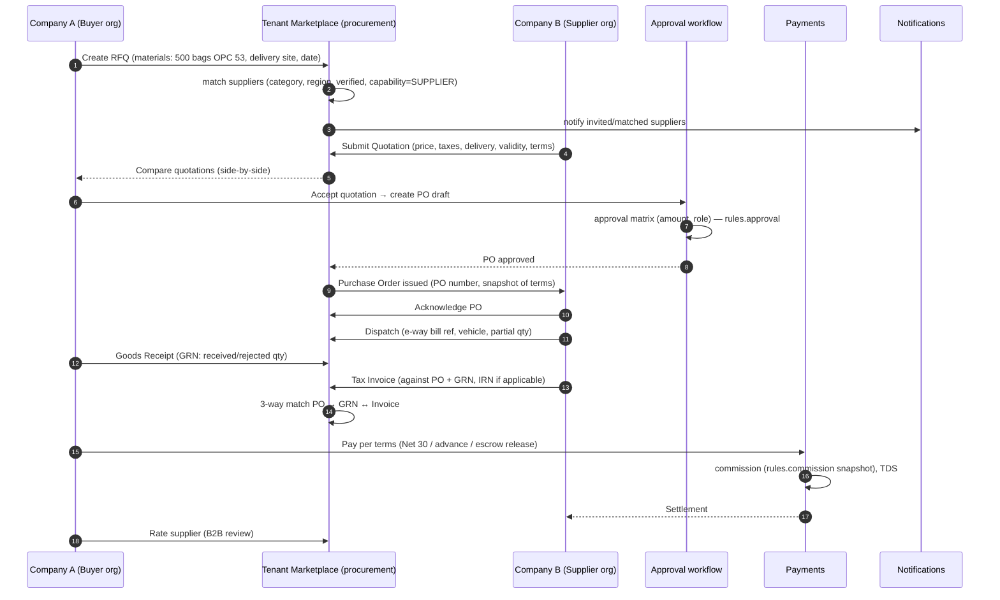
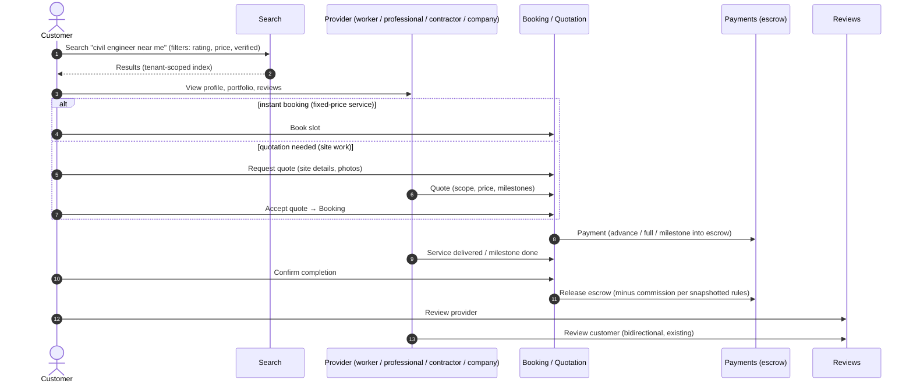
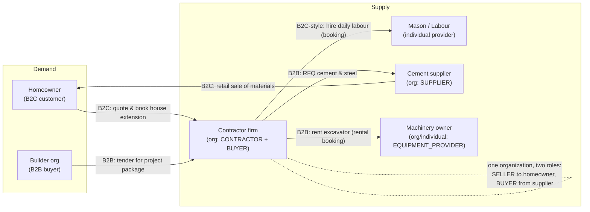
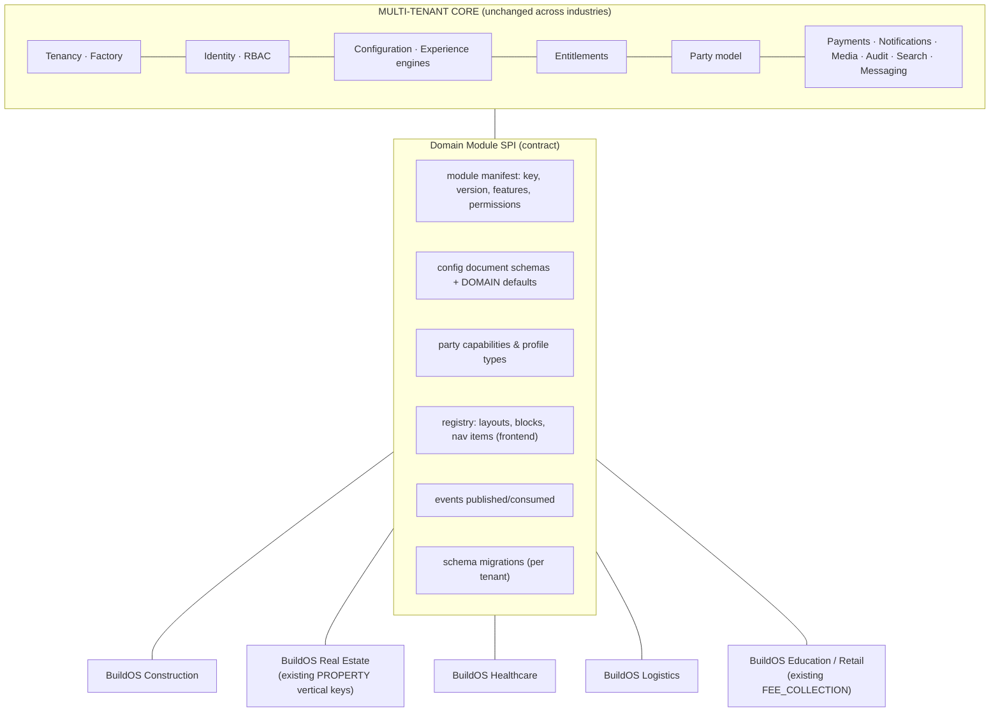

# 07 — B2B, B2C & Hybrid Commerce · Construction Domain · Extensibility

## 1. Commerce model

B2B and B2C are **not two systems**. They are two sets of *capabilities* over one party model
(02 §4.1) and one commerce core:

| Concept | B2C usage | B2B usage |
|---|---|---|
| Party | Individual customer | Organization (buyer) |
| Counterparty | Worker / professional / organization | Supplier / contractor / manufacturer (organization) |
| Discovery | Search + map + ratings | Supplier directory + RFQ broadcast + catalogs |
| Price | List/quoted price, instant booking | Negotiated quotes, price lists per buyer, volume tiers, contracts |
| Commitment | Booking | Purchase Order (from an accepted quotation) |
| Fulfilment | Service visit, milestones | Delivery / GRN, partial deliveries, service completion certificates |
| Billing | Receipt / GST invoice at payment | Tax invoice against PO, credit terms, e-invoicing (IRN) and e-way bill (India, above thresholds) |
| Payment | Prepaid / escrow / milestone | Credit (Net-N), advance %, escrow for new relationships, TDS |
| Approval | Self | Buyer-side approval matrix (04 §11) |
| Trust | Reviews, KYC | Verification of GST/registration, relationship history, credit limits |

**Tenant mode** (04 configuration + 08 entitlements): `commerce.modes = [B2C] | [B2B] | [B2B, B2C]`.
The mode controls which capabilities, navigation and registration journeys exist. It does **not**
fork data models.

---

## 2. Diagram 12 — B2B Flow

### 2.1 B2B relationships

| Relationship | Meaning | Effects |
|---|---|---|
| `PREFERRED_SUPPLIER` | Buyer ↔ Supplier | Appears first in RFQ matching, can have a buyer-specific price list |
| `CONTRACTED` | Framework agreement | Contract rates, credit limit, terms |
| `SUBCONTRACTOR_OF` | Contractor → Subcontractor | Work orders flow down. Parent visibility into project progress. |
| `DEALER_OF` / `DISTRIBUTOR_OF` | Manufacturer → Dealer/Distributor | Channel pricing, territory |
| `BLOCKED` | Either side | Excluded from matching |

Relationships are **within one tenant**. Cross-tenant B2B trade is **not** supported by default,
see 10 §3 (decision D4).

---

## 3. Diagram 13 — B2C Flow

---

## 4. Diagram 14 — B2B + B2C Flow (hybrid tenant)

**The key point:** the contractor firm is simultaneously a *seller* (B2C, to the homeowner) and a
*buyer* (B2B, from the supplier). One organization carries both capabilities. The commission rules,
tax treatment and payment terms differ **by transaction type**, and are resolved from `rules.*`
keyed by `(transactionType, category, partyTypes)`, not by user type.

---

## 5. Construction ecosystem (first domain module)

### 5.1 Party capabilities and profiles

| Group | Capabilities / profiles |
|---|---|
| Demand | Customer (individual), Builder/Developer (org), Contractor (as buyer) |
| Individual providers | Worker, Labour (skilled/unskilled trade), Civil Engineer, Architect, Surveyor, Interior designer, Site supervisor |
| Organizational providers | Contractor, Subcontractor, Construction Company, Service Provider |
| Material trade | Supplier, Manufacturer, Dealer, Distributor, Material Seller |
| Equipment | Vehicle Owner, Machinery Owner, Equipment Provider |

### 5.2 Domain capability modules

| Module | Key aggregates | Existing service | Notes |
|---|---|---|---|
| `services` (catalog) | ServiceCategory (GLOBAL taxonomy + tenant extensions), ServiceOffering | booking-service | |
| `bookings` | Booking, Slot, Assignment | booking-service | exists |
| `quotations` | QuoteRequest, Quotation, QuoteLine | new or booking | Shared by B2C and B2B |
| `projects` | Project, Milestone, ProjectDocument | project-service | exists |
| `materials` | Product, SKU, UoM, PriceList, Inventory (optional) | new `catalog-service` | HSN codes |
| `procurement` | RFQ, PurchaseOrder, Dispatch, GRN, Invoice | new `procurement-service` | B2B |
| `rental` | Equipment, Availability, RentalBooking, Operator, Meter readings | new `rental-service` | Machinery and vehicles |
| `jobs` | JobPosting, Application, Engagement | new `jobs-service` | Labour hiring |
| `reviews` | Review, RatingSummary | review-service | exists |
| `social` | Post, Reel, Comment, Follow | new | Moderation rules |
| `payments` | Escrow, Wallet, Settlement | payment-service | horizontal |

### 5.3 DOMAIN-level configuration pack: `construction`

- The GLOBAL construction taxonomy (categories, trades, material classes), units of measure
  (bags, m³, sq ft, brass, MT), and HSN/SAC mappings.
- Default rules (48 h free cancellation for site work, milestone payment templates, a 3-way-match
  tolerance of 2%).
- Default registration forms per profile (for example, a civil engineer requires a degree
  certificate and registration number).
- Default layouts and presets (for example, "Service Marketplace" home with a category grid and
  "Find a professional" search).
- Default notification templates (quote received, PO issued, delivery due).
- A fixture pack for the wizard preview (03 §2.1).

---

## 6. Future extensibility: domain modules on an unchanged core

**Module manifest (conceptual contents):** `moduleKey`, `version`, `requiresCore ≥ x.y`,
`features[]` (for the Feature Catalog, with dependencies), `permissions[]` (namespaced
`<module>.*`), `configSchemas[]`, `domainDefaults`, `partyCapabilities[]`, `frontendRegistry`
(layouts, blocks, routes, nav items), `events`, `services` (the backends that implement it),
`migrations`.

**Rules**

1. The core **never imports** a domain module. Modules depend on core SPIs only.
2. A domain module cannot add a new *configuration level* or bypass tenancy. It uses `tenant-common` like every other service.
3. `Vertical` (existing enum) becomes **data**, a registry of installed domain modules. A new
   industry is a deployment of module services plus catalog entries. It is not an enum change in
   the core.
4. A tenant runs **one primary domain**. It may add compatible modules from other domains
   (for example, Construction + Real Estate listings) if entitled.
