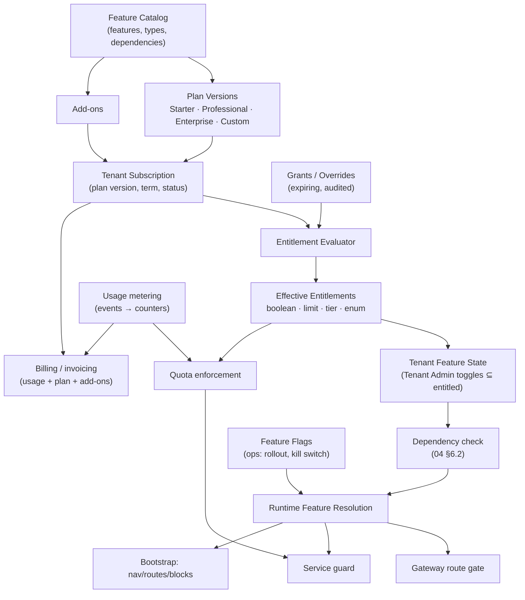
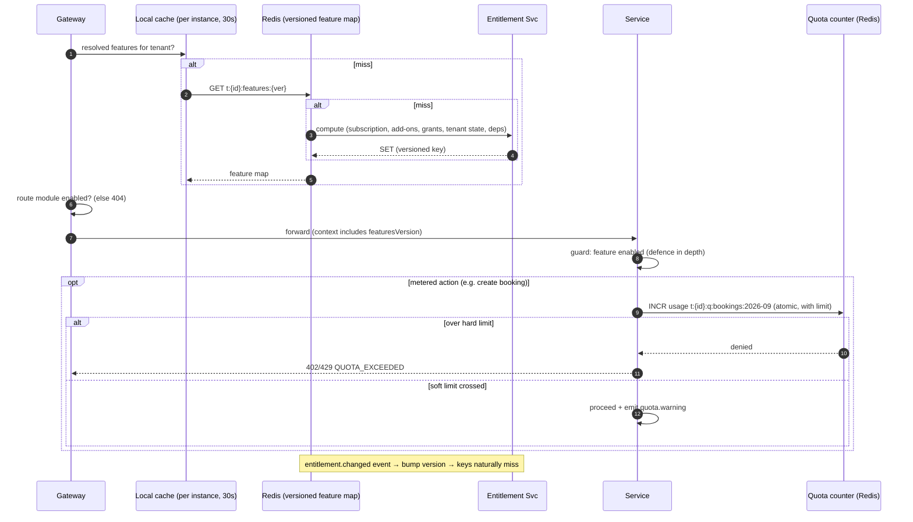

# 08 — Subscription & Feature Entitlement Architecture

## 1. Concepts: keep commercial, operational and tenant choices separate

| Concept | Question | Owner | Changes via | Example |
|---|---|---|---|---|
| **Feature Catalog** | What capabilities exist? | Super Admin (+ module manifests) | Catalog publish | `ai.assistant`, `whatsapp`, `procurement`, `video` |
| **Plan** (versioned) | What does a package include? | Super Admin | New plan version (existing subscribers keep theirs until migrated) | Starter v3, Professional v2, Enterprise, Custom |
| **Add-on** | What can be bought on top? | Super Admin | Catalog | `whatsapp` add-on, extra 10k SMS |
| **Tenant Subscription** | What did this tenant buy? | Billing / Super Admin | Plan change, renewal | Tenant A: Professional v2 + WhatsApp add-on |
| **Grant / Override** | Exceptions | Super Admin (audited, expiring) | Manual | "AI trial until 31 Oct" |
| **Entitlement** (derived) | What *may* the tenant use? | Computed | Any of the above | `ai = false`, `whatsapp = true`, `bookings.monthly ≤ 5000` |
| **Tenant Feature State** | What *has* the tenant switched on? | Tenant Admin | Features screen | `erp = on`, `reels = off` (entitled but not wanted) |
| **Feature Flag** | Is the code path *operationally* on? | Engineering / SRE | Flag service | Kill switch `video.transcoding`, rollout of `new-checkout` to 10% |
| **Quota / Usage limit** | How much? | From entitlement | Metering | 5,000 bookings/month, 20 GB storage, 50 staff users |

> **Why separate them?** Mixing commercial entitlement with operational flags is the most common
> SaaS failure here. Sales grants "AI" and SRE kills "AI" through the same boolean, and nobody
> knows why a tenant lost a paid feature. Three independent inputs, each with a clear owner, make
> the result explainable.

## 2. Diagram 24 — Subscription & Feature Entitlement



## 3. Feature catalog entry (conceptual)

| Attribute | Example |
|---|---|
| `key` | `whatsapp` |
| `type` | `BOOLEAN` / `LIMIT` (numeric) / `TIER` (ordered enum) / `ENUM_SET` |
| `category` | Communication |
| `modules` | `notifications.whatsapp` (the gateway routes and services it controls) |
| `dependencies` | REQUIRES `integration.whatsapp` CONFIGURED; REQUIRES `notifications` |
| `tenantToggleable` | true (Tenant Admin may turn it off if entitled) |
| `defaultEnabledWhenEntitled` | false |
| `visibility` | `PUBLIC` (shown in the upsell list) / `HIDDEN` (internal, beta) |
| `meters` | `whatsapp.messages` |
| `dataOnDisable` | `RETAIN_DORMANT` (default) / `RETAIN_READONLY` |

### 3.1 Example plans (illustrative)

| Feature | Starter | Professional | Enterprise |
|---|---|---|---|
| Marketplace, Booking, Reviews, Notifications (in-app, email) | ✔ | ✔ | ✔ |
| B2C | ✔ | ✔ | ✔ |
| B2B (organizations, procurement) | — | ✔ | ✔ |
| Payments (escrow) | ✔ | ✔ | ✔ |
| SMS | 1k/mo | 10k/mo | custom |
| WhatsApp | add-on | add-on | ✔ |
| Chat | ✔ | ✔ | ✔ |
| Video, Reels | — | add-on | ✔ |
| Maps | ✔ | ✔ | ✔ |
| AI | — | add-on | ✔ |
| ERP / CRM / Inventory connectors | — | — | ✔ |
| Jobs | — | ✔ | ✔ |
| Analytics | basic | advanced | advanced + warehouse export |
| Custom domain | — | ✔ | ✔ (multiple) |
| Theme | presets only | custom colours + styles | advanced tokens |
| Layouts | 2 | all | all + custom blocks |
| White-label mobile app | — | — | ✔ |
| Staff users | 5 | 50 | custom |
| Bookings / month | 500 | 5,000 | custom |
| Storage | 5 GB | 50 GB | custom |
| Tier / isolation | T1 | T1 | T2/T3 |
| SSO (SAML/OIDC) | — | — | ✔ |
| Sandbox environment | — | — | ✔ |

---

## 4. Evaluation semantics

```
entitled(f)  = planVersion.includes(f) ∨ addOn(f) ∨ activeGrant(f)            (booleans)
limit(f)     = max(plan.limit, grant.limit) + Σ addOn.increments              (limits)
enabled(f)   = entitled(f) ∧ tenantFeatureState(f) ∧ dependenciesSatisfied(f)
active(f,u)  = enabled(f) ∧ flag(f, tenant, user) ∧ permission(u, f)
```

- **Downgrade behaviour:** when entitlement is lost, `enabled` becomes false and data is retained
  dormant (per `dataOnDisable`). Configuration overrides that depend on the entitlement stay stored
  but inactive (04 §4). A grace period (default 14 days, read-only) applies for features with user
  data (for example, B2B open POs can be completed but new ones cannot be created).
- **Subscription states:** `TRIALING → ACTIVE → PAST_DUE → (grace) → SUSPENDED → CANCELED`.
  `PAST_DUE` shows warnings only. `SUSPENDED` drives the tenant lifecycle's SUSPENDED state (03 §4).
- **Plan versioning:** plans are immutable once any tenant subscribes. Price or feature changes
  create a new version. Migrating tenants between versions is an explicit, audited bulk operation.

## 5. Diagram 11 — Feature Resolution (runtime)



## 6. Usage metering & quotas

| Aspect | Design |
|---|---|
| Source of truth | Business events (`booking.created`, `sms.sent`, `media.stored`) → metering consumer → usage ledger (append-only, per tenant, per meter, per period) |
| Enforcement | Redis counters for real-time checks (fast, approximate). Reconciled hourly with the ledger (authoritative, used for billing). |
| Limit types | **Hard** (block: staff users, storage), **Soft** (warn, then bill overage: SMS), **Rate** (per-second fairness: API calls) |
| Period | Calendar month in the tenant timezone, or subscription anniversary (plan attribute) |
| Visibility | Tenant Admin usage dashboard, 80%/100% alerts |
| Failure mode | If Redis is unavailable, **fail open** for soft limits and **fail closed** for hard security-relevant limits (for example seats). Always log for reconciliation. |

## 7. Entitlement risks

| Risk | Mitigation |
|---|---|
| Stale entitlements after an upgrade (the customer paid but the feature is not visible) | Versioned keys plus an event-driven version bump, with a max local TTL of 30 s |
| Entitlement checked only in the UI | Enforced at both gateway and service. Tests assert 404 when the feature is disabled. |
| Grants never expire (revenue leakage) | Grants require `expiresAt` (≤ 12 months) and a monthly report |
| Plan edits silently change existing customers | Immutable plan versions |
| Dependency drift (a provider is removed) | `DEGRADED` state and an alert (04 §6.2) |
