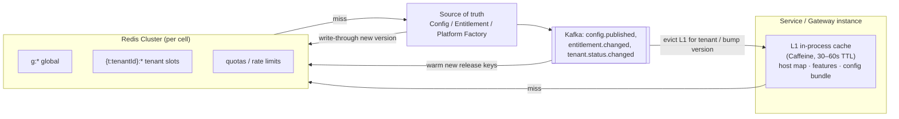
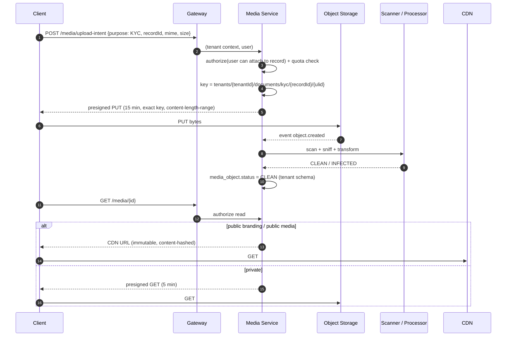
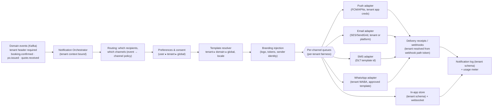

# 09 — Cache, Storage, Notifications, Backend, Scalability & Non-Functional Architecture

## 1. Multi-tenant cache architecture

### 1.1 Key conventions

| Class | Pattern | Example |
|---|---|---|
| Global | `g:{area}:{key}:v{ver}` | `g:cfg:global:theme:v41`, `g:catalog:plans:v7` |
| Domain | `d:{module}:{area}:v{ver}` | `d:construction:cfg:rules:v9` |
| Tenant | `t:{tenantId}:{area}[:{sub}]:v{ver}` | `t:01HX…:cfg:bundle:website:r128`, `t:01HX…:features:v12`, `t:01HX…:nav:customer-app:r128`, `t:01HX…:theme:r128` |
| Tenant + user | `t:{tenantId}:u:{userId}:{area}` | `t:01HX…:u:884:prefs` |
| Tenant + role | `t:{tenantId}:role:{role}:{area}:v{permsVer}` | `t:01HX…:role:CONTRACTOR:perms:v5` |
| Quota | `t:{tenantId}:q:{meter}:{period}` | `t:01HX…:q:bookings:2026-09` |
| Rate limit | `rl:t:{tenantId}:{route}:{window}` | |
| Host map | `host:{hostname}` → tenantId | `host:www.company-a.com` |

**Rules**

1. **Tenant context is part of the key by construction.** The cache client wrapper takes the
   `TenantContext` and builds the prefix itself. Services never concatenate tenant ids by hand. A
   tenant-scoped cache call without context throws.
2. **Versioned keys over deletes.** A new publish → new release id → new key. Old keys expire by
   TTL. This avoids invalidation races and makes rollback instant.
3. User-specific data is **never** cached under a tenant-only key (prevents one user's personalised
   view being served to another).
4. Use Redis Cluster **hash tags** `{t:01HX…}` so that one tenant's keys co-locate in a slot group,
   which makes per-tenant `SCAN`/purge efficient.
5. **Tenant purge** on deletion: `SCAN` by tag and `UNLINK`. It is also covered by TTLs.
6. **Noisy neighbour:** per-tenant key-count and memory sampling. T2/T3 tenants may get a dedicated Redis.
7. The existing OTP and session data move under the tenant namespace.

### 1.2 Diagram 21 — Cache Architecture



| Data | L1 TTL | L2 TTL | Invalidation |
|---|---|---|---|
| Host → tenant map | 60 s | none (versioned) | `tenant.domain.changed` |
| Tenant status | 10 s | 60 s | `tenant.status.changed` (suspension must bite fast) |
| Features/entitlements | 30 s | versioned | `entitlement.changed` |
| Config bundles | 60 s | versioned by release | `config.published` |
| Permissions | 60 s | versioned by `permsVersion` | role change |

---

## 2. Multi-tenant file storage

### 2.1 Layout

```
s3://{env}-platform-media/
  tenants/{tenantId}/
    branding/{contentHash}.{ext}           public (via CDN), immutable
    public/{…}                             public media (CMS images, catalog photos)
    media/{userId|orgId}/{objectId}        private user media (portfolio drafts, KYC photos)
    documents/{module}/{recordId}/{objectId} private (KYC, invoices, POs, drawings)
    exports/{jobId}/{file}                 private, 7-day lifecycle
    tmp/                                   1-day lifecycle
  drafts/{draftId}/branding/staging/       wizard uploads before tenant exists, 30-day lifecycle
  global/                                  platform assets (default logos, library previews)
```

### 2.2 Controls

| Control | Detail |
|---|---|
| Path construction | **Server-side only**, from `TenantContext` and the record id. Client-supplied paths or keys are never used. Object keys are random (ULID) and never derived from filenames. |
| Access | Private objects are served only through **pre-signed URLs** (GET ≤ 5 min, PUT ≤ 15 min), issued by the Media Service after an authorization check on the owning record. The presign is scoped to one exact key. |
| Bucket policy | Deny all public access except the `tenants/*/branding/*` and `tenants/*/public/*` prefixes, served via CDN origin access control. The service IAM role is limited to `tenants/*`. T2/T3 get a **separate bucket per tenant** with the tenant's KMS key. |
| Uploads | Direct-to-storage via presigned PUT → `media.uploaded` event → AV scan + content-type sniff + image re-encode (strips EXIF/GPS from public images) → marked `CLEAN` → usable. Until then the object is quarantined. |
| Media domain | User content is served from `media.platform-cdn.com` (cookieless, separate site) to contain XSS in uploaded files |
| Metadata | A `media_object` row in the tenant schema (`tenant_id`, owner, record link, size, hash, scan status). Storage quota is computed from these rows. |
| Deletion | Soft delete on the row, lifecycle-purged object after the retention period. On tenant deletion, the prefix/bucket is purged and the KMS key destroyed. |

### 2.3 Diagram 22 — Media Storage Architecture



---

## 3. Multi-tenant notifications

### 3.1 Model

| Element | Resolution (most specific wins) |
|---|---|
| **Template** | `(event, channel, locale)`: TENANT override → DOMAIN default → GLOBAL default. Templates are logic-less (Mustache-style), with a declared variable schema per event. Branding variables are injected automatically (logo, colours, display name, support contacts, legal footer). |
| **Channel availability** | Entitlement ∧ tenant enabled ∧ provider configured |
| **Provider** | Tenant BYO provider → platform shared provider (if the plan allows) |
| **Sender identity** | Email: `no-reply@company-a.com` if the tenant verified its domain (SPF, DKIM, DMARC via the Domain Manager), else `company-a@mail.platform.com` with the display name. SMS: the tenant's **DLT-registered** header and templates (TRAI requirement in India, where each SMS template must be pre-registered). WhatsApp: the tenant's WABA and **Meta-approved templates**. |
| **Preferences** | GLOBAL defaults → TENANT defaults per event category → USER preferences. **Transactional/security** messages (OTP, payment receipts) cannot be opted out of. Marketing requires opt-in (consent recorded). |
| **Quiet hours / throttling** | Tenant setting (for example no marketing SMS 21:00–09:00 in the tenant TZ) |

### 3.2 Diagram 23 — Notification Architecture



**Webhook tenant resolution:** provider webhooks arrive at
`/webhooks/{provider}/{opaqueWebhookToken}`. The token maps to `(tenantId, integrationId)`, and
the signature is verified with that tenant's webhook secret. Tenant ids are never trusted from the
webhook body.

---

## 4. Backend architecture

| Concern | Design |
|---|---|
| Service template | Each tenant-scoped service includes `tenant-common` (context, schema routing, Kafka/Feign propagation), `audit-common`, `web-common`, and the new `config-client` (resolved config and rule access with caching) and `entitlement-client` (feature guard) starters |
| API style | REST, versioned (`/api/v1`), with problem+json errors that include a stable `code` (`TENANT_SUSPENDED`, `FEATURE_NOT_ENABLED`, `QUOTA_EXCEEDED`) |
| Tenant Admin API | No `tenantId` in paths. The tenant always comes from the context. |
| Super Admin API | `/api/platform/v1/tenants/{tenantId}/…`, served only on the operator host |
| Consistency | A service owns its data. Cross-service invariants use sagas + outbox. Idempotency keys on all POSTs from clients and on all consumers. |
| Events | Kafka topics are **shared across tenants** (partition key = `tenantId:aggregateId` for ordering). The tenant header is mandatory. T3 cells have their own clusters. |
| Background jobs | `CrossTenantRunner` iterates tenants **with per-tenant fairness and time budgets**. Long jobs are sharded by tenant hash across instances. |
| Search | Elasticsearch: **index-per-tenant** for T2/T3 and large T1 tenants, and a shared index with a mandatory `tenant_id` filter via filtered aliases (`profiles_{tenantId}` alias → shared index + term filter) for small tenants. Services query only aliases. |

---

## 5. Scalability architecture

| Dimension | Strategy |
|---|---|
| Stateless services | Horizontal pod autoscaling on CPU/RPS/latency. No sticky sessions. |
| Tenant count | Schema-per-tenant scaled out by **multiple DB clusters** (placement map). Target ≤ ~500 tenants per cluster for 11–15 services (tune by measurement: `table_open_cache`, dictionary memory, backup time). |
| Tenant size skew | Promote to T2/T3. Per-tenant rate limits and bulkheads (separate thread pools / connection pool caps per tenant for heavy endpoints). |
| Reads | Read replicas per cluster. Search and analytics offloaded to ES and the warehouse. |
| Cells | Each cell is a full stamp. The global edge routes by host → cell. Blast radius is limited to one cell. |
| Kafka | Partitions sized to peak throughput. Consumer lag alerts per tenant (via header-aware metrics). |
| Config reads | Pre-resolved bundles in Redis plus in-process caches. Resolution is never on the hot path uncached. |

**Scalability risks:** Flyway-at-boot does not scale (fixed by the migration controller, 02 §6.3).
`CrossTenantRunner` scheduling becomes O(tenants) per job (fixed by sharding plus fairness).
Connection pools: schema switching keeps one pool per service per cluster, which is good, but T2
datasources add pools (cap them, use a pooler such as ProxySQL).

---

## 6. Non-functional requirements (targets)

| NFR | Target | How |
|---|---|---|
| Availability | 99.9% (Standard), 99.95% (Enterprise T2/T3) per month | Multi-AZ everything, no single-instance services, health-based routing |
| Latency | p95 < 300 ms for API reads and < 600 ms for writes (in-region). Bootstrap bundle p95 < 150 ms (cached). | Caching, pre-resolution, edge |
| Horizontal scaling | Linear to 10× current load by adding pods and clusters | Stateless design, placement map |
| Fault tolerance | Resilience4J timeouts/retries/circuit breakers (existing), bulkheads per tenant for heavy paths, graceful degradation (config bundle last-known-good) | |
| Security | 06 in full. OWASP ASVS L2 (L3 for the auth and platform realms). | |
| Performance isolation | One tenant cannot consume more than X% of shared capacity: rate limits, quotas, pool caps | |
| Observability | Every log, metric and trace carries `tenant_id`, `cell`, `trace_id`. Per-tenant SLO dashboards for T2/T3. Metrics cardinality: tenant labels only on a bounded metric set (top-N plus "other"). | OpenTelemetry → Prometheus/Grafana, Zipkin/Tempo (existing stack) |
| Auditability | 06 §10 | |
| Tenant isolation | Automated cross-tenant test suite gate (10 §5). Quarterly external pentest focused on isolation. | |
| Data privacy | DPDP/GDPR processes, PII tagging, tokenised warehouse | |
| Backup | MySQL PITR (binlog) with 7–35 day window, daily snapshots, **per-tenant logical dumps** weekly (fast single-tenant restore). Object storage versioning plus cross-region replication. Config Service and audit store backed up separately. | |
| Disaster recovery | RPO ≤ 15 min, RTO ≤ 4 h (Standard). RPO ≤ 5 min, RTO ≤ 1 h (Enterprise). | §7 |
| Configuration rollback | Any published config reverted in < 1 min (pointer move plus cache version) | 04 §9 |
| Zero-downtime deployment | §8 | |

## 7. Disaster recovery considerations

| Scenario | Response |
|---|---|
| Single service failure | Auto-restart. Circuit breakers. The UI degrades per feature. |
| AZ loss | Multi-AZ DB (semi-sync replica promotion), pods rescheduled |
| Region loss | Warm standby region: async DB replication, replicated object storage, config and registry replicated. DNS/edge failover per cell. Runbooks rehearsed twice a year. |
| **Single-tenant data corruption** (bad import, admin error) | Restore that tenant's schemas to a point in time into a side schema, then diff and selective repair, or swap the schema (`MAINTENANCE` state). *This is a major operational advantage of schema-per-tenant. Rehearse it.* |
| Bad global config publish | Release-level rollback (04 §9). Global rings limit the blast radius. |
| Bad deploy | Canary per ring (internal tenants → 5% → all), automated rollback on SLO burn |
| Key compromise | Rotate the realm signing key (JWKS overlap), revoke refresh families, rotate KEK (re-wrap DEKs) |
| Ransomware / destructive insider | Immutable backups (object lock), separate backup account, maker–checker on deletes |

## 8. Zero-downtime deployment

1. **Expand/contract migrations** only (02 §6.3). Code N works with schema N-1 and N.
2. Rolling or blue-green deploys per service. Readiness gates include "global migration applied".
3. **Release rings by tenant**: `internal` → `early` (opt-in tenants) → `general`. The ring is a
   `TenantDeployment` attribute. The gateway can route a ring to a canary service version.
4. Frontend: immutable, content-hashed assets. `index.html` is short-cached. Clients keep working
   with the old bundle. The registry manifest ensures config never references keys the deployed
   client lacks.
5. Kafka event schemas evolve compatibly (schema registry, backward-compatible changes only).
6. Config schema changes are shipped with upcasters **before** any config uses the new shape.
