# 07 — Flowcharts

These diagrams are Mermaid. They render on GitHub and in the VS Code Markdown preview
(install the "Markdown Preview Mermaid Support" extension if they show as code).
A built `flowcharts.html` sits next to this file (`python3 tools/build_html.py` regenerates it).

## 1. System architecture

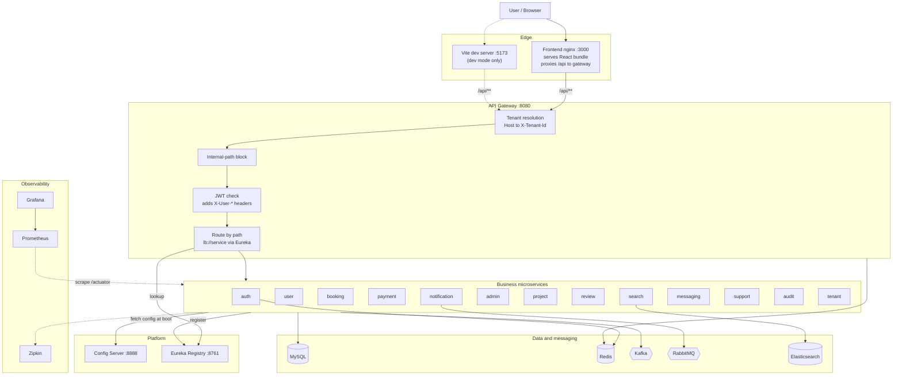

## 2. Docker startup order

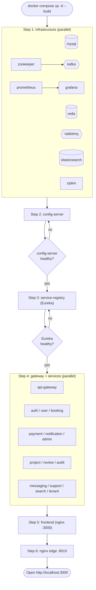

## 3. What happens when one service boots

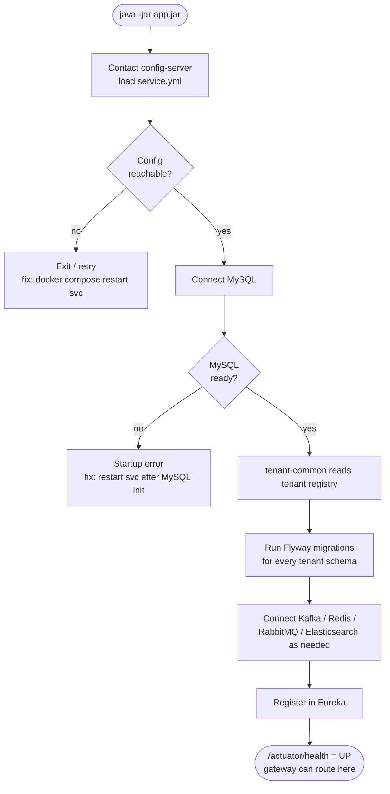

## 4. Request through the API gateway (decision flow)

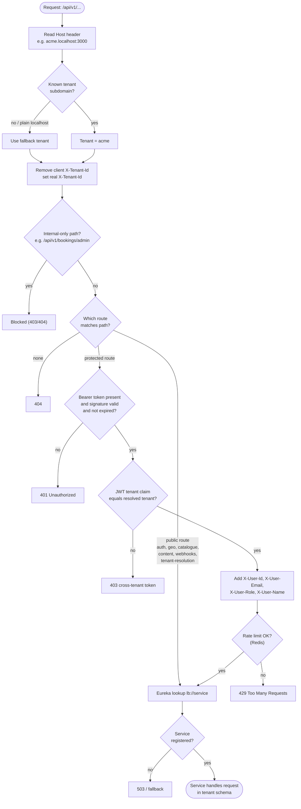

## 5. Login (sequence)

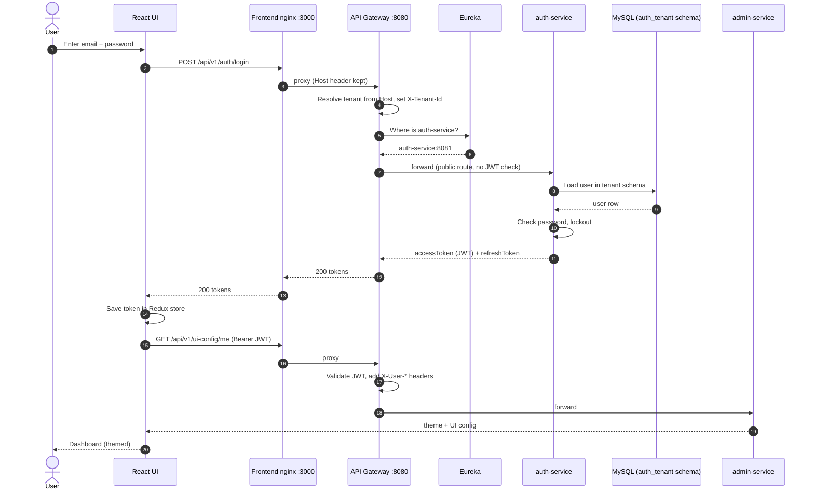

## 6. OTP login (sequence)

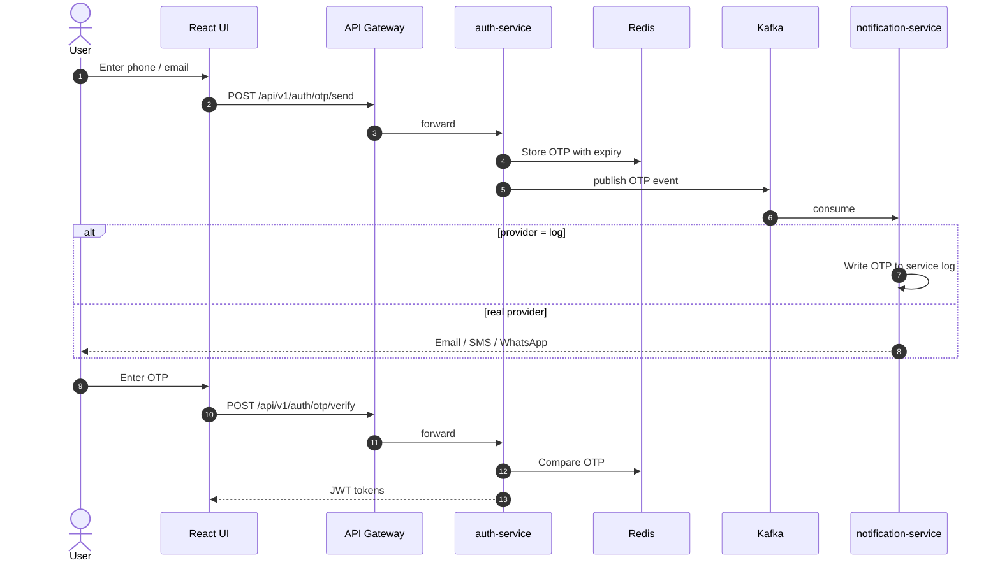

## 7. Authenticated call: create a booking (sequence)

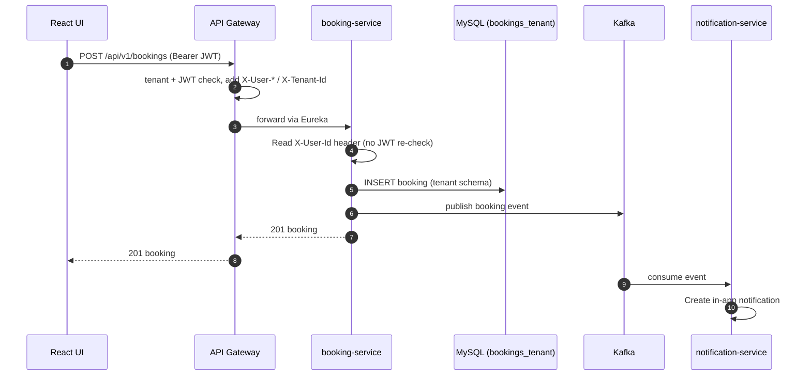

## 8. Kafka event flows

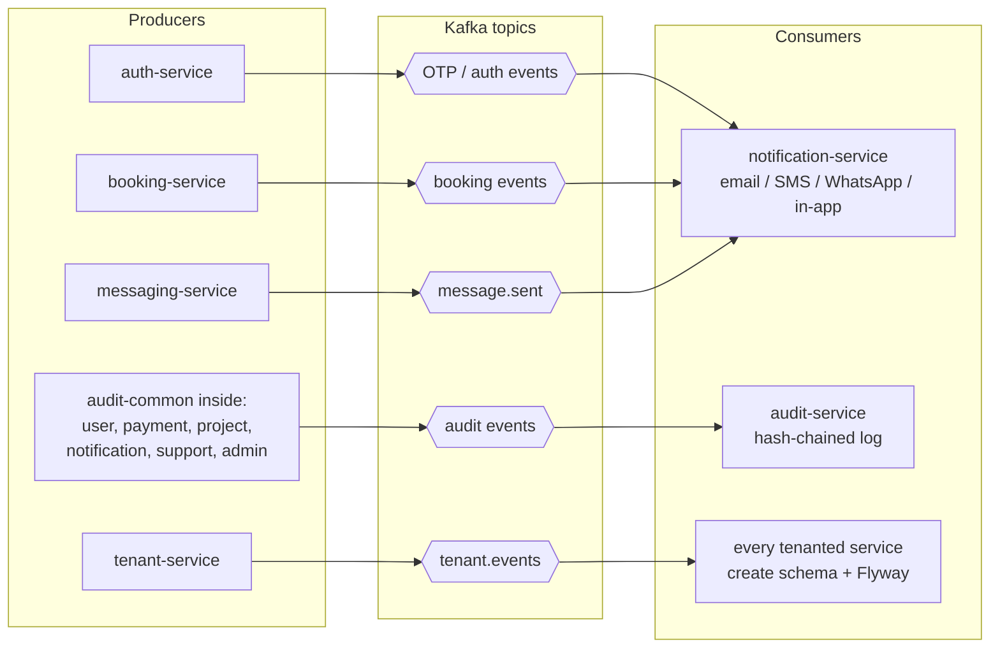

## 9. Service-to-service call (review needs a completed booking)

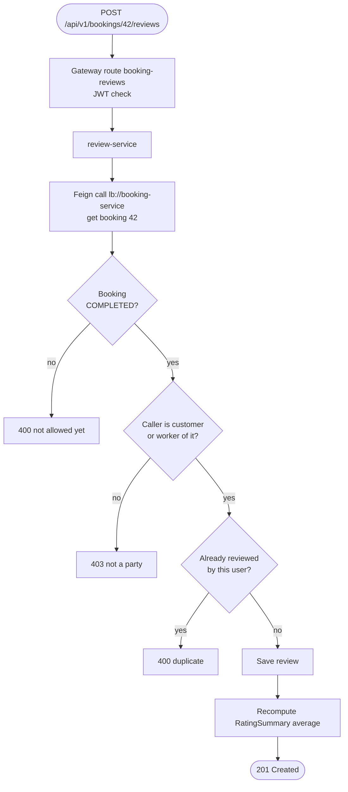

## 10. Escrow payment states

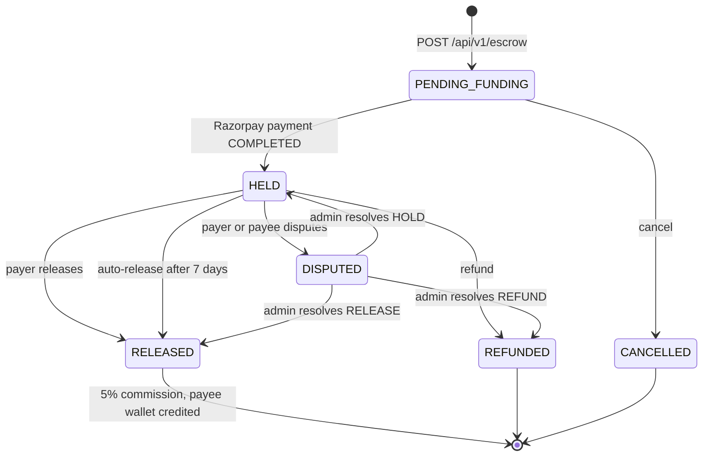

## 11. Support ticket states

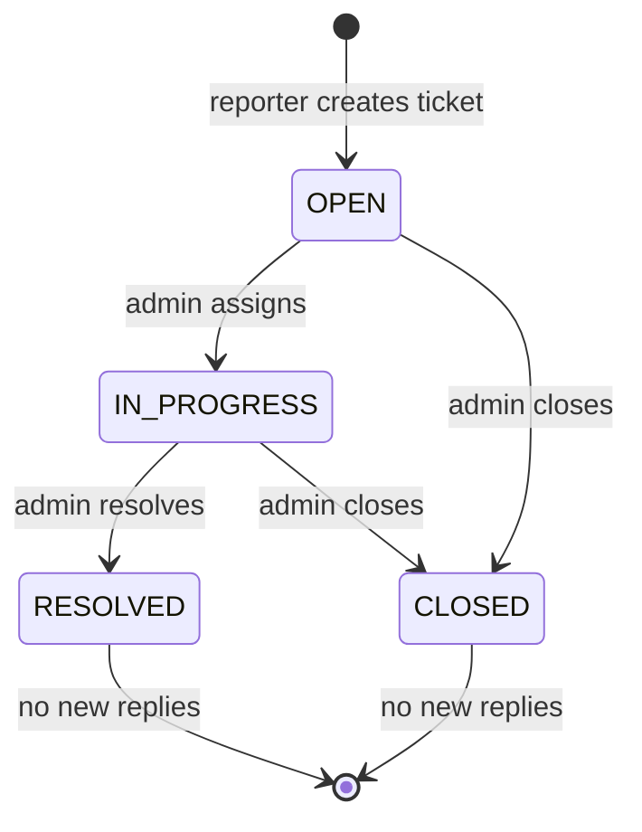

## 12. Multi-tenancy data path

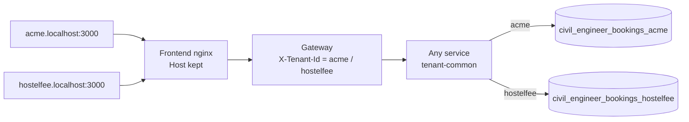

## 13. UI: dev mode vs Docker mode

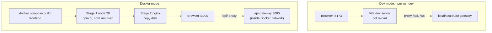

## 14. How to start: which option?

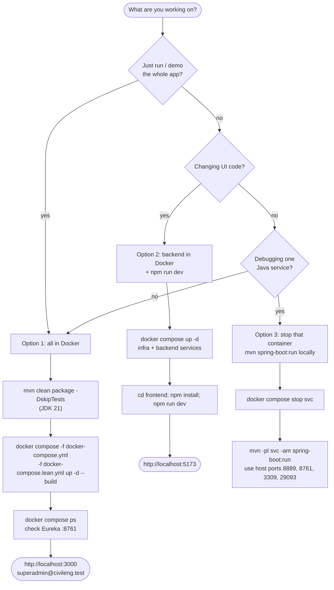

## 15. Code change: what to rebuild

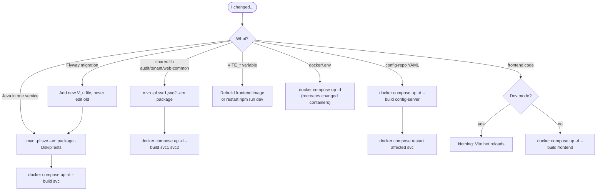
