# AryaDash (VIPLine-billing) — Angular UI Interview Guide

Everything a UI developer needs to explain this project in an interview: what it is, how it
is built, how each flow works end to end (with flowcharts), which Angular concepts it uses
and where, and practice questions with answers taken from the real code.

> Source repo: `~/VIPLine-billing` (GitHub `goswyperdev/VIPLine-billing`).
> Two Angular apps live in it: **aryadash-dashboard** (the product) and **aryadash-designer**
> (an AI tool that writes config for the product).
> Per-project pages: [projects/index.html](projects/index.html).
> For 5+ years of experience, read this with the [senior developer playbook](03-senior-developer-playbook.md).

---

## 1. Your 60-second pitch

> "I work on **AryaDash**, a **configuration-driven Angular dashboard engine** for telecom and
> billing operations. Instead of hand-coding every screen, we built around 80 reusable
> components — tables, forms, wizards, charts, detail views, chat, timelines — and each
> screen is described in **JSON**: which API to call, which columns to show, which filters,
> which form fields, what to do on each response status.
>
> The **same Angular 15 codebase ships 14 differently branded products** — VIP Line, Arya CRM,
> Arya Billing Admin (Xmobee), Wirepay, OCS Monitor, and more. A product is selected at
> **build time** through `angular.json` configurations that swap in that product's
> `global.json`, `routes.ts`, environment file and asset folder.
>
> I worked on the UI engine — the table/form components, the REST layer that builds URLs and
> headers from config, the login and session handling (cookie sessions and JWT bearer tokens),
> role-based menu and route access, and real-time features like live panels and chat over
> WebSockets. We also have a second app, **AryaDash Designer**, built in Angular 21 with
> standalone components and signals, which uses Claude to generate those JSON configs from a
> plain-English description."

---

## 2. What the project is

| Item | Value |
|---|---|
| Repo | `VIPLine-billing` (≈1,550 commits since Nov 2022) |
| App 1 | `aryadash-dashboard` — Angular **15.2**, NgModule-based, package name `vip-line` |
| App 2 | `aryadash-designer` — Angular **21.1**, standalone components + signals |
| Products built from App 1 | **14** (one folder each under `src/config/`) |
| Reusable UI components | ≈80 declared in `app.module.ts` (components, pipes, directives) |
| Page config files | ≈440 JSON files across all products (arya-billing-admin alone has 221) |
| Styling | Argon Dashboard (Bootstrap 5) theme + SCSS, per-product theme colours |
| Domain | Telecom BSS/OSS: SIMs, activations, bundles, DIDs, billing, wallets, CRM tickets, MNP porting, reports |

**The core idea (say this clearly in the interview):**
screens are **data, not code**. A page is a list of *view items* in `global.json`, each item
points to a JSON file that describes a table/form/etc., and generic Angular components
interpret that JSON at runtime.

---

## 3. Tech stack

| Layer | Dashboard (App 1) | Designer (App 2) |
|---|---|---|
| Framework | Angular 15.2, `NgModule`, `CUSTOM_ELEMENTS_SCHEMA` | Angular 21.1, standalone, `ApplicationConfig`, signals, `inject()` |
| Build | `@angular-builders/custom-webpack` (DefinePlugin injects `PRODUCT_TYPE`) | `@angular/build` (esbuild), Vitest |
| Language | TypeScript 4.x | TypeScript 5.9 |
| Async | RxJS 7.8 (`Observable`, `Subject`, custom observers) | RxJS (`switchMap`, `forkJoin`, `shareReplay`) + async iterators |
| HTTP | `HttpClient` wrapped in `RestAPIService` | `HttpClient`, `fetch` + SSE stream reader |
| UI libs | ngx-bootstrap (modals), ngx-toastr, ngx-spinner, SweetAlert2, ngx-gauge, Chart.js, drawflow / rete (bot-flow editor), flag-icon-css | plain SCSS |
| Storage | `angular-2-local-storage` (prefixed per product), `ngx-cookie` | `localStorage` settings |
| Real time | native `WebSocket`, `@stomp/stompjs` + SockJS (agent voice), Verto WebSocket | Server-Sent Events from Node server |
| Files | papaparse (CSV), file-saver, sha.js (password hashing) | Node `fs` via `server.js` |
| AI | — | `@anthropic-ai/sdk` (browser) or AWS Bedrock via `server.js` |

---

## 4. Folder structure (dashboard)

```
aryadash-dashboard/
├── angular.json                 # 22 build configs + 17 serve configs = one per product/env
├── custom-webpack.config.js     # DefinePlugin: process.env.PRODUCT_TYPE
├── src/
│   ├── main.ts                  # platformBrowserDynamic().bootstrapModule(AppModule)
│   ├── index.html               # <app-root>, Argon CSS, fonts, FontAwesome
│   ├── environments/            # environment.<product>.ts  -> configBase, productType
│   ├── config/
│   │   ├── global.json          # placeholder, REPLACED at build time
│   │   └── <product>/           # 14 products
│   │       ├── global.json      # title, theme, login, menu, submenu, pages, dashboard
│   │       ├── routes.ts        # Angular routes for that product
│   │       └── *.json           # one file per screen: tables, forms, wizards...
│   ├── assets-<product>/        # logos, CSS per brand
│   ├── proxy.conf.<product>.json# dev-server proxy: /user_mgmt/* -> backend
│   └── app/
│       ├── app.module.ts        # declares ~80 components/pipes/directives
│       ├── app-routing.module.ts# wraps every route (except login) with AuthGuard
│       ├── routes/routes.ts     # placeholder, REPLACED per product
│       ├── appconfig.service.ts # global.json + runtime JSON loader with cache
│       ├── rest-api.service.ts  # builds URL/headers from config, GET/POST/PUT/DELETE
│       ├── data-store.service.ts# localStorage + in-memory runtime store + pub/sub
│       ├── access-control.service.ts, auth.guard.ts, bearer-auth.service.ts
│       ├── session-logout.service.ts
│       ├── login-page/ login/   # login screen + login logic
│       ├── tableview/           # THE page shell: header, menu, rows of view items
│       ├── dashboard/           # metric tiles, gauges, charts
│       ├── table/ form/ wizard-form/ modal-form/ detailview/ list-view/ ...
│       ├── chat-room/ webchannel/ live-panel/ break-panel/ agent-voice/
│       └── *.pipe.ts            # data-fetch, data-xlate, data-filter, fe-paging, ...
```

---

## 5. High-level architecture

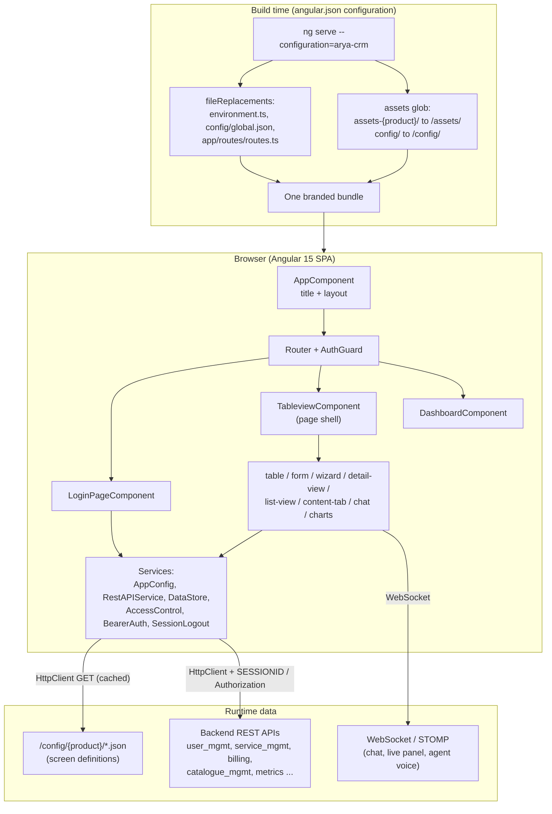

---

## 6. Flow 1 — Choosing a product at build time

`angular.json` has one **build configuration** and one **serve configuration** per product.
Each one swaps three files and copies that product's assets.

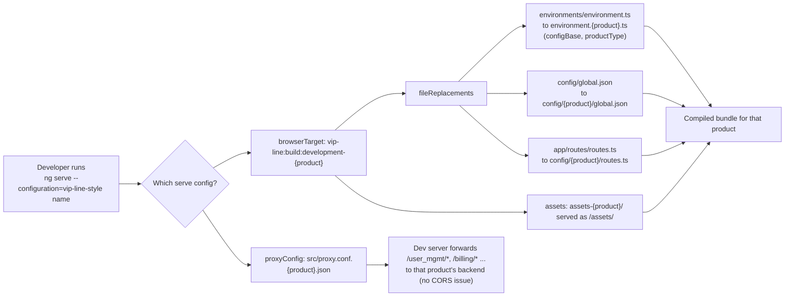

Key points to say:

- `global.json` is **imported at compile time** (`import * as data from '../config/global.json'`
  in `AppConfig`), so it is baked into the bundle.
- The per-screen JSON files are **fetched at runtime** over HTTP from
  `config/<configBase>/<name>.json`, so they can be edited without recompiling TypeScript.
- **Product type** (e.g. `PRODUCT_TYPE=enterprise ng serve --configuration=arya-crm`) adds a
  second layer: `AppConfig.readConfig()` tries `config/arya-crm/enterprise/<name>.json` first
  and falls back to `config/arya-crm/<name>.json` on 404 or on an HTML response.

---

## 7. Flow 2 — App bootstrap

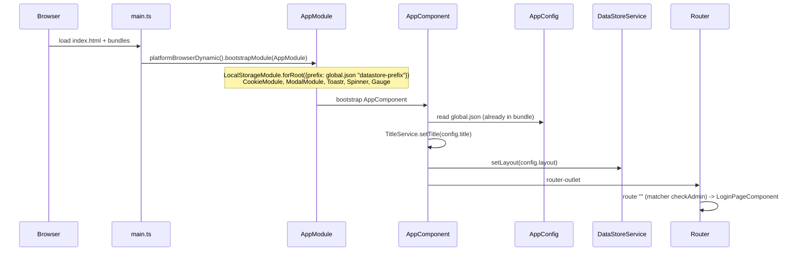

---

## 8. Flow 3 — Login (session-cookie mode and bearer-token mode)

`LoginComponent.onSignIn()` reads `global.json → login` to decide everything: URLs, field
names, cookie name, what to store after success.

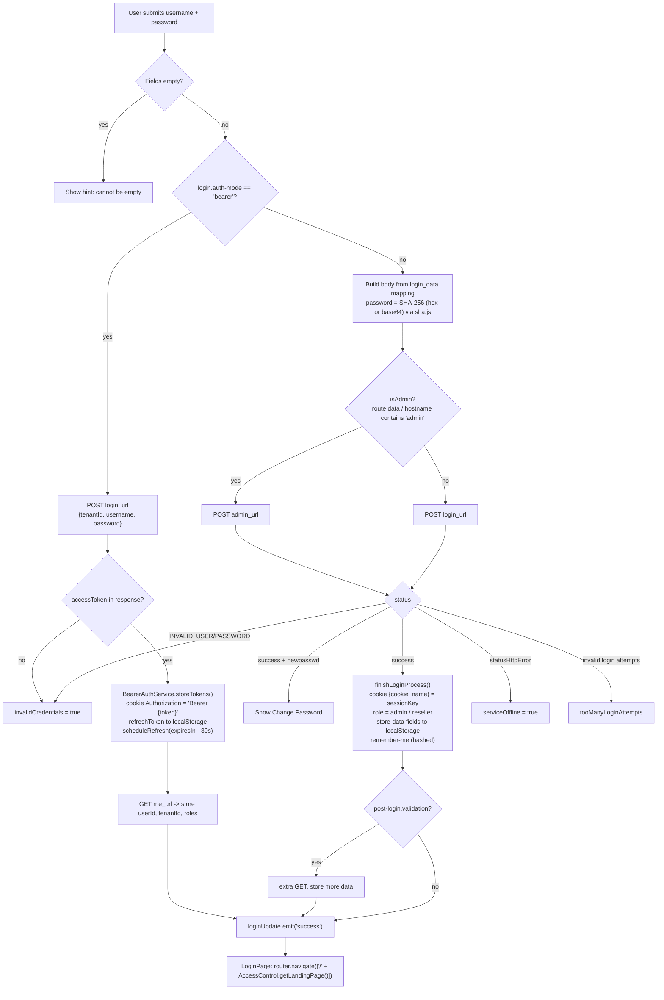

Interview talking points:

- **Config-driven field mapping**: `login_data` maps UI fields to API field names
  (`username → servedMSISDN` in VIP Line), so one login component serves 14 backends.
- **Two auth strategies behind one interface**: `AccessControlService.isLoggedIn()` checks the
  bearer cookie in bearer mode and the product's session cookie otherwise.
- **Token refresh**: `BearerAuthService.scheduleRefresh()` sets a timer for 30 seconds before
  expiry and calls `refresh_url`.

---

## 9. Flow 4 — Route protection (AuthGuard + role access)

`app-routing.module.ts` wraps every route except the login component:

```ts
const guardedRoutes = routes.map(route =>
  route.component === LoginPageComponent ? route : { ...route, canActivate: [AuthGuard] });
```

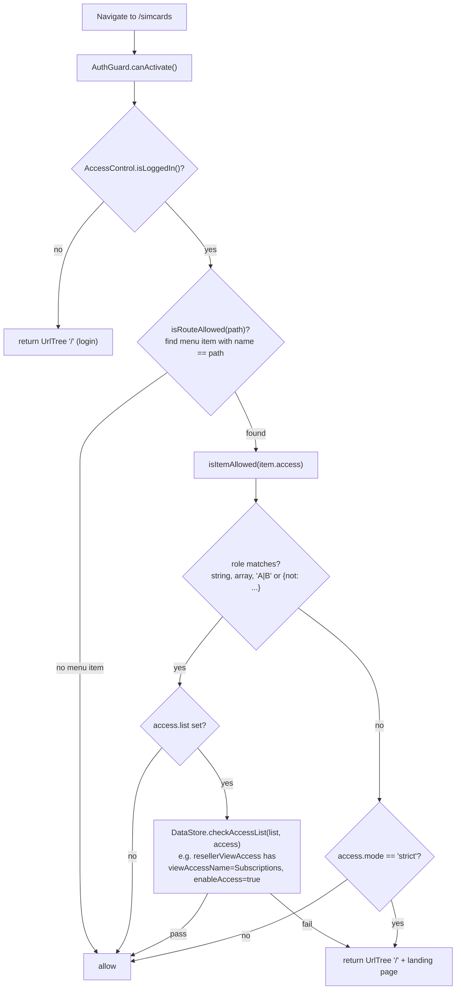

The **same `isItemAllowed()`** is used by `MenuComponent` to hide menu entries, by
`TableviewComponent` to drop view items, and by the guard — one rule set, three places.

---

## 10. Flow 5 — Menu click to rendered page (the heart of the engine)

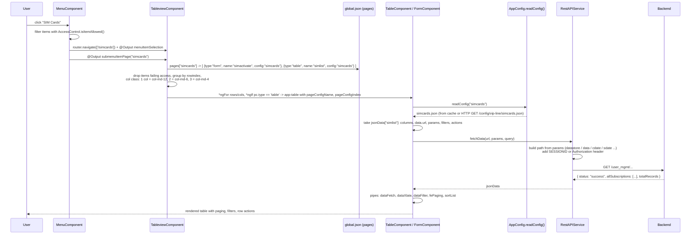

**A real example** (`config/vip-line/global.json` → `pages.simbaltopup`):

```json
[
  { "type": "form",  "name": "toppingup",  "config": "simbaltopup" },
  { "type": "table", "name": "simBallist", "config": "simbaltopup", "totalEntries": "true", "view": "top" }
]
```

This one entry produces a page with a top-up form and a table below it. No new Angular code.

**View types supported by `tableview.component.html`**: `table`, `table-with-filter`,
`form`, `modal-form`, `modal-wizard`, `wizard`, `select-update-form`, `detail-view`,
`list-view`, `content-tab`, `page-section`, `timeline`, `chat-view`, `chat-conversation`,
`bot-flow`, `metrics-grid`, `shift-grid`, `selection-overlay`, charts and more.

---

## 11. Flow 6 — Form submit with status handlers

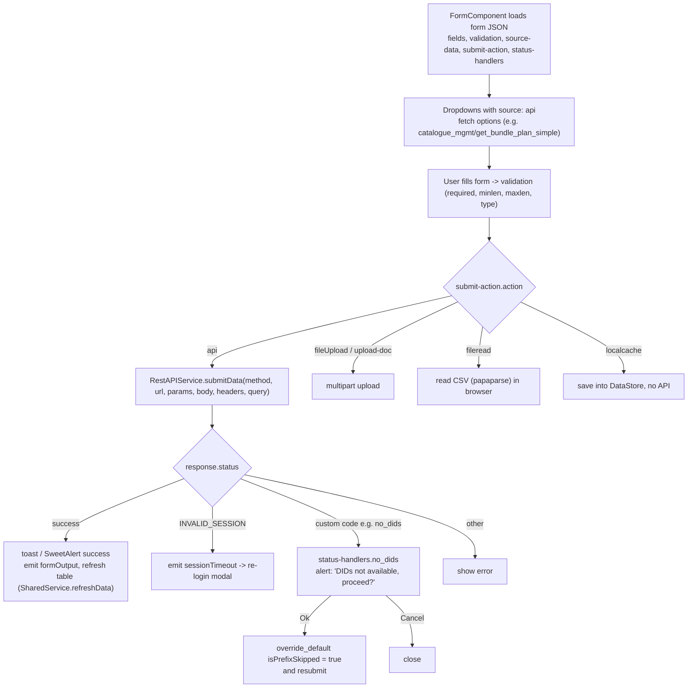

Why this matters: business rules like "no DIDs left — continue anyway?" are **declared in JSON**,
not coded. The form engine (`form.component.ts`, ~3,400 lines) interprets them.

---

## 12. Flow 7 — How an HTTP request is built

`RestAPIService.fetchData(path, params, query, headers)` turns a config like

```json
"params": {
  "fields": ["resellerid", "allplans"],
  "resellerid": { "source": "datastore", "data": "resellerId", "match-role": "reseller" },
  "allplans":   { "source": "data", "value": "All", "match-role": "admin" }
}
```

into a URL:

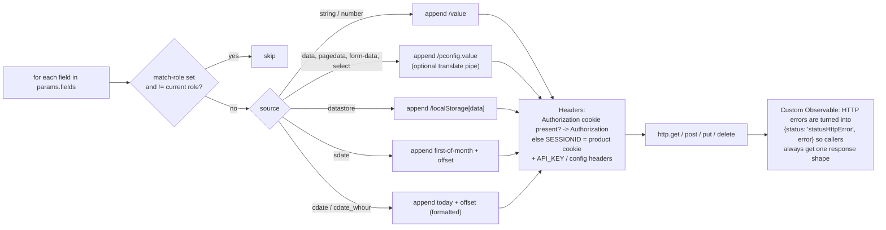

So a reseller calls `.../get_bundle_plan_simple/Tariff%20Plans/<resellerId>` and an admin calls
`.../get_bundle_plan_simple/Tariff%20Plans/All` — same config, role decides the URL.

A URL ending in `!` (e.g. Wirepay's `v1/auth/login!`) is a marker: `submitData()` strips it and does **not** append the usual trailing `/` — for endpoints that must be called without a trailing slash.

`isEmptyResultStatus()` treats "not found / no records" statuses as an empty result instead of an
error, so the UI shows an empty table rather than an error popup.

---

## 13. Flow 8 — Session expiry and re-login without losing the page

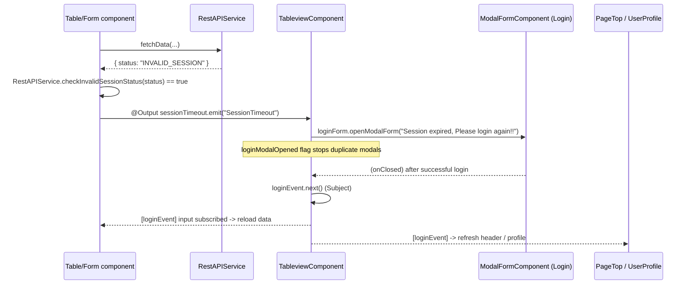

Logout (`SessionLogoutService.logout()`): bearer mode clears tokens; cookie mode calls
`logout_url` / `admin_url`, treats an already-expired session as a successful logout, removes the
cookie, clears stored session data, and navigates to `''` or `'admin'`.

---

## 14. Flow 9 — Component communication patterns used

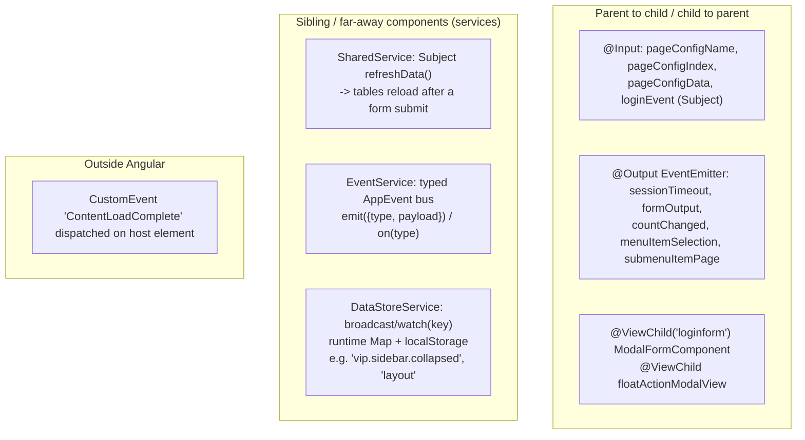

---

## 15. Real-time features

| Feature | Where | Tech |
|---|---|---|
| Generic socket | `websocket.service.ts` | native `WebSocket`, messages exposed as `Subject.asObservable()`; URL injected via `InjectionToken SOCKET_URL` |
| Agent voice / softphone | `agent-voice.service.ts` | `@stomp/stompjs` over SockJS (`/topic/agent-status`) + Verto WebSocket |
| Web chat channel | `webchannel/` | `WebSocket` |
| CRM chat / support chat | `chat-room/`, `chat-conversation/` | `WebsocketService` created per room (`new WebsocketService(url/domain/user/room/nick)`); config keys `crmchat`, `supportchat`, `infibotchat` |
| Live panel / break panel | `live-panel/`, `break-panel/`, `attendance.service.ts` | agent availability, breaks, shift sign-off (Arya CRM) |
| Bot flow editor | `bot-flow-editor/` | `drawflow` / `rete` node editor |

---

## 16. Performance and design decisions worth mentioning

1. **Config cache with request de-duplication** — `AppConfig.readConfig()` keeps a
   `Map<configName, json>` cache **and** a `Map<configName, Observer[]>` of pending requests.
   If five components ask for `simcards.json` at the same time, only **one** HTTP call is made
   and all five observers get the result. (Same idea as `shareReplay(1)`, written by hand.)
2. **Front-end paging** (`fePaging` pipe, `fpaging: true, pageentries: 50`) for small lists,
   server paging for large ones.
3. **Pure pipes** for formatting (`dataXlate`, `dataFetch`, `templateField`, `textWrap`,
   `calc`) keep templates declarative and are memoised by Angular.
4. **Per-product localStorage prefix** (`datastore-prefix`) so two products on the same domain
   don't overwrite each other's data.
5. **Dev proxy per product** avoids CORS in development.
6. **Role-aware URLs** (`match-role`) — one config serves admin and reseller.

---

## 17. The second app: AryaDash Designer (AI config generator)

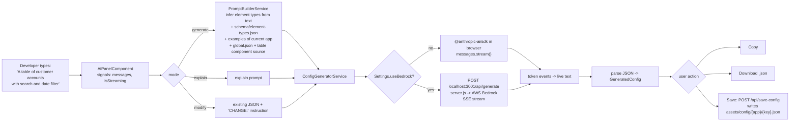

Angular 21 features to name: **standalone components**, **`loadComponent` lazy routes**,
**`signal()` / `computed()`**, **`inject()`** instead of constructor injection,
**`provideRouter` / `provideHttpClient`** in `app.config.ts`,
**`provideBrowserGlobalErrorListeners()`**.

---

## 18. Angular concepts → where they are in this project

| Concept | Where in this project |
|---|---|
| NgModule, declarations, `forRoot()` | `app.module.ts` (`LocalStorageModule.forRoot`, `ModalModule.forRoot`, `ToastNoAnimationModule.forRoot`) |
| `CUSTOM_ELEMENTS_SCHEMA` | `app.module.ts` — allows unknown elements from third-party widgets |
| Standalone components | designer `AiPanelComponent`, `SettingsComponent` |
| Routing, custom `UrlMatcher` | `checkAdmin` matcher in each `routes.ts` sets `data.is_admin` from hostname |
| Route data | `{ path: 'admin', data: { is_admin: true } }`, `disable_float` |
| Guards | `AuthGuard implements CanActivate`, returns `boolean \| UrlTree` |
| Lazy loading | designer: `loadComponent: () => import(...)` |
| Services / DI | `providedIn: 'root'` everywhere; `providers: [AppConfig]` at component level in `TableviewComponent` and `AppComponent` |
| `InjectionToken` | `SOCKET_URL` in `websocket.service.ts` |
| `@Input` / `@Output` / `EventEmitter` | every view component |
| `@ViewChild(..., { read: X })` | `TableviewComponent` → `ModalFormComponent`, `ModalViewComponent` |
| Lifecycle hooks | `OnInit`, `AfterContentInit`, `OnDestroy` (unsubscribe login events) |
| Structural directives | `*ngFor` rows/cols, `*ngIf` per view type, `ng-template [ngIf]` |
| `[ngClass]` | layout switching (vertical / horizontal / horizontal-top / horizontal-light) |
| Custom pipes | 15 pipes: `dataFetch`, `dataXlate`, `dataFilter`, `dataGroup`, `fePaging`, `sortList`, `safeHtml`, `calc`, `jsonParse` ... |
| Built-in pipes | `currency`, `date` (with timezone from config), `decimal`, `titlecase` |
| Custom directives | `[tooltip]`, `[appLastElement]`, `[appNoLeadingSpace]` |
| `DomSanitizer` | `safe-html.pipe.ts` for config-provided HTML |
| Template-driven forms | `FormsModule`; `form-field` binds `[ngModel]` to a `Map` of field values with `[ngModelOptions]="{standalone: true}"` (no ReactiveForms) |
| HttpClient | `RestAPIService`, `AppConfig` |
| RxJS | `Subject`, `Observable` constructor, custom Observers, `filter`, `map`, `switchMap`, `forkJoin`, `shareReplay` |
| Environments | `environment.<product>.ts` with `configBase`, `productType` |
| `fileReplacements` | swap global.json / routes.ts / environment per product |
| Custom webpack | `DefinePlugin` to read `PRODUCT_TYPE` env var at build |
| Proxy config | `proxy.conf.<product>.json` |
| Signals | designer: `signal`, `computed`, `.update()`, `.set()` |

---

## 19. Interview questions with answers from this project

**Q1. Explain your project's architecture.**
Config-driven SPA. `global.json` defines branding, login, menu and pages; each page is a list of
view items that point to screen JSON files; generic components (table, form, wizard…) render
them; `RestAPIService` builds requests from config. One codebase, 14 products, chosen by
`angular.json` configurations.

**Q2. How do you build different clients from one codebase?**
Build configurations with `fileReplacements` (environment, `global.json`, `routes.ts`) and
per-product asset folders. Serve configurations pair each build with its own proxy file.
Runtime `productType` lets a variant (e.g. `enterprise`) override single JSON files with fallback.

**Q3. How is authentication handled?**
Two modes chosen by `login.auth-mode`. Session mode: POST credentials (password SHA-256 hashed),
store `sessionKey` in a product-named cookie, send it as `SESSIONID` header. Bearer mode: store
`Authorization: Bearer …` cookie, refresh token in storage, auto-refresh 30 s before expiry,
principal from `me_url`.

**Q4. How do you protect routes?**
`AuthGuard` added to every non-login route by mapping over the routes array. It returns a
`UrlTree` (not `false`) so Angular redirects cleanly: to login if not logged in, or to the
role's landing page if the menu item's `access` rule fails.

**Q5. How does role-based UI work?**
`access` objects on menu items and page items: `role` (string, array, `"A|B"`, or `{not: …}`),
`list` (a permission list saved at login such as `resellerViewAccess`), and `mode: strict`.
`AccessControlService.isItemAllowed()` is reused by menu, guard and page builder.

**Q6. How do components talk to each other?**
`@Input`/`@Output` for parent-child; `@ViewChild` to call child methods (open login modal);
services with `Subject` for siblings (`SharedService.refreshData()`, `EventService`,
`DataStoreService.watch()`); a `Subject<void>` passed as `@Input loginEvent` to tell every child
"login finished, reload".

**Q7. What happens when the session expires mid-work?**
Any component that sees `INVALID_SESSION` emits `sessionTimeout`; the page shell opens a login
modal (guarded against duplicates); after login it calls `loginEvent.next()` and children reload
— the user never loses the page they were on.

**Q8. How did you avoid duplicate HTTP calls for configs?**
`AppConfig.readConfig()` returns a custom `Observable` backed by a cache map and a pending-observer
map; the first subscriber triggers the request, later ones are queued and all are notified.

**Q9. Difference between `Subject`, `BehaviorSubject`, `ReplaySubject`?**
`Subject` has no initial value and late subscribers miss past values (used here for events like
refresh/login). `BehaviorSubject` holds a current value (good for "current layout"). `ReplaySubject`
/ `shareReplay(1)` replays the last N values (designer's schema is loaded once with `shareReplay(1)`).

**Q10. `switchMap` vs `mergeMap` vs `forkJoin`?**
Designer uses `switchMap` to go from the loaded schema to the prompt-building call (cancels the
previous inner stream), and `forkJoin` to wait for examples, global config and component source in
parallel before composing the prompt.

**Q11. Why pipes instead of methods in templates?**
Pure pipes run only when inputs change; a method call in a template runs on every change-detection
cycle. The table uses pipes like `dataFetch`, `dataXlate`, `fePaging` for formatting and paging.

**Q12. How do you handle CORS in development?**
Angular dev-server proxy per product (`proxy.conf.aryacrm.json` maps `/user_mgmt/*`,
`/service_mgmt/*`, `/billing_reports/*` … to the backend). In production the same paths are served
from the same origin.

**Q13. What is a custom `UrlMatcher` and why use one?**
`checkAdmin` matches the empty path and, when the hostname contains `admin`, sets
`route.data.is_admin = true`, so `admin.example.com` shows the admin login without a separate route.

**Q14. NgModule vs standalone — which did you use?**
Both. The dashboard (Angular 15) is NgModule-based with ~80 declarations. The designer (Angular 21)
is fully standalone with `ApplicationConfig`, `provideRouter`, `provideHttpClient`, lazy
`loadComponent`, and signals.

**Q15. What are signals and how are they used?**
Reactive values with fine-grained change tracking. Designer: `messages = signal<AiMessage[]>([])`,
`isStreaming = signal(false)`, `hasApiKey = computed(() => …)`, updated with `.set()` / `.update()`
while tokens stream in.

**Q16. How do you stream an AI response into the UI?**
`ConfigGeneratorService` wraps the Anthropic SDK stream (`for await` over events) or a `fetch`
body reader (SSE from `server.js`) in an `Observable<StreamEvent>` that emits `token`, `done`,
`error`; the component appends tokens to a signal.

**Q17. How is data kept per product in the browser?**
`LocalStorageModule.forRoot({ prefix: datastore-prefix })` — e.g. `vip.`, `aryabilling.` — plus a
product-specific cookie name (`SESSIONID_VIP_LINE`, `SESSIONID_ARYA_CRM`).

**Q18. How would you add a new screen?**
Add a JSON file under `src/config/<product>/`, add a `pages` entry and a `menu`/`submenu` entry in
that product's `global.json`, add a `{ path, component: TableviewComponent }` route in its
`routes.ts`. Only write Angular code if a new *view type* is needed.

**Q19. How would you add a new product?**
Create `src/config/<new>/` (global.json, routes.ts, screen JSONs), `environment.<new>.ts`
(`configBase: "<new>/"`), `assets-<new>/`, `proxy.conf.<new>.json`, and a build + serve
configuration in `angular.json`.

**Q20. What would you improve? (always prepare this)**
- Split very large components (`form.component.ts` ~3,400 lines, `table.component.ts` ~1,700) into
  smaller field/column renderers.
- Add TypeScript interfaces / JSON Schema for configs (the designer's `element-types.json` is a
  start) instead of `any`.
- Move to an `HttpInterceptor` for auth headers and session-expiry handling instead of doing it in
  `RestAPIService` and every component.
- Use `takeUntilDestroyed` / `async` pipe to avoid manual subscriptions.
- Functional guards (`CanActivateFn`) — class-based `CanActivate` is deprecated in newer Angular.
- Remove `console.log` noise; add `OnPush` change detection on heavy tables.
- Don't call the Anthropic API from the browser with a user key (`dangerouslyAllowBrowser`) — the
  Bedrock path through `server.js` is the safer pattern.
- Upgrade the dashboard from Angular 15 to a supported version.

---

## 20. How to run

```bash
# Dashboard (default product = VIP Line, http://localhost:4200)
cd ~/VIPLine-billing/aryadash-dashboard
npm install
ng serve                                   # vip-line (development config)
ng serve --configuration=arya-crm          # Arya CRM
PRODUCT_TYPE=enterprise ng serve --configuration=arya-crm   # Arya CRM enterprise variant
ng build --configuration=arya-crm          # production-style build for one product

# Designer (http://localhost:4201) + its file/AI server (http://localhost:3001)
cd ~/VIPLine-billing/aryadash-designer
npm install
node server.js &                           # file read/write + Bedrock proxy
npm start
```

---

## 21. Glossary

| Term | Meaning here |
|---|---|
| Product | One branded build (vip-line, arya-crm …) = one folder in `src/config/` |
| `global.json` | Product-level config: title, theme, login, menu, submenu, pages, dashboard widgets |
| Page | Entry in `global.json → pages`: array of view items |
| View item | `{ type, name, config, rowindex?, access? }` — one table/form/etc. on a page |
| Screen JSON | `src/config/<product>/<config>.json` — definition keyed by view-item `name` |
| `configBase` | Folder name used to fetch screen JSON at runtime |
| `productType` | Optional sub-variant folder with fallback (e.g. `enterprise`) |
| `datastore-prefix` | localStorage key prefix per product |
| `access` | Role / permission rule on menu and page items |
| `status-handlers` | Per-status reactions declared in form JSON |
| BSS / OSS | Business / Operations Support Systems (telecom billing and operations) |
| MSISDN, ICCID, IMSI, DID | Phone number, SIM serial, subscriber identity, direct inward dial number |
| MNP | Mobile Number Portability (port-in / port-out) |
| CDR / EDR | Call / Event Detail Record |
