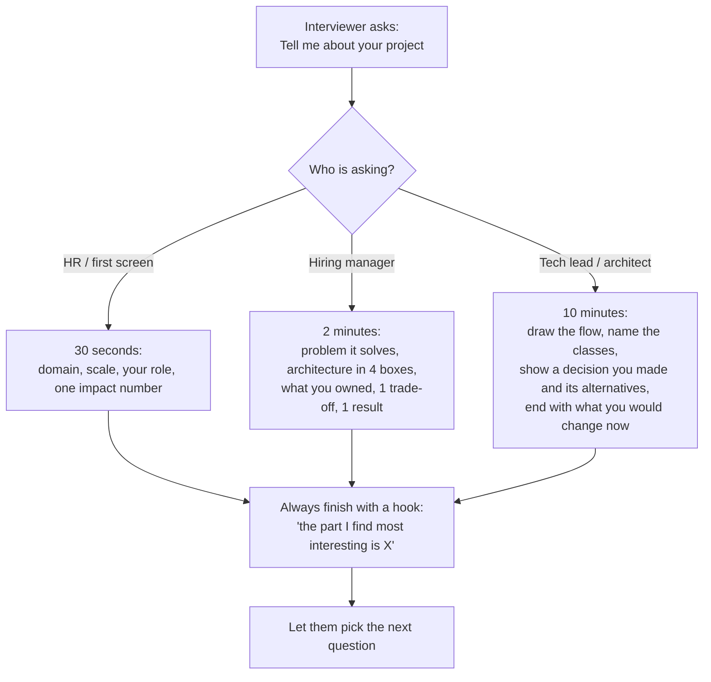
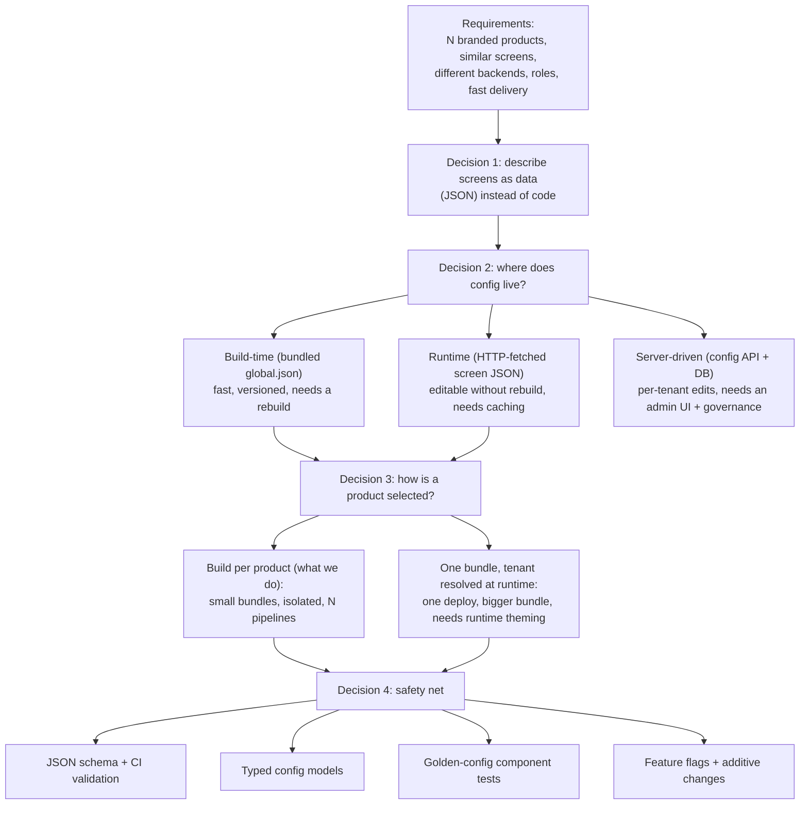
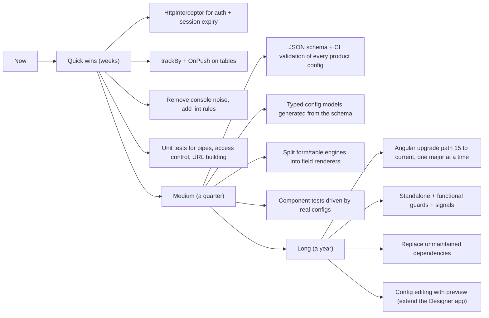

# Handling this project as a 5+ year UI developer

A playbook for interviewing (or working) at **5 years of experience** level on the AryaDash
Angular codebase. At 2 years you are asked *what* the code does; at 5 years you are asked
*why it is built that way, what you owned, what you would change, and how you would lead it*.

> Companion documents: [Interview guide](00-interview-guide.md) (the facts and flows) ·
> [All projects](projects/README.md) (2 apps, 14 products)

---

## 1. What changes at 5 years

| They ask a junior | They ask you |
|---|---|
| "What is a pipe?" | "Why a pipe and not a method? When does it hurt you?" |
| "How does login work?" | "Two auth modes in one codebase — how did you keep 13 products working while adding the 14th?" |
| "Did you use RxJS?" | "Where did you leak subscriptions, and how did you find it?" |
| "What did you build?" | "What did you own, what did you decide, what did you measure?" |
| "Do you know Angular 15?" | "The app is on Angular 15 and out of support. What is your migration plan and its risk?" |
| — | "Review this PR / estimate this feature / mentor this junior." |

**Three sentences that set the level in the first minute:**

> "I work on a config-driven Angular platform where 14 branded products are built from one
> codebase — screens are JSON, not components.
> I own the rendering engine and the platform services: the table/form engines, the REST layer,
> auth and session handling, and role-based access.
> The interesting problems are extensibility and blast radius: any change I make in a shared
> component ships to 14 products at once."

---

## 2. Tell the story at three depths



**The 2-minute version (memorise the shape, not the words):**

1. *Problem* — 14 telecom/billing customers need similar CRUD, report and workflow screens, each
   with their own branding, backend and permissions. Hand-coding every screen does not scale.
2. *Solution* — an engine: ~80 generic components read JSON that describes each screen (data
   source, columns, filters, form fields, actions, per-status behaviour). A product is chosen at
   build time by `angular.json` configurations that swap `global.json`, `routes.ts`, environment
   and assets.
3. *My part* — the engine and platform services, plus the products I delivered screens for.
4. *Trade-off* — we traded compile-time safety for delivery speed: a new screen is a JSON file,
   but configs are untyped and the generic components grew large. We are addressing that with a
   JSON schema and an AI designer tool that generates configs from the schema.
5. *Result* — a new screen takes hours instead of days; a new product is a config folder plus a
   build configuration.

---

## 3. Ownership stories (STAR) that exist in this codebase

Use the ones you actually did. If a piece was written by a teammate, say
*"that part I reviewed / maintained"* — claiming someone else's work is the fastest way to fail a
deep-dive round. Each story below points at real code you can open during prep.

### 3.1 Duplicate config requests — `appconfig.service.ts`

- **Situation** — a page renders several view items, and each one asks for the same screen JSON.
- **Task** — stop N components triggering N identical HTTP calls on every navigation.
- **Action** — `readConfig()` keeps a result cache **and** a map of pending observers: the first
  subscriber fires the request, later subscribers are queued and all are notified on completion
  (a hand-written `shareReplay(1)`), plus a `productType` fallback path for variant folders.
- **Result** — one request per config per session instead of one per component.
- **Follow-up they will ask** — "why not `shareReplay(1)`?" Honest answer: it predates that
  refactor; `shareReplay({ bufferSize: 1, refCount: false })` plus `catchError` would express the
  same thing in three lines, and that is on my cleanup list.

### 3.2 Session expiry without losing the user's page — `tableview` + `rest-api.service.ts`

- **Situation** — long shifts in a CRM: sessions expire while an agent has a half-filled form.
- **Task** — never dump the user back to the login page mid-task.
- **Action** — any component seeing an `INVALID_SESSION` status emits `sessionTimeout`; the page
  shell opens a login modal (guarded by `loginModalOpened` so five parallel failures open one
  modal), and after login a `Subject` passed down as `@Input loginEvent` tells every child to
  reload.
- **Result** — re-authentication in place, no lost form state, one modal instead of a stack.
- **What I would do now** — an `HttpInterceptor` so components never handle session logic at all.

### 3.3 "Not found" is not an error — `isEmptyResultStatus()`

- **Situation** — back ends answer empty lookups with prose (`"MDN not Found"`,
  `"No records found"`), and the UI raised an error modal that agents had to dismiss all day.
- **Task** — distinguish "no data" from "failure" without an enum from the backend.
- **Action** — a loose regex (`not found|no record|no data|no result|empty`) classifies those
  statuses as an empty result; genuine HTTP errors and session expiry still surface.
- **Result** — fewer support complaints; empty states instead of popups.
- **Trade-off to volunteer** — string matching is fragile; the right fix is a status contract with
  the backend teams, which is a cross-team conversation, not a UI change.

### 3.4 Adding bearer/JWT auth without touching 13 products — `bearer-auth.service.ts`

- **Situation** — a new product (Wirepay) authenticates with JWT + refresh tokens and a tenant
  header; every existing product uses server sessions and a `SESSIONID` header.
- **Task** — support both without a fork and without regressing the others.
- **Action** — the mode is data (`login.auth-mode: "bearer"` in that product's `global.json`);
  `AccessControlService.isLoggedIn()` hides the difference; `BearerAuthService` stores tokens,
  schedules a refresh 30 s before expiry and clears tokens on logout;
  `api-config.header-params` adds `X-TENANT-ID` globally. A `!` suffix on a URL suppresses the
  trailing slash the old backends require.
- **Result** — one codebase, two auth strategies, zero changes in the other products.
- **This is your best "extensibility" story** — it shows a strategy pattern chosen through config.

### 3.5 One access rule, three consumers — `access-control.service.ts`

- **Situation** — role checks were duplicated in the menu, the route guard and the page builder,
  and drifted apart (a hidden menu item was still reachable by typing the URL).
- **Task** — one implementation of "may this user see this?".
- **Action** — `isItemAllowed()` supports role as a string, an array, `"A|B"`, or `{not: [...]}`
  plus permission lists saved at login and a `mode: strict` escape hatch; the guard returns a
  `UrlTree` to the role's landing page instead of `false`.
- **Result** — menu, guard and page composition cannot disagree.
- **Say this too** — client-side access control is UX, not security; the API must enforce it.

### 3.6 Multi-product build pipeline — `angular.json`

22 build and 17 serve configurations, per-product proxy files, per-product localStorage prefixes
and cookie names, and a `PRODUCT_TYPE` env var wired through a custom webpack `DefinePlugin` for
variant overrides. Good material for "how do you handle multi-tenancy / white-labelling?".

### 3.7 A production bug you can talk about honestly

The recent commits (`break-panel` sign-out, conditional view checks for live/break panels,
ticket-detail fix) are the kind of real defect story interviewers like: symptom → how you
reproduced it → root cause → fix → what stopped it recurring. Prepare **one** of these end to end
from the actual diff (`git show <sha>`), including what test or guard you added.

---

## 4. Senior-level questions and answers

**Q. Why config-driven? Would you do it again?**
For 14 products with similar screens, yes — the cost of a new screen collapses. I would change
two things: type the configs (JSON Schema + generated TypeScript types, validated in CI) from day
one, and keep the generic components small by splitting per field type instead of letting one
component grow to thousands of lines.

**Q. What is the blast radius of your changes?**
Any change in `table`, `form` or `rest-api` ships to all 14 products. So: feature-flag behaviour
through config keys with safe defaults, change additively (new key, old path untouched), and
smoke-test the two or three heaviest products before release. This answer alone signals seniority.

**Q. How do you keep a 3,400-line component maintainable?**
I do not defend it — I explain the plan: extract field renderers per `type` into small components
behind a `FieldRegistry`, move the submit/status-handler logic into a service, cover the current
behaviour with tests against real product configs first, then refactor in slices so each release
is reversible.

**Q. Performance: the table is slow with 5,000 rows. What do you do?**
Measure first (Angular DevTools profiler, `performance.mark`). Then, in order of payoff: server-
side paging/filtering instead of front-end paging; `trackBy` on every `*ngFor`; `OnPush` on the
row components and immutable row updates; move formatting from method calls in templates into
pure pipes; virtual scrolling (`cdk-virtual-scroll`) for long lists; `runOutsideAngular` for
scroll/resize handlers. Quantify before/after.

**Q. Where do memory leaks come from here and how do you fix them?**
Manual `subscribe()` calls in components that outlive their subscription (data-store watches,
`loginEvent`, socket streams). Fixes: `async` pipe where possible, `takeUntilDestroyed()` or a
`destroy$` `Subject`, and closing sockets in `ngOnDestroy`. How I find them: Chrome heap snapshots
across repeated navigations and a lint rule for bare `.subscribe(`.

**Q. How would you test a config-driven UI?**
Three layers: unit tests for pure logic (pipes, `AccessControlService`, URL building in
`RestAPIService` — these are the highest value and easiest to write); component tests that feed a
real product config plus a mocked HTTP response and assert the rendered table/form; and a handful
of end-to-end smoke flows per product (login → menu → page loads → submit). Plus a CI step that
validates every config against the JSON schema — that catches a whole class of runtime bugs.

**Q. State management — why no NgRx?**
The app's state is mostly server state plus a small amount of session data, and screens are
described by config rather than by app state. A store would add ceremony without removing
complexity. What we do have (`DataStoreService` with `broadcast`/`watch`, `SharedService`,
`EventService`) is effectively a hand-rolled event bus; if it grew, I would move to signals or a
small typed facade before reaching for NgRx.

**Q. Angular 15 is out of support. Plan?**
Inventory blockers first (`angular-2-local-storage`, `ngx-cookie`, `angular-chart.js` are the risky
ones). Then: upgrade one major at a time with `ng update` on a branch per version; replace dead
dependencies with maintained equivalents or thin in-house wrappers; migrate class guards to
functional guards and modules to standalone with the official schematics; keep the Designer app
(already Angular 21) as the proving ground for new patterns. Sell it in risk terms — security
patches, hiring, library support — with a per-product smoke-test gate.

**Q. Security review of this front end — what do you flag?**
Client-side hashing of passwords is not a substitute for TLS and server-side hashing; role checks
in the UI must be enforced server-side; `SafeHtmlPipe` bypasses sanitisation, so config is a trust
boundary — only config authors may inject HTML; cookies should be `HttpOnly`/`Secure`/`SameSite`
where the flow allows; and in the Designer, `dangerouslyAllowBrowser` with an API key in
`localStorage` is fine for a local dev tool but must never ship — the Bedrock path keeps
credentials server-side.

**Q. How do you review a junior's PR in this codebase?**
Behaviour first (does it work for both roles and at least two products?), then blast radius (is a
shared component changed for one product's need?), then the small stuff: no `any` where a type is
known, no logic in templates, `trackBy`, unsubscribe, no `console.log`, config keys documented,
and one test that would have failed before the fix. I leave the "why" in the comment, not just the
"what", and I approve with nits rather than blocking on style.

**Q. How do you estimate a new screen / a new product?**
A screen that fits existing view types: hours — config plus review. A screen needing a new view
type: days — component, config keys, docs, tests, and the rollout risk to other products. A new
product: config folder, environment, assets, proxy, build/serve configurations, plus backend
contract mapping — typically a couple of weeks, dominated by API differences, not UI.

**Q. How do you mentor on this codebase?**
Pair on their first screen entirely in config so they see the engine from the outside, then have
them add one small view type so they see it from the inside. Keep a "how to add a screen" doc
(this folder) current. In review, explain the trade-off rather than dictating the change.

---

## 5. System design round: "design a config-driven dashboard platform"

You already have the answer — narrate it as a design, not as history.



Points that score: naming the alternative you did **not** pick and why; caching and
de-duplication; versioning of configs; a validation gate; and how you would roll out a breaking
engine change across products.

---

## 6. Machine / live-coding round: likely tasks and the patterns to use

| Likely task | What they are checking | Pattern from / for this project |
|---|---|---|
| Debounced search over a table | RxJS operators, no leaks | `fromEvent`/`valueChanges` → `debounceTime(300)`, `distinctUntilChanged()`, `switchMap()`, `takeUntilDestroyed()` |
| Attach auth headers to every request | Interceptors | move the `SESSIONID`/`Authorization` logic out of `RestAPIService` into an `HttpInterceptor` |
| Retry a failing request | Error handling | `retry({ count: 2, delay: 1000 })` + `catchError` mapping to a uniform result shape (this codebase already normalises errors) |
| Write a pipe that formats a config-driven value | Pure vs impure | mirror `templateField` / `dataXlate` |
| Render a component by a `type` string | Dynamic components | a registry `Map<string, Type<any>>` + `ViewContainerRef.createComponent()` — the modern replacement for the big `*ngIf` ladder in `tableview.component.html` |
| Make a list fast | Change detection | `OnPush` + `trackBy` + immutable updates |
| Guard a route | Modern Angular | functional `CanActivateFn` with `inject()` returning a `UrlTree` |

**Interceptor sketch to have ready** (the refactor you would propose here):

```ts
export const authInterceptor: HttpInterceptorFn = (req, next) => {
  const cookies = inject(CookieService);
  const cfg = inject(AppConfig);
  const auth = cookies.get('Authorization');
  const authed = req.clone({
    setHeaders: auth ? { Authorization: auth }
                     : { SESSIONID: cookies.get(cfg.getCookieName()) || 'PlaceHolder' },
  });
  return next(authed).pipe(
    tap(event => {
      if (event instanceof HttpResponse && RestAPIService.checkInvalidSessionStatus(event.body?.status)) {
        inject(SessionEventsService).sessionExpired();   // one place, not every component
      }
    }),
  );
};
```

---

## 7. The improvement roadmap to propose (shows you think beyond tickets)



Always attach a *why it matters to the business*: fewer production bugs, faster onboarding of new
developers, supported framework for security patches, shorter time-to-first-screen for a new
client.

---

## 8. Quantifying impact without inventing numbers

Interviewers want numbers; integrity matters more. Use ranges you can defend and say how you know:

- "A new screen that fits existing view types takes hours rather than the days a hand-coded screen
  took — measured by comparing two similar tickets."
- "One product's config folder has 220 screen JSON files and no bespoke components — that is the
  reuse argument in one number."
- "Config requests dropped from one per view item to one per page after the cache change."
- "14 products ship from one codebase; adding the 14th needed zero changes to the other 13."

If you do not have a metric, say what you would measure now — that is a senior answer too.

---

## 9. Behavioural answers to prepare

| Prompt | What the story needs |
|---|---|
| Disagreement with a teammate or lead | A technical disagreement (e.g. new view type vs config key), how you framed it in trade-offs, what you did after the decision went the other way |
| A production incident | Detection, immediate mitigation, root cause, the guard you added, and what you told the users |
| Mentoring | One concrete person, what they could not do before and can do now |
| Pushing back on scope | A request that would have coupled the engine to one customer, and the alternative you offered |
| Something you got wrong | A real one with the correction — e.g. a "quick" shared-component tweak that regressed another product, and the review/test habit it changed |

---

## 10. Questions to ask them (senior candidates are judged on these)

- How are cross-cutting UI changes tested before they reach every customer?
- Who owns the contract between front end and back end, and where are statuses defined?
- What is the framework upgrade policy, and what is the oldest supported version in production?
- How much of the UI is config or low-code today, and where does that model break for you?
- What does the on-call/escalation path look like for the front end?
- What would you want me to have shipped by day 90?

---

## 11. Two-week preparation checklist

**Week 1 — the codebase**
- [ ] Re-read the [interview guide](00-interview-guide.md) flows and redraw them from memory.
- [ ] Open `rest-api.service.ts`, `appconfig.service.ts`, `access-control.service.ts`,
      `auth.guard.ts`, `login.component.ts`, `tableview.component.ts` and be able to explain each
      in four sentences.
- [ ] Run two products locally and click through login → menu → a table → a form submit.
- [ ] `git log --author="<you>"` — pick three commits and prepare STAR stories from the diffs.

**Week 2 — the delivery**
- [ ] Practise the 30-second / 2-minute / 10-minute versions out loud.
- [ ] Draw the menu→page flow on paper in under two minutes.
- [ ] Prepare the improvement roadmap and one honest weakness per area.
- [ ] Revise Angular fundamentals a 5-year candidate is expected to nail cold: change detection
      and `OnPush`, RxJS operators and leaks, pipes (pure/impure), DI and providers scope,
      guards/resolvers, lazy loading, interceptors, signals vs `BehaviorSubject`, testing basics.
- [ ] Prepare your questions for them.

---

## 12. Traps to avoid

- Claiming the whole platform. Say what you owned, what you contributed to, what you maintained.
- Defending every legacy choice. "It grew that way; here is the plan" reads as senior; denial does not.
- Buzzwords without the repo behind them — if you say NgRx/micro-frontends/SSR, expect
  "where did you use it here?".
- Only describing features. Pair every feature with a decision, a trade-off and an outcome.
- Forgetting the domain. Knowing what an ICCID, MSISDN, DID, MNP port or CDR is makes you sound
  like someone who worked in telecom, not someone who only rendered tables.
