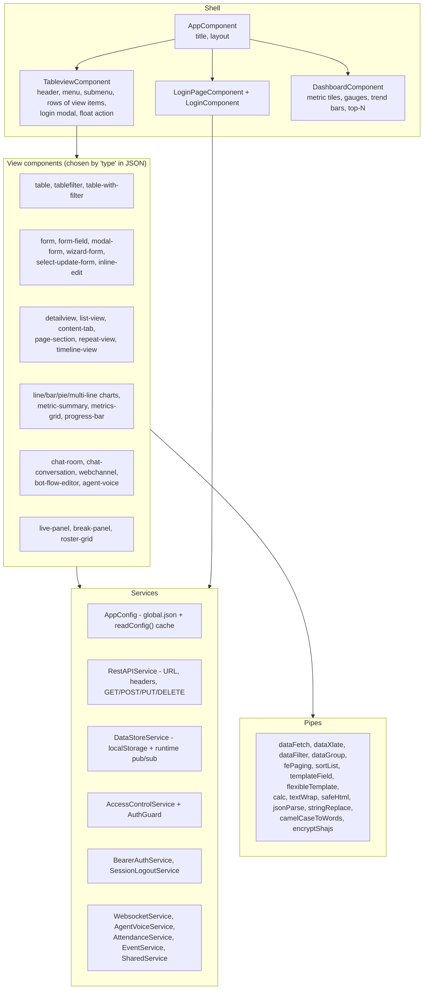
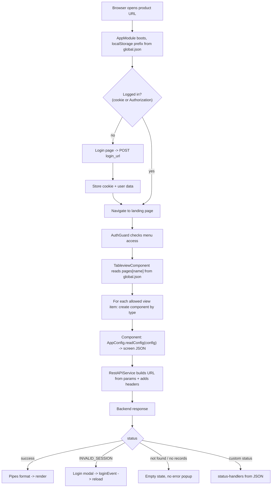

# A. AryaDash Dashboard (the engine)

> Folder: `~/VIPLine-billing/aryadash-dashboard` · package `vip-line` · Angular 15.2 ·
> [All projects](README.md) · [Interview guide](../00-interview-guide.md)

## What it is

A **configuration-driven dashboard engine**. About 80 generic Angular components (table, form,
wizard, modal form, detail view, list view, content tabs, timeline, charts, chat, bot-flow editor…)
read JSON files that describe each screen. The same code is built into **14 branded products**
(see [the product list](README.md)).

## Key numbers

| Item | Value |
|---|---|
| Angular | 15.2 (NgModule, `CUSTOM_ELEMENTS_SCHEMA`) |
| Declarations in `AppModule` | ~80 (components + 15 pipes + 3 directives) |
| Build configurations | 22 (one or two per product: `development-<product>` and a production one) |
| Serve configurations | 17 (each with its own `proxy.conf.<product>.json`) |
| Products (`src/config/<product>/`) | 14 |
| Screen JSON files | ≈440 |
| Biggest files | `form.component.ts` ~3,400 lines, `table.component.ts` ~1,700, `bot-flow-editor` ~1,600, `attendance.service.ts` ~1,500 |
| Dev URL | `http://localhost:4200` |

## Layers



## End-to-end request lifecycle



## Anatomy of a screen JSON (VIP Line `simcards.json`, trimmed)

```json
{
  "simactivate": {
    "type": "form",
    "title": "SIM Activate",
    "submit-action": { "action": "api", "url": "/user_mgmt/add_subscription_sample/", "type": "json" },
    "fields": [
      { "title": "SIM ID", "data": "iccid", "type": "text-input", "required": true,
        "validation": { "type": "text", "minlen": 5, "maxlen": 50 } },
      { "title": "Tariff Plan", "data": "tariffPlanId", "type": "input-select", "source": "api",
        "source-data": { "url": "catalogue_mgmt/get_bundle_plan_simple/Tariff%20Plans/",
                         "list": "bundlePlans", "name": "bundleId", "title": "bundleName" } }
    ],
    "status-handlers": {
      "no_dids": { "action": "alert", "message": "DIDs not available do you want to proceed?",
                   "options": ["Ok", "Cancel"] }
    }
  },
  "simlist": {
    "type": "table",
    "title": "SIM CARD",
    "data": { "fpaging": true, "pageentries": 50,
              "datalist": ["allSubscriptions", "availableSimDetails"], "method": "GET" }
  }
}
```

## Layouts

`global.json → layout` (or the user's saved choice in `DataStore`) switches the shell between
`horizontal`, `horizontal-light`, `horizontal-top` and `vertical` (collapsible sidebar,
`vip.sidebar.collapsed` watched through `DataStoreService.watch()`).

## How to run

```bash
cd ~/VIPLine-billing/aryadash-dashboard
npm install
ng serve                                  # VIP Line
ng serve --configuration=<product>        # see each product page for the exact name
ng test                                   # Karma + Jasmine
```

## Interview angle

- Why config-driven? 14 clients, similar CRUD/report screens, frequent changes — changing JSON is
  faster and safer than shipping new components.
- Trade-offs: very large generic components, weak typing (`any`), logic hidden in JSON, harder to
  unit-test. The designer app's JSON schema (`element-types.json`) is the first step to validating
  configs.
- Full flows and Q&A: [Interview guide](../00-interview-guide.md).
