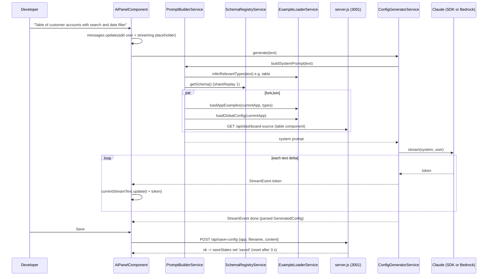
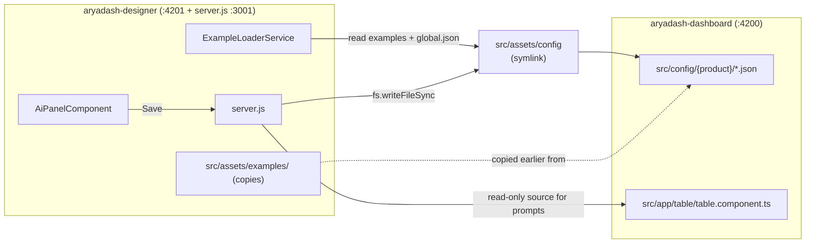

# B. AryaDash Designer (AI config generator)

> Folder: `~/VIPLine-billing/aryadash-designer` · Angular 21.1 · standalone + signals ·
> [All projects](README.md) · [Interview guide](../00-interview-guide.md)

## What it is

A small internal tool that lets a developer describe a screen in plain English and get back an
AryaDash JSON config (table, form, wizard…), explain an existing config, or modify one. It uses
Claude either directly from the browser (`@anthropic-ai/sdk`) or through AWS Bedrock via a small
Node server. Generated configs can be copied, downloaded, or saved with one click - and because
`src/assets/config` is a **symlink to `aryadash-dashboard/src/config`**, saving writes the file
straight into the Dashboard product it belongs to (see [Connection to the Dashboard](#connection-to-the-dashboard)).

## Key facts

| Item | Value |
|---|---|
| Angular | 21.1, `@angular/build` (esbuild), Vitest |
| Bootstrapping | `bootstrapApplication` + `app.config.ts` (`provideRouter`, `provideHttpClient`, `provideBrowserGlobalErrorListeners`) |
| Routes | `''` → `designer`; `designer` and `settings` lazy via `loadComponent`; `**` → `designer` |
| Dev URL | `http://localhost:4201` (`npm start`) |
| Helper server | `node server.js` on `http://localhost:3001` |
| Source size | ~1,300 lines of TypeScript + `schema/element-types.json` |
| AI | `@anthropic-ai/sdk` (default model `claude-sonnet-4-6`, `max_tokens` 8096) or Bedrock `InvokeModelWithResponseStream` |

## Files

| File | Job |
|---|---|
| `ai/ai-panel/ai-panel.component.ts` | Chat UI; signals `messages`, `isStreaming`, `currentStreamText`, `saveStates`; `computed` `hasApiKey`, `currentApp`; Ctrl/Cmd+Enter to send |
| `ai/config-generator.service.ts` | `generate` / `explain` / `modify` → `Observable<StreamEvent>` (`token`, `done`, `error`); Anthropic stream or Bedrock SSE |
| `ai/prompt-builder.service.ts` | Builds the system prompt: element schema + app examples + app `global.json` + table component source |
| `ai/example-loader.service.ts` | Picks relevant element types from the request text and loads matching example configs |
| `schema/schema-registry.service.ts` | Loads `element-types.json` once (`shareReplay(1)`) |
| `schema/element-types.json` | Schema: `elementTypes`, `tableFieldTypes`, `formFieldTypes`, `filterTypes`, `chartTypes`, `dataSourceConfig`, `globalConfigStructure`, `namingConventions` |
| `shared/settings/settings.service.ts` | API key, model, Bedrock region/model, current app — kept in `localStorage` |
| `shared/services/designer-server.service.ts` | Calls `server.js` on `http://localhost:3001/api` (list apps, list app files, save config, read dashboard source) |
| `server.js` | `GET /api/apps`, `GET /api/app-files/:app`, `POST /api/save-config`, `GET /api/dashboard-source` (read-only, path-traversal guarded), `POST /api/generate` (Bedrock SSE) |

## Flow



## Connection to the Dashboard

The link is **one-way**: the Designer depends on the Dashboard, the Dashboard has no reference to
the Designer, and the two running apps never call each other.

| Connection | Kind | Where |
|---|---|---|
| `src/assets/config` -> `../../../aryadash-dashboard/src/config` | Symlink, committed to git | `src/assets/config` |
| Reads a product's `global.json` and screen JSON as AI examples | Through the symlink (`HttpClient`) | `example-loader.service.ts` |
| "Save" writes `assets/config/<app>/<key>.json` - i.e. directly into that Dashboard product | Through the symlink (`fs.writeFileSync`) | `server.js` -> `/api/save-config` |
| Reads `aryadash-dashboard/src/app/table/table.component.ts` read-only for prompt context | Hard-coded path `DASHBOARD_SRC` | `server.js` -> `/api/dashboard-source` |
| `src/assets/examples/*.json` copied from product configs | Copies (2 of 6 have since drifted from the originals) | `src/assets/examples/` |



Consequences worth knowing: saving in the Designer changes the Dashboard's config immediately (no
copy step, `ng serve` picks it up), and the Designer only works when both folders sit side by side
as they do in `~/VIPLine-billing/`.

## Modes

| Mode | Input | What is sent |
|---|---|---|
| Generate | Plain-English description | Full system prompt (schema + examples + global config + source) |
| Explain | A JSON config | "Explain section by section: element, data source, fields, filters/actions" |
| Modify | JSON config + a line starting `CHANGE:` | "Apply the change, keep all other keys, return only JSON" |

## How to run

```bash
cd ~/VIPLine-billing/aryadash-designer
npm install
node server.js        # needs AWS credentials only if you use Bedrock
npm start             # http://localhost:4201, open Settings to add API key / Bedrock model
```

## Interview angle

- Modern Angular: standalone, `inject()`, signals/`computed`, lazy `loadComponent`, functional providers.
- Wrapping an async iterator / `ReadableStream` in an RxJS `Observable` to stream tokens into the UI.
- Prompt building with `switchMap` + `forkJoin` to fetch context in parallel.
- Cross-app design: the Designer edits the Dashboard's real configs through a symlink, so there is no import/export step - and no runtime coupling between the two apps.
- Security talking point: the direct SDK path uses `dangerouslyAllowBrowser: true` with a key in
  `localStorage` — fine for a local dev tool, not for production; the Bedrock path keeps
  credentials on the server.
