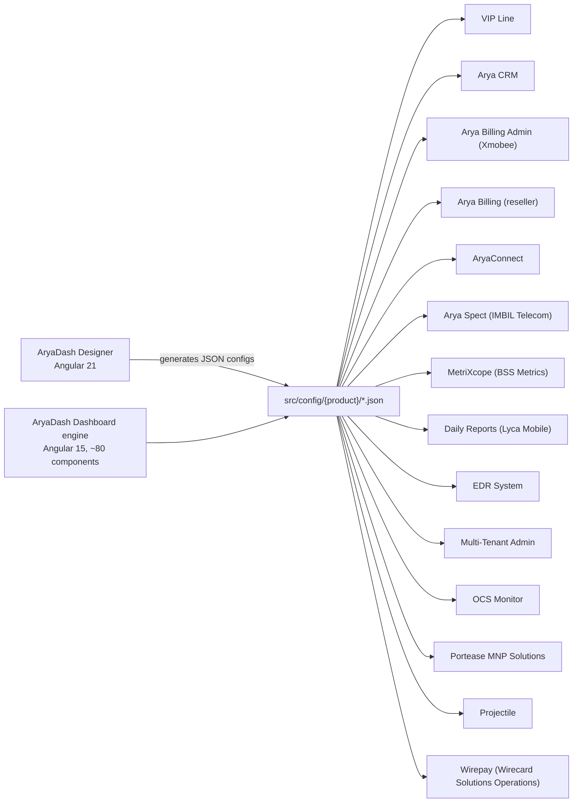

# Projects in VIPLine-billing

> [Interview guide](../00-interview-guide.md)

## Summary

The repository contains **2 Angular applications**. The first one is an engine that is built into **14 separately branded products**, so there are **16 things** you can describe as "projects".

| # | Project | Kind | Angular | Details |
|---|---|---|---|---|
| A | [AryaDash Dashboard](01-aryadash-dashboard.md) | Application (engine) | 15.2, NgModule | Config-driven UI engine; source of all 14 products |
| B | [AryaDash Designer](02-aryadash-designer.md) | Application (tool) | 21.1, standalone + signals | AI assistant that writes AryaDash JSON configs |

## The 14 products built from AryaDash Dashboard

| # | Product | Folder | Menu | Pages | Screen JSON | Auth | Serve with |
|---|---|---|---|---|---|---|---|
| 1 | [VIP Line](products/vip-line.md) | `vip-line` | 15 | 43 | 43 | session | `development` |
| 2 | [Arya CRM](products/arya-crm.md) | `arya-crm` | 13 | 47 | 46 | session | `arya-crm` |
| 3 | [Arya Billing Admin (Xmobee)](products/arya-billing-admin.md) | `arya-billing-admin` | 18 | 213 | 219 | session | `arya-billing-admin` |
| 4 | [Arya Billing (reseller)](products/arya-billing.md) | `arya-billing` | 12 | 27 | 27 | session | `arya-billing` |
| 5 | [AryaConnect](products/arya-connect.md) | `arya-connect` | 9 | 8 | 7 | session | `arya-connect` |
| 6 | [Arya Spect (IMBIL Telecom)](products/arya-spect.md) | `arya-spect` | 7 | 7 | 6 | session | `arya-spect` |
| 7 | [MetriXcope (BSS Metrics)](products/bss-metrics.md) | `bss-metrics` | 8 | 8 | 7 | session | `bss-metrics` |
| 8 | [Daily Reports (Lyca Mobile)](products/daily-reports.md) | `daily-reports` | 4 | 14 | 17 | session | `daily-reports` |
| 9 | [EDR System](products/edr-system.md) | `edr-system` | 5 | 4 | 4 | session | `edr-system` |
| 10 | [Multi-Tenant Admin](products/multi-tenant.md) | `multi-tenant` | 7 | 7 | 1 | session | `multi-tenant` |
| 11 | [OCS Monitor](products/ocs-monitor.md) | `ocs-monitor` | 8 | 16 | 12 | session | `ocs-monitor` |
| 12 | [Portease MNP Solutions](products/port-mnp-solutions.md) | `port-mnp-solutions` | 4 | 3 | 3 | session | `port-mnp-solutions` |
| 13 | [Projectile](products/projectile.md) | `projectile` | 8 | 16 | 14 | session | `projectile` |
| 14 | [Wirepay (Wirecard Solutions Operations)](products/wirepay.md) | `wirepay` | 4 | 4 | 3 | bearer | `wirepay` |

Total screen JSON files: **409**. Note: `angular.json` also has a `validata` build that points at `src/config/validata/global.json`, which does not exist in the repo, so it is not counted.

## How the projects relate

## One-line description of each product

1. **VIP Line** - Reseller and admin portal for a private mobile/VoIP operator: SIM cards, activations, calls and SMS, data, DIDs, finances, rate sheets, SIM transfer and reseller management.
2. **Arya CRM** - Ticketing and customer-care CRM: raise and track tickets, approvals, support and CRM chats, web channels, bot flows, staff rosters, agent break requests and a live agent panel.
3. **Arya Billing Admin (Xmobee)** - The largest product: full billing back office for an MVNO - MNO, customer, reseller, product, wallet, warehouse and SIM management, finance, dunning, invoices, tax and business-activation reports.
4. **Arya Billing (reseller)** - Reseller-facing billing portal (infimobile): activation, registration, staff, product and stock requests, e-top-up and voucher sales, returns and recalls.
5. **AryaConnect** - CPaaS e-mail workspace: accounts, staff, roster, inbox, outbox, folders and mail sync logs.
6. **Arya Spect (IMBIL Telecom)** - Monitoring / lawful-intercept style console: targets, users, audit events, error logs, tenants and subscriptions.
7. **MetriXcope (BSS Metrics)** - Read-only BSS analytics: dashboards for orders, activations, payments, services, recharges and finance.
8. **Daily Reports (Lyca Mobile)** - Daily operational reporting: reports, data validations and analytics dashboards.
9. **EDR System** - Endpoint / EDR admin console: users, devices, audit logs and settings.
10. **Multi-Tenant Admin** - Tenant onboarding and administration for the multi-tenant platform: onboarding, users, audit events, error logs, tenants, subscriptions.
11. **OCS Monitor** - Online Charging System monitor: recharges, rated CDRs, servers, subscriptions, USSD menus and tariffs.
12. **Portease MNP Solutions** - Mobile Number Portability portal: port-in, port-out and routing requests.
13. **Projectile** - Project delivery tool: accounts, projects, change requests, QA review tool, AI chat, KPIs.
14. **Wirepay (Wirecard Solutions Operations)** - Payments operations console: overview, onboarding, resellers, wallets and float. Uses JWT bearer login and an X-TENANT-ID header.
