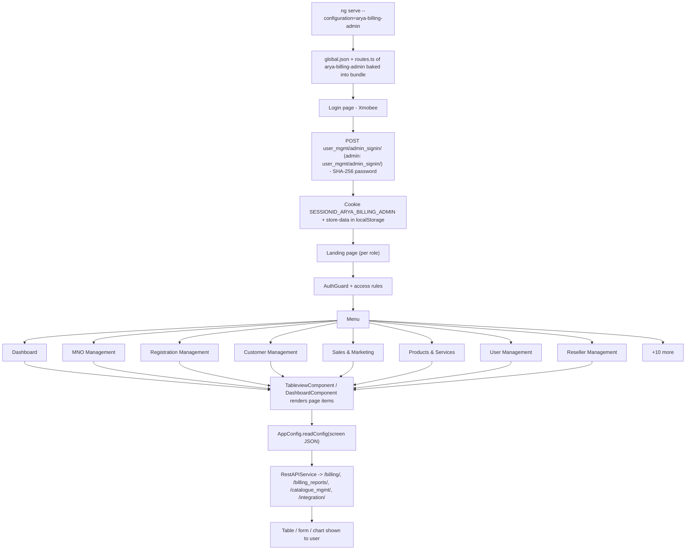

# 3. Arya Billing Admin (Xmobee)

> Product folder: `aryadash-dashboard/src/config/arya-billing-admin/` - built from the shared AryaDash engine. [Back to all projects](../README.md) - [Interview guide](../../00-interview-guide.md)

## What it is

The largest product: full billing back office for an MVNO - MNO, customer, reseller, product, wallet, warehouse and SIM management, finance, dunning, invoices, tax and business-activation reports.

## Key facts

| Item | Value |
|---|---|
| Browser title | Xmobee |
| Theme colours | primary `#FFC400`, fade `#0A0A0A` |
| Timezone | UTC+0100 |
| Default layout | vertical |
| localStorage prefix | `aryabillingadmin` |
| Session cookie | `SESSIONID_ARYA_BILLING_ADMIN` |
| Auth mode | session cookie |
| Login URL (user / admin) | `user_mgmt/admin_signin/` / `user_mgmt/admin_signin/` |
| Menu entries | 18 |
| Pages in global.json | 213 |
| Screen JSON files | 219 |
| Routes | 22 (login + 21) using `DashboardComponent`, `LoginPageComponent`, `TableviewComponent` |
| Environment | `{ production: false, showVersion: true, configBase: "arya-billing-admin/", productType: '' }` |
| Brand assets | `src/assets-arya-billing-admin/` |
| Backend API modules (dev proxy) | `/billing/`, `/billing_reports/`, `/catalogue_mgmt/`, `/integration/`, `/inventory_mgmt/`, `/invt_mgmt/`, `/ledger_mgmt/`, `/metrics/`, `/mno_mgmt/`, `/self_service_payment/`, `/seller_mgmt/`, `/service_mgmt/`, `/shipment_management/`, `/tax_management/`, `/user_kyc/`, `/user_mgmt/`, `/wallet_mgmt/` |

## How to run

```bash
cd ~/VIPLine-billing/aryadash-dashboard
ng serve --configuration=arya-billing-admin   # http://localhost:4200
ng build --configuration=development-arya-billing-admin
```

## Menu and access

| Menu | Route | Sub-pages | Who can see it |
|---|---|---|---|
| Dashboard | `/dashboard` | Dashboard | everyone |
| MNO Management | `/mnomanagement` | MNO Onboarding, Wholesale Plan Creation, Wholesale Plan Mapping, Pool Change Request | role = Admin; mode strict |
| Registration Management | `/registrationmanagement` | Website Order, Amazon Orders, eCommerce Payments by Date, eCommerce Payments by OrderId, Mcf Orders, Bulk Upload, Label Uploads | permission list `veiwAccess` has 'Registration Management' |
| Customer Management | `/customermanagement` | Search Subscriber, Search Order, Migrate Msisdn, Change Carrier Logs, Change MDN, Port-in, Intrevention Port-in, Port-out, Port-out by MSISDN, Sim Replacement, Offline eSIM, Validate Device, Service Requests, Pending ... | permission list `veiwAccess` has 'Customer Management' |
| Sales & Marketing | `/salesandmarketing` | Product Requests, E-Balance, Promotions, Discounts, Giveaway Participants, Giveaway Winners | permission list `veiwAccess` has 'Sales & Marketing' |
| Products & Services | `/productsandservices` | Tariff Addons, Service Addons, Service Policies, Service Plan, Service Bundles, Ott Plan | permission list `veiwAccess` has 'Products & Services' |
| User Management | `/usermanagement` | Reseller Users, Staff Users, Staff Topup | permission list `veiwAccess` has 'User Management' |
| Reseller Management | `/resellermanagement` | Reseller Approvals, Reseller Sales Location | permission list `veiwAccess` has 'Reseller Management' |
| General | `/general` | Dashboard Sessions, Reseller Sessions, User Sessions, Audit Events, Error Logs, Verizon Error Logs, T-Mobile Error Logs, Roles, Roles Configuration, View Configuration, Recharge Transfer Config, Service Blockage, Prod... | permission list `veiwAccess` has 'General' |
| Reseller Stock Return | `/resellerstockreturn` | Product Return Requests, E-topup Return Requests | permission list `veiwAccess` has 'Reseller Stock Return' |
| Finance | `/finance` | Bank, Accounts, Postpaid bill Deposit, Risk Evaluation Rules, Dunning, Dunning Configuration, Invoice, Bill runs, Manual Invoice Generation, Invoice Adjustment, Invoice & Deposit Payments, General Ledger Accounts, Gen... | permission list `veiwAccess` has 'Finance' |
| Reports | `/reports` | Business Activation Reports, Tax Reports, Warehouse Reports | permission list `veiwAccess` has 'Reports' |
| Tax Reports | `/taxreports` | Voucher Sales Tax Reports, E-Balance Sales Tax Reports, Sim Sales Tax Reports, Service Bundle Recharge Tax Reports Using Airtime, Mobile Money Service Bundle Recharge Tax Reports, Staff Recharge Tax Reports, Reseller ... | permission list `veiwAccess` has 'Tax Reports' |
| Wallet | `/wallet` | All Wallets, Wallet Logs, Reports | permission list `veiwAccess` has 'Wallet' |
| Bulk Emails & SMS | `/bulkemailsandsms` | Bulk Emails | permission list `veiwAccess` has 'Bulk Emails & SMS' |
| Business Activation Reports | `/activationreports` | Physical Orders, Amazon Orders, Subscriptions, Auto Renewal Payments, Auto Renewal Recharges, Bundle Advanced Payments, E-Topup Sales Report, Website Stripe Payments, Website Stripe Refunds, Stripe Disputes Report, So... | permission list `veiwAccess` has 'Business Activation Reports' |
| Warehouse Management | `/warehousemanagement` | Products Catelogue, Warehouse Bins, Reseller Bins, Bin Stocks, Stock Movement Logs, Stock Movement Request, Order Movement, Product Bundles, Internal Product Bundles, Reseller Sim Assignments, Warehouse Reports | permission list `veiwAccess` has 'Warehouse' |
| Sim Configuration | `/simconfiguration` | MSISDN Block, Sim Inventory, Sim Lifecycle Update Report, Sim Lifecycle Process, Sim Details, Churn Sims | permission list `veiwAccess` has 'SIM Configuration' |

## Product-specific features (keys in global.json)

- `layout` - Default layout
- `summary-gauges` - Dashboard gauges
- `trend-bars` - Dashboard trend bars
- `metrics-summary` - Dashboard metric tiles

## View types used

Page items in `global.json -> pages`: `table` x197, `modal-form` x43, `form` x7, `page-section` x6, `flexible-reports` x3, `modal-wizard` x3, `detail-view` x2

Definitions inside screen JSON files: `table` x195, `form` x158, `detail-view` x24, `page-section` x17, `wizard` x15, `modal-form` x13, `list` x10, `content-tab` x2, `list-view` x2, `interntdatatable` x1, `timeline` x1, `detail` x1

## Flow



## Screen JSON files

|  |  |  |  |
|---|---|---|---|
| `accounts.json` | `actions.json` | `activepostpaidbundlesreports.json` | `activeprepaidbundles.json` |
| `alias.json` | `allwallets.json` | `amazonorders.json` | `amazonordersreports.json` |
| `assignmentgroup.json` | `auditevents.json` | `bank.json` | `billruns.json` |
| `binstocks.json` | `bulkemailsandsms.json` | `bulkupload.json` | `bundleadvancedpaymentsreports.json` |
| `businessactivationreportebalance.json` | `businessactivationreportetopup.json` | `businessactivationreports.json` | `businessactivationsimreports.json` |
| `businessactivationsimswapreports.json` | `businessactivationspecialnumberwalletreports.json` | `businessactivationvoucherreport.json` | `canceladvancedpayments.json` |
| `cancelautorenewal.json` | `categoryconfiguration.json` | `change_permission.json` | `changecarrierlogs.json` |
| `changemdnlogs.json` | `churnsims.json` | `customerinfo.json` | `customerrefundrequests.json` |
| `customerreturnreport.json` | `customtaxinvoicereport.json` | `dailycallsandsms.json` | `dashboardsessions.json` |
| `datacdrsrecords.json` | `devicereplacementreport.json` | `devicereturnreport.json` | `deviceswaps.json` |
| `discountattachment.json` | `discounts.json` | `dunning.json` | `dunningconfiguration.json` |
| `e-topupreturnrequests.json` | `eCommercepayments.json` | `eCommercepaymentsbyorderid.json` | `ebalance.json` |
| `ebalanceactivationprocess.json` | `ebalancesalesreport.json` | `ebalancesalesreportdaterange.json` | `ebalancesalestaxcutdownreport.json` |
| `eblcsalestaxreports.json` | `emailnotifications.json` | `errorlogs.json` | `esimrule.json` |
| `etopupresellerreporttestonly.json` | `etopupsalesreport.json` | `etopupsalesreportdaterange.json` | `etopupsalesreporttestonly.json` |
| `etopupsalestaxcutdownreport.json` | `faileddatacdrs.json` | `fetchsubscriber.json` | `fraudlentpayments.json` |
| `generalledgeraccounts.json` | `generalledgerreports.json` | `giveawayparticipants.json` | `giveawaywinners.json` |
| `inactiveusersreport.json` | `incomingcallsbycountry.json` | `incomminginternationcalls.json` | `internalproductbundles.json` |
| `internalrechargetransfer.json` | `interntdata.json` | `intreventionportin.json` | `invoice.json` |
| `invoice_adjustment.json` | `invoiceanddepositpayments.json` | `labeluploads.json` | `locationbasedreport.json` |
| `manualinvoicegeneration.json` | `mblmnyservicebdlrechtaxreports.json` | `mcforders.json` | `mifiblockingreturnreport.json` |
| `mifipurchasereport.json` | `mifisalesreport.json` | `mifiscannedinventorypurchasereport.json` | `migratemsisdn.json` |
| `mmscdrsrecords.json` | `mnoemails.json` | `mnofeatureresetlogs.json` | `mnoonboarding.json` |
| `msisdnblock.json` | `networkrule.json` | `notifications.json` | `offlineesims.json` |
| `ordermovement.json` | `ott.json` | `ottplan.json` | `payments.json` |
| `pendingactivations.json` | `physicalorderreports.json` | `planattachment.json` | `plandetach.json` |
| `poolchangerequest.json` | `portin.json` | `portout.json` | `portoutbymdn.json` |
| `postbilldeposit.json` | `prepaidairtime.json` | `productactivationprocess.json` | `productblockingprocess.json` |
| `productbundle.json` | `productbundleinformation.json` | `productrequest.json` | `productreturnrequest.json` |
| `productscatelogue.json` | `promotions.json` | `proratedinvoices.json` | `purchasedetails.json` |
| `rechargetransferConfiguration.json` | `refundshistory.json` | `renewalpaymentsreports.json` | `renewalrechargesreports.json` |
| `reports.json` | `resellerapprovals.json` | `resellerbalancereport.json` | `resellerbins.json` |
| `resellercommissionreport.json` | `resellersaleslocation.json` | `resellersalesreport.json` | `resellersessions.json` |
| `resellersimassignments.json` | `resellersimreports.json` | `resellerstockbalancereport.json` | `resellerusers.json` |
| `resellervoucherreports.json` | `resellerwalletsalestaxreport.json` | `riskevaluationrules.json` | `roles.json` |
| `rolesConfiguration.json` | `searchorder.json` | `searchsubscriber.json` | `searchsubscriberdetails.json` |
| `selfrechagecctransactionreport.json` | `selfrechargeccfailedtransactionreport.json` | `serbdlrechrtaxrepusingairtime.json` | `serviceaddon.json` |
| `serviceblockage.json` | `servicebundleblockingreturnreport.json` | `servicebundles.json` | `serviceproducts.json` |
| `servicerequests.json` | `servicesplan.json` | `servicespolicies.json` | `serviceusagereport.json` |
| `shippinglabel.json` | `simblockingreturnreport.json` | `simdetails.json` | `siminventory.json` |
| `simlifecycleprocess.json` | `simlifecycleupdatereport.json` | `simreplacement.json` | `simreplacementactions.json` |
| `simsalesreport.json` | `simsalestaxreports.json` | `simstatusreport.json` | `simusagereport.json` |
| `smscdrsrecords.json` | `softrechargesalesreport.json` | `softresellerreport.json` | `softreserllertaxcutdownreport.json` |
| `specialnumbers.json` | `staffairtime.json` | `staffrechargetaxcutdownreports.json` | `staffrechargetaxreports.json` |
| `stafftopup.json` | `staffusers.json` | `stockmovementlogs.json` | `stockmovementrequest.json` |
| `stripedisputesreport.json` | `subscriberactions.json` | `subscriberhistory.json` | `subscrinfo.json` |
| `subscriptiondailyreport.json` | `subscriptions.json` | `subscriptionsreports.json` | `tariffaddon.json` |
| `taxinvoice.json` | `taxreports.json` | `ticket.json` | `ticketmonitoring.json` |
| `ticketreports.json` | `tmobileerrorlogs.json` | `transferrechargereport.json` | `ucctaxreports.json` |
| `usersessions.json` | `validatedevice.json` | `vas.json` | `verifyrequest.json` |
| `verizonerrorlogs.json` | `viewConfiguration.json` | `voicecdrsrecords.json` | `voucherblockingreturnreport.json` |
| `voucherreturnreport.json` | `vouchersalesreport.json` | `vouchersalestaxcutdownreport.json` | `vouchersalestaxreports.json` |
| `voucherstatusreport.json` | `voucherusagereport.json` | `walletlogs.json` | `warehousebins.json` |
| `warehousereports.json` | `websiteorders.json` | `websitestripepaymentsreports.json` | `websitestriperefundsreports.json` |
| `wholesaleplancreation.json` | `wholesaleplanmapping.json` | `zreport.json` |  |

## Talking points for an interview

- Built from the **same codebase** as the other products; only `src/config/arya-billing-admin/`, its environment file and asset folder differ.
- Adding a screen here = add a JSON file + a `pages`/`menu` entry in `global.json` + a route in `routes.ts` (component `TableviewComponent`).
- Uses **session-cookie** login: `sessionKey` from the login response is stored in cookie `SESSIONID_ARYA_BILLING_ADMIN` and sent as the `SESSIONID` header.
- Menu items carry `access` rules, so the menu, the route guard and the page builder all hide what the role may not see.
