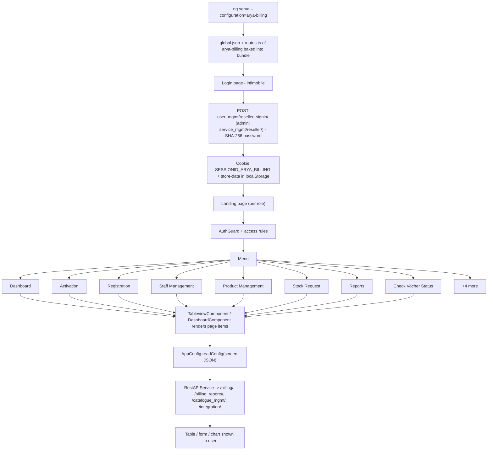

# 4. Arya Billing (reseller)

> Product folder: `aryadash-dashboard/src/config/arya-billing/` - built from the shared AryaDash engine. [Back to all projects](../README.md) - [Interview guide](../../00-interview-guide.md)

## What it is

Reseller-facing billing portal (infimobile): activation, registration, staff, product and stock requests, e-top-up and voucher sales, returns and recalls.

## Key facts

| Item | Value |
|---|---|
| Browser title | infimobile |
| Theme colours | primary `#d50000`, fade `#181818` |
| Timezone | UTC+0100 |
| Default layout | vertical |
| localStorage prefix | `aryabilling` |
| Session cookie | `SESSIONID_ARYA_BILLING` |
| Auth mode | session cookie |
| Login URL (user / admin) | `user_mgmt/reseller_signin/` / `service_mgmt/reseller/` |
| Menu entries | 12 |
| Pages in global.json | 27 |
| Screen JSON files | 27 |
| Routes | 16 (login + 15) using `DashboardComponent`, `LoginPageComponent`, `TableviewComponent` |
| Environment | `{ production: false, showVersion: true, configBase: "arya-billing/", productType: '' }` |
| Brand assets | `src/assets-arya-billing-admin/` |
| Backend API modules (dev proxy) | `/billing/`, `/billing_reports/`, `/catalogue_mgmt/`, `/integration/`, `/inventory_mgmt/`, `/invt_mgmt/`, `/ledger_mgmt/`, `/metrics/`, `/mno_mgmt/`, `/self_service_payment/`, `/seller_mgmt/`, `/service_mgmt/`, `/user_kyc/`, `/user_mgmt/`, `/wallet_mgmt/` |

## How to run

```bash
cd ~/VIPLine-billing/aryadash-dashboard
ng serve --configuration=arya-billing   # http://localhost:4200
ng build --configuration=development-arya-billing
```

## Menu and access

| Menu | Route | Sub-pages | Who can see it |
|---|---|---|---|
| Dashboard | `/dashboard` | - | everyone |
| Activation | `/activation` | Activate Now | everyone |
| Registration | `/registration` | Activate Now | everyone |
| Staff Management | `/staffmanagement` | Staff | everyone |
| Product Management | `/productmanagement` | E-top Wallet Balance, E-Balance Wallet Balance, Commition Wallet Balance, Special Number Wallet Balance, Physical Product, Vochers | everyone |
| Stock Request | `/stockrequest` | Stock Requests, E-Balance Transfer, E-Topup Wallet Requests, E-Balance Wallet Requests, Special Number Requests, Physical Product Requests, Vocher Requests | everyone |
| Reports | `/reports` | SIM Purchase Reports, E-Topup Sales Reports, E-Balance Business Activation, E-Balance using E-Topup Sales, E-Balance Vocher Sales, E-Topup Purchase Reports | everyone |
| Check Vocher Status | `/vocher_status` | Vocher Status | everyone |
| Return Products | `/return_products` | Return Products | everyone |
| Stock Selection | `/stock_selection` | Damaged Stock Selection | everyone |
| Recall E-Topup | `/e_topup` | Recall E-Topup | everyone |
| Recall Vochers | `/recall_vochers` | Recall Vochers | everyone |

## Product-specific features (keys in global.json)

- `layout` - Default layout
- `summary-gauges` - Dashboard gauges
- `metrics-summary` - Dashboard metric tiles

## View types used

Page items in `global.json -> pages`: `table` x27, `modal-form` x7, `modal-wizard` x2, `wizard` x1

Definitions inside screen JSON files: `table` x26, `form` x10, `modal-form` x4, `wizard` x2, `page-section` x2, `list` x2

## Flow



## Screen JSON files

|  |  |  |  |
|---|---|---|---|
| `activation.json` | `commitionwallet.json` | `ebalbusinessactivation.json` | `ebaltransfer.json` |
| `ebalusingetopupsales.json` | `ebalvochersales.json` | `ebalwallet.json` | `ebalwalletrequests.json` |
| `etopuppurchaserepo.json` | `etopupsales.json` | `etopupwallet.json` | `etopwallet.json` |
| `numberrequests.json` | `numberwallet.json` | `physicalproduct.json` | `productrequests.json` |
| `recalletopup.json` | `recallvochers.json` | `registration.json` | `returnproducts.json` |
| `simpurchaserepo.json` | `staff.json` | `stockrequest.json` | `stockselection.json` |
| `vocherrequests.json` | `vochers.json` | `vocherstatus.json` |  |

## Talking points for an interview

- Built from the **same codebase** as the other products; only `src/config/arya-billing/`, its environment file and asset folder differ.
- Adding a screen here = add a JSON file + a `pages`/`menu` entry in `global.json` + a route in `routes.ts` (component `TableviewComponent`).
- Uses **session-cookie** login: `sessionKey` from the login response is stored in cookie `SESSIONID_ARYA_BILLING` and sent as the `SESSIONID` header.
