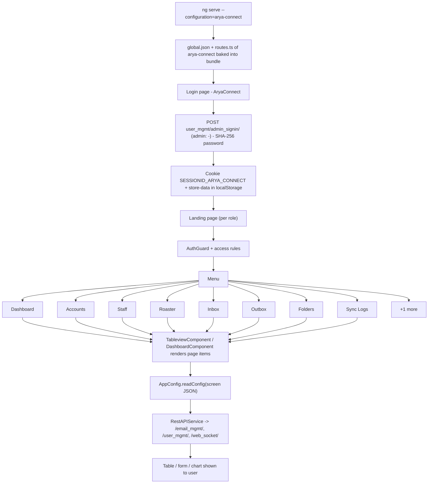

# 5. AryaConnect

> Product folder: `aryadash-dashboard/src/config/arya-connect/` - built from the shared AryaDash engine. [Back to all projects](../README.md) - [Interview guide](../../00-interview-guide.md)

## What it is

CPaaS e-mail workspace: accounts, staff, roster, inbox, outbox, folders and mail sync logs.

## Key facts

| Item | Value |
|---|---|
| Browser title | AryaConnect |
| Theme colours | primary `#C71026`, fade `#a7dab0` |
| Timezone | UTC+0530 |
| localStorage prefix | `cpaas-email` |
| Session cookie | `SESSIONID_ARYA_CONNECT` |
| Auth mode | session cookie |
| Login URL (user / admin) | `user_mgmt/admin_signin/` / `-` |
| Menu entries | 9 |
| Pages in global.json | 8 |
| Screen JSON files | 7 |
| Routes | 12 (login + 11) using `DashboardComponent`, `LoginPageComponent`, `TableviewComponent` |
| Environment | `{ production: false, showVersion: true, configBase: "arya-connect/", productType: '' }` |
| Brand assets | `src/assets-bssmetrics/` |
| Backend API modules (dev proxy) | `/email_mgmt/`, `/user_mgmt/`, `/web_socket/` |

## How to run

```bash
cd ~/VIPLine-billing/aryadash-dashboard
ng serve --configuration=arya-connect   # http://localhost:4200
ng build --configuration=development-arya-connect
ng build --configuration=arya-connect
```

## Menu and access

| Menu | Route | Sub-pages | Who can see it |
|---|---|---|---|
| Dashboard | `/dashboard` | - | everyone |
| Accounts | `/accounts` | Accounts | everyone |
| Staff | `/staff` | Staff | everyone |
| Roaster | `/roaster` | Roaster | everyone |
| Inbox | `/inbox` | Inbox | everyone |
| Outbox | `/outbox` | Outbox | everyone |
| Folders | `/folders` | Folders | everyone |
| Sync Logs | `/synclogs` | Sync Logs | everyone |
| Settings | `/settings` | Settings | everyone |

## Product-specific features (keys in global.json)

- `global-context` - Global context selector in the header (stored in DataStore, can reload page)
- `summary-gauges` - Dashboard gauges
- `summary-views` - Dashboard summary views
- `metrics-summary` - Dashboard metric tiles

## View types used

Page items in `global.json -> pages`: `table` x6, `form` x3, `waterfall` x1, `modal-form` x1, `detail-view` x1

Definitions inside screen JSON files: `detail-view` x13, `form` x7, `table` x4, `modal-form` x4, `page-section` x2, `detail` x1, `content-tab` x1

## Flow



## Screen JSON files

|  |  |  |  |
|---|---|---|---|
| `accounts.json` | `emails.json` | `roaster.json` | `settings.json` |
| `staff.json` | `subscrinfo.json` | `synclogs.json` |  |

## Talking points for an interview

- Built from the **same codebase** as the other products; only `src/config/arya-connect/`, its environment file and asset folder differ.
- Adding a screen here = add a JSON file + a `pages`/`menu` entry in `global.json` + a route in `routes.ts` (component `TableviewComponent`).
- Uses **session-cookie** login: `sessionKey` from the login response is stored in cookie `SESSIONID_ARYA_CONNECT` and sent as the `SESSIONID` header.
