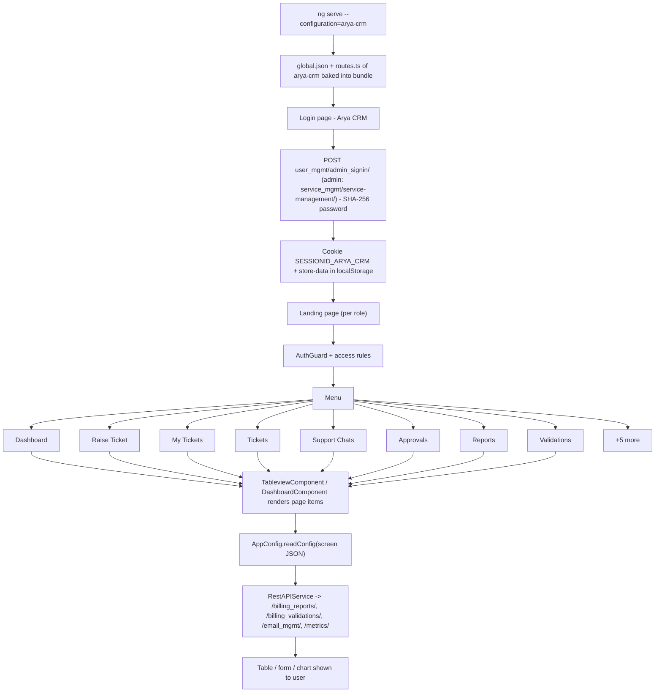

# 2. Arya CRM

> Product folder: `aryadash-dashboard/src/config/arya-crm/` - built from the shared AryaDash engine. [Back to all projects](../README.md) - [Interview guide](../../00-interview-guide.md)

## What it is

Ticketing and customer-care CRM: raise and track tickets, approvals, support and CRM chats, web channels, bot flows, staff rosters, agent break requests and a live agent panel.

## Key facts

| Item | Value |
|---|---|
| Browser title | Arya CRM |
| Theme colours | primary `#00b2db`, fade `#00272f` |
| Timezone | UTC+0530 |
| localStorage prefix | `Ticketing CRM` |
| Session cookie | `SESSIONID_ARYA_CRM` |
| Auth mode | session cookie |
| Login URL (user / admin) | `user_mgmt/admin_signin/` / `service_mgmt/service-management/` |
| Menu entries | 13 |
| Pages in global.json | 47 |
| Screen JSON files | 46 |
| Routes | 19 (login + 18) using `DashboardComponent`, `LoginPageComponent`, `TableviewComponent` |
| Environment | `{ production: false, showVersion: true, configBase: "arya-crm/", productType: process.env['PRODUCT_TYPE'] || '' }` |
| Product-type overrides | `enterprise/` (used with `PRODUCT_TYPE=...`) |
| Brand assets | `src/assets-edrsystem/` |
| Backend API modules (dev proxy) | `/billing_reports/`, `/billing_validations/`, `/email_mgmt/`, `/metrics/`, `/service_mgmt/`, `/smesg_mgmt/`, `/smesg_mgmt/ws/`, `/user_mgmt/`, `/voice_mgmt/ws/` |

## How to run

```bash
cd ~/VIPLine-billing/aryadash-dashboard
ng serve --configuration=arya-crm   # http://localhost:4200
ng build --configuration=development-arya-crm
ng build --configuration=arya-crm
PRODUCT_TYPE=enterprise ng serve --configuration=arya-crm
```

## Menu and access

| Menu | Route | Sub-pages | Who can see it |
|---|---|---|---|
| Dashboard | `/dashboard` | Dashboard | everyone |
| Raise Ticket | `/raiseticket` | Raise Ticket | role = Admin, Customer Care Manager; mode strict |
| My Tickets | `/mytickets` | My Tickets, Search, Developments, TAT Overdue, Closed Wait, Resolved, Closed, All | role not in Admin, Customer Care Manager; mode strict |
| Tickets | `/assignedtickets` | My Tickets, Search, Developments, TAT Overdue, Closed Wait, Resolved, Closed, All | role = Admin, Customer Care Manager; mode strict |
| Support Chats | `/supportchats` | Chat Requests, Chat Conversations, Support Staff | role = Admin, Customer Care Manager; mode strict |
| Approvals | `/approvals` | TAT Approvals, Sign Off Approvals, Break Requests | role = Admin, Customer Care Manager; mode strict |
| Reports | `/reports` | Get All Tickets, Get Open Tickets, Get Awaiting FeedBack Tickets, Get Escalation Report, Attendance Summary, Staff Time Report | role = Admin, Customer Care Manager; mode strict |
| Validations | `/validations` | Critical Alerts, Validation Scripts | everyone |
| Assignment Settings | `/configurations` | Category Configuration, Assignment Group, Tags | role = Admin, Customer Care Manager; mode strict |
| Staff Management | `/staffmanagement` | Staff Users, Staff Roles, Shift Roster, Shift Timings, Roster Rules, View Configuration | role = Admin, Customer Care Manager; mode strict |
| CRM Settings | `/crmsettings` | Troubleshoot Flows, Customer Chat Flow, Global Settings | role = Admin, Customer Care Manager; mode strict |
| CRM Chats | `/chatspage` | CRM Chats | everyone |
| WebChannels | `/webchannels` | Channel Management, Subscription Approval, Channels | everyone |

## Product-specific features (keys in global.json)

- `access-control` - Custom role field for access rules
- `api-config` - Global extra request headers (header-params)
- `global-context` - Global context selector in the header (stored in DataStore, can reload page)
- `live-panel` - Live agent panel
- `break-request` - Agent break requests (break panel)
- `float-action` - Floating action button that opens a modal view
- `crmchat` - CRM chat
- `supportchat` - Support chat
- `infibotchat` - Bot chat
- `troubleshootchat` - Troubleshoot chat
- `summary-gauges` - Dashboard gauges
- `trend-bars` - Dashboard trend bars
- `summary-views` - Dashboard summary views
- `metrics-summary` - Dashboard metric tiles

## View types used

Page items in `global.json -> pages`: `table` x41, `modal-form` x5, `bot-flow` x2, `modal-wizard` x1, `modal-grid` x1, `form` x1, `content-tab` x1, `webchannel-view` x1, `selection-overlay` x1, `detail-view` x1

Definitions inside screen JSON files: `form` x49, `table` x40, `detail-view` x18, `page-section` x14, `modal-form` x6, `wizard` x2, `content-tab` x2, `metrics-grid` x2, `list` x2, `bot-flow` x2, `timeline` x1, `chat-view` x1, `chat-conversation` x1, `shift-grid` x1, `selection-overlay` x1, `link-highlight` x1, `detail` x1

## Flow



## Screen JSON files

|  |  |  |  |
|---|---|---|---|
| `agentreport.json` | `alertemails.json` | `alltickets.json` | `assignedtickets.json` |
| `assignmentgroup.json` | `attendancereports.json` | `breakrequests.json` | `categoryconfiguration.json` |
| `cdrsreports.json` | `chatconversations.json` | `chatrequests.json` | `closedtickets.json` |
| `customerresponse.json` | `errorlogs.json` | `errorlogsbyid.json` | `escalationreport.json` |
| `getawaitingfeedbackreport.json` | `getopentickets.json` | `managerapprovals.json` | `privatetickets.json` |
| `raiseticket.json` | `resolutiontickets.json` | `resolvedtickets.json` | `roleconfiguration.json` |
| `roles.json` | `roster.json` | `rosterrules.json` | `searchtickets.json` |
| `settings.json` | `shifttimings.json` | `staffusers.json` | `subscrinfo.json` |
| `tagreports.json` | `tatapprovals.json` | `tatoverdue.json` | `ticketactions.json` |
| `ticketactivity.json` | `ticketdetails.json` | `ticketinfo.json` | `ticketreport.json` |
| `tickettags.json` | `troubleshoot.json` | `validationlogs.json` | `viewconfiguration.json` |
| `webchannel-message-templates.json` | `webchannel.json` |  |  |

## Talking points for an interview

- Built from the **same codebase** as the other products; only `src/config/arya-crm/`, its environment file and asset folder differ.
- Adding a screen here = add a JSON file + a `pages`/`menu` entry in `global.json` + a route in `routes.ts` (component `TableviewComponent`).
- Uses **session-cookie** login: `sessionKey` from the login response is stored in cookie `SESSIONID_ARYA_CRM` and sent as the `SESSIONID` header.
- Menu items carry `access` rules, so the menu, the route guard and the page builder all hide what the role may not see.
- `api-config.header-params` adds extra headers (for example a tenant id) to every request.
- Has a **product-type** variant folder (`enterprise/`); `AppConfig.readConfig()` loads it first and falls back to the base file.
- Agent features (live panel, break requests) come from `live-panel/`, `break-panel/` and `attendance.service.ts`.
