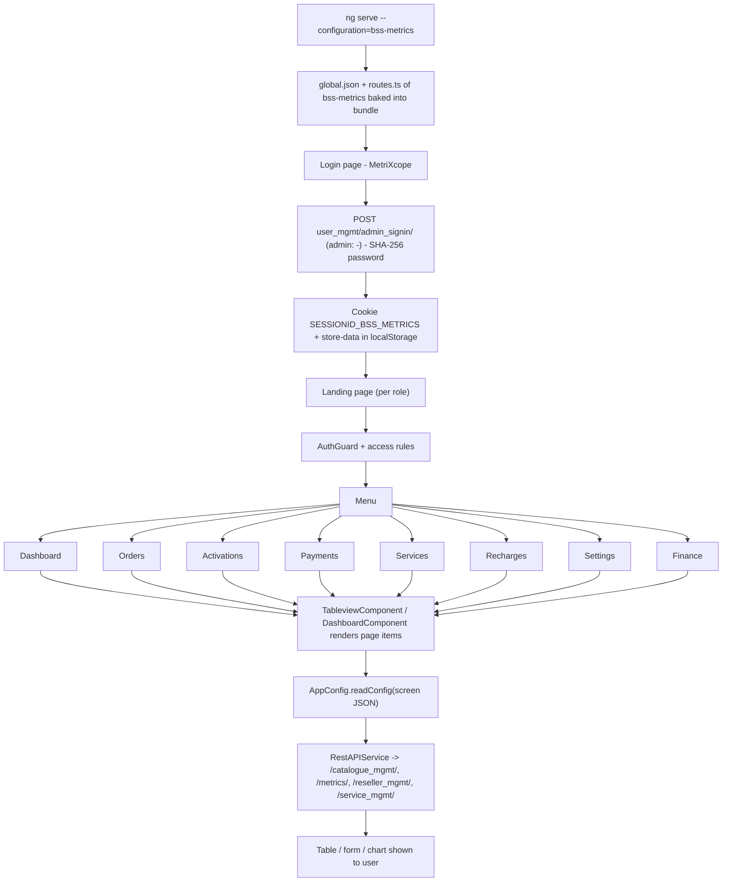

# 7. MetriXcope (BSS Metrics)

> Product folder: `aryadash-dashboard/src/config/bss-metrics/` - built from the shared AryaDash engine. [Back to all projects](../README.md) - [Interview guide](../../00-interview-guide.md)

## What it is

Read-only BSS analytics: dashboards for orders, activations, payments, services, recharges and finance.

## Key facts

| Item | Value |
|---|---|
| Browser title | MetriXcope |
| Theme colours | primary `#C71026`, fade `#a7dab0` |
| Timezone | UTC+0100 |
| localStorage prefix | `bss-metrics` |
| Session cookie | `SESSIONID_BSS_METRICS` |
| Auth mode | session cookie |
| Login URL (user / admin) | `user_mgmt/admin_signin/` / `-` |
| Menu entries | 8 |
| Pages in global.json | 8 |
| Screen JSON files | 7 |
| Routes | 12 (login + 11) using `DashboardComponent`, `LoginPageComponent`, `TableviewComponent` |
| Environment | `{ production: false, showVersion: true, configBase: "bss-metrics/", productType: '' }` |
| Brand assets | `src/assets-bssmetrics/` |
| Backend API modules (dev proxy) | `/catalogue_mgmt/`, `/metrics/`, `/reseller_mgmt/`, `/service_mgmt/`, `/user_mgmt/`, `/wallet_mgmt/` |

## How to run

```bash
cd ~/VIPLine-billing/aryadash-dashboard
ng serve --configuration=bss-metrics   # http://localhost:4200
ng build --configuration=development-bss-metrics
ng build --configuration=bss-metrics
```

## Menu and access

| Menu | Route | Sub-pages | Who can see it |
|---|---|---|---|
| Dashboard | `/dashboard` | - | everyone |
| Orders | `/orders` | - | everyone |
| Activations | `/activations` | - | everyone |
| Payments | `/payments` | - | everyone |
| Services | `/services` | - | everyone |
| Recharges | `/recharges` | - | everyone |
| Settings | `/settings` | - | everyone |
| Finance | `/finance` | - | everyone |

## Product-specific features (keys in global.json)

- `summary-gauges` - Dashboard gauges
- `trend-bars` - Dashboard trend bars
- `summary-views` - Dashboard summary views
- `metrics-summary` - Dashboard metric tiles

## View types used

Page items in `global.json -> pages`: `dashboard` x7, `detail-view` x6

Definitions inside screen JSON files: `dashboard` x6, `detail-view` x6

## Flow



## Screen JSON files

|  |  |  |  |
|---|---|---|---|
| `activations.json` | `finance.json` | `orders.json` | `payments.json` |
| `recharges.json` | `settings.json` | `tickets.json` |  |

## Talking points for an interview

- Built from the **same codebase** as the other products; only `src/config/bss-metrics/`, its environment file and asset folder differ.
- Adding a screen here = add a JSON file + a `pages`/`menu` entry in `global.json` + a route in `routes.ts` (component `TableviewComponent`).
- Uses **session-cookie** login: `sessionKey` from the login response is stored in cookie `SESSIONID_BSS_METRICS` and sent as the `SESSIONID` header.
