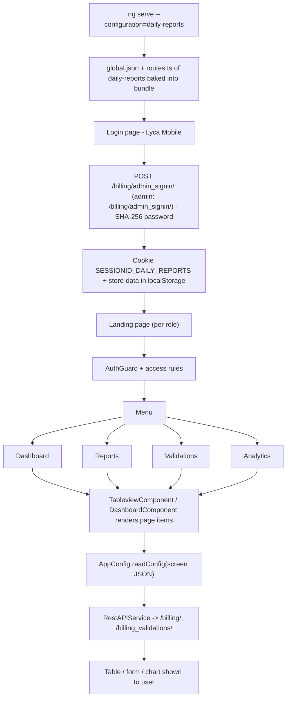

# 8. Daily Reports (Lyca Mobile)

> Product folder: `aryadash-dashboard/src/config/daily-reports/` - built from the shared AryaDash engine. [Back to all projects](../README.md) - [Interview guide](../../00-interview-guide.md)

## What it is

Daily operational reporting: reports, data validations and analytics dashboards.

## Key facts

| Item | Value |
|---|---|
| Browser title | Lyca Mobile |
| Theme colours | primary `#20244f`, fade `green` |
| Timezone | UTC+0200 |
| Default layout | horizontal |
| localStorage prefix | `daily-reports` |
| Session cookie | `SESSIONID_DAILY_REPORTS` |
| Auth mode | session cookie |
| Login URL (user / admin) | `/billing/admin_signin/` / `/billing/admin_signin/` |
| Menu entries | 4 |
| Pages in global.json | 14 |
| Screen JSON files | 17 |
| Routes | 5 (login + 4) using `DashboardComponent`, `LoginPageComponent`, `TableviewComponent` |
| Environment | `{ production: false, showVersion: true, configBase: "daily-reports/", productType: '' }` |
| Brand assets | `src/assets-daily-reports/` |
| Backend API modules (dev proxy) | `/billing/`, `/billing_validations/` |

## How to run

```bash
cd ~/VIPLine-billing/aryadash-dashboard
ng serve --configuration=daily-reports   # http://localhost:4200
ng build --configuration=development-daily-reports
```

## Menu and access

| Menu | Route | Sub-pages | Who can see it |
|---|---|---|---|
| Dashboard | `/dashboard` | - | everyone |
| Reports | `/reports` | CDR Reports, Daily Reports, Usage, Re-Generate CDR reports, Re-Generate CDR Logs, Daily Validation Reports, Dynamic CDRs | everyone |
| Validations | `/validations` | Configs, Data Sources, API Configs, Database Configs, Query Configs, Processing Configs | everyone |
| Analytics | `/analytics` | Analytics | everyone |

## Product-specific features (keys in global.json)

- `layout` - Default layout
- `summary-gauges` - Dashboard gauges
- `trend-bars` - Dashboard trend bars
- `topn-tables` - Dashboard top-N tables
- `metrics-summary` - Dashboard metric tiles

## View types used

Page items in `global.json -> pages`: `table` x13, `modal-form` x4, `form` x1, `dashboard` x1

Definitions inside screen JSON files: `table` x17, `form` x15, `modal-form` x3, `dashboard` x1, `detail-view` x1, `list` x1, `page-section` x1

## Flow



## Screen JSON files

|  |  |  |  |
|---|---|---|---|
| `analytics.json` | `apiconfig.json` | `cdrreports.json` | `create-configs.json` |
| `dailyreports.json` | `dailyreportvalidations.json` | `databaseconfigs.json` | `datasources.json` |
| `dynamiccdr.json` | `forcedruncdrsreport.json` | `processingconfigs.json` | `queryconfigs.json` |
| `runmissingwindows.json` | `simcards.json` | `usage.json` | `validationconfig.json` |
| `website.json` |  |  |  |

## Talking points for an interview

- Built from the **same codebase** as the other products; only `src/config/daily-reports/`, its environment file and asset folder differ.
- Adding a screen here = add a JSON file + a `pages`/`menu` entry in `global.json` + a route in `routes.ts` (component `TableviewComponent`).
- Uses **session-cookie** login: `sessionKey` from the login response is stored in cookie `SESSIONID_DAILY_REPORTS` and sent as the `SESSIONID` header.
