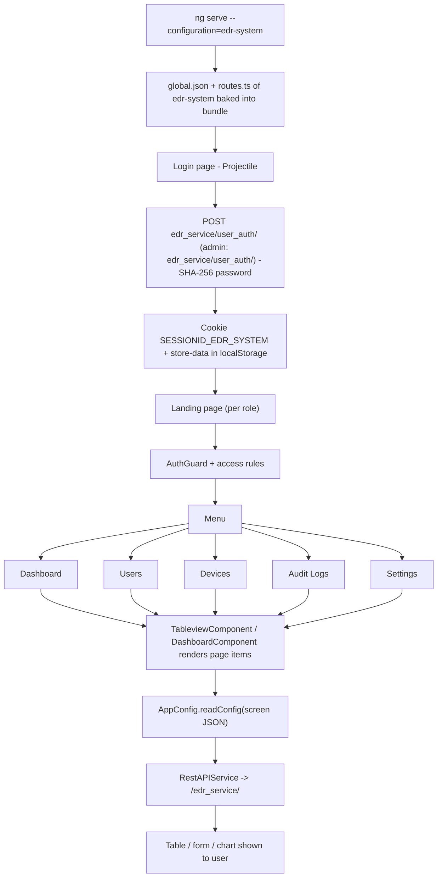

# 9. EDR System

> Product folder: `aryadash-dashboard/src/config/edr-system/` - built from the shared AryaDash engine. [Back to all projects](../README.md) - [Interview guide](../../00-interview-guide.md)

## What it is

Endpoint / EDR admin console: users, devices, audit logs and settings.

## Key facts

| Item | Value |
|---|---|
| Browser title | Projectile |
| Theme colours | primary `#11caeb`, fade `#a7dab0` |
| Timezone | UTC+0100 |
| localStorage prefix | `edr-system` |
| Session cookie | `SESSIONID_EDR_SYSTEM` |
| Auth mode | session cookie |
| Login URL (user / admin) | `edr_service/user_auth/` / `edr_service/user_auth/` |
| Menu entries | 5 |
| Pages in global.json | 4 |
| Screen JSON files | 4 |
| Routes | 8 (login + 7) using `DashboardComponent`, `LoginPageComponent`, `TableviewComponent` |
| Environment | `{ production: false, showVersion: true, configBase: "edr-system/", productType: '' }` |
| Brand assets | `src/assets-edrsystem/` |
| Backend API modules (dev proxy) | `/edr_service/` |

## How to run

```bash
cd ~/VIPLine-billing/aryadash-dashboard
ng serve --configuration=edr-system   # http://localhost:4200
ng build --configuration=development-edr-system
ng build --configuration=edr-system
```

## Menu and access

| Menu | Route | Sub-pages | Who can see it |
|---|---|---|---|
| Dashboard | `/dashboard` | - | everyone |
| Users | `/users` | Users | everyone |
| Devices | `/devices` | Devices | everyone |
| Audit Logs | `/auditlogs` | Audit Logs | everyone |
| Settings | `/settings` | Settings | everyone |

## Product-specific features (keys in global.json)

- `user-profile` - Role-based profile icon
- `summary-gauges` - Dashboard gauges
- `topn-tables` - Dashboard top-N tables
- `summary-views` - Dashboard summary views
- `metrics-summary` - Dashboard metric tiles

## View types used

Page items in `global.json -> pages`: `detail-view` x6, `table` x3, `modal-form` x2

Definitions inside screen JSON files: `detail-view` x6, `table` x3, `form` x2

## Flow



## Screen JSON files

|  |  |  |  |
|---|---|---|---|
| `auditlogs.json` | `devices.json` | `settings.json` | `users.json` |

## Talking points for an interview

- Built from the **same codebase** as the other products; only `src/config/edr-system/`, its environment file and asset folder differ.
- Adding a screen here = add a JSON file + a `pages`/`menu` entry in `global.json` + a route in `routes.ts` (component `TableviewComponent`).
- Uses **session-cookie** login: `sessionKey` from the login response is stored in cookie `SESSIONID_EDR_SYSTEM` and sent as the `SESSIONID` header.
