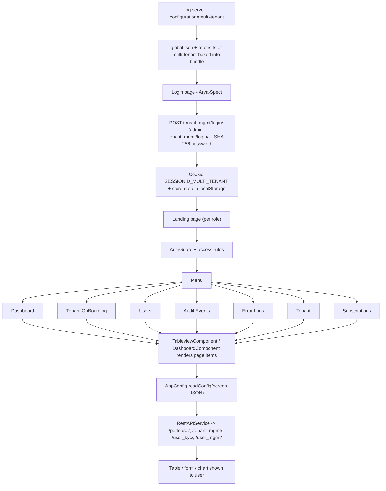

# 10. Multi-Tenant Admin

> Product folder: `aryadash-dashboard/src/config/multi-tenant/` - built from the shared AryaDash engine. [Back to all projects](../README.md) - [Interview guide](../../00-interview-guide.md)

## What it is

Tenant onboarding and administration for the multi-tenant platform: onboarding, users, audit events, error logs, tenants, subscriptions.

## Key facts

| Item | Value |
|---|---|
| Browser title | Arya-Spect |
| Theme colours | primary `#d50000`, fade `#181818` |
| Timezone | UTC+0100 |
| localStorage prefix | `arya-spect` |
| Session cookie | `SESSIONID_MULTI_TENANT` |
| Auth mode | session cookie |
| Login URL (user / admin) | `tenant_mgmt/login/` / `tenant_mgmt/login/` |
| Menu entries | 7 |
| Pages in global.json | 7 |
| Screen JSON files | 1 |
| Routes | 17 (login + 16) using `DashboardComponent`, `LoginPageComponent`, `TableviewComponent` |
| Environment | `{ production: false, showVersion: true, configBase: "multi-tenant/", productType: '' }` |
| Brand assets | `src/assets-portease-mnp/` |
| Backend API modules (dev proxy) | `/portease/`, `/tenant_mgmt/`, `/user_kyc/`, `/user_mgmt/` |

## How to run

```bash
cd ~/VIPLine-billing/aryadash-dashboard
ng serve --configuration=multi-tenant   # http://localhost:4200
ng build --configuration=development-multi-tenant
```

## Menu and access

| Menu | Route | Sub-pages | Who can see it |
|---|---|---|---|
| Dashboard | `/dashboard` | Dashboard | everyone |
| Tenant OnBoarding | `/tenantonboarding` | Tenant OnBoarding | everyone |
| Users | `/users` | Users | everyone |
| Audit Events | `/auditevents` | Audit Events | everyone |
| Error Logs | `/errorlogs` | Error Logs | everyone |
| Tenant | `/tenant` | Tenant | everyone |
| Subscriptions | `/subscriptions` | Subscriptions Request, Subscriptions | everyone |

## Product-specific features (keys in global.json)

- `change-password` - Change-password flow
- `user-profile` - Role-based profile icon
- `summary-gauges` - Dashboard gauges
- `topn-tables` - Dashboard top-N tables
- `metrics-summary` - Dashboard metric tiles

## View types used

Page items in `global.json -> pages`: `table` x7, `modal-form` x5

Definitions inside screen JSON files: `modal-form` x1, `table` x1, `list` x1

## Flow



## Screen JSON files

|  |  |  |  |
|---|---|---|---|
| `tenantonboarding.json` |  |  |  |

## Talking points for an interview

- Built from the **same codebase** as the other products; only `src/config/multi-tenant/`, its environment file and asset folder differ.
- Adding a screen here = add a JSON file + a `pages`/`menu` entry in `global.json` + a route in `routes.ts` (component `TableviewComponent`).
- Uses **session-cookie** login: `sessionKey` from the login response is stored in cookie `SESSIONID_MULTI_TENANT` and sent as the `SESSIONID` header.
