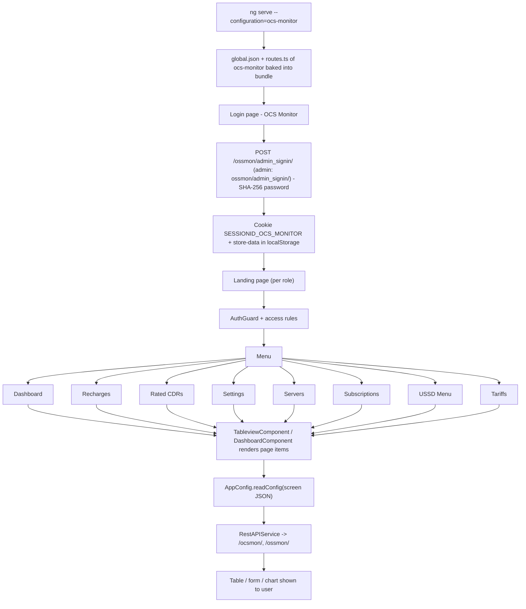

# 11. OCS Monitor

> Product folder: `aryadash-dashboard/src/config/ocs-monitor/` - built from the shared AryaDash engine. [Back to all projects](../README.md) - [Interview guide](../../00-interview-guide.md)

## What it is

Online Charging System monitor: recharges, rated CDRs, servers, subscriptions, USSD menus and tariffs.

## Key facts

| Item | Value |
|---|---|
| Browser title | (not set) |
| Theme colours | primary `#3d3d3d`, fade `#f4c960` |
| Timezone | UTC+0100 |
| localStorage prefix | `ocs-monitor` |
| Session cookie | `SESSIONID_OCS_MONITOR` |
| Auth mode | session cookie |
| Login URL (user / admin) | `/ossmon/admin_signin/` / `ossmon/admin_signin/` |
| Menu entries | 8 |
| Pages in global.json | 16 |
| Screen JSON files | 12 |
| Routes | 13 (login + 12) using `DashboardComponent`, `LoginPageComponent`, `TableviewComponent` |
| Environment | `{ production: false, showVersion: true, configBase: "ocs-monitor/", productType: '' }` |
| Brand assets | `src/assets-edrsystem/` |
| Backend API modules (dev proxy) | `/ocsmon/`, `/ossmon/` |

## How to run

```bash
cd ~/VIPLine-billing/aryadash-dashboard
ng serve --configuration=ocs-monitor   # http://localhost:4200
ng build --configuration=development-ocs-monitor
```

## Menu and access

| Menu | Route | Sub-pages | Who can see it |
|---|---|---|---|
| Dashboard | `/dashboard` | - | everyone |
| Recharges | `/recharges` | Data, Voice, SMS | everyone |
| Rated CDRs | `/ratedcdrs` | Data, Voice | everyone |
| Settings | `/settings` | Settings | everyone |
| Servers | `/server` | Servers | everyone |
| Subscriptions | `/spalsubscriptions` | Subscriptions, Recharges, Services | everyone |
| USSD Menu | `/ussdmenu` | USSD Menu | everyone |
| Tariffs | `/tariffs` | Tariffs, Tariff Rules | everyone |

## Product-specific features (keys in global.json)

- `summary-gauges` - Dashboard gauges
- `trend-bars` - Dashboard trend bars
- `topn-tables` - Dashboard top-N tables
- `summary-views` - Dashboard summary views
- `metrics-summary` - Dashboard metric tiles

## View types used

Page items in `global.json -> pages`: `table` x15, `modal-form` x6, `detail-view` x6

Definitions inside screen JSON files: `table` x11, `form` x8, `detail-view` x6, `modal-form` x5, `list` x2

## Flow



## Screen JSON files

|  |  |  |  |
|---|---|---|---|
| `ocsserver.json` | `pcrfserver.json` | `ratedcdrs.json` | `recharges.json` |
| `rechargesbymdn.json` | `server.json` | `services.json` | `settings.json` |
| `spalsubscriptions.json` | `tariffrules.json` | `tariffs.json` | `ussdmenu.json` |

## Talking points for an interview

- Built from the **same codebase** as the other products; only `src/config/ocs-monitor/`, its environment file and asset folder differ.
- Adding a screen here = add a JSON file + a `pages`/`menu` entry in `global.json` + a route in `routes.ts` (component `TableviewComponent`).
- Uses **session-cookie** login: `sessionKey` from the login response is stored in cookie `SESSIONID_OCS_MONITOR` and sent as the `SESSIONID` header.
