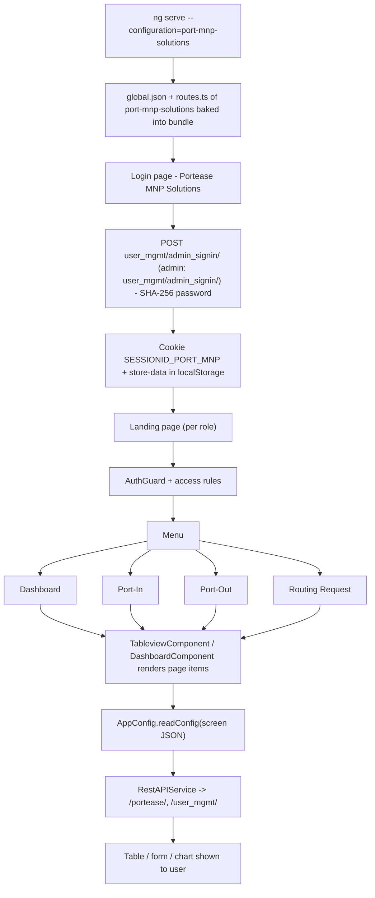

# 12. Portease MNP Solutions

> Product folder: `aryadash-dashboard/src/config/port-mnp-solutions/` - built from the shared AryaDash engine. [Back to all projects](../README.md) - [Interview guide](../../00-interview-guide.md)

## What it is

Mobile Number Portability portal: port-in, port-out and routing requests.

## Key facts

| Item | Value |
|---|---|
| Browser title | Portease MNP Solutions |
| Version in config | 2.0.3 |
| Theme colours | primary `#00b2db`, fade `#00b2db` |
| Timezone | GMT+04:00 |
| localStorage prefix | `Portease CRM` |
| Session cookie | `SESSIONID_PORT_MNP` |
| Auth mode | session cookie |
| Login URL (user / admin) | `user_mgmt/admin_signin/` / `user_mgmt/admin_signin/` |
| Menu entries | 4 |
| Pages in global.json | 3 |
| Screen JSON files | 3 |
| Routes | 9 (login + 8) using `DashboardComponent`, `LoginPageComponent`, `TableviewComponent` |
| Environment | `{ production: false, showVersion: true, configBase: "port-mnp-solutions/", productType: '' }` |
| Brand assets | `src/assets-portease-mnp/` |
| Backend API modules (dev proxy) | `/portease/`, `/user_mgmt/` |

## How to run

```bash
cd ~/VIPLine-billing/aryadash-dashboard
ng serve --configuration=port-mnp-solutions   # http://localhost:4200
ng build --configuration=development-portease-mnp
```

## Menu and access

| Menu | Route | Sub-pages | Who can see it |
|---|---|---|---|
| Dashboard | `/dashboard` | Dashboard | everyone |
| Port-In | `/portin` | Port-In | everyone |
| Port-Out | `/portout` | Port-out | everyone |
| Routing Request | `/routingrequest` | Routing Request | everyone |

## Product-specific features (keys in global.json)

- `api-config` - Global extra request headers (header-params)
- `global-context` - Global context selector in the header (stored in DataStore, can reload page)
- `change-password` - Change-password flow
- `clientlogo` - Client logo
- `summary-gauges` - Dashboard gauges
- `topn-tables` - Dashboard top-N tables
- `summary-views` - Dashboard summary views
- `metrics-summary` - Dashboard metric tiles

## View types used

Page items in `global.json -> pages`: `table` x3, `modal-form` x1

Definitions inside screen JSON files: `form` x7, `table` x3, `list` x1

## Flow



## Screen JSON files

|  |  |  |  |
|---|---|---|---|
| `portin.json` | `portout.json` | `routingrequest.json` |  |

## Talking points for an interview

- Built from the **same codebase** as the other products; only `src/config/port-mnp-solutions/`, its environment file and asset folder differ.
- Adding a screen here = add a JSON file + a `pages`/`menu` entry in `global.json` + a route in `routes.ts` (component `TableviewComponent`).
- Uses **session-cookie** login: `sessionKey` from the login response is stored in cookie `SESSIONID_PORT_MNP` and sent as the `SESSIONID` header.
- `api-config.header-params` adds extra headers (for example a tenant id) to every request.
