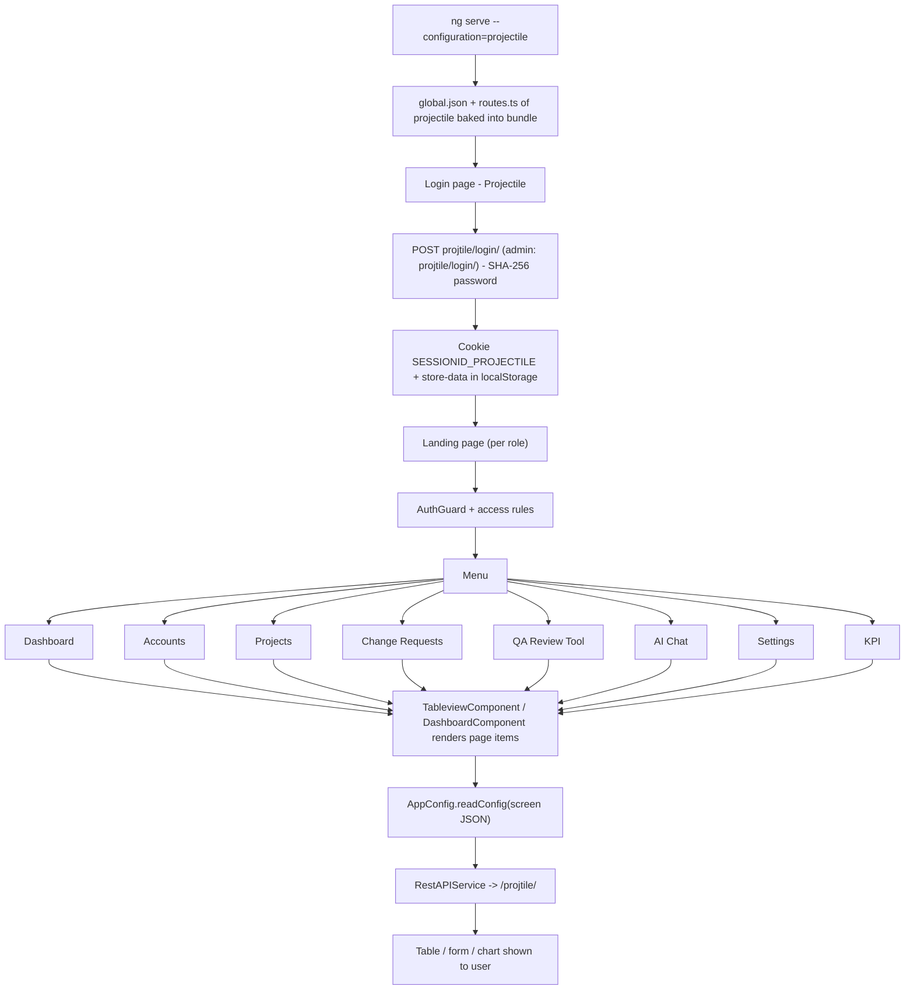

# 13. Projectile

> Product folder: `aryadash-dashboard/src/config/projectile/` - built from the shared AryaDash engine. [Back to all projects](../README.md) - [Interview guide](../../00-interview-guide.md)

## What it is

Project delivery tool: accounts, projects, change requests, QA review tool, AI chat, KPIs.

## Key facts

| Item | Value |
|---|---|
| Browser title | Projectile |
| Theme colours | primary `#30bf4a`, fade `#a7dab0` |
| Timezone | UTC+0100 |
| localStorage prefix | `projtile` |
| Session cookie | `SESSIONID_PROJECTILE` |
| Auth mode | session cookie |
| Login URL (user / admin) | `projtile/login/` / `projtile/login/` |
| Menu entries | 8 |
| Pages in global.json | 16 |
| Screen JSON files | 14 |
| Routes | 12 (login + 11) using `DashboardComponent`, `LoginPageComponent`, `TableviewComponent` |
| Environment | `{ production: false, showVersion: true, configBase: "projectile/", productType: '' }` |
| Brand assets | `src/assets-projectile/` |
| Backend API modules (dev proxy) | `/projtile/` |

## How to run

```bash
cd ~/VIPLine-billing/aryadash-dashboard
ng serve --configuration=projectile   # http://localhost:4200
ng build --configuration=development-projectile
ng build --configuration=projectile
```

## Menu and access

| Menu | Route | Sub-pages | Who can see it |
|---|---|---|---|
| Dashboard | `/dashboard` | - | everyone |
| Accounts | `/accounts` | Clients, Users | everyone |
| Projects | `/projects` | Projects, Tasks, RLIS, Recurring Tasks, Assignments, Resource Utilization, Task Extension Requests, Task Bugs | everyone |
| Change Requests | `/changerequests` | Change Requests | everyone |
| QA Review Tool | `/qareview` | - | everyone |
| AI Chat | `/aichat` | - | everyone |
| Settings | `/settings` | Settings | everyone |
| KPI | `/kpi` | KPI Entry, KPI Goal Update | role = Manager, Admin, Director; mode strict |

## Product-specific features (keys in global.json)

- `api-config` - Global extra request headers (header-params)
- `global-context` - Global context selector in the header (stored in DataStore, can reload page)
- `user-profile` - Role-based profile icon
- `links` - External links
- `summary-gauges` - Dashboard gauges
- `trend-charts` - Dashboard trend charts
- `topn-tables` - Dashboard top-N tables
- `summary-views` - Dashboard summary views
- `metrics-summary` - Dashboard metric tiles

## View types used

Page items in `global.json -> pages`: `table` x17, `modal-form` x8, `detail-view` x6, `table-with-filter` x1, `modal-wizard` x1, `page-section` x1

Definitions inside screen JSON files: `form` x52, `table` x17, `page-section` x6, `detail-view` x6, `wizard` x3, `list` x3, `modal-form` x2

## Flow



## Screen JSON files

|  |  |  |  |
|---|---|---|---|
| `changerequest.json` | `changerequestdetail.json` | `clients.json` | `kpi.json` |
| `projectassign.json` | `projectrepo.json` | `projects.json` | `projecttask.json` |
| `recurringtask.json` | `rlis.json` | `settings.json` | `taskbug.json` |
| `taskextension.json` | `users.json` |  |  |

## Talking points for an interview

- Built from the **same codebase** as the other products; only `src/config/projectile/`, its environment file and asset folder differ.
- Adding a screen here = add a JSON file + a `pages`/`menu` entry in `global.json` + a route in `routes.ts` (component `TableviewComponent`).
- Uses **session-cookie** login: `sessionKey` from the login response is stored in cookie `SESSIONID_PROJECTILE` and sent as the `SESSIONID` header.
- Menu items carry `access` rules, so the menu, the route guard and the page builder all hide what the role may not see.
- `api-config.header-params` adds extra headers (for example a tenant id) to every request.
