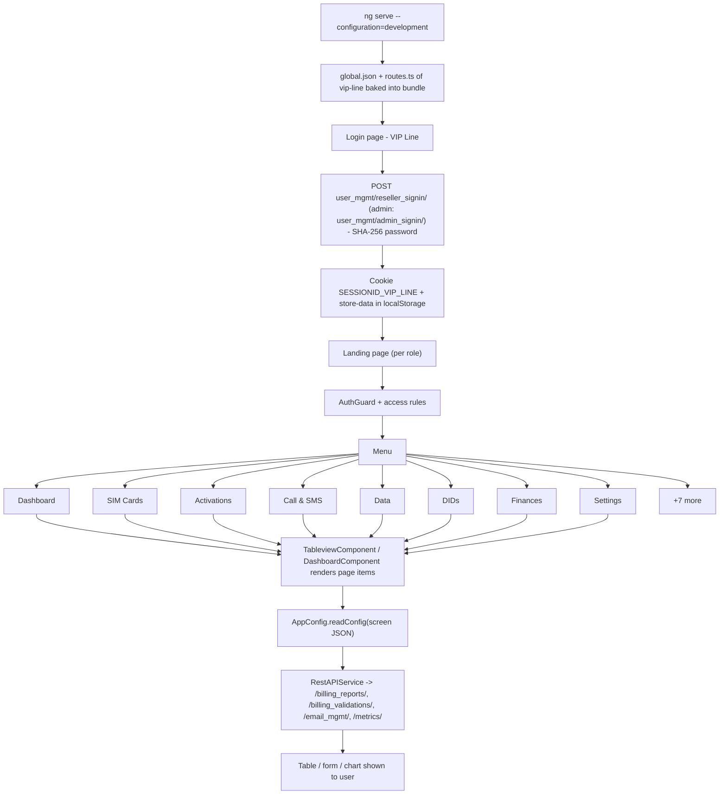

# 1. VIP Line

> Product folder: `aryadash-dashboard/src/config/vip-line/` - built from the shared AryaDash engine. [Back to all projects](../README.md) - [Interview guide](../../00-interview-guide.md)

## What it is

Reseller and admin portal for a private mobile/VoIP operator: SIM cards, activations, calls and SMS, data, DIDs, finances, rate sheets, SIM transfer and reseller management.

## Key facts

| Item | Value |
|---|---|
| Browser title | VIP Line |
| Version in config | 2.0.3 |
| Theme colours | primary `#f4c960`, fade `#ffde8c` |
| Timezone | UTC+0200 |
| Currency | USD |
| localStorage prefix | `vip` |
| Session cookie | `SESSIONID_VIP_LINE` |
| Auth mode | session cookie |
| Login URL (user / admin) | `user_mgmt/reseller_signin/` / `user_mgmt/admin_signin/` |
| Menu entries | 15 |
| Pages in global.json | 43 |
| Screen JSON files | 43 |
| Routes | 21 (login + 20) using `DashboardComponent`, `LoginPageComponent`, `TableviewComponent` |
| Backend API modules (dev proxy) | `/billing_reports/`, `/billing_validations/`, `/email_mgmt/`, `/metrics/`, `/service_mgmt/`, `/user_mgmt/`, `/web_socket/` |

## How to run

```bash
cd ~/VIPLine-billing/aryadash-dashboard
ng serve   # http://localhost:4200
ng build --configuration=production
ng build --configuration=development
```

## Menu and access

| Menu | Route | Sub-pages | Who can see it |
|---|---|---|---|
| Dashboard | `/dashboard` | - | everyone |
| SIM Cards | `/simcards` | SIM Cards | role = reseller; permission list `resellerViewAccess` has 'Subscriptions' |
| Activations | `/activations` | Activations, Service Plans, Plan Activation | role = reseller; permission list `resellerViewAccess` has 'Service Bundles' |
| Call & SMS | `/callnsms` | Camel Call, Outbound Calls, Inbound Calls, SMS | role = reseller; permission list `resellerViewAccess` has 'CDR Management' |
| Data | `/dserv` | Data Withdrawals, Data Balance Topup | role = reseller; permission list `resellerViewAccess` has 'CDR Management' |
| DIDs | `/dids` | DID Management, Buy DID, DID Pool, DID History, DID Request | role = reseller; permission list `resellerViewAccess` has 'DIDs' |
| Finances | `/finances` | Withdrawals | role = reseller; permission list `resellerViewAccess` has 'Finance' |
| Settings | `/settings` | Settings, Block Prefix | role = reseller; permission list `resellerViewAccess` has 'Billing Settings' |
| Rate Sheet | `/ratesheet` | Rate Sheet | everyone |
| Traffic Cost | `/trafficcost` | Traffic Cost, SIP Trunks | role = reseller; permission list `resellerViewAccess` has 'Global Prefix Rating' |
| SIM Transfer | `/simtransfer` | SIM Transfer, SIM Transfer Logs | role = reseller; permission list `resellerViewAccess` has 'SIM Swap' |
| SMS | `/sms` | SMS | everyone |
| Reseller | `/reseller` | Add Reseller, Invoices, Stock Transfer, Stock Recalls | role = reseller; permission list `resellerViewAccess` has 'Reseller Management' |
| SIM Upload | `/simupload` | Upload SIMs | role = reseller; permission list `resellerViewAccess` has 'SIM Inventory' |
| Audit Logs | `/auditlogs` | Audit Logs | permission list `veiwAccess` has 'Audit Events' |

## Product-specific features (keys in global.json)

- `user-profile` - Role-based profile icon
- `toprightlogo` - Reseller brand logo from DataStore
- `trend-charts` - Dashboard trend charts
- `topn-tables` - Dashboard top-N tables
- `metrics-summary` - Dashboard metric tiles

## View types used

Page items in `global.json -> pages`: `table` x42, `form` x14, `modal-form` x10, `modal-wizard` x2, `modal-view` x1, `table-with-filter` x1, `select-update-form` x1

Definitions inside screen JSON files: `tables` x32, `form` x26, `modal-form` x19, `table` x10, `wizard` x2, `select-update-form` x1

## Flow



## Screen JSON files

|  |  |  |  |
|---|---|---|---|
| `activations.json` | `addreseller.json` | `alltransactions.json` | `archive.json` |
| `auditlogs.json` | `blockprefix.json` | `buydid.json` | `camelcall.json` |
| `changeimsi.json` | `conference.json` | `databaltopup.json` | `datawithdrawls.json` |
| `didhistory.json` | `didmanagement.json` | `didpool.json` | `didrequest.json` |
| `inboundcalls.json` | `invoice.json` | `login.json` | `newissuesubmission.json` |
| `outboundcalls.json` | `packactivation.json` | `ratesheet.json` | `retaildata.json` |
| `sendussd.json` | `serviceplans.json` | `settings.json` | `simbaltopup.json` |
| `simbalwithdrawals.json` | `simcards.json` | `simtransfer.json` | `simtransferlogs.json` |
| `simupload.json` | `siptrunks.json` | `sms.json` | `smsnotification.json` |
| `stocktransfer.json` | `tariffactivations.json` | `tickets.json` | `topingup.json` |
| `totalcharges.json` | `trafficcost.json` | `withdrawals.json` |  |

## Talking points for an interview

- Built from the **same codebase** as the other products; only `src/config/vip-line/`, its environment file and asset folder differ.
- Adding a screen here = add a JSON file + a `pages`/`menu` entry in `global.json` + a route in `routes.ts` (component `TableviewComponent`).
- Uses **session-cookie** login: `sessionKey` from the login response is stored in cookie `SESSIONID_VIP_LINE` and sent as the `SESSIONID` header.
- Menu items carry `access` rules, so the menu, the route guard and the page builder all hide what the role may not see.
