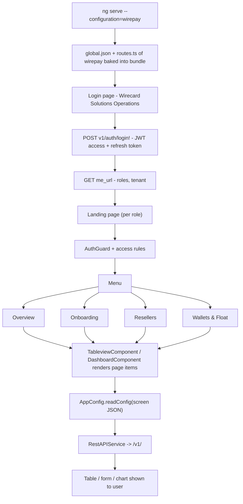

# 14. Wirepay (Wirecard Solutions Operations)

> Product folder: `aryadash-dashboard/src/config/wirepay/` - built from the shared AryaDash engine. [Back to all projects](../README.md) - [Interview guide](../../00-interview-guide.md)

## What it is

Payments operations console: overview, onboarding, resellers, wallets and float. Uses JWT bearer login and an X-TENANT-ID header.

## Key facts

| Item | Value |
|---|---|
| Browser title | Wirecard Solutions Operations |
| Version in config | 0.1.0 |
| Theme colours | primary `#e2242f`, fade `#1a1a1a` |
| Timezone | UTC+0300 |
| Currency | UGX |
| Default layout | vertical |
| localStorage prefix | `wirepay` |
| Session cookie | `SESSIONID_WIREPAY` |
| Auth mode | bearer |
| Login URL (user / admin) | `v1/auth/login!` / `-` |
| Menu entries | 4 |
| Pages in global.json | 4 |
| Screen JSON files | 3 |
| Routes | 6 (login + 5) using `LoginPageComponent`, `TableviewComponent` |
| Environment | `{ production: false, showVersion: true, configBase: "wirepay/", productType: '' }` |
| Brand assets | `src/assets-wirepay/`, `src/assets-wirepay/css/` |
| Backend API modules (dev proxy) | `/v1/` |

## How to run

```bash
cd ~/VIPLine-billing/aryadash-dashboard
ng serve --configuration=wirepay   # http://localhost:4200
ng build --configuration=development-wirepay
ng build --configuration=wirepay
```

## Menu and access

| Menu | Route | Sub-pages | Who can see it |
|---|---|---|---|
| Overview | `/overview` | Overview | everyone |
| Onboarding | `/onboarding` | Onboarding | everyone |
| Resellers | `/resellers` | Resellers | everyone |
| Wallets & Float | `/wallets` | Wallets & Float | everyone |

## Product-specific features (keys in global.json)

- `access-control` - Custom role field for access rules
- `api-config` - Global extra request headers (header-params)
- `layout` - Default layout
- `clientlogo` - Client logo

## View types used

Page items in `global.json -> pages`: `page-section` x6, `table` x4, `modal-form` x3

Definitions inside screen JSON files: `page-section` x18, `form` x11, `table` x4, `modal-form` x3

## Flow



## Screen JSON files

|  |  |  |  |
|---|---|---|---|
| `onboarding.json` | `resellers.json` | `wallets.json` |  |

## Talking points for an interview

- Built from the **same codebase** as the other products; only `src/config/wirepay/`, its environment file and asset folder differ.
- Adding a screen here = add a JSON file + a `pages`/`menu` entry in `global.json` + a route in `routes.ts` (component `TableviewComponent`).
- Uses the **bearer-token** login path (`BearerAuthService`): access token in an `Authorization` cookie, refresh 30 s before expiry, principal from `me_url`.
- URLs ending in `!` (`v1/auth/login!`) tell `RestAPIService.submitData()` to strip the marker and not append a trailing slash.
- `api-config.header-params` adds extra headers (for example a tenant id) to every request.
