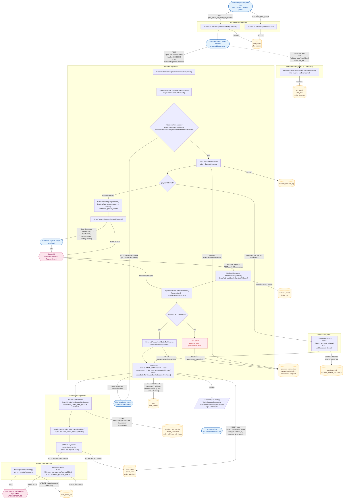
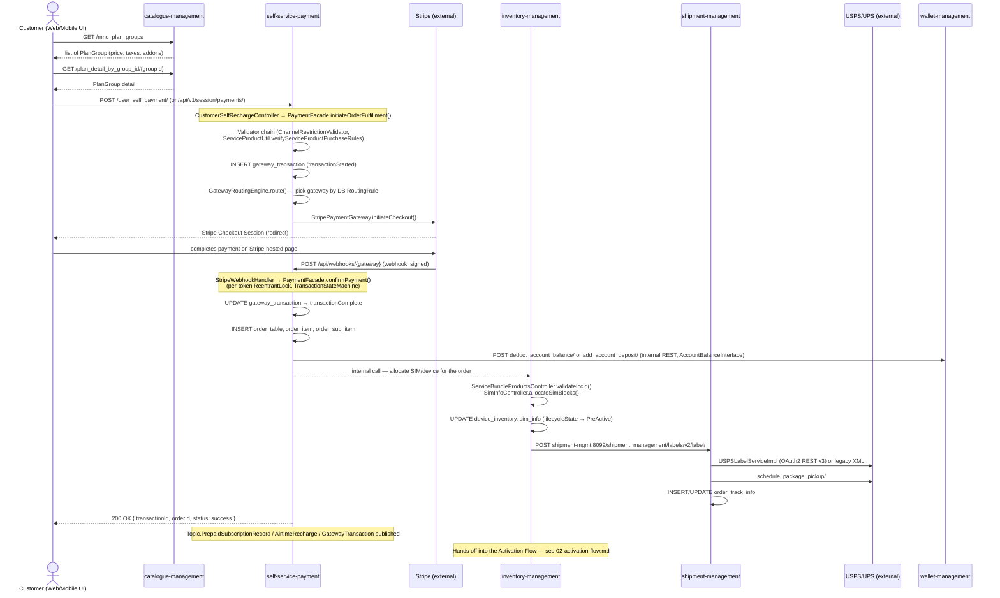

# Purchase Flow — New SIM / Plan Order (Telecom BSS)

> Source system: `billing_micro_services` (Java 8, Spring Boot/Spring Cloud microservices, MySQL, RabbitMQ/MQTT,
> Kubernetes). This document traces the **customer purchase journey** — from browsing a plan in the UI to an
> `Order` being created and money moving — with real class/method/table names pulled from the source, not just
> a conceptual description. File:line references let you (or an interviewer) jump straight to the code.

## 1. Business summary

A customer (web/mobile UI, or a reseller acting on their behalf) browses available plans, picks one, and
either buys a brand-new line (new SIM + device shipped) or attaches a plan to an existing wallet-based
recharge. The purchase flow spans **4 microservices** end-to-end before it hands off into the activation flow
(see `02-activation-flow.md`):

```
catalogue-management  →  self-service-payment  →  inventory-management  →  shipment-management
   (browse plans)         (order + payment)         (SIM/device alloc)        (pack + ship)
```

## 2. Flowchart with APIs and tables

How to read it: rounded boxes are **UI actions**, rectangles are **service logic**, diamonds are
**decisions**, cylinders are **MySQL tables**, and hexagons are **external APIs**. Each arrow is labelled
with the API call or the table operation it performs.



### 2.1 API details

| # | Method + path | Service | Auth | Request (key fields) | Response (key fields) | Tables |
|---|---|---|---|---|---|---|
| 1 | `GET /mno_plan_groups` | catalogue-management | session | — | list of `PlanGroup` (token, price, validity, add-ons) | read `plan_group`, `plan_addon` |
| 2 | `GET /plan_detail_by_group_id/{groupId}` | catalogue-management | session | `groupId` | plan detail, price, taxes | read `plan_group` |
| 3 | `GET /validate_iccid/{iccid}/{puk}` (also `/{imei}`) | inventory-management | header `API_KEY` | `iccid`, `puk`, `imei` | `ValidateICCIDVo` (valid flag, SIM/device info) | read `sim_detail`, `sim_info`, `device_inventory` |
| 4 | `POST /api/v1/session/payments/` | self-service-payment | header `SESSIONID` | `UserSelfPaymentCommand`: `entityType` (e.g. `ConsumerOrderPayment`, `StarterPlanPurchase`), `entityId` (plan token), `paymentMethod` (`STRIPE`, `PAYPAL`, `EBALANCE`, `AIRTIME_BALANCE`), `transactionAmount`, `taxAmount`, `totalPriceExclTaxes`, `planAddonTokens[]`, `multiTenureMonthsCommitted`, `email`, `resellerId`, `enableAutoRenewal` + `autoRenewalCommand` | `OrderResponse`: `status`, `statusCode`, `transactionId`, `orderId`, `paymentState`, `routingGateway`, `clientSecret`, `clientSessionId`, `requiresAction`, `nextAction` | insert `gateway_transaction`, `discount_redeem_log` |
| 4a | `POST /api/v1/payments/` | self-service-payment | header `API_KEY` (**result not enforced**, see §7) | same as #4 | same as #4 | same as #4 |
| 5 | Stripe Checkout / PaymentIntent (external) | Stripe | Stripe secret key | amount, currency, metadata (transaction token) | session id, client secret | — |
| 6 | `POST /api/webhooks/{gateway}` | self-service-payment | Stripe signature (raw body) | Stripe event JSON | 200 OK | `webhook_events`, update `gateway_transaction` |
| 7 | `POST /deduct_account_balance/`, `POST /add_account_deposit/` (internal) | wallet-management | internal | account id, amount, reference | status, new balance | wallet account + ledger |
| 8 | `POST /schedule_order_pickup/{orderNo}` | inventory-management | header `SESSIONID` | `orderNo`, pickup details | status | update `order_table` |
| 9 | `POST /shipment_management/labels/v2/label/`, `/schedule_package_pickup/` (internal) | shipment-management | hardcoded API key | order no, address, package | label, tracking no. | insert `order_track_info` |
| 10 | USPS / UPS label, pickup, tracking (external) | USPS / UPS | OAuth2 (USPS v3, UPS) or legacy XML user id | address, weight, service | label PDF, tracking no., status | — |

### 2.2 Table details (purchase flow)

| Table | Service (owner) | Operation in this flow | Important columns |
|---|---|---|---|
| `plan_group`, `plan_addon` | catalogue-management | SELECT | `plan_group_id`, `plan_group_token`, `price`, `setup_price`, validity; add-on `plan_addon_token`, `price` |
| `gateway_transaction` | self-service-payment | INSERT, then UPDATE | `transaction_id`, `transaction_token`, `transaction_status`, `entity_type`, `entity_id`, `owner_ref_id`, `total_price`, `tax_amount`, `payment_method_type`, `payment_source_id`, `gateway_reference_id`, `user_ref` (email), `reseller_id` |
| `discount_redeem_log` | self-service-payment | INSERT | discount applied, `transaction_token` |
| `webhook_events` | self-service-payment | INSERT (dedup) | gateway event id, processing status |
| `order_table` | user-mgmt-repo (written by self-service-payment, inventory, user-management) | INSERT, then UPDATE | `order_id` (PK), `order_no`, `order_type`, `user_id`, `account_id`, `current_status` (`OrderStatus`, default `Submitted`), `total_value`, `total_price_excl_taxes`, `total_taxes_n_fees`, `payment_id`, `channel`, `order_origin`, `fulfillment_pending`, `billing_address_id`, `msisdn`, `reseller_code`, `created_on` |
| `order_item` | user-mgmt-repo | INSERT | `sim_config_id` (PK), `order_id`, `bundle_id` (plan group), `entity_type`, `entity_id`, `status` (e.g. `DispatchPending`), `total_spent`, `tax_split_amount`, `multi_tenure_config`, `payment_method_ref_id`, `device_serial_number` (ICCID), `plan_addon_tokens` |
| `order_sub_item` | user-mgmt-repo | INSERT (one per add-on) | `sub_item_id`, `order_item_id`, `item_type` (`Plan_Addon`), `item_id`, `unit_price`, `quantity`, `total_price` |
| `user` | billing-common-repository (`user_kyc.User`) | SELECT / INSERT | `user_id`, `user_name`, `full_name`, `email`, `phone_number`, `account_id`, `reseller_code`, `password`, `created_on` |
| `user_address` | user-management | INSERT | address lines, zip. **`user_id` holds the ICCID until activation re-keys it** (see activation doc) |
| wallet account / `account_balance_transaction` | wallet-management | UPDATE / INSERT | balance, amount, reference. **Not atomic** with `order_table` |
| `sim_detail` (entity `SIMDetail`, no explicit `@Table` name — physical name depends on the naming strategy) | inventory-mgmt-repo | SELECT | `iccid`, `imsi`, `puk` |
| `sim_info` | inventory-mgmt-repo | UPDATE | `served_IMSI`, `is_allocated`, `lifecycle_state` (`NotProvisioned → PreActive`), `order_id` |
| `device_inventory` | inventory-mgmt-repo | UPDATE | `serial_number`, `mno_sim_profile` (**decides the carrier**), `order_id`, `device_bin_id` |
| `order_track_info` | shipment-management | INSERT / UPDATE | order ref (string, no FK), tracking number, courier, status |

### 2.3 Sequence diagram (same flow, message order)



## 3. Step-by-step trace (with evidence)

| # | Step | Component | Evidence |
|---|------|-----------|----------|
| 1 | Customer browses plans | `catalogue-management` → `MnoPlansController` | `GET /mno_plan_groups` — `MnoPlansController.java:280`; `GET /plan_detail_by_group_id/{groupId}` — `MnoPlansController.java:636` |
| 2 | Customer submits purchase/payment | `self-service-payment` → `CustomerSelfRechargeController` | `POST /user_self_payment/` (`CustomerSelfRechargeController.java:850`), also `POST /api/v1/session/payments/` (`:824`) and `POST /api/v1/payments/` (`:835`) |
| 3 | Orchestration & validation | `PaymentFacade.initiateOrderFulfillment(command, request)` | `PaymentFacade.java:193` — runs `ChannelRestrictionValidator` (carrier-aware) and `ServiceProductUtil.verifyServiceProductPurchaseRules` before any money moves |
| 4 | Transaction row created | `gateway_transaction` table | `GatewayTransaction` entity, `@Table(name = "gateway_transaction")` |
| 5 | Gateway selection | `GatewayRoutingEngine.route(context)` | DB-driven `RoutingRule` rows — amount/tier/country/currency/card-brand/gateway-health; skips `DOWN` gateways, falls back to Stripe |
| 6 | External payment call | `StripePaymentGateway.initiateCheckout` | Creates a Stripe Checkout Session/PaymentIntent |
| 7 | Payment confirmation | Stripe webhook → `StripeWebhookHandler.handleWebhook` → `PaymentFacade.confirmPayment(...)` | `PaymentFacade.java:601`; raw-body signature verification, durable `WebhookEvent`-keyed dedup, per-transaction-token `ReentrantLock`, `TransactionStateMachine`-guarded transitions |
| 8 | Order + order-line persisted | `Order`, `OrderItem`, `OrderSubItem` | `orderRepo.save(order)` / `orderWiseSimConfigRepo.save(orderItem)` / `orderSubItemRepository.save(...)` — e.g. `OrderFulfillmentServiceImpl.java:2184` (`doCreateOrderForServiceBundleEbalanceRecharge`, wallet/eBalance purchases) and, for card/Stripe purchases, `user-management` `OrderHelper.submitAndFulfilOrder` (`OrderHelper.java:518`) after the `SUBMIT_ORDER` event (see §6) |
| 9 | Wallet update | `wallet-management`'s `ConnectorApplication` REST API via `AccountBalanceInterface` | `deduct_account_balance/`, `add_account_deposit/` — **not atomic with the ledger insert** |
| 10 | SIM/device allocation | `inventory-management` | `ServiceBundleProductsController` (ICCID validation, internal method `validateIccid`, invoked from `GET /validate_iccid/{iccid}/{puk}` and `/{iccid}/{puk}/{imei}` (`API_KEY` header) — `ServiceBundleProductsController.java:1808,2347,2356`); `SimInfoController.allocateSimBlocks` (`SimInfoController.java:1164`) — **confirmed unlocked, non-transactional allocation** |
| 11 | Shipment/fulfillment order | `inventory-management` → `shipment-management` | `WarehouseController.scheduleOrderPickup` (`POST /schedule_order_pickup/{orderNo}`, `WarehouseController.java:593`) calls `CourierUtils` → HTTP to `shipment-mgmt:8099/shipment_management/labels/v2/label/` |
| 12 | Carrier shipping label | `shipment-management` → `LabelsController` | `USPSLabelServiceImpl` (OAuth2 REST v3) or `PackagePickupServiceImpl` (legacy XML); UPS equivalents |
| 13 | Delivery tracking | `shipment-management`'s hourly `trackingScheduler` | Polls `OrderTrackInfo` rows, updates via legacy USPS tracking API — **no event published on status change**; consumers must poll `Order`/`OrderTrackInfo` directly |
| 14 | Downstream event publish | `event-mgmt-utils` DB-poll bus | `Topic.PrepaidSubscriptionRecord` / `Topic.AirtimeRecharge` / `Topic.GatewayTransaction` |
| 15 | Hand-off | → Activation flow | Once SIM is allocated/plan applied, `user-management`'s activation controller takes over — see `02-activation-flow.md` |

## 4. API surface

### 4.1 UI-facing (external, customer/reseller-facing) APIs

| Method | Path | Controller | Purpose |
|---|---|---|---|
| GET | `/mno_plan_groups` | `MnoPlansController` (catalogue-management) | Browse available plans |
| GET | `/plan_detail_by_group_id/{groupId}` | `MnoPlansController` | Plan detail (price, taxes, addons) |
| POST | `/user_self_payment/` | `CustomerSelfRechargeController` (self-service-payment) | Submit purchase/payment |
| POST | `/api/v1/session/payments/` | same | Session-authenticated payment variant |
| GET | `/validate_iccid/{iccid}/{puk}` | `ServiceBundleProductsController` (inventory-management) | Validate a SIM's ICCID/PUK before assigning it to the order |
| POST | `/schedule_order_pickup/{orderNo}` | `WarehouseController` (inventory-management) | Trigger courier pickup once packed |

### 4.2 Internal (service-to-service) API calls

| Caller | Callee | Mechanism | Purpose |
|---|---|---|---|
| self-service-payment | wallet-management | REST (`AccountBalanceInterface` → `ConnectorApplication`) | Debit/credit customer wallet |
| self-service-payment | inventory-management | Internal call (order fulfillment dispatch) | Allocate SIM/device to the paid order |
| inventory-management | shipment-management | REST, `CourierUtils` | Request shipping label + schedule pickup (`shipment-mgmt:8099`) |
| self-service-payment / user-management | mno_mgmt / pwg-mno-mgmt | REST | Trigger carrier-side provisioning (continues in the Activation flow) |

### 4.3 External (third-party) API calls

| Provider | Called from | Purpose | Notes |
|---|---|---|---|
| Stripe | `StripePaymentGateway` (self-service-payment) | Checkout Session / PaymentIntent, webhook confirmation | Primary payment gateway; PayPal is a structurally similar alternate path (`PaypalWebhookController`) |
| USPS | `USPSLabelServiceImpl` / `USPSDeliveryService` (shipment-management) | Shipping label, pickup, tracking | Two coexisting API generations: legacy XML Web Tools and REST v3 OAuth |
| UPS | `UPSDeliveryService` (shipment-management) | Shipping label, pickup, tracking | XML/REST, OAuth2 |

## 5. Database tables touched (order creation + user-detail storage)

| Table | Entity | Written by | Key columns |
|---|---|---|---|
| `gateway_transaction` | `GatewayTransaction` | self-service-payment | `transaction_id`, `transaction_status` (state-machine enforced), `payment_method_type`, `user_ref`, `total_price` |
| `order_table` | `Order` | self-service-payment (`orderRepo.save`) | `order_id`, `order_no`, `user_id`, `account_id`, `current_status` (`OrderStatus` enum, 27 values), `total_value`, `payment_id`, `channel`, `order_origin` |
| `order_item` | `OrderItem` | self-service-payment | `sim_config_id`, `order_id` (FK-by-convention, not a DB FK), `bundle_id`, `status`, `device_serial_number` |
| `order_sub_item` | `OrderSubItem` | self-service-payment | `sub_item_id`, `order_item_id`, `item_type` (e.g. `Plan_Addon`), `unit_price`, `quantity` |
| `sim_info` | `SimInfo` (inventory-mgmt-repo) | inventory-management | `lifecycle_state` (`NotProvisioned → PreActive → Active`) |
| `device_inventory` | `DeviceInventory` (inventory-mgmt-repo) | inventory-management | `mno_sim_profile` (carrier-gated allocation) |
| `order_track_info` | shipment-management (cross-schema, string reference to `Order.orderId`, **not a DB FK**) | shipment-management | shipment status, tracking number |
| `user` | `User` (`user_kyc` package, billing-common-repository) | user-management | `user_id`, `full_name`, `email`, `phone_number`, `account_id`, `password` (**stored in the same table read/compared elsewhere in plaintext — a known, cataloged risk, not something this flow introduces**), `primary_person_name`/`alternate_*` fields for account contacts |
| `subscription` | `Subscription` (billing-common-repository) | user-management (created during activation, referenced from purchase) | `served_MSISDN`, `served_IMSI`, `mno_sim_profile`, `user_id`, `account_id`, `activation_state` |

**Where the customer's personal details actually live:** the `user` table (`user_kyc.User`) — name, email, phone,
company, billing/contact persons. The `Order` row only carries `user_id`/`account_id` references plus
transactional fields (amount, status, channel) — it does not duplicate the customer's PII. Note there are two
independently-declared `User`/`Subscription` entities in different packages (`user_kyc` vs `spal_repo`,
`billing` vs `spal` model packages) — a confirmed duplicated-taxonomy pattern in this codebase; do not assume
they're kept in sync without checking which one a given service actually uses.

## 6. Order-creation code paths, precisely

There isn't one single "create order" method. Where the order is created depends on the payment method:

- **Card/Stripe SIM purchases** (`ConsumerOrderPayment` / `GuestOrderPayment` / `ResellerOrderPayment`): the
  order is created **after payment, by `user-management`, through an event**.
  1. `OrderFulfillmentServiceImpl.initiateOrderFullfillment` (`:3102`) parks the whole cart (`OrderCommand` as
     JSON) in **`payment_order_info`** and inserts `gateway_transaction` (`transactionStarted`). No `order_table`
     row exists yet.
  2. After the Stripe webhook, `PaymentFacade.confirmPayment` → `finishOrderFulfillment` (`:855`) →
     `fulfillProductFulfillment` (`OrderFulfillmentServiceImpl.java:1694`) publishes **`OrderEvent SUBMIT_ORDER`**
     (`:1711`) plus a ledger event (`type:SimPurchase`).
  3. `user-management` `UserMgmtEventHooks.onOrderEvent` (`:194`) → `OrderHelper.submitAndFulfilOrder`
     (`OrderHelper.java:518`) re-checks that `gateway_transaction` is `transactionComplete`, then calls
     `OrderController.submitNewOrderHelper(...)`. This **creates `order_table`, the order items and the `user`
     record**. `OrderUtils.fulfillOrder` then writes `order_check_points`, sends new-user events and the
     device-registration SMS.
  4. `user-management` publishes `SUBMIT_ORDER_COMPLETED` and the `CustomerSIMPurchase` email.
     `self-service-payment` (`SelfServicePaymentEventHooks.java:130`) marks `payment_order_info` as confirmed.
- **Reseller wallet / e-balance purchases**: `self-service-payment` creates the order itself and synchronously,
  in `OrderFulfillmentServiceImpl.createOrderForServiceBundleEbalanceRecharge(...)` →
  `doCreateOrderForServiceBundleEbalanceRecharge(...)` (`:2171-2184`, 3 call sites, e.g. `:2072`).
- **Unused helper:** `CustomerSelfRechargeController.createNewOrderForTransaction(...)` (two overloads, `:8007`
  and `:10432`) has no live caller. Its only call site is commented out (`:7970`). It is not how card orders
  are created.

## 7. Known structural notes (observed while reading, not fixed)

- SIM-block allocation (`SimInfoController.allocateSimBlocks`) and warehouse stock movement have **no locking**
  — a real concern under concurrent orders for the same stock, at production scale.
- Wallet debit (`wallet-management`) and the local `order_table`/ledger insert are **not atomic** — a partial
  failure can desynchronize wallet balance from order state.
- `shipment-management` has **no event bus participation** — nothing is published when a shipment's status
  changes; any consumer must poll.
- USPS OAuth credentials appear in plaintext in production config in this repo's audited properties files,
  inconsistent with `{cipher}`-encrypted DB passwords elsewhere in the same file.

---
Next: `02-activation-flow.md` — what happens after the SIM is allocated and the order is paid.
