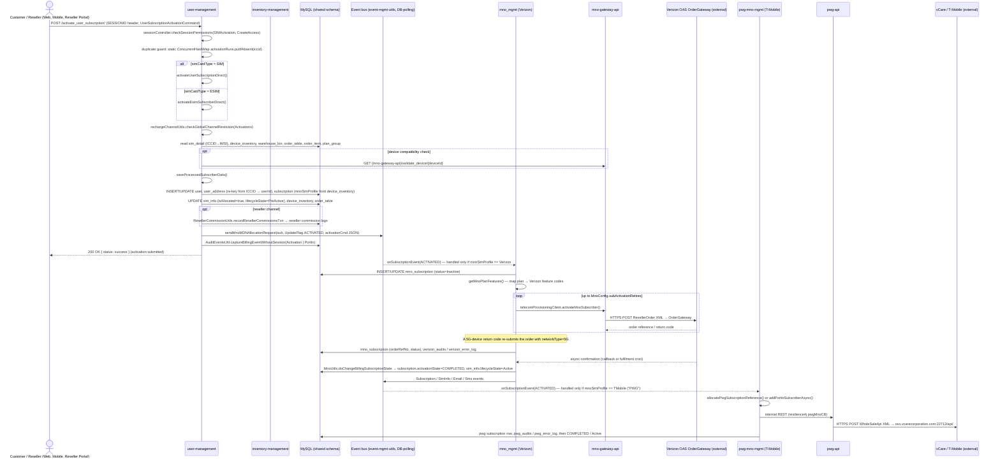
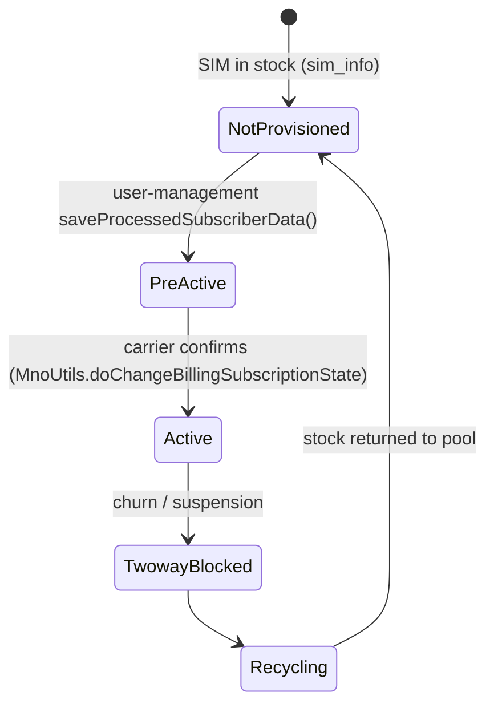

# Activation Flow — SIM / eSIM Subscriber Activation (Telecom BSS)

> Source system: `billing_micro_services`. This traces what happens **after purchase** (see
> `01-purchase-flow.md`): the customer (or a reseller) activates the SIM, the platform creates the
> subscription, and the chosen mobile carrier (MNO) assigns a phone number (MDN). Class, method and table names
> come from the source code, with file:line references.
>
> Confidence labels: **HIGH** means I read the current source in this session. **MEDIUM** means the claim comes
> from the repo's own `.claude/` discovery docs and I did not re-check it line by line.

## 1. Business summary

Activation is **asynchronous and event-driven**. It is not one synchronous API call to the carrier.

1. `user-management` validates the SIM, device, plan and order, creates the `Subscription` in a
   **PreActive** state, and publishes a `Subscription` event with `UpdateFlag.ACTIVATED`.
2. Each carrier-gateway microservice (`mno_mgmt` for Verizon, `pwg-mno-mgmt` for T-Mobile/PWG, `gupi_mgmt`
   for Tata/GUPI) listens for that event. The matching carrier service calls its external carrier API to
   allocate an MDN.
3. When the carrier confirms, the carrier service moves the subscription to **COMPLETED** and the SIM to
   **Active**.

The UI gets an immediate "activation submitted" response. The number arrives later.

```
UI ──► user-management ──(DB-poll event bus: Topic.Subscription / ACTIVATED)──► mno_mgmt     ──► Verizon OAS (XML)
                                                                           ├──► pwg-mno-mgmt ──► pwg-api ──► vCare/T-Mobile (XML)
                                                                           └──► gupi_mgmt    ──► Tata/GUPI API
```

## 2. End-to-end sequence diagram



## 3. Step-by-step trace (with evidence)

| # | Step | Where | Evidence | Confidence |
|---|------|-------|----------|-----------|
| 1 | UI submits activation | `user-management` `SubscriptionActivationController` | `POST /activate_user_subscription/` at `SubscriptionActivationController.java:529`. Variants: `/session/activate_user_subscription/` (`:584`), `/activate_user_subscription_api_key/` (`:600`, API-key/partner), `/submit_reseller_sim_activation_request/` (`:450`), `/bulk_sim_activation/` (`:687`), `/direct_activation/{subId}` (`:3062`) | HIGH |
| 2 | Session/permission check | same | `sessionController.checkSessionPermissions(sessionId, AccessTargetName.SIMActivation, CreateAccess, ...)` at `:536`. The repo's security docs say this check is currently a **no-op**; I did not re-check that here. | HIGH (call) / MEDIUM (no-op claim) |
| 3 | Duplicate-request guard | same | `private static final Map<String, Long> activationRuns = new ConcurrentHashMap` (`:446`), `putIfAbsent(iccid)` (`:541`). This lock lives only inside one JVM, so it does not protect against duplicates across pods. | HIGH |
| 4 | Physical SIM vs eSIM | same | `activateUserSubscriptionDirect(...)` (`:2324`) vs `activateEsimSubscriberDirect(...)` (`:1343`) | HIGH |
| 5 | Channel restriction | same | `rechargeChannelUtils.checkGlobalChannelRestiction(RechargeRestictionTypes.Activations, ...)` (`:2330`) | HIGH |
| 6 | Validate SIM, device, order, plan | same | `simDetailRepo.findByIccidAndIsDeletedFalse`, `warehouseBinRepo.findByBinId`, `orderRepo.findByOrderNo/findByOrderId`, `orderItemRepo.findByOrderIdAndDeviceSerialNumber`, `planGroupRepo.findByPlanGroupToken`, and plan tenure checked against `device.getMnoSimProfile()` (inside `activateUserSubscriptionDirect`) | HIGH |
| 7 | Device compatibility (internal call) | same | `GET http://{mno-gateway-api.host}:{port}{VALIDATE_DEVICE_API}/{deviceId}` (`:842`) | HIGH |
| 8 | Create subscription and user data | `saveProcessedSubscriberData(...)` (`:1784`) | `SubscriptionCommand` built with IMSI, `mnoSimProfile` (taken from the allocated `device_inventory` row, so **the carrier is decided by which SIM stock was allocated**), and `serviceBundleSerialNumber` (`:1868-1873`) | HIGH |
| 9 | Persist PreActive state | same | `simInfo.setIsAllocated(true)`, `setLifecycleState(PreActive)`, then `deviceInventoryRepo.save`, `orderRepo.save`, `subRepository.save`, `simInfoRepo.save` (`:2272-2280`) | HIGH |
| 10 | Address re-keying | same | Addresses captured at purchase time are keyed by **ICCID**. At activation they are re-keyed to the new `userId` with `userAddressRepo.findByUserId(iccid)` → `setUserId(user.getUserId())` → `saveAll` (`:2256-2262`) | HIGH |
| 11 | Reseller commission | same | `resellerCmsnUtils.recordResellerCommissionsTxn(...)` (`:2288`) when `resellerId != null` | HIGH |
| 12 | Auto-renewal setup (optional) | same | `paymentMethodSetupUtils.savePaymentGatewayDetails...`, `rechargeAutoRenewalUtils.processAutoRenewalSetup(...)` | HIGH |
| 13 | Publish activation event | `event-mgmt-utils` `EventService` | `UserMgmtEventService.getEventService().sendMnoMDNAllocationRequest(sub, UpdateFlag.ACTIVATED, json(activationCmd), ...)` (`SubscriptionActivationController.java:2214`) → `EventService.sendMnoMDNAllocationRequest` (`EventService.java:1441`) builds a `SubscriptionEvent` with `extraInfo` = the full activation command | HIGH |
| 14 | Audit record | same | `AuditEventsUtil.captureBillingEventWithoutSession(... BillingEvents.Activation / PortIn)` | HIGH |
| 15 | Verizon consumer | `mno_mgmt` | `MnoGwEventHooks.java:178` handles `ACTIVATED` only when `mnoSimProfile == Verizon` → `MnoGwEventHooksHelper.activateSubscriber` (`:387`). If `activationInitiatedOn` is set, the request is **stored for future-date activation** in `FutureDateSimActivations`. Otherwise it calls `allocateMnoSubscriptionReference` or `addPortInSubscriber` | HIGH |
| 16 | Verizon API call | `mno_mgmt` → `mno-gateway-api` → Verizon | `MnoSubscriberUtils.allocateMnoSubscriptionReference`: upserts `MnoSubscription`, maps plan to Verizon feature codes, and builds `ResellerAddSubscriberType` (physical SIM) or `ResellerAddSubscriberByESIMType`. If no MDN is given, it asks for `NextAvailableMDN` by zip code. Then `telecomProvisioningClient.activateMnoSubscriber(...)` runs in a **retry loop** bounded by `MnoConfig.subActivationRetires`. `mno-gateway-api` `SubscriptionServiceImpl` sends the XML over HTTP to the Verizon OrderGateway (`SubscriptionServiceImpl.java:147`) | HIGH |
| 17 | 5G re-submit | `MnoGwEventHooksHelper` | When the return code is in `ReturnCodes.validDeviceReturnCodes()`, it sets `networkType=5G` on the billing subscription and re-submits | HIGH |
| 18 | Final state (Verizon) | `MnoUtils.doChangeBillingSubscriptionState` (`MnoUtils.java:2678`) | `simInfo.setLifecycleState(Active)` (`:2702`), `subscription.setActivationState(COMPLETED)` (`:2706`). **No shared transaction** covers the carrier call and these DB writes. | HIGH |
| 19 | T-Mobile/PWG consumer | `pwg-mno-mgmt` | `PwgMnoGwEventHooks.java:137` returns early unless `mnoSimProfile == TMobile` → `pwgMnoSubscriberUtils.allocatePwgSubscriptionReference` or `addPortinSubscriberAsync` | HIGH |
| 20 | T-Mobile/PWG API call | `pwg-mno-mgmt` → `pwg-api` → vCare | Internal REST to `pwg-api` (resilience4j `pwgMnoCB`), then `WholeSaleApi` XML to `https://oss.vcarecorporation.com:22712/api/` (default URL in `PwgGlobalConfigController.java:42`). Success is audited in `pwg_audits` and failure in `pwg_error_log` | MEDIUM (internal hops from `.claude/context/17-business-flows.md` §17.3; vCare URL is HIGH) |
| 21 | GUPI/Tata consumer | `gupi_mgmt` | `GupiMnoGwEventHooks.java:91` → `subscriberUtils.createMnoSubscriptionAfterSIMActivationConfirmed(command)` | HIGH |

## 4. API surface

### 4.1 UI / partner-facing APIs (`user-management`)

| Method | Path | Caller | Notes |
|---|---|---|---|
| POST | `/activate_user_subscription/` | Customer web/mobile | `SESSIONID` header; handles physical SIM and eSIM |
| POST | `/session/activate_user_subscription/` | Session-authenticated variant | Delegates to the API-key handler |
| POST | `/activate_user_subscription_api_key/` | Partner / e-commerce (`External_Open`) | API-key based |
| POST | `/submit_reseller_sim_activation_request/` | Reseller portal | Reseller-channel activation |
| POST | `/bulk_sim_activation/` | Admin/reseller | Bulk activation |
| POST | `/direct_activation/{subId}` | Admin | Direct activation of an existing subscription |
| GET | `/order_inquiry_by_session/{referenceType}/{referenceNo}` | UI polling | Activation/order status; proxies to the carrier service's `/order_inquiry/...` |
| GET | `/portin_inquiry/{mdn}` | UI | Port-in status (proxies to `mno_mgmt`'s `port_in_Inquiry/`) |

### 4.2 Internal (service-to-service) calls

| From | To | Mechanism | Purpose |
|---|---|---|---|
| user-management | mno-gateway-api | REST (`validate_device`) | Device compatibility check |
| user-management | mno_mgmt / pwg-mno-mgmt / gupi_mgmt | **Event** `Topic.Subscription`, `UpdateFlag.ACTIVATED` (DB-polling bus in `event-mgmt-utils`) | Ask the carrier to allocate an MDN |
| user-management | mno_mgmt / pwg-mno-mgmt | REST `{mno.mgmt.host}/order_inquiry/...`, `{pwg.mno.mgmt.host}/order_inquiry/...` | Status inquiry |
| mno_mgmt | mno-gateway-api | REST (`TelecomProvisioningClient`, base URL `MnoConfig.mnoBaseUrl`) | Verizon provisioning adapter |
| pwg-mno-mgmt | pwg-api | REST, resilience4j `pwgMnoCB` | T-Mobile/PWG provisioning adapter |
| carrier services | user-management and notification services | Events: `Subscription`, `SimInfo`, `Email`, `Sms` | Final state and customer notification |

### 4.3 External (carrier) APIs

| Carrier | Called from | Protocol | Endpoint |
|---|---|---|---|
| Verizon | `mno-gateway-api` `SubscriptionServiceImpl` | HTTPS POST, XML `ResellerOrder` | OAS `.../xapi/ws/OrderGateway` (UAT default `rssxuat1.vzwcorp.com`; production URL comes from config) |
| T-Mobile (through vCare/PWG) | `pwg-api` | HTTPS POST, XML `WholeSaleApi` | `oss.vcarecorporation.com:22712/api/` |
| Tata/GUPI | `gupi_mgmt` | REST, OAuth2 client credentials | From config. The repo's config audit found GUPI production config is not checked into this repo. |

## 5. Database tables touched

| Table | Entity | Written by | What changes |
|---|---|---|---|
| `subscription` | `Subscription` (billing-common-repository) | user-management, then the carrier service | Created with `mno_sim_profile`, `served_IMSI`, `user_id`, `account_id`. `activation_state`: `INIT → INPROGRESS → COMPLETED` (or `REJECTED` / `INSTALLATIONFAILED`). `served_MSISDN` is filled once the carrier assigns the MDN (or is set up front for port-in). `mno_ref_no` / `mno_account_id` hold carrier references. |
| `sim_info` | `SimInfo` | user-management → carrier service | `is_allocated=true`; `lifecycle_state`: `NotProvisioned → PreActive → Active`; `order_id` |
| `sim_detail` | `SIMDetail` | read only | Looks up IMSI from ICCID |
| `device_inventory` | `DeviceInventory` | user-management | Stock row. Its `mno_sim_profile` **decides the carrier**. |
| `order_table` / `order_item` | `Order` / `OrderItem` | user-management | Order linked to the activated ICCID (`iccidSubRecharges` JSON); `userId` filled for third-party orders |
| `user` | `User` (`user_kyc`) | user-management | Subscriber account (name, email, phone, account_id) |
| `user_address` | `UserAddress` | user-management | Re-keyed from ICCID to userId |
| `mno_subscription` | `MnoSubscription` (mno_mgmt) | mno_mgmt | Carrier-side record: `status`, `orderRefNo`, `mnoStatusCode`, `failureCause`, `networkType` |
| `failed_mno_subscription` | `FailedMnoSubscription` | mno_mgmt | Failed activations kept for retry/intervention |
| `future_date_sim_activations` | `FutureDateSimActivations` | mno_mgmt | Scheduled activations, run later by a cron |
| `verizon_audits` / `verizon_error_log` | — | mno_mgmt / mno-gateway-api | Carrier request/response audit (MEDIUM) |
| `pwg_audits` / `pwg_error_log` | — | pwg-api | T-Mobile audit (MEDIUM) |
| reseller commission tables | `ResellerCommissionLogs`, `ResellerAggregatedCommission` | user-management | Commission rows for reseller activations (MEDIUM) |
| `events` (audit) | `AuditEventsUtil` | user-management | "Activation request submitted" billing event |

## 6. State machine



`subscription.activation_state` moves alongside it: `INIT → INPROGRESS → COMPLETED` on success, or
`REJECTED` / `INSTALLATIONFAILED` on failure.

## 7. Engineering notes from reading the code (observed, not changed)

- **Carrier selection comes from inventory.** The subscription's `mnoSimProfile` is copied from the allocated
  `device_inventory` row. The device-coverage / compatibility cascade described in the repo docs decides which
  stock gets allocated. After that, the carrier is fixed and the event fan-out routes by that field.
- **Fan-out by filtering.** Every carrier service receives every `ACTIVATED` event. Verizon (`mno_mgmt`) and
  PWG (`pwg-mno-mgmt`) filter on `mnoSimProfile`. **In the `gupi_mgmt` handler (`GupiMnoGwEventHooks.java:91`)
  I found no `mnoSimProfile` check before it acts.** UNKNOWN / REQUIRES VALIDATION: whether that matters in
  production depends on whether `gupi_mgmt` is deployed and reading the same event stream. The repo notes it
  has no Jenkins deploy path.
- **Retries around a non-idempotent carrier call.** `allocateMnoSubscriptionReference` retries
  `activateMnoSubscriber` up to `subActivationRetires` times. A short-circuit applies only when an
  `orderRefNo` was already saved. A timeout after Verizon accepted the order could therefore lead to a
  duplicate submission.
- **The duplicate-activation guard is JVM-local** (`static ConcurrentHashMap`). With more than one replica, two
  pods can both accept the same ICCID.
- **No distributed transaction.** The local PreActive writes, the event publish, the carrier call, and the
  COMPLETED/Active writes are separate steps. The event bus marks a failed handler as processed after one
  attempt (per the repo's failure-handling docs), so recovery relies on `failed_mno_subscription`, workflow
  requests, and crons.
- **Stale doc line numbers.** The repo's `.claude/context/26-business-processes.md` cites `MnoUtils.java:2426/2431`
  for the COMPLETED/Active writes. In the current source those lines have moved (`:2479/2484` is the reactivate
  path; activation completion is `:2702/2706`).

---
Previous: `01-purchase-flow.md` · Next: `03-recharge-flow.md`
