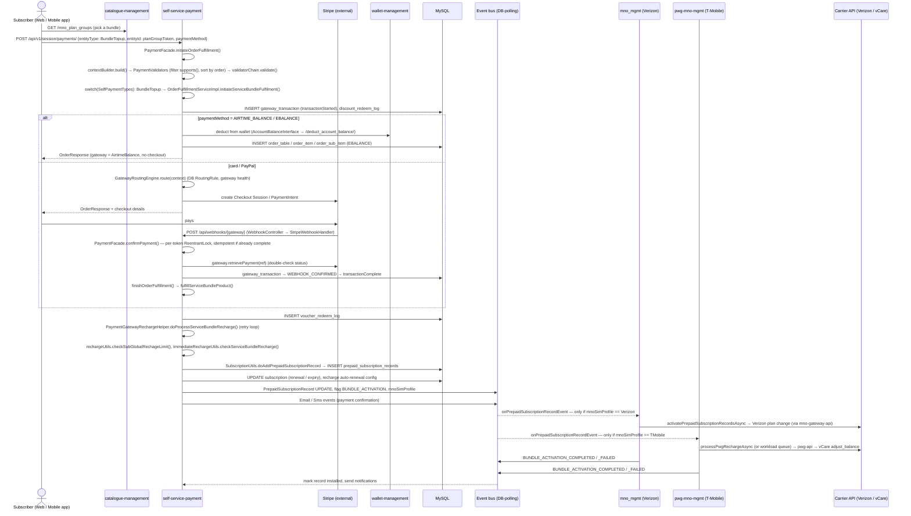
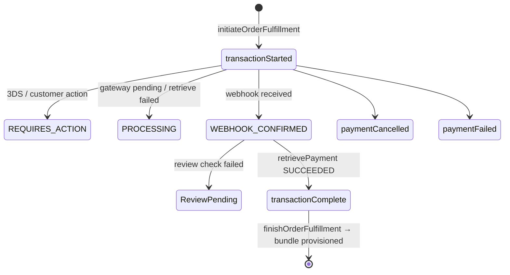

# Recharge Flow — Prepaid Bundle Top-Up / Airtime / Wallet (Telecom BSS)

> Source system: `billing_micro_services`. This traces how an **already-active subscriber** (see
> `02-activation-flow.md`) pays for and receives a new plan bundle. It follows the self-service path through
> the payment gateway, the prepaid bundle record, and carrier-side provisioning.
>
> Confidence labels: **HIGH** means I read the current source in this session. **MEDIUM** means the claim comes
> from the repo's `.claude/` discovery docs and I did not re-check it line by line.

## 1. Business summary

Recharge happens in two phases.

1. **Pay.** `self-service-payment` validates the request, creates a `gateway_transaction`, routes it to a
   payment gateway (Stripe by default), and returns a checkout session to the UI. Wallet-based methods
   (`AIRTIME_BALANCE`, `EBALANCE`) skip the gateway and settle immediately.
2. **Fulfil.** After the gateway confirms (webhook), the platform inserts `prepaid_subscription_records` rows
   (the bundle and its quotas), updates the subscription's renewal dates, and publishes a
   `PrepaidSubscriptionRecord` event with `BUNDLE_ACTIVATION`. The subscriber's carrier service (`mno_mgmt`
   for Verizon, `pwg-mno-mgmt` for T-Mobile/PWG) applies the plan on the network.

```
UI ─► self-service-payment ─► Stripe/PayPal (external) ─► webhook ─► self-service-payment
                                                                        │
                    wallet-management ◄── REST ─────────────────────────┤ (wallet/partial payments)
                                                                        │
                  Topic.PrepaidSubscriptionRecord (BUNDLE_ACTIVATION) ◄─┘
                        ├──► mno_mgmt     ──► mno-gateway-api ──► Verizon
                        └──► pwg-mno-mgmt ──► pwg-api         ──► vCare / T-Mobile
```

## 2. End-to-end sequence diagram (card payment, bundle top-up)



## 3. Step-by-step trace (with evidence)

| # | Step | Where | Evidence | Confidence |
|---|------|-------|----------|-----------|
| 1 | UI submits recharge | `self-service-payment` `CustomerSelfRechargeController` | `POST /api/v1/session/payments/` (`:824`, `SESSIONID`) and `POST /api/v1/payments/` (`:835`, `API_KEY`) both call `paymentFacade.initiateOrderFulfillment(command, request)`. The older `POST /user_self_payment/` (`:850`) validates the session, looks up the carrier by MSISDN, and runs `rechargeChannelUtils.checkGlobalChannelRestiction(type, mMap, mnoType)` | HIGH |
| 2 | Build context and validate | `PaymentFacade.initiateOrderFulfillment` (`PaymentFacade.java:193`) | `contextBuilder.build(command)`, then `SelfPaymentTypes.getExistedPayments(entityType)`. Validators are filtered by `supports(context)`, sorted by `getOrder(context)`, and run through `validatorChain.validate(...)` (`:201-203`) | HIGH |
| 3 | Dispatch by product type | same | A `switch` sends each product to a fulfilment method (`:218-266`): `BundleTopup → initiateServiceBundleFulfilment`, `AirtimeTopup → initiateAirTimeTopUpFulfilment`, `PlanAddon → initiatePlanAddonPayments`, `InternationalCredits → initiateInternationalPaymentFulfilment`, `PayGBalance`, `BundleAdvancedPayments`, `SimReplacementOrder`, order/starter-plan purchase types, and reseller/distributor payments | HIGH |
| 4 | Wallet payment short-circuit | same | `PaymentMethod.noNeedtoSessionCreationTypes()` returns before routing with `gatewayName = "AirtimeBalance"` (`:272-276`). `EBALANCE` bundle recharges create an order through `createOrderForServiceBundleEbalanceRecharge` (`OrderFulfillmentServiceImpl.java:2072`) | HIGH |
| 5 | Gateway routing | `GatewayRoutingEngine.route(context)` (`PaymentFacade.java:297`) | DB-driven `RoutingRule` rows (amount, tier, country, currency, card brand, gateway health); falls back to Stripe | HIGH (call) / MEDIUM (rule details) |
| 6 | Webhook confirmation | `WebhookController` (`@RequestMapping("/api/webhooks")`) → `StripeWebhookHandler` → `PaymentFacade.confirmPayment` (`:601`) | Per-token `ReentrantLock`. An already-`transactionComplete` transaction returns success (**idempotent replay**). Terminal failed or `ReviewPending` states are refused. Also a rate limiter, `WebhookProcessingStatus.PROCESSED`, `gateway.retrievePayment(...)` to re-check with the gateway, `healthMonitor.recordSuccess/Failure`, a review step, then `transactionComplete` and `finishOrderFulfillment(txn)` (`:709`) | HIGH |
| 7 | Fulfilment dispatch | `PaymentFacade.finishOrderFulfillment` (`:855`) | Requires `transactionComplete`, runs `checkRechargeExistence(transaction)`, then switches on `TxnEntityTypes` | HIGH |
| 8 | Bundle fulfilment | `OrderFulfillmentServiceImpl.fulfillServiceBundleProduct` (`:460`) | Sets `planGroupId` on the transaction, saves a `VoucherRedeemLog`, then `gatewayRechargeHelper.doProcessServiceBundleRecharge(...)` | HIGH |
| 9 | Recharge processing | `PaymentGatewayRechargeHelper.doProcessServiceBundleRecharge` | Wrapped in `while (++retryCount <= maxRetry)`. Stamps `subscriptionToken` on the transaction, builds a `PrepaidSubscriptionCommand`, then updates renewal dates, saves `subscription`, and sends payment SMS/email | HIGH |
| 10 | Limit checks | same helper | `rechargeUtils.checkSubGlobalRechageLimit(planGroup, subscription, mMap)`; `ImmediateRechargeUtils.checkServiceBundleRecharge(...)` against existing `prepaid_subscription_records` | HIGH |
| 11 | Bundle record created | `SubscriptionUtils.doAddPrepaidSubscriptionRecord(...)` | Inserts `prepaid_subscription_records` rows keyed by `bundleRecordToken` (the recharge token). Brand-specific branch: LycaUGA/Tuvalu also call `uraAPIsCaller.raiseCustomerInvoice` (Uganda revenue-authority invoice); InfiMobile USA / SIMPreactivated compute expiry per record | HIGH |
| 12 | Carrier event published | self-service-payment | `PrepaidSubscriptionRecordEvent.UpdateFlag.BUNDLE_ACTIVATION` with `sub.getMnoSimProfile()` (e.g. `PaymentGatewayRechargeHelper.java:694`, `CustomerSelfRechargeController.java:8521/8705`, `OrderFulfillmentService.java:2432`) | HIGH |
| 13 | Verizon applies the bundle | `mno_mgmt` | `MnoGwEventHooks.onPrepaidSubscriptionRecordEvent` (`:364-370`): if `mnoSimProfile == Verizon` → `mnoGwEventHooksHelper.activatePrepaidSubscriptionRecordsAsync(event)`. There is also a DB-write cache retry callback, `eventDBWriteCacheService` (`MnoGwEventHooksHelper.java:160-170`) | HIGH |
| 14 | T-Mobile/PWG applies the bundle | `pwg-mno-mgmt` | `PwgMnoGwEventHooks.java:391`: if `mnoSimProfile == TMobile` → `workloadQueueHelper.postWorkloadEventAsync` (when `isWorkloadEventsQueueEnabled`) or `pwgMnoSubscriberUtils.processPwgRechargeAsync`. Then an internal call to `pwg-api` `POST /pwg_gateway_api/adjust_balance_request` → vCare `WholeSaleApi` XML | HIGH (hook) / MEDIUM (pwg-api hop) |
| 15 | Completion | carrier service → self-service-payment | `BUNDLE_ACTIVATION_COMPLETED` / `_FAILED` event; the record is marked installed and notifications are sent | MEDIUM |
| 16 | Reseller commission | `CustomerSelfRechargeController` | `ResellerCommissionUtils.recordResellerCommissionsTxn`. The tier is chosen by the subscriber's recharge count (First / Second / Third / Recurring) and `cmsnAmount = txnAmount × cmsnPercent × 0.01`. Retry endpoint: `/retry_commission_logging/{rechargeToken}` | MEDIUM |

## 4. API surface

### 4.1 UI / partner-facing APIs (`self-service-payment`)

| Method | Path | Purpose |
|---|---|---|
| POST | `/api/v1/session/payments/` | Main payment/recharge entry (session auth) |
| POST | `/api/v1/payments/` | Same, API-key auth (partners) |
| POST | `/user_self_payment/` | Older dashboard recharge entry |
| POST | `/user_self_payment_api_key/` | Older API-key variant |
| POST | `/getRechargewise_discounts/{subId}/{pgId}/{offerCodes}/{enableAuto}` | Discount preview |
| POST | `/validate_recharge_discount/` | Validate a coupon/discount |
| POST | `/validate_wallet_payment/` | Pre-check wallet payment |
| GET | `/check_payment_limit/{transactionAmount}/{email}` | Payment limit check |
| POST | `/recharge_prepaid_subscription/` | Direct prepaid recharge |
| POST | `/third_party_recharge/` | Third-party recharge |
| POST | `/wallet_recharge/` | Wallet top-up |
| POST | `/send_bundle_activation_event/{rechargeToken}/{subscriptionId}` | Re-send `BUNDLE_ACTIVATION` (ops) |
| POST | `/failed_bundle_recharge_retries/{rechargeToken}` | Retry a failed bundle (ops) |
| POST | `/retry_commission_logging/{rechargeToken}` | Retry commission logging (ops) |
| POST | `/api/webhooks/{gateway}` | Gateway webhook (Stripe/PayPal → platform) |
| POST | `/initiate_recharge/{subId}`, `/auto_renewal_setup/{subId}/{mdn}` | In `user-management` (`SubscriptionActivationController.java:3278/3289`) |

### 4.2 Internal (service-to-service) calls

| From | To | Mechanism | Purpose |
|---|---|---|---|
| self-service-payment | wallet-management | REST `/deduct_account_balance/` (`ConnectorApplication.java:297`), `/add_account_deposit/` (`:257`) via `AccountBalanceInterface` | Wallet debit/credit |
| self-service-payment | mno_mgmt / pwg-mno-mgmt | **Event** `PrepaidSubscriptionRecord` with `BUNDLE_ACTIVATION` | Apply bundle on the network |
| pwg-mno-mgmt | pwg-api | REST `adjust_balance_request`, resilience4j `pwgMnoCB` | T-Mobile adapter |
| mno_mgmt | mno-gateway-api | REST `TelecomProvisioningClient` | Verizon adapter |
| self-service-payment | billing-integ / notification services | Events `Email`, `Sms` | Payment confirmation |
| self-service-payment | general-ledger-mgmt / billing-loyalty | Events `GatewayTransaction`, `AirtimeRecharge`, `PrepaidSubscriptionRecord` | GL posting, loyalty promotions (MEDIUM) |

### 4.3 External APIs

| Provider | Purpose |
|---|---|
| Stripe | Checkout Session / PaymentIntent, `retrievePayment`, signed webhooks |
| PayPal | Alternate gateway (`PaypalWebhookController`; per the repo docs it has **no signature verification** and no dedup) |
| Verizon OAS | Plan/feature change for a Verizon subscriber |
| vCare (T-Mobile wholesale) | `WholeSaleApi` balance/bundle adjust |
| URA (Uganda) | Customer invoice upload, LycaUGA brand only |
| CSI tax engine | Tax rating for the InfiMobile brand (`infimobileTaxCalculationService`) (MEDIUM) |

## 5. Database tables touched

| Table | Entity | Written by | Role |
|---|---|---|---|
| `gateway_transaction` | `GatewayTransaction` | self-service-payment | One row per payment attempt. `transaction_token`, `transaction_status` (`transactionStarted → WEBHOOK_CONFIRMED → transactionComplete`, or `paymentFailed` / `paymentCancelled` / `REQUIRES_ACTION` / `PROCESSING` / `ReviewPending`), `entity_type`, `entity_id` (plan token), `owner_ref_id` (subscription), `plan_group_id`, `subscription_token` (recharge token), `payment_source_id`, `txn_confirm_id` |
| `prepaid_subscription_records` | `PrepaidSubscriptionRecord` (billing-common-repository) | self-service-payment | **The bundle itself**: one row per bundle/quota, keyed by `bundleRecordToken`, with expiry/activation state |
| `subscription` | `Subscription` | self-service-payment | Renewal/expiry dates updated; `mno_sim_profile` read to route the event |
| `voucher_redeem_log` | `VoucherRedeemLog` | self-service-payment | Redemption audit per transaction |
| `discount_redeem_log` | `DiscountRedeemLog` | self-service-payment | Discounts applied, stamped with the transaction token |
| recharge auto-renewal / renewal config | `RechargeAutoRenewal` | self-service-payment | Next renewal date, auto-pay setup |
| `order_table` / `order_item` / `order_sub_item` | `Order` / `OrderItem` / `OrderSubItem` | self-service-payment | Created for EBALANCE (reseller e-balance) recharges |
| wallet ledger tables | `AccountBalanceTransaction`, wallet account (wallet-management) | wallet-management | Balance debit/credit. **Not atomic** with the local inserts |
| webhook event store | `WebhookEvent` | self-service-payment | Durable dedup key per gateway event |
| reseller commission tables | `ResellerCommissionLogs`, `ResellerAggregatedCommission` | self-service-payment | Commission per reseller-driven recharge (MEDIUM) |
| carrier audit tables | `verizon_audits` / `pwg_audits` / `pwg_recharge_flow_logs` / error logs | carrier services | Carrier request/response trail (MEDIUM) |

## 6. Payment state machine (`gateway_transaction.transaction_status`)



## 7. Engineering notes from reading the code (observed, not changed)

- **Strategy-style dispatch.** `PaymentFacade` combines a validator chain (pluggable `PaymentValidator` beans
  with `supports()` / `getOrder()`), a routing engine, a gateway factory, and a per-product fulfilment
  `switch`. This newer, cleaner design sits beside the older `CustomerSelfRechargeController` flow, which is
  roughly 9,000+ lines.
- **Confirmation is idempotent within one pod.** The `transactionComplete` short-circuit plus the durable
  `WebhookEvent` dedup make webhook replays safe. The `ReentrantLock` map (`transactionLocks`) is JVM-local,
  so two pods handling the webhook and a client-side confirm at the same moment are protected only by the
  DB-state check.
- **The API-key check on `/api/v1/payments/` is not enforced.** `initiatePaymentByAPIKEY`
  (`CustomerSelfRechargeController.java:835-846`) computes `isApiKeyValid` and puts `INVALID_APIKEY` into
  `mMap`, but never returns early. It calls `paymentFacade.initiateOrderFulfillment(...)` either way. Worth
  raising with the team as a security bug. I did not change it.
- **Possible NPE in the Verizon recharge hook.** `MnoGwEventHooks.java:368` calls
  `event.getMnoSimProfile().equals(...)` without a null check. The PWG hook does null-check.
- **Retry around recharge.** `doProcessServiceBundleRecharge` loops up to `maxRetry`, guarded by a local
  `rechargeDone` flag. Downstream duplicate protection depends on the `rechargeToken`, not on a DB unique
  constraint I could confirm.
- **Brand logic inside the recharge path.** LycaUGA/Tuvalu vs InfiMobile USA branches sit inline in the
  helper (`HomeController.currentMode`), which is the brand-specific if/else pattern the team is moving toward
  configuration-driven strategies.

---
Previous: `02-activation-flow.md` · Start: `01-purchase-flow.md`
