# Arya CMS (jc-cms) — React / Next.js UI Interview Guide

Everything a UI developer needs to explain this project in an interview: what it is, how it
is built, how every flow works end to end (with flowcharts), which React / Next.js concepts
it uses and where, real bugs fixed (ready-made STAR stories), and practice questions with
answers taken from the real code.

> Source repo: `~/june-24/arya-cms` (the app lives in `jc-cms/`).
> One codebase, **5 Next.js apps + 1 Express server + 1 shared React engine**, rendering
> **4 live sites** (InfiMobile website, InfiMobile Reseller Portal, Xmobee website, Xmobee
> Reseller Portal) purely from JSON.
> Per-project pages: [projects/README.md](projects/README.md).
> Interviewing with ~5 years of experience? Read
> [01-five-years-experience-playbook.md](01-five-years-experience-playbook.md) after this — it covers
> positioning, depth of answers, senior STAR stories, system design and a 7-day plan.

---

## 1. Your 60-second pitch

> "I work on **Arya CMS**, a **JSON-configuration-driven CMS built with React 18 and Next.js 14**.
> Instead of hand-coding every page, we built a rendering engine of about 35 reusable React
> components — rows, cards, text, forms, dropdowns, tables, charts, tabs, steppers, carousels,
> Stripe and NMI payment widgets — and every page, modal and drawer of a site is described in
> **JSON**: its sections, its components, and its *events*, which are chains of actions like
> `apiCall`, `openModal`, `navigateLink` or a custom script.
>
> The **same engine renders four production sites** for two telecom brands — the InfiMobile
> and Xmobee consumer websites (plans, SIM activation, recharge, checkout) and their **reseller
> portals** (dashboard, stock requests, bulk activations, staff/retailer management, reports).
> Which site a server renders is picked by one env var, `ACTIVE_SITE`.
>
> There is no database: content is JSON files on disk, and business data comes from REST
> microservices declared per site in an `api.json` contract, called from the browser through
> one generic API executor that handles headers, sessions, debouncing, coalescing and
> session expiry.
>
> On top of the site app we have a **visual drag-and-drop editor** (another Next.js app) that
> edits those JSON files and publishes them through a small **Express** API, a static-export
> **landing** app, and a **blog** pair. I worked on the engine and the reseller portal: the
> config-driven auth gate, the global data / localStorage layer, the event interceptor, the
> theme system with light/dark mode, shared components like Tables, and the deploy packaging."

---

## 2. What the project is

| Item | Value |
|---|---|
| Repo | `arya-cms` (≈2,400 commits since Aug 2025), app folder `jc-cms/` (package `json-config-cms`) |
| Framework | **Next.js 14 (pages router)** + **React 18.3** |
| Apps | `app/site`, `app/editor`, `app/landing`, `app/blog-site`, `app/blog-admin` + `server/` (Express 5) |
| Shared engine | `packages/` — 174 component files, 24 hooks, utils, theme (≈39.5k lines JS/JSX across apps + engine) |
| Sites rendered | 4 (`config/Development`, `config/reseller`, `config/xmobee`, `config/xmobee-reseller`) under 2 brands |
| Content storage | JSON files on disk — no DB, no ORM |
| Business data | External REST microservices (wallet, inventory, user, KYC, MNO, payment, reports…) |
| Styling | Bootstrap 5 + plain per-site CSS, CSS custom properties (`--rp-*` tokens), critical-CSS inlining |
| Domain | Telecom MVNO: plans, SIM/eSIM activation, port-in, recharge, wallet, orders, reseller stock & commissions |

**The core idea (say this clearly):** pages are **data, not code**. A page is a JSON tree of
`sections → columns → component {type, props, actions}`. `ComponentRegistry` maps each `type`
string to a React component, and a JSON `events` map turns user actions into chains of
declarative steps. Adding a page = adding a JSON file + one line in `cms-config.json`.

---

## 3. Tech stack

| Layer | What is used | Where |
|---|---|---|
| UI | React 18.3 function components + hooks, Context API | `packages/components`, `packages/hooks` |
| Framework | Next.js 14 pages router, `getServerSideProps`, `next/dynamic`, `next/script`, `_document.js` | `app/site/pages` |
| Code splitting | `next/dynamic(..., { ssr:false })` for heavy widgets (Tables, Charts, Carousel, Accordion) | `ComponentRegistry.js` |
| State | `useState` + Context: `GlobalDataProvider` (app-wide), `LocalDataProvider` (per section) | `packages/components/data` |
| Persistence | `localStorage` (opt-in per data source), `sessionStorage` (auth), `BroadcastChannel` (cross-tab sync) | `GlobalDataProvider.jsx`, `AuthContext.js` |
| HTTP | native `fetch` wrapped by `executeApi()` — debounce, coalescing, queue, rate-limit, session handling | `hooks/useApiExecutor.js` |
| UI libs | Bootstrap 5, `sonner` (toasts), `react-tooltip`, `chart.js` + `react-chartjs-2`, `jspdf`, `exceljs` | |
| Payments | `@stripe/stripe-js` (Stripe embedded checkout), `@nmipayments/nmi-pay-react` (NMI/Stax: card, ACH, Apple/Google Pay) | `dynamic/StripeCheckout.jsx`, `dynamic/StaxCollectPayment.jsx` |
| Editor | `@dnd-kit/core` (drag-drop), `reactflow` + `dagre` (page-flow graph), `re-resizable`, `react-json-tree`, Editor.js (blog) | `components/editor` |
| Backend for editor | Express 5 + body-parser + cors, `puppeteer` (thumbnails), AWS Bedrock (AI spellcheck) | `server/` |
| Security | AES-encrypted `api.enc.json` in prod, SHA-256 client password hashing (`sha.js`) | `hooks/configDecrypt.js`, `scripts/encryptconf.js` |
| Build/deploy | custom Node scripts, CleanCSS, critical CSS, archiver zip, Jenkins | `scripts/deploy.js`, `Jenkinsfile` |

---

## 4. Folder structure

```
arya-cms/
├── Jenkinsfile                  # CI: validate commits → npm run deploy → ssh to stage host
├── AI/architecture.md           # long-form architecture notes
└── jc-cms/
    ├── package.json             # all scripts: dev, dev:reseller, build, deploy …
    ├── jsconfig.json            # path aliases @/components @/hooks @/utils @/shared …
    ├── app/
    │   ├── site/                # ★ customer site + reseller portal (port 4010)
    │   │   ├── next.config.js   # ACTIVE_SITE → webpack alias @/config = config/<site>
    │   │   └── pages/ _app.js  _document.js  [...slug].js  index.js  sitemap.xml.js  api/config.js
    │   ├── editor/              # visual page builder (port 3010)
    │   ├── landing/             # static-exported marketing pages (port 5012 → S3)
    │   ├── blog-site/ blog-admin/   # static-export blog reader + authoring dashboard
    │   └── _shared/             # getprops.js (server-side page resolver), generateSeo.js …
    ├── packages/                # ★ the shared React engine
    │   ├── components/core/     # PageRenderer, SectionRenderer, ColumnRenderer, ComponentRegistry,
    │   │                        # ModalRenderer, DrawerRenderer, GlobalLayout (Navbar/Topbar/SideNav/Footer)
    │   ├── components/dynamic/  # 38 leaf components (TextBox, Button, Tables, Charts, Stepper…)
    │   ├── components/data/     # GlobalDataProvider, LocalDataProvider, EventsContext, CompositesContext
    │   ├── components/editor/   # drag-drop builder, inspectors, CSS/script editors, SEO panel
    │   ├── components/inspector/# property panels, one per component type
    │   ├── hooks/               # eventRouter, userEventInterceptor, useApiExecutor, AuthContext,
    │   │                        # authRouteConfig, useTheme, useCssFiles, ModalContext …
    │   └── utils/ constants/ theme/ services/
    ├── config/                  # ★ "the database": one folder per site
    │   ├── Development/         # InfiMobile website  (96 pages, 55 modals, 100 APIs)
    │   ├── reseller/            # InfiMobile reseller (39 pages, 39 modals, 112 APIs)
    │   ├── xmobee/              # Xmobee website      (97 pages, 58 modals, 105 APIs)
    │   ├── xmobee-reseller/     # Xmobee reseller     (53 pages, 39 modals, 116 APIs)
    │   ├── themes/              # brand → sites grouping for the editor
    │   └── active/              # symlinks to the currently active site (dev only)
    ├── server/                  # Express /cmsapi (port 5010) used only by the editor
    └── scripts/                 # devinit, update-proxy, deploy, csscompress, encryptconf …
```

Inside each `config/<site>/`:

| File | Purpose |
|---|---|
| `cms-config.json` | Site manifest: `pages` (route → JSON file), `modals`, `drawers`, `global.layout` (nav type, auth), header/menu/footer, `cssFiles`, `externalScripts` |
| `<page>.json` | One page/modal/drawer: `sections`, `events`, `layers`, `repeaters`, `modals`, `namedEvents` |
| `api.json` / `api.enc.json` | Backend contract: `backends` (base path + headers) and `apis` (method, path, body/query mapping, result target) |
| `proxy-conf.json` / `proxy-env.json` | Real backend hosts per environment (dev/test/stage/live) |
| `data.json` + `data/` | Global data sources (`scope`, `localstorage: enabled`, static JSON files) |
| `scripts/*.js` | ~220 small ES modules run by `scriptUrl` actions (validation, response handling, formatting) |
| `css/`, `fonts/`, `images/` | Per-site assets |

---

## 5. Architecture at a glance

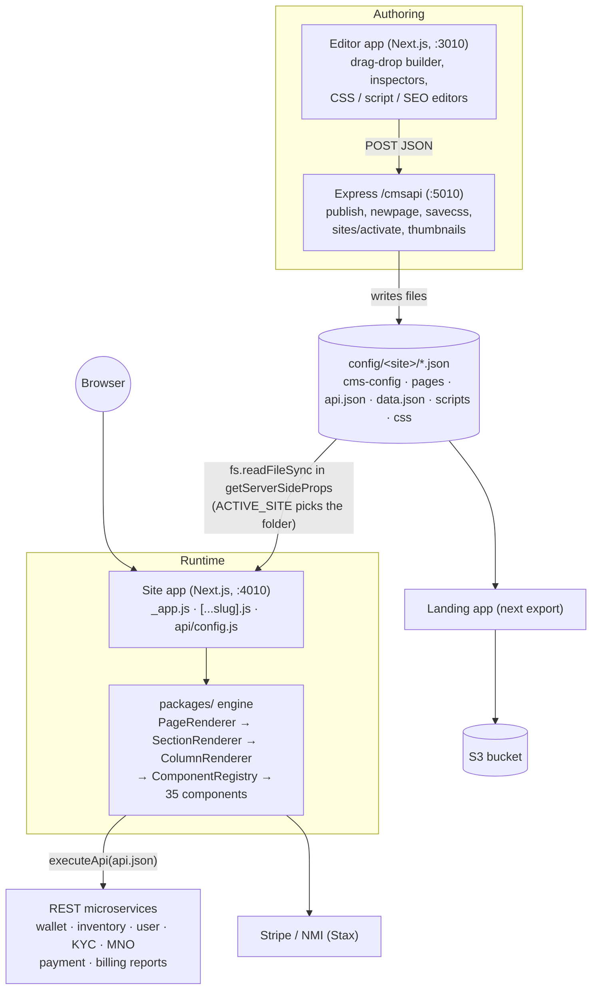

---

## 6. Flowcharts — every important flow

### 6.1 Dev start-up & site selection

Why it matters: **one Next server can only render one site**, because `next.config.js`
resolves the `@/config` webpack alias to `config/${ACTIVE_SITE}` once at start-up.

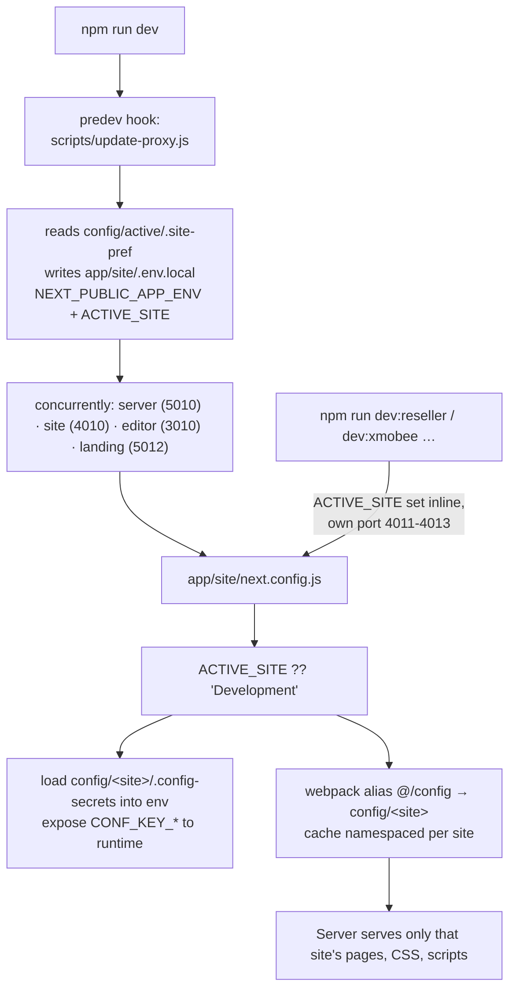

### 6.2 Page request lifecycle (SSR)

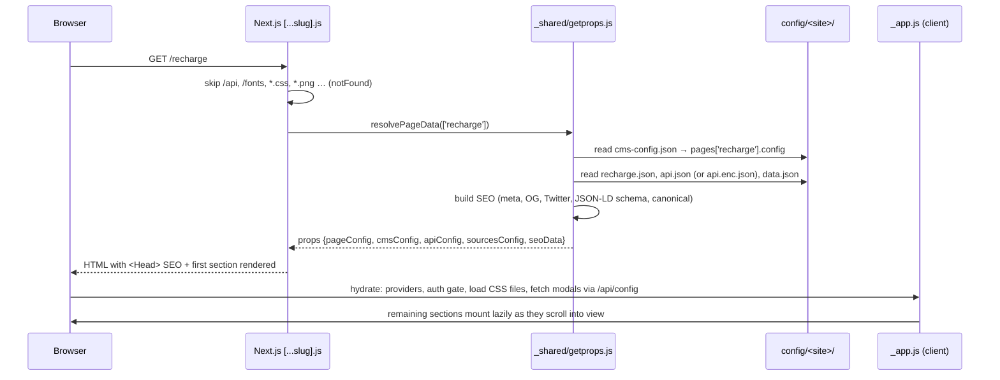

### 6.3 Provider tree (what wraps every page)

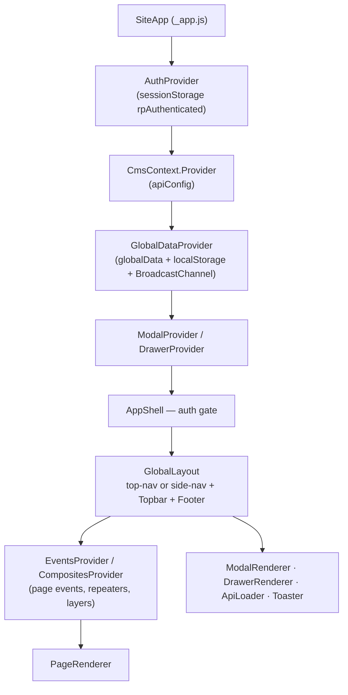

### 6.4 JSON → React rendering pipeline

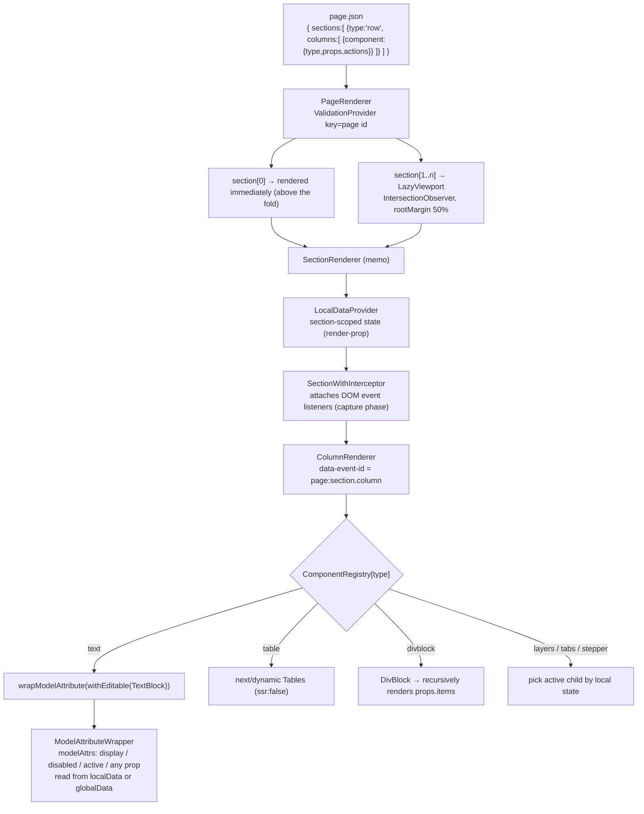

### 6.5 Event → action chain (the heart of the engine)

A component never has an `onClick` written in JS. It has `"actions": { "click": "doLogin" }`,
and the page's `events.doLogin` is an array of steps.

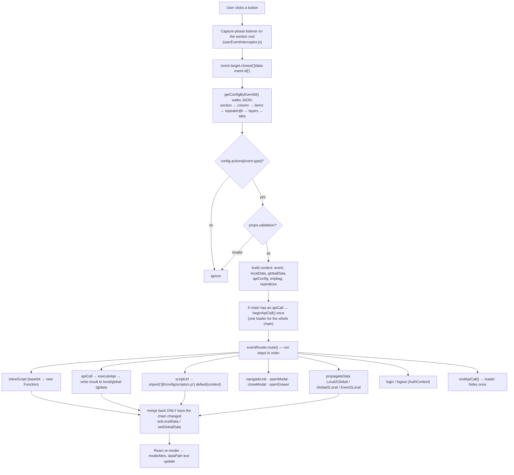

### 6.6 `executeApi` — one generic HTTP layer

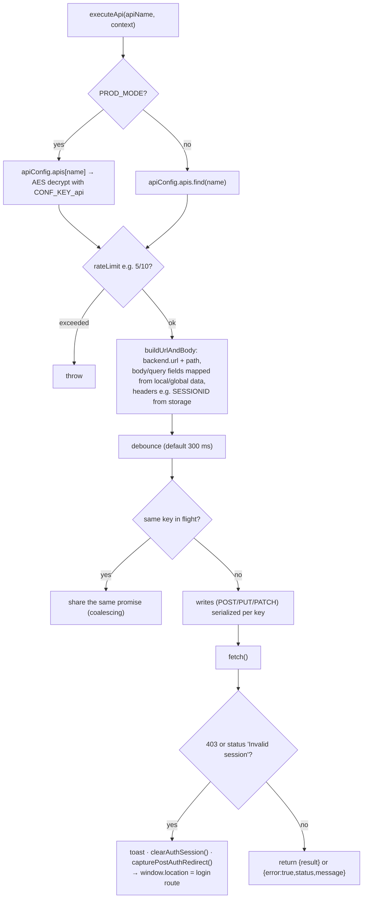

### 6.7 Reseller login flow

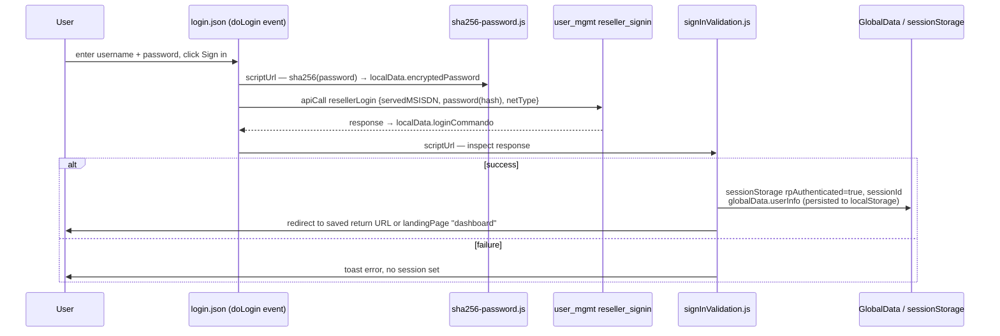

### 6.8 Config-driven auth gate (`AppShell` in `_app.js`)

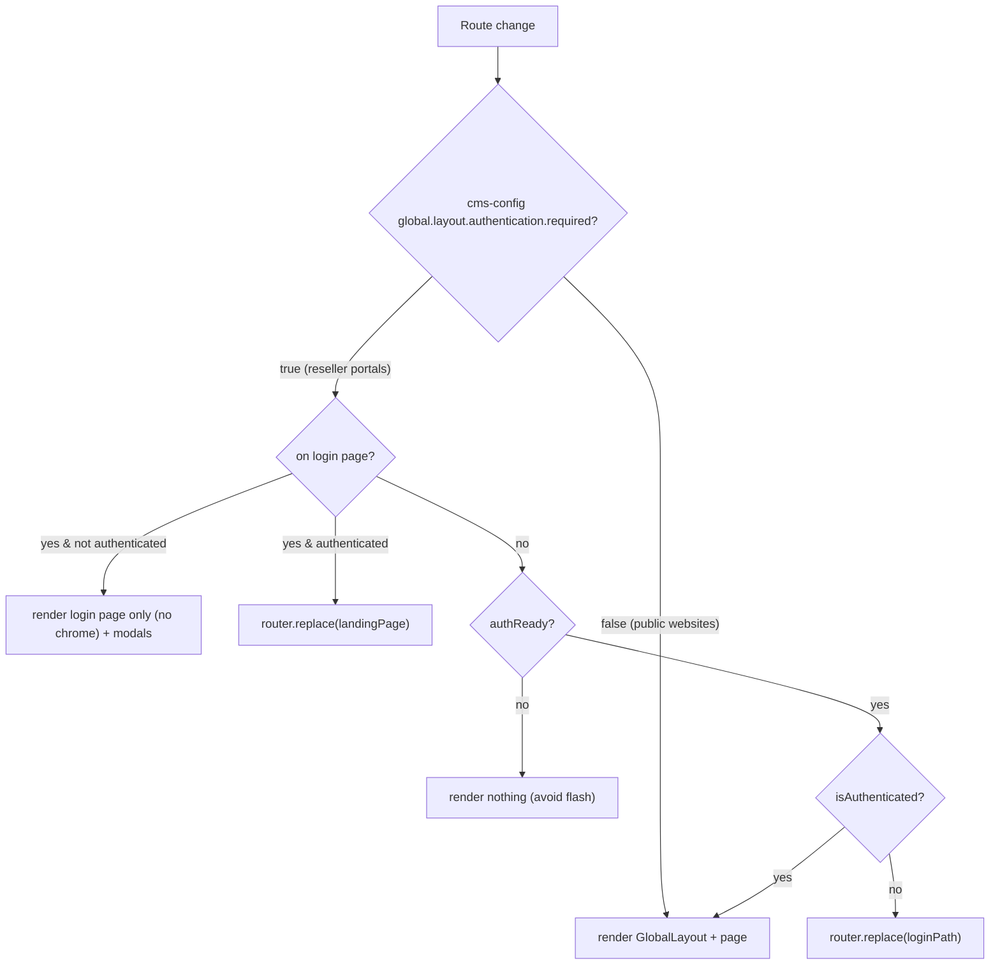

### 6.9 Global data & localStorage persistence

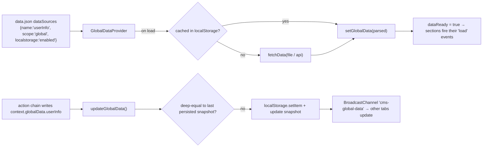

### 6.10 Modals & drawers (lazy-loaded config)

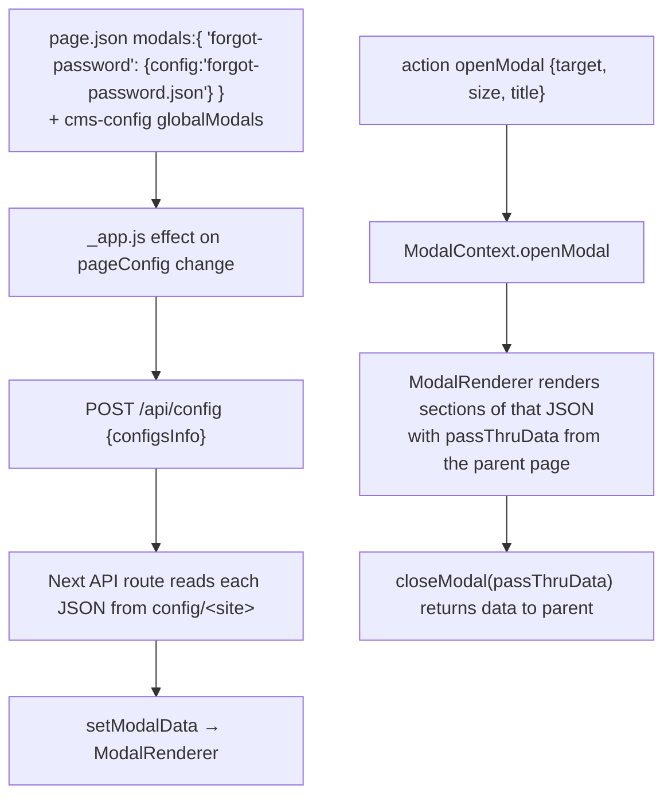

### 6.11 Light / dark theme

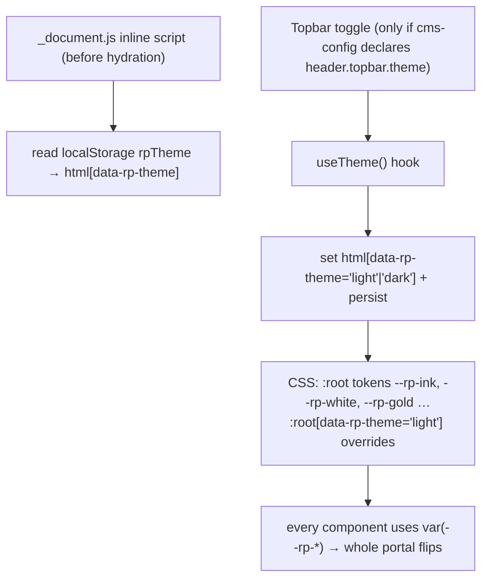

### 6.12 Editor → publish

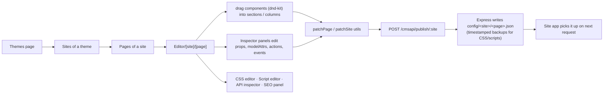

### 6.13 Build & deploy

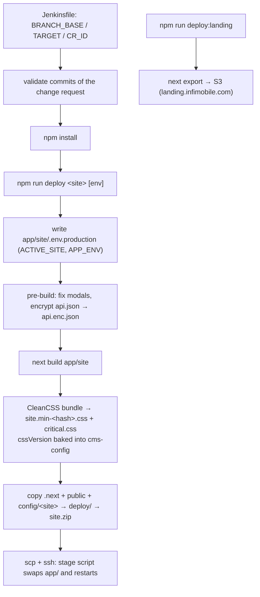

---

## 7. React & Next.js concepts → where they are in this code

| Concept | Where / how it is used |
|---|---|
| **Component composition / recursion** | `DivBlock` renders `props.items`, each item goes back through the registry — the whole page is a recursive tree |
| **Registry / factory pattern** | `ComponentRegistry.js`: `type` string → component. `ComponentGuardRegistry` for the editor |
| **Higher-Order Components** | `wrapModelAttribute(C)` (data-bound props), `withEditable('text', C)` (inline editing in the editor) |
| **Render props** | `LocalDataProvider` takes `children(localData)` |
| **Context API** | `CmsContext`, `GlobalDataContext`, `LocalDataContext` + separate `LocalDataActionContext` (split state/setter to reduce re-renders), `AuthContext`, `ModalContext`, `DrawerContext`, `EventsContext`, `CompositesContext`, `ValidationContext` |
| **Custom hooks** | `useEventRouter`, `useEventInterceptor`, `useApiLoading`, `useCssFiles`, `useTheme`, `useBreakpoint`, `useTableFilters`, `useRepeaterItems`, `useTextValidator` |
| **`React.memo`** | `SectionRenderer` is memoised |
| **`useRef` for latest state** | interceptor keeps `localDataRef/globalDataRef` so async chains read fresh values without re-attaching listeners |
| **`key` to reset state** | `<ValidationProvider key={id}>` remounts on page change so stale validators don't leak |
| **`React.cloneElement`** | `ModelAttributeWrapper` injects `style`, `disabled`, `className` into the child |
| **`flushSync`** | used in the API executor/interceptor where a state write must be committed before the next step |
| **Code splitting** | `next/dynamic` with `ssr:false` for Tables, Charts, Carousel, Accordion, TestimonialMarquee; scripts are lazy `import()` chunks, prefetched in parallel at chain start |
| **Lazy rendering** | `LazyViewport` (IntersectionObserver) mounts below-the-fold sections on scroll |
| **SSR** | `getServerSideProps` in `[...slug].js` reads JSON with `fs` and builds SEO props |
| **Next API route** | `pages/api/config.js` returns modal/drawer JSON on demand |
| **`_document.js`** | blocking inline theme script (no flash of wrong theme), critical CSS inlined in `<head>` |
| **`next/script`** | analytics, Meta pixel, Front chat, Stripe loaded by `externalScripts` flags |
| **Static export** | `landing`, `blog-site`, `blog-admin` use `next export` / `output:'export'` |
| **Controlled inputs + two-way binding** | `model` prop on TextBox/Select/OptionGroup writes to local/global data (`ModelBinding.jsx`) |
| **Event delegation** | one capture-phase listener per section instead of one handler per component |
| **Error handling** | API errors returned as values `{error:true}`, surfaced as `context.error`; toasts via `sonner` |
| **Accessibility / responsive** | Bootstrap grid, `useBreakpoint`, mobile nav vs side nav, `responsive-base.css` |

---

## 8. Real problems I solved (STAR stories)

Use these as "tell me about a hard bug" answers. All are real, from this repo.

1. **Dashboard KPIs shimmering forever after reload — localStorage race.**
   *S:* After login the dashboard worked, but a hard reload made every KPI show an infinite skeleton.
   *T:* Find why `userInfo.resellerId` disappeared on reload.
   *A:* Traced `GlobalDataProvider`: an effect re-ran on every navigation and overwrote the
   "already persisted" snapshot with current state, so `updateGlobalData()`'s deep-equal check
   thought the value was saved and skipped `localStorage.setItem` permanently. Removed that
   overwrite so only a real successful write updates the snapshot; also registered
   `walletBalanceText` as a persisted source.
   *R:* Reloads keep the session data; every localStorage-backed source on all sites fixed.

2. **Checkbox that could never be un-ticked — stale snapshot merge.**
   The interceptor runs in the **capture** phase and awaits the action chain; the checkbox's own
   `onChange` model write happens later (bubble phase). The chain then merged its whole stale
   `localData` snapshot back, reverting the value. Fix: snapshot keys at chain start and merge
   back **only keys the chain actually changed**. Engine-wide fix.

3. **Loader flickering on every API call.** Each `apiCall` has a 300 ms debounce but the loader
   had a 250 ms hide-grace, so sequential calls hid/showed it between each. Fix: bracket the whole
   event chain with one `beginApiCall/endApiCall` when it contains an `apiCall`. Verified: one
   show, one hide across 6 chained calls.

4. **In-table action buttons did nothing.** `Tables.jsx` looked up `btn.actionName` directly in
   `events` instead of first resolving through the component's `actions` mapping. Fixed with a
   fallback so old configs still work.

5. **Light theme for a dark-only portal.** Added `useTheme` hook, a pre-hydration script in
   `_document.js`, and light values for all `--rp-*` tokens; swept ~130 hard-coded hex colours to
   tokens, but deliberately *not* white text on fixed brand-red buttons. Found `color-scheme: dark`
   forcing dark native inputs, and a stale rule inlined via `critical.css` beating normal CSS.

6. **Empty 600px gap at the bottom of every page.** `LazyViewport` kept its placeholder
   `minHeight` after content mounted, and an empty footer still rendered. Fixed both generically.

7. **Deploy silently failing.** A stray `};` made CleanCSS warn; the compressor treats warnings
   as fatal, so no zip was produced and a stale `site.zip` stayed around. Fixed CSS in two sites,
   also made `robots.txt` and `.env.production` actually ship.

---

## 9. Interview questions with answers from this project

**Q1. Why is the whole site configuration-driven?** Four sites for two brands share 90% of
behaviour. JSON pages let us add or change pages without redeploying engine code, let a
non-developer use the visual editor, and keep one engine to test and fix.

**Q2. How does a JSON `type` become a component?** `ColumnRenderer` looks up
`ComponentRegistry[component.type]` and renders it with `config`, `data` (localData) and
`actions`. Container components like `divblock` recurse into `props.items`.

**Q3. How do you handle events without writing handlers?** One capture-phase listener per
section (`useEventInterceptor`). It finds the nearest `data-event-id`, resolves the JSON node with
`getConfigByEventId`, reads `actions[event.type]` and runs the named event's steps via
`useEventRouter`.

**Q4. Why capture phase?** So validation and chain orchestration can run before component-level
bubble handlers; it is also why same-dispatch writes needed the "merge only changed keys" fix.

**Q5. Local vs global data?** `localData` lives per section (`LocalDataProvider`), reset on page
change — form fields, API results for that section. `globalData` is app-wide
(`GlobalDataProvider`) — user info, plans, cart, wallet — optionally persisted to
`localStorage` and synced between tabs with `BroadcastChannel`.

**Q6. How do conditional show/hide work?** `modelAttrs` in JSON, e.g.
`"display": {"scope":"global","model":"transactionToken","defval":""}`.
`ModelAttributeWrapper` reads the value and injects `style.display` etc. with `cloneElement`.

**Q7. How are API calls made?** Never raw URLs. `api.json` declares backends and APIs with body
field mappings. `executeApi` builds URL/body/headers, then applies rate-limit, debounce,
in-flight coalescing and write serialization, and handles session expiry centrally.

**Q8. How is `api.json` protected in production?** It is AES-encrypted to `api.enc.json` at build
time; at runtime each API definition is decrypted with `CONF_KEY_api` only when used.

**Q9. How does auth work?** Two modes. Public sites: modal login, gate only on actions.
Portals: `authentication.required: true` → `AppShell` blocks every route except login until
`sessionStorage.rpAuthenticated` is true. `SESSIONID` header is forwarded from storage. On 403 /
"Invalid session", `executeApi` clears the session, remembers the current URL, redirects to login,
and after login the user returns there.

**Q10. How do you avoid layout flash / hydration mismatch with auth?** `authReady` flag: render
`null` for protected pages until client auth state is known; the login page itself renders on SSR.

**Q11. How do you improve performance?** Only section 0 renders eagerly; the rest use
IntersectionObserver. Heavy widgets are `next/dynamic` with `ssr:false`. Scripts are lazy chunks
prefetched in parallel. Critical CSS inlined, main CSS bundled + gzipped with a content hash for
cache busting. API debounce and coalescing avoid duplicate requests.

**Q12. How is SEO handled?** `getServerSideProps` builds title, description, canonical, Open
Graph, Twitter tags and JSON-LD (`WebPage`, `FAQPage`, `Article`) from page JSON or auto-generated
from content; `sitemap.xml.js` generates a sitemap.

**Q13. How do modals get their content?** Page JSON lists modal configs; `_app.js` POSTs to
`/api/config` to fetch them after navigation; `openModal` actions show them via `ModalContext`,
passing `passThruData` both ways.

**Q14. How do you theme four sites?** Per-site CSS files listed in `cms-config.cssFiles` and
loaded by `useCssFiles`; colours are CSS custom properties so a palette change is one place;
light/dark via `data-rp-theme` attribute on `<html>`.

**Q15. What's the hardest part of a config-driven UI?** Debuggability — a typo in a JSON
`dataPath` just silently shows nothing. My checklist: does the field exist in the live response,
did the API fire, is the data actually in state when read.

**Q16. How do you run multiple sites locally?** `npm run dev:reseller`, `dev:xmobee`,
`dev:xmobee-reseller` each start their own server on their own port with `ACTIVE_SITE` set,
because the webpack alias is fixed at start-up.

**Q17. How do forms validate?** Components register validators in `ValidationProvider`; a button
with `props.validation` triggers `runValidations()` before its chain runs; `useTextValidator`
checks required, min length, a custom regex `pattern`, and password rules (upper/lower-case,
number, special character).

**Q18. How are payments integrated?** Stripe embedded checkout (`StripeCheckout`,
`StripePayment`) and NMI/Stax (`StaxCollectPayment`: card, ACH, Apple Pay, Google Pay, 3-D Secure,
Kount fraud session id). Tokens come back as DOM events and are handed to the backend charge API.

**Q19. What React anti-patterns did you have to fix?** Hooks called conditionally in `AppShell`
(fixed by always computing values); spreading a stale snapshot over newer state; effects that
re-ran on every navigation because a prop was a fresh object each page.

**Q20. What would you improve?** TypeScript + a JSON Schema for page configs (catch typos at
build time), unit tests for the engine hooks, React Query-style caching instead of hand-rolled
maps, moving secrets out of source, a per-site CI pipeline, and the App Router with server
components for the marketing pages.

**Q21. How is state shared between browser tabs?** `BroadcastChannel('cms-global-data')` —
persisted sources broadcast updates so a second tab updates wallet/user info immediately.

**Q22. What is `propagateData`?** A step that copies a value Local→Global, Global→Local or from a
custom DOM event's `detail` into local data — how sections and modals share results.

**Q23. How do repeated lists work?** `repeater` templates + `useRepeaterItems`; event ids carry
the index (`plan@2`) so a click resolves to the right item and `repindices` go into context.

**Q24. Multi-step flows?** `layers`, `tabs` and `stepper` components show one child at a time
based on local state; `getConfigByEventId` knows how to walk into the active layer/tab.

**Q25. How do you make sure a shared-engine fix doesn't break another site?** Audit every site's
JSON for the pattern (e.g. counted all 693 `modelAttrs` before making global scope work), keep old
behaviour as a fallback, and verify on each site's dev server.

---

## 10. How to run

```bash
cd ~/june-24/arya-cms/jc-cms
npm install
npm run dev                  # server 5010 + site 4010 + editor 3010 + landing 5012
npm run dev:reseller         # reseller portal on 4011
npm run dev:xmobee           # 4012
npm run dev:xmobee-reseller  # 4013
npm run build                # production build of app/site for ACTIVE_SITE
npm run deploy reseller      # build + package → site.zip
```

If you see `Cannot find module './x.json'` for a file that exists, the server is compiled for a
different site — check `config/active/.site-pref` and `app/site/.env.local` agree, restart, and
delete `app/site/.next` if needed.

---

## 11. Glossary

| Term | Meaning |
|---|---|
| Site | A folder under `config/` — one website or portal |
| Theme (editor) | A brand grouping of sites (`config/themes/infimobile.json`) |
| Section / column / component | The three levels of a page JSON |
| Event | Named array of actions in a page's `events` |
| Action | One step: `apiCall`, `scriptUrl`, `inlineScript`, `navigateLink`, `openModal`, `propagateData`, `login`, `logout` … |
| `modelAttrs` | JSON-declared bindings that set display/disabled/active/props from data |
| `dataPath` / `model` | Where a component reads / writes its value |
| Layers | A set of alternative panels, one visible at a time (multi-step pages) |
| `ACTIVE_SITE` | Env var choosing which `config/<site>` a server renders |
