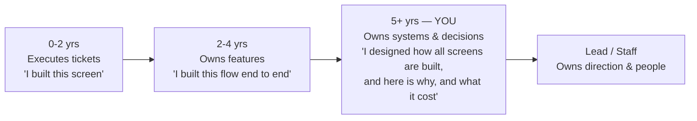
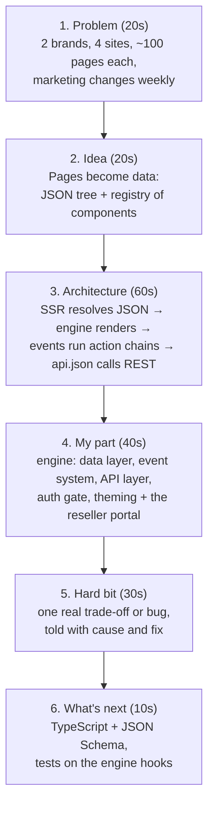
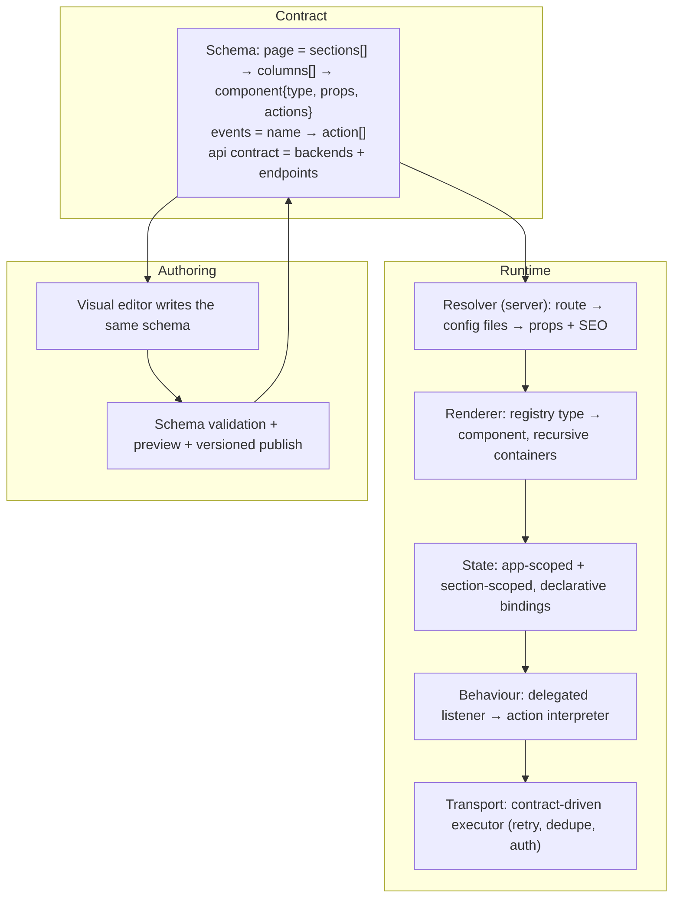
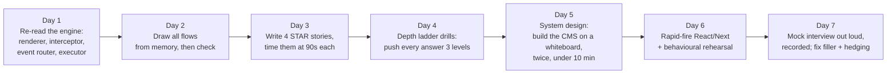

# How to Handle This Interview With 5 Years of Experience

A senior-leaning UI developer is not judged on "do you know React" — that is assumed. At 5 years
you are judged on **ownership, depth, trade-offs, and impact**. This page is the playbook for
presenting Arya CMS (`jc-cms`) at that level: what to claim, how deep each answer must go, the
stories to tell, the questions you will get back, and what to prepare in the last week.

> Companion pages: [the full project guide](00-interview-guide.md) ·
> [all projects](projects/README.md)

---

## 1. What 5 years means to the interviewer

At 5 years they expect four things in every answer:

| They listen for | Weak (2-yr) answer | Your answer |
|---|---|---|
| **Scope** | "I worked on the reseller dashboard." | "I own the shared rendering engine that four production sites are built on, plus the reseller portal built on top of it." |
| **Why** | "We used Context." | "We split state into global and per-section contexts, and split state from setters, because every keystroke otherwise re-rendered the whole page tree." |
| **Cost** | "It works." | "It cost us debuggability — a typo in a JSON path fails silently — so I added a fixed triage checklist and I would add JSON Schema validation next." |
| **Impact** | "I fixed a bug." | "A reload lost the session data, so every KPI hung on a skeleton; the fix was in the shared provider and fixed that class of bug for every localStorage-backed field on all four sites." |

**The one-line frame to open with:** *"I'm the engineer for a config-driven UI platform — one React
engine, four production sites, two brands — and most of my work is in the engine, so a fix or a
feature lands on all four sites at once."*

---

## 2. Your positioning: numbers to have on the tip of your tongue

| Fact | Number |
|---|---|
| Sites rendered by one codebase | **4** (InfiMobile & Xmobee websites, two reseller portals), **2 brands** |
| Code projects in the repo | **7** (5 Next.js apps, 1 Express API, 1 shared engine) |
| Shared engine | ~**174** component files, **24** hooks, ≈**35** registered component types |
| Total JS/JSX | ≈**39.5k** lines across apps + engine |
| Page configs | **96 / 39 / 97 / 53** pages per site, plus 39-58 modals each |
| API surface | **100-116** endpoint definitions per site, 22-25 backends |
| Per-site scripts | ~**215-225** small ES modules driven by config |
| Repo history | ≈**2,400** commits |

Do not recite the table. Use one number per claim: *"about 35 component types cover 96 pages on
the main site — that ratio is the whole argument for the config-driven approach."*

---

## 3. Resume / CV bullets (copy these)

- Built and own a **JSON-configuration-driven UI engine** (React 18, Next.js 14) that renders
  **4 production telecom sites across 2 brands** from one codebase — ~35 reusable components and a
  declarative event/action system replace hand-coded pages.
- Designed the **runtime data layer**: global + per-section React contexts with opt-in
  `localStorage` persistence and cross-tab sync via `BroadcastChannel`; fixed a persistence race
  that silently dropped session data on reload across every site.
- Built a **generic API execution layer** driven by a per-site `api.json` contract — URL/body/header
  mapping, debouncing, in-flight coalescing, write serialization, rate limiting, and centralized
  session-expiry handling with return-to-page redirect.
- Implemented a **config-driven page-level auth gate** reusable by any tenant (`authentication.required`),
  removing hardcoded login/dashboard routes from engine code.
- Delivered a **reseller portal** (dashboard, single and bulk SIM activations, stock requests,
  staff/retailer management, wallet and commission reports) entirely as configuration on that engine.
- Shipped a **light/dark theme system** using CSS custom-property tokens with pre-hydration theme
  application (no flash), opted into per site from config.
- Improved perceived performance: viewport-lazy section mounting, `next/dynamic` for heavy widgets,
  critical-CSS inlining, and a single loading overlay per event chain instead of one per API call.
- Hardened the **build/deploy pipeline** (CleanCSS bundling with content-hash cache busting,
  encrypted API config, packaging fixes that were silently dropping files from the release zip).

---

## 4. The 3-minute project walkthrough (rehearse out loud)

Script for step 3, word for word:

> "A request hits one catch-all route. `getServerSideProps` reads that site's `cms-config.json`,
> finds the page's JSON file, loads it with the API contract and the data-source manifest, builds
> the SEO tags, and returns it all as props. On the client, `PageRenderer` walks
> sections → columns → components; a registry maps each `type` string to a React component, and
> container components recurse into their children. Nothing has an `onClick` in code — a component
> declares `actions: { click: 'doLogin' }`, and the page's `events.doLogin` is an ordered list of
> steps like hash the password, call this API, run this script. One capture-phase listener per
> section catches the DOM event, finds the JSON node, and runs that chain."

---

## 5. Depth ladder — how far each topic must go at 5 years

For every row: they will ask the surface question, then push. Be ready for the third column.

| Topic | Surface answer | Where they push, and what you say |
|---|---|---|
| **Context API** | "We use Context for global and local data." | "Context re-renders every consumer on any change. We split `LocalDataContext` from `LocalDataActionContext` so components that only write don't re-render when the data changes, and section state is scoped to a section rather than the page. If a page grew hot, the next step is a selector-based store (Zustand/`useSyncExternalStore`) — Context is a dependency-injection tool, not a performance-optimised store." |
| **Re-render control** | "`React.memo` on SectionRenderer." | "`memo` only helps if props are stable — our section config objects come from props, so they're referentially stable per page; but `sourcesConfig` was a fresh object each navigation, which re-ran an effect and caused a real persistence bug. Identity, not just value, is what you must reason about." |
| **useEffect** | "For data loading." | "Effects that depend on freshly created objects re-run every render/navigation. We also avoid conditional hooks — the auth gate computes its route unconditionally and decides afterwards, because hook order must not vary between renders." |
| **Stale closures** | "Use refs." | "The interceptor holds `localDataRef/globalDataRef` updated on every render, so an async chain reads current values without re-subscribing DOM listeners. But refs don't fix ordering: our chain ran on capture phase and the input's own `onChange` ran later on bubble, so merging the whole snapshot back reverted the user's change — the fix was diffing and merging only the keys the chain touched." |
| **SSR/hydration** | "Next.js does SSR." | "Anything that depends on browser-only state (`sessionStorage` auth, theme) must not render differently on server and client. We gate protected pages on an `authReady` flag and render `null` until we know, and apply the theme in a blocking script in `_document` before hydration so there's no flash and no mismatch." |
| **Code splitting** | "`next/dynamic`." | "Tables, Charts, Carousel and Accordion are `ssr:false` dynamic imports because they're heavy and below the fold; per-site scripts are lazy `import()` chunks. We also prefetch every script in a chain in parallel when the chain starts, because a cold import used to resolve *after* the API result it depended on." |
| **Rendering perf** | "Lazy load." | "Only the first section renders eagerly; the rest mount on IntersectionObserver with a 50% root margin. The placeholder `minHeight` must be released once mounted, otherwise you reserve dead space forever — that was a real bug." |
| **Network layer** | "We call fetch." | "One executor: config-driven URL/body/header mapping, 300ms debounce, in-flight coalescing on a method+URL+body key, serialization of writes, rate-limit windows, errors returned as values rather than thrown, and one central place that detects 403/'Invalid session', clears the session, remembers the URL and redirects to login." |
| **Auth** | "sessionStorage flag." | "That's the client gate — it prevents anonymous navigation and flashing protected chrome. Real authorisation is server-side: every call carries `SESSIONID` and the backend rejects it. I'd be explicit in the interview that a client flag is UX, not security." |
| **Security** | "We don't store secrets." | "The API contract is AES-encrypted at build time and decrypted per definition at runtime with a key from env. Passwords are SHA-256 hashed client-side *in addition to* TLS, not instead of it. And I'd call out the debt: credentials that shouldn't be in source, which belong in env/IAM." |
| **CSS at scale** | "We use tokens." | "28+ `--rp-*` custom properties, light values under `[data-rp-theme='light']`. The traps I hit: `!important` beats specificity so a themed override silently loses; `color-scheme: dark` restyles native controls with no author rule to grep for; and a stale rule inlined in generated `critical.css` beats your stylesheet — if a rule is *absent* from `document.styleSheets` rather than overridden, suspect a broken comment." |
| **Testing** | "We test manually." | Don't stop there: "The engine's pure parts — `getConfigByEventId`, `readData`, the changed-key diff, `buildUrlAndBody` — are perfect unit-test targets and that's the gap I'd close first, then a couple of Playwright journeys for login → dashboard and checkout. I've been verifying with headless browser scripts, which is a symptom of that missing layer." |

---

## 6. Senior-level STAR stories (four, with impact framed)

Pick two or three; don't tell all four. Every one ends with *what it changed beyond the bug*.

**A. The silent data loss (debugging depth).**
*Situation:* Reseller dashboard KPIs worked after login but hung on a loading shimmer after a
page reload. *Task:* Nobody could tell whether it was the API, the config or the UI.
*Action:* Ruled it out layer by layer — confirmed the field names against the live API response,
confirmed the call fired, then found the data was missing from React state on reload. Root cause
was in the shared global-data provider: an effect re-ran on every navigation and overwrote the
"last persisted" snapshot, so a deep-equality check concluded the value was already saved and
skipped the actual `localStorage` write forever. *Result:* One-line class of fix in the provider
restored persistence for **every** localStorage-backed field on all four sites, and I registered
another field that had never been declared as persistent. I also wrote down a three-step triage
order for "value never resolves" so the next person doesn't re-derive it.
*Senior lesson to say out loud:* "Shared-state caches must have exactly one writer. Two code paths
updating the same bookkeeping is how you get a bug that only appears on reload."

**B. The checkbox that couldn't be unticked (systems thinking).**
A checkbox could be ticked once, never unticked. Cause was ordering, not logic: the engine's event
interceptor runs on the **capture** phase and awaits an async chain, while the component's own
model write happens later on the **bubble** phase — so the chain merged its stale snapshot over the
newer state. *Result:* Changed the merge to diff and apply only the keys the chain actually
changed. This was an engine fix affecting every component that has both a data binding and a click
action; I also removed the redundant action from the config, since the binding already recorded the
value — and made that a convention: *don't add an action just to record an input's own value.*

**C. Light theme on a dark-only product (scoping and saying no).**
The ask was "add light mode". Instead of patching each reported element, I tokenised the palette,
added light values in one block, and swept ~130 hardcoded colours with a script — but deliberately
**not** white text on permanently-red buttons, because that text is correct in both themes. That
judgement call is the answer to "how do you decide the boundary of a refactor": *convert what is
theme-reactive, leave what is brand-fixed, and write down the rule so the next sweep doesn't
over-apply.*

**D. The deploy that shipped nothing (ownership beyond your layer).**
A stray `;` in a CSS file made the minifier emit a warning; the compressor treats warnings as fatal
and exits, so no new zip was produced — and because the failure skipped cleanup, a stale zip from
an earlier build stayed in place and looked shippable. *Result:* Fixed the CSS in two sites, then
audited what the package actually contained versus what the app needs — found `robots.txt` and a
production env file that were never being shipped, and a dev-only symlink that made a missing asset
folder look fine locally while 404ing in production. *Lesson:* "Verify the artifact, not the
build log."

---

## 7. Architecture questions you will get at this level

**"Design this from scratch — how would you build a config-driven CMS?"**
Draw this, then talk through the numbered decisions:

Decisions to defend: (1) **interpreter over code generation** — configs are data you can validate,
diff and publish without a build; (2) **escape hatch on purpose** — a `scriptUrl` step runs real
JavaScript, because pure config never covers the last 10%; (3) **contract for the network** so
backend changes don't touch React; (4) **versioned publish with validation**, which is the part we
under-invested in and the first thing I'd add.

**"Where does this architecture break?"** Be honest and specific: debuggability (silent failures on
a mistyped path), no compile-time safety, large page JSON files (one is 527 KB — you `grep` for an
anchor string instead of opening it), an event resolver that must understand every container type
(repeaters, layers, tabs each needed special handling), and config drift between sites that only a
side-by-side diff catches.

**"How would you migrate to the App Router / Server Components?"**
"Marketing pages first — they're content-only, so server components cut client JS with no behaviour
change. The portals stay on the client for a long time: the whole engine is event- and state-driven.
I'd do it per route group, keep the same config schema, and measure bundle size before and after
rather than migrating for fashion."

**"How do you add a fifth site?"** "Create `config/<site>/`, declare pages, the API contract and the
data sources, set the layout and auth flags — and ideally ship nothing in `packages/`. When a new
site *does* need engine code, that's my signal something site-specific leaked into the engine, like
the hardcoded route names I pulled out into per-instance props."

**"How would you scale the team on this?"** "Schema validation in CI so a bad config can't merge, a
component catalogue with prop docs, ownership split between engine and site configs, and a
convention doc — most of our recurring bugs were conventions people couldn't have known."

---

## 8. Behavioural questions — the 5-year versions

| Question | Frame to use | Concrete hook from this project |
|---|---|---|
| "Tell me about a technical decision you made." | Decision → alternatives → constraint that decided it → what it cost | Auth gate as config vs. per-site code; cost is that a client flag is UX-only, so the backend must still enforce |
| "A disagreement with a teammate or PM." | Disagree on approach, align on outcome, make the trade-off visible | A "rebuild the login page as a new React + Tailwind app" request: I proposed rebuilding it inside the existing engine instead — same visual result, no second stack to maintain, and the real wiring (hashing, API, session) stayed untouched |
| "Something you shipped that broke." | Own it, explain detection, explain the systemic fix | The loader flicker / stale-zip deploy: fixes were "make the bad state impossible", not "be more careful" |
| "How do you review code?" | Correctness → data flow → identity/ordering → conventions → tests | I look for shared state with two writers, effects depending on fresh objects, `!important` added to win a cascade fight instead of fixing specificity |
| "How do you mentor?" | Write the rule down where it will be found | I keep a running conventions + gotchas log in the repo, so "why doesn't my themed override apply" is answered before it's asked |
| "How do you estimate?" | Split known from unknown, timebox the unknown | Porting a feature between the two portals: the copy is hours, the divergence audit is the risk — so I diff configs and scripts first, then estimate |
| "Working with backend?" | Contract-first | Field names are checked against the live response, not assumed; several "UI bugs" were fields the backend never returned, which I raised as a product gap rather than faking |
| "Priorities with a deadline?" | Cut scope, not correctness | Ship the theme tokens sitewide (one place) before chasing individual reported elements |

---

## 9. Rapid-fire knowledge they still spot-check (answer in one or two sentences)

- **`useMemo` vs `useCallback` vs `memo`** — value, function identity, component; all three are only
  useful when identity stability actually feeds a comparison somewhere downstream.
- **Why keys matter** — reconciliation identity; index keys corrupt state in reorderable lists. We
  also use `key` deliberately to *force* a remount (`ValidationProvider key={pageId}`) so stale
  validators don't leak across pages.
- **Strict mode double-invoke** — effects run twice in dev; effects must be idempotent, which is
  exactly why an effect that overwrote a persistence snapshot was dangerous.
- **`flushSync`** — commits state synchronously when the next step in an imperative chain must see
  it; used sparingly in the executor because it forces a synchronous re-render.
- **Event delegation** — one listener per section instead of hundreds; capture vs bubble decides
  who runs first, which caused a real ordering bug.
- **Debounce vs throttle** — debounce waits for quiet (our 300 ms API debounce and typing commits),
  throttle caps rate.
- **SSR vs SSG vs ISR** — our portals are SSR (per-user, auth-gated), landing/blog are static
  exports (campaign and content pages, cheap and CDN-friendly).
- **Deep vs shallow equality** — we use `fast-deep-equal` before writing to `localStorage`; the cost
  is that a wrong "already equal" conclusion silently skips the write, which is what bit us.
- **Error handling** — the executor returns `{error: true}` instead of throwing so a chain can
  branch; a thrown error in an async chain is easy to swallow.
- **Accessibility** — the honest answer: semantic elements and Bootstrap defaults, but a
  config-driven engine makes it a *platform* opportunity — enforce labels and focus order in the
  component layer once and every page inherits it. Say that; it scores well.

---

## 10. Questions to ask them (a 5-year candidate is expected to interview back)

1. Who owns the platform layer versus feature teams here, and how are breaking changes coordinated?
2. What does your release pipeline look like end to end, and what's your rollback story?
3. What's the current split of server versus client rendering, and is there an App Router migration
   in flight?
4. How is UI quality enforced — types, schema validation, component tests, visual regression?
5. What is the most painful part of your frontend codebase right now? (Then say how you'd approach it.)
6. What would you want me to have shipped in my first 90 days?

---

## 11. Red flags to avoid

- **Over-claiming.** Say "I own the engine and the reseller portal", not "I built everything".
  If something wasn't verified end to end (a flow that needs a real payment or backend), say so —
  senior engineers distinguish "verified" from "believed correct by construction".
- **Config-driven evangelism.** If you can't name three downsides of your own architecture, you
  sound junior.
- **Blaming tools or people.** "The backend's field was misspelled" is a fact; the senior version is
  "I mapped it, flagged it, and we kept the mapping in one place".
- **Vague performance talk.** Never say "we optimised it" without the mechanism and the observation.
- **Silence on testing.** Don't pretend; name the gap and the plan.
- **Reciting file names.** Names support a point, they aren't a point.

---

## 12. Seven-day prep plan

Daily rule: every answer must end with a **cost or a trade-off**. That single habit is what makes
5 years sound like 5 years.

---

## 13. Live-coding / take-home: what they'd hand you, and how to use this project

| Likely exercise | Use this project to shine |
|---|---|
| "Render this JSON as components" | You've built exactly this — talk registry, recursion, unknown-type fallback, and keys |
| "Build a form with validation" | Controlled inputs, a validation context that components register into, validate-before-submit |
| "Fetch with loading/error/retry" | Debounce, coalescing identical in-flight requests, errors as values, one loading counter for a whole chain |
| "Make this list fast" | Virtualisation or IntersectionObserver mounting, stable identities, split contexts, memo where it's measurable |
| "Add dark mode" | Tokens over per-component colours, pre-hydration script, and the native-control `color-scheme` trap |
| "Review this PR" | Call out two-writer state, effects on unstable deps, `!important` used to win a cascade fight, missing cleanup |

Whatever the task: **narrate the trade-off as you code**. At 5 years, thinking out loud is the
deliverable.
