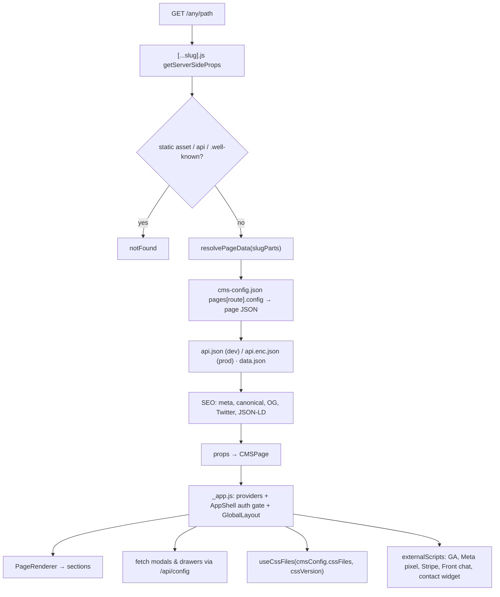

# 1 · Site app — `app/site`

The customer-facing Next.js app. The **same build** renders any of the four sites; which one is
decided by `ACTIVE_SITE` at start-up. This is where the InfiMobile/Xmobee websites and both
reseller portals actually run.

## Facts

| Item | Value |
|---|---|
| Framework | Next.js 14 **pages router**, React 18 |
| Ports | `npm run dev:site` 4010 · `dev:reseller` 4011 · `dev:xmobee` 4012 · `dev:xmobee-reseller` 4013 |
| Pages folder | `_app.js`, `_document.js`, `[...slug].js`, `index.js`, `404.js`, `sitemap.xml.js`, `api/config.js` |
| Data fetching | `getServerSideProps` → `app/_shared/getprops.js` `resolvePageData()` |
| Only API route | `pages/api/config.js` — returns modal / drawer JSON on demand |
| Site selection | `next.config.js`: `ACTIVE_SITE ?? 'Development'` → webpack alias `@/config` |
| Secrets | `config/<site>/.config-secrets` loaded into env; `CONF_KEY_*` exposed for `api.enc.json` decryption |

## Request → page flow

## `_app.js` responsibilities

- Imports Bootstrap CSS and the site's `site-global.css` (via the `@/config` alias).
- Provider tree: `AuthProvider → CmsContext → GlobalDataProvider → Modal/Drawer providers → AppShell`.
- **AppShell** — config-driven auth gate: when `global.layout.authentication.required` is true,
  nothing but the login page renders until `useAuth().isAuthenticated`.
- Lazy loads Bootstrap JS, `sonner` Toaster (`next/dynamic`, `ssr:false`).
- Loads modal configs whenever `pageConfig` changes (page modals merged over `globalModals`).
- Config-driven third-party widgets (Front chat initialised in `onInitCompleted` to avoid a race).

## `_document.js`

- Inlines `critical.css` in `<head>` (built by `scripts/extract-critical-css.js`) to avoid FOUC.
- A blocking inline script applies the saved light/dark theme before hydration.

## Talking points

- "Catch-all route + JSON = no page files per route; adding a page is config only."
- "SSR for SEO, then everything interactive is client-side through the engine."
- "One server = one site, because the webpack alias is resolved once; we run one dev server per site."
- "Protected portals use a generic auth gate; public sites keep modal-only login — same code path."
