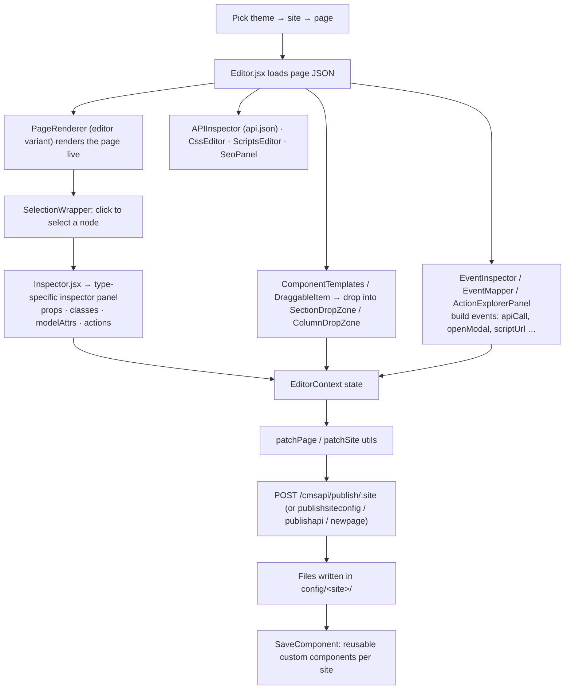

# 2 · Editor app — `app/editor`

A visual, drag-and-drop page builder that edits the same JSON the site app renders.

## Facts

| Item | Value |
|---|---|
| Port | 3010 (`npm run dev:editor`) |
| Key libs | `@dnd-kit/core` (drag-drop), `reactflow` + `dagre` (flow graph), `re-resizable`, `react-json-tree` |
| Components | `packages/components/editor/` (≈38 files, ~6.9k lines) + `packages/components/inspector/` (one panel per component type) |
| Saves through | Express `server/` at `/cmsapi` (port 5010) |

## Pages

| Route | Purpose |
|---|---|
| `/` | Simple login stub (stores a username in localStorage) |
| `/themes` | List brand themes (`config/themes/*.json`) |
| `/sites/[themeName]` | Sites in a theme |
| `/sitepages/[siteName]` | Pages / modals of a site, with thumbnails |
| `/editor/[siteName]/[pageName]` | **Drag-and-drop builder** |
| `/content/[siteName]/[pageName]` | Content-only inline editing (text etc.) |
| `/seo/[siteName]`, `/seo/[siteName]/[pageName]` | SEO audit dashboard, SERP + social previews |
| `/flow/[siteName]` | Page-navigation graph (reactflow) — known stale-path bug |
| `api/editor/page`, `api/seo/save` | Next API routes used by the editor |

## Editing flow

## React concepts to mention

- `withEditable(type, Component)` HOC turns runtime components into inline-editable ones.
- Context (`EditorContext`) for selection + dirty state; debounced inputs (`DebouncedInput`) to avoid
  re-rendering the canvas on every keystroke.
- Same `ComponentRegistry` for editor and site → WYSIWYG, no separate preview implementation.
