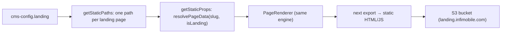

# 3 · Landing app — `app/landing`

Static marketing landing pages built from the same engine and deployed to S3.

## Facts

| Item | Value |
|---|---|
| Port (dev) | 5012 |
| Rendering | `getStaticPaths` + `getStaticProps` in `pages/[...slug].js` → `next export` |
| Source of pages | `cms-config.json` → `landing` map (separate from `pages`) |
| Pages today | Development: `traveller-plan`, `fifa-plan`, `freedom-unlimited-plan`, `cheap-prepaid-unlimited-plan`; Xmobee: 3 |
| Deploy | `npm run deploy:landing` → `scripts/deploy-landing.js` (decrypts AWS creds, exports, uploads to S3) |

## Flow

## Talking points

- "SSG instead of SSR because campaign pages are fully static and need to be cheap and fast."
- "Same JSON + same components as the main site; only the rendering mode differs."
