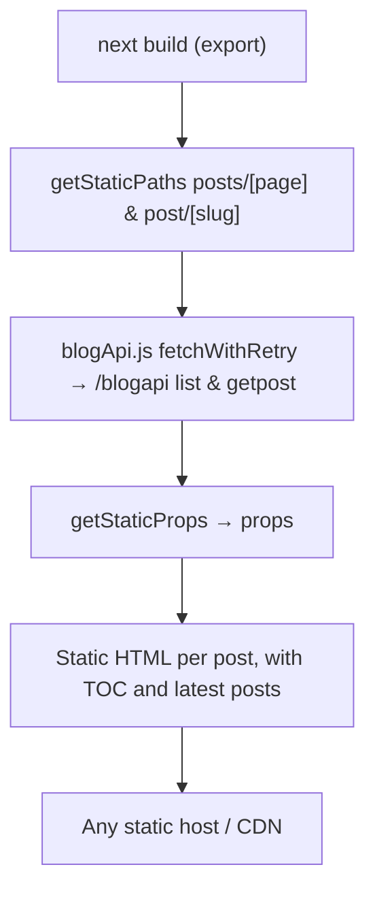

# 4 · Blog site — `app/blog-site`

A static-generated public blog. It borrows the engine's layout (Navbar/Footer/Header, providers)
through webpack aliases so the blog looks like the InfiMobile site.

## Facts

| Item | Value |
|---|---|
| Rendering | `output: 'export'`, SSG (`getStaticPaths` / `getStaticProps`) |
| Routes | `/` (page 1), `/posts/[page]` (9 posts per page), `/post/[slug]` |
| Data | Serverless blog API (AWS API Gateway `/blogapi`), with retry for 5xx (`fetchWithRetry`, 4 attempts, backoff) |
| Components | `BlogList`, `BlogCard`, `BlogContent`, `TableOfContents`, `LatestPosts`, `CommentForm`, `NewsletterSignup` |
| Status | Copied from an older codebase; not wired into root scripts or CI yet (see its README) |

## Flow

## Talking points

- "Retry only on 5xx — a 4xx is a real answer; paging relies on `hasMore`, not the cursor."
- "Static export means no Node server in production, great for SEO and cost."
