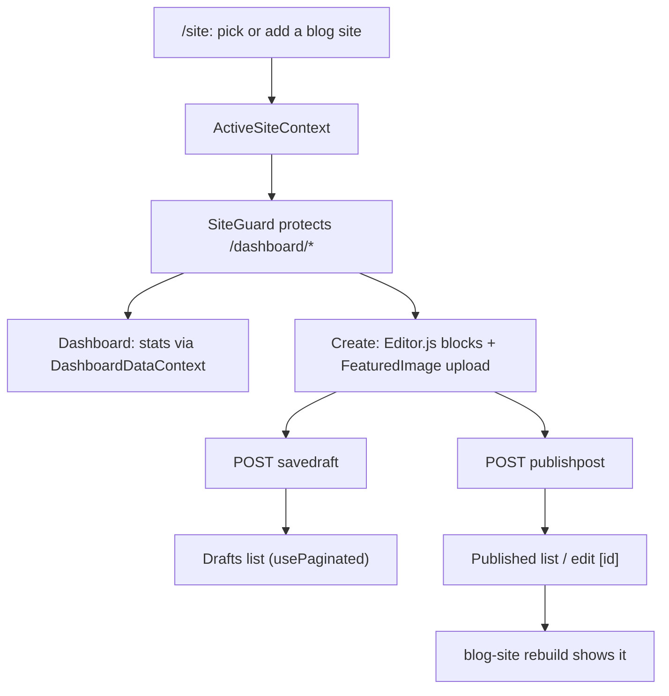

# 5 · Blog admin — `app/blog-admin`

The authoring dashboard for the blog: create drafts, publish, edit published posts, upload
featured images, see stats. Fully standalone (does not use the `packages/` engine).

## Facts

| Item | Value |
|---|---|
| Rendering | `output: 'export'` but **client-rendered** — every page fetches in the browser (SPA once exported) |
| Editor | Editor.js (`@editorjs/editorjs`, header, list, paragraph) in `BlogEditor.jsx` |
| Routes | `/`, `/site` (choose/add blog site), `/dashboard`, `/dashboard/create`, `/dashboard/drafts`, `/dashboard/drafts/[id]`, `/dashboard/published`, `/dashboard/published/[id]` |
| State | `ActiveSiteContext`, `DashboardDataContext`, `SiteGuard` (redirect if no site chosen) |
| Hooks | `useFetch`, `usePaginated` |
| API | `/blogapi` → `site`, `addsite`, `savedraft`, `publishpost`, `getpost/published/:id`, `dashboard/stats`, image upload |

## Flow

