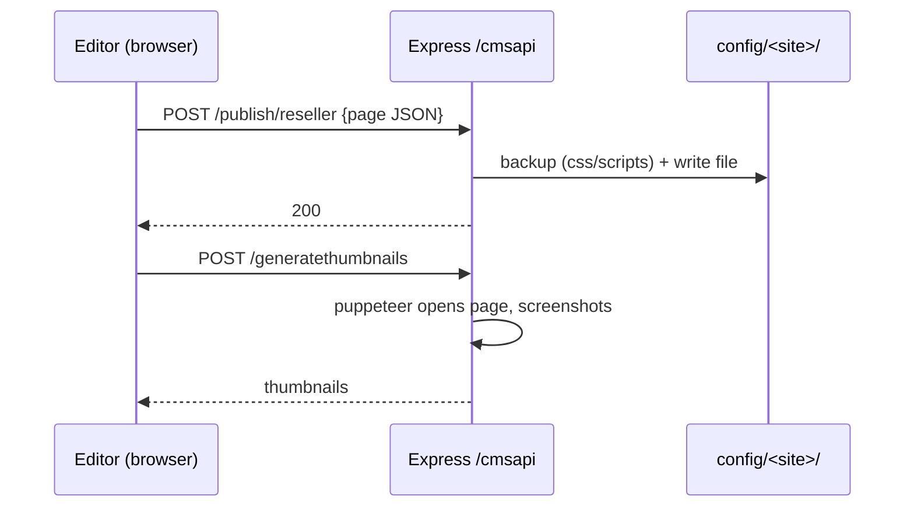

# 6 · CMS server — `server/` (Express)

A small Express 5 API used **only by the editor** to write content back to disk. The public
sites never call it.

## Facts

| Item | Value |
|---|---|
| Start | `npm run server` → `node server/index.js` (port 5010) |
| Mount | `app.use('/cmsapi', apiRouter)` |
| CORS | limited to the editor's origins |
| Body limit | 50 MB JSON |

## Endpoints

| Method | Path | Purpose |
|---|---|---|
| POST | `/publish/:site` | Write a page JSON |
| POST | `/publishsiteconfig/:site` | Write `cms-config.json` |
| POST | `/publishapi/:site` | Write `api.json` |
| POST | `/newpage/:site` | Create a page and register it |
| GET/POST | `/fetchcss`, `/savecss`, `/newcss` | CSS CRUD with timestamped backups |
| GET/POST | `/fetchscripts`, `/fetchscript`, `/savescript`, `/newscript` | Script CRUD with backups |
| GET | `/sites` | List site folders |
| POST | `/sites/activate/:site` | Set `.site-pref` + refresh `config/active` symlinks |
| POST | `/saveComponent/:site/:jsonfile`, GET `/getComponents/:site` | Reusable custom components |
| POST | `/generatethumbnails` | Puppeteer screenshots for the page picker |
| GET | `/spellcheck-input-all/...`, `/spellcheck-input/...` | AI spellcheck of page text via AWS Bedrock |

## Flow

## Talking point / improvement

- Credentials for the spellcheck service should come from env/IAM, not source — a good
  "what would you improve" answer.
