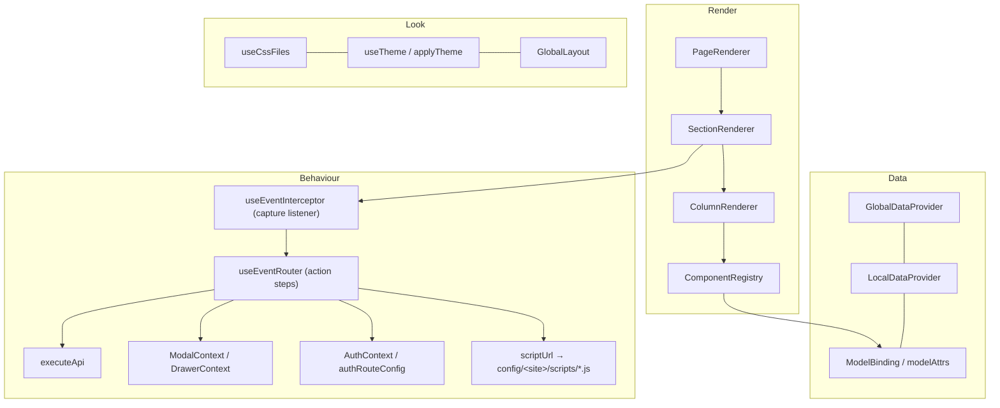
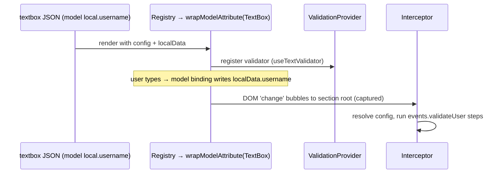

# 7 · Shared engine — `packages/`

The real product: a React library of renderers, components, providers and hooks that all the
Next.js apps import through path aliases (`@/components`, `@/hooks`, `@/utils`, `@/constants`,
`@/theme`). Not an npm workspace — just aliased folders.

## Contents

| Folder | Files | Key items |
|---|---|---|
| `components/core` | 15 + GlobalLayout | `PageRenderer`, `SectionRenderer`, `ColumnRenderer`, `ComponentRegistry`, `ModalRenderer`, `DrawerRenderer`, `LazyViewport`, `ModelAttributeWrapper`, `ValidationProvider`, `ApiLoader`, `GlobalLayout/` (Navbar, SideNavbar, Topbar, Footer) |
| `components/dynamic` | 38 | Row, Column, Card, DivBlock, TextBlock, TextBox, Button, SelectDropdown, OptionGroup, DynamicForm, Tables, Charts, Tabs, Stepper, Layers, Carousel, Accordion, FileUploader, Timer, PlanGrid, Family/SinglePlanPricing, StripeCheckout, StripePayment, StaxCollectPayment … |
| `components/data` | 4 | `GlobalDataProvider`, `LocalDataProvider`, `EventsContext`, `CompositesContext` |
| `components/editor`, `inspector`, `content` | ≈38 + 30 | Editor-only UI |
| `hooks` | 24 | `eventRouter`, `userEventInterceptor`, `useApiExecutor`, `useApiLoading`, `AuthContext`, `authRouteConfig`, `ModalContext`, `DrawerContext`, `useCssFiles`, `useTheme`, `ModelBinding`, `wrapModelAttribute`, `withContentEditable`, `configDecrypt` … |
| `utils` | 19 | `datafetch` (readData), `applyFilters`, `processTemplateTag`, `resolveHref`, `ChartKit`, `seo/*`, `editor/patchPage` |
| `theme`, `services`, `constants` | | `applyTheme`, `discount-calculator`, event types, breakpoints |

## Registered component types (≈35)

`row, multicolumn, layers, card, divblock, list, video, image, text, textbox, button, select,
optionGroup, form, dynamicOptionGroup, fileUpload, stripePayment, staxCollectPayment, timer, tabs,
stepper, conditional, familyPlanPricing, singlePlanPricing, planGrid, accordion, iconBurstSection,
scrollRevealList, testimonialMarquee, carousel, table, chart, stripeCheckout`

Almost all are wrapped: `wrapModelAttribute(Component)`; editable ones also
`withEditable('text', TextBlock)`; heavy ones are `next/dynamic({ ssr:false })`.

## Layers of the engine

## A component, end to end (TextBox)

## Design decisions worth defending

- **Event delegation + config lookup** instead of per-component handlers — components stay dumb and reusable.
- **Split context for state vs setter** (`LocalDataContext` / `LocalDataActionContext`) to cut re-renders.
- **Scripts as lazy ES modules** keep site-specific logic out of the engine but still code-split.
- **API contract as data** (`api.json`) — backend URLs and field mappings change without touching React code.
