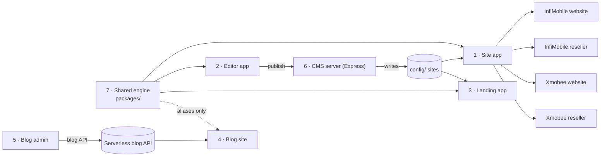
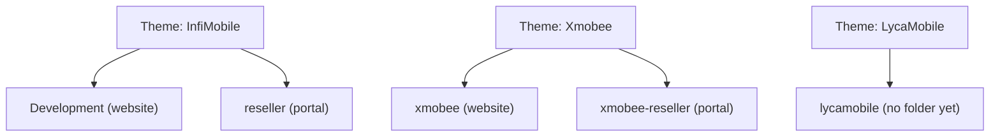

# How many projects are there? — Arya CMS (React)

**Short answer for the interview:** one repository (`arya-cms/jc-cms`) that contains
**7 code projects** (5 Next.js apps, 1 Express server, 1 shared React engine) and
**4 site projects** (JSON configurations) that the engine renders, for **2 brands**.

> "It's a monorepo-style codebase: one shared React engine in `packages/`, three main Next.js
> apps on top of it — the site renderer, the visual editor and the landing exporter — plus a
> blog pair and a small Express API for the editor. The site app renders four sites: InfiMobile
> and Xmobee public websites, and a reseller portal for each brand."

---

## A. Code projects (7)

| # | Project | Tech | Port / output | What it does | Page |
|---|---|---|---|---|---|
| 1 | **Site app** `app/site` | Next.js 14 pages router, SSR | 4010 (4011-4013 per site) | Renders any site from JSON: public websites and reseller portals | [01-site-app](01-site-app.md) |
| 2 | **Editor app** `app/editor` | Next.js 14, dnd-kit, reactflow | 3010 | Drag-and-drop visual builder, inspectors, CSS/script/SEO editors | [02-editor-app](02-editor-app.md) |
| 3 | **Landing app** `app/landing` | Next.js 14, `next export` | 5012 → S3 | Static marketing landing pages from `cmsConfig.landing` | [03-landing-app](03-landing-app.md) |
| 4 | **Blog site** `app/blog-site` | Next.js, `output:'export'`, SSG | static | Public blog reader over a serverless blog API | [04-blog-site](04-blog-site.md) |
| 5 | **Blog admin** `app/blog-admin` | Next.js, client-rendered SPA, Editor.js | static | Write drafts, publish posts, featured images, stats | [05-blog-admin](05-blog-admin.md) |
| 6 | **CMS server** `server/` | Express 5 | 5010 `/cmsapi` | Publishes JSON/CSS/scripts to disk for the editor, thumbnails, AI spellcheck | [06-cms-server](06-cms-server.md) |
| 7 | **Shared engine** `packages/` | React 18 components + hooks | library (path aliases) | Rendering pipeline, events, data, API layer, auth, theme | [07-shared-engine](07-shared-engine.md) |

## B. Site projects rendered by the engine (4)

| # | Site folder | Brand | Type | Layout | Auth | Pages | Modals | APIs | Page |
|---|---|---|---|---|---|---|---|---|---|
| 1 | `config/Development` | InfiMobile | Consumer website | top nav | modal login only | 96 | 55 | 100 | [infimobile-website](sites/infimobile-website.md) |
| 2 | `config/reseller` | InfiMobile | Reseller portal | side nav | full-page gate | 39 | 39 | 112 | [infimobile-reseller](sites/infimobile-reseller.md) |
| 3 | `config/xmobee` | Xmobee | Consumer website | top nav | modal login only | 97 | 58 | 105 | [xmobee-website](sites/xmobee-website.md) |
| 4 | `config/xmobee-reseller` | Xmobee | Reseller portal | side nav | full-page gate | 53 | 39 | 116 | [xmobee-reseller](sites/xmobee-reseller.md) |

(`config/themes/lycamobile.json` names a `lycamobile` site, but no such folder exists — it's a
placeholder brand, not a live project.)

---

## How the projects relate

## Brand grouping (what the editor shows)

