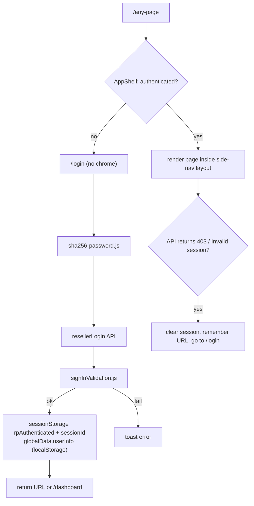
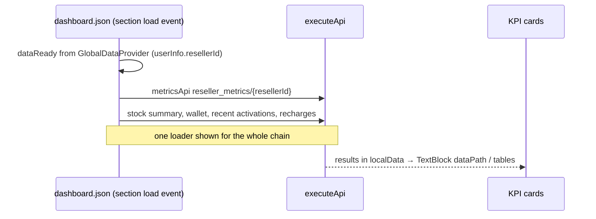
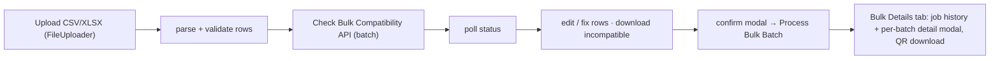

# Site 2 · InfiMobile Reseller Portal — `config/reseller`

A B2B portal for resellers, retailers and their staff: wallet, stock, activations (single and
bulk), recharges, staff/retailer management, commissions and reports. Same engine, side-nav
layout, full-page authentication.

## Facts

| Item | Value |
|---|---|
| Brand / theme | InfiMobile |
| Layout | **side nav** + topbar (wallet balance, search, light/dark toggle) |
| Auth | `required: true`, `initialPage: login`, `landingPage: dashboard` |
| Roles | Reseller Aggregator · Reseller Retailer · Reseller Staff |
| Size | 39 pages · 39 modals · 222 scripts · 25 CSS files |
| API contract | 23 backends · 112 APIs (wallet, inventory, user, KYC, MNO, payment, billing reports…) |
| External scripts | Google Analytics, Meta pixel, config-driven contact widget |
| Run | `npm run dev:reseller` (port 4011) |

## Pages

| Area | Pages |
|---|---|
| Auth | `login`, `forgot-password`, `reset-password`, `newpassword`, `verify-2fa`, `secondary-validation` |
| Home | `dashboard` (KPI cards, wallet usage donut, recent activations / recharges tables) |
| Sell | `activations` (new / port-in), `bulk-requests` (bulk upload + bulk details), `activation-status`, `recharge`, `plans` |
| Stock | `stock-request`, `return-products`, `product-management` |
| People | `staff-management`, `retailer-management`, `create-new-staff`, `create-new-reseller`, `add-commission` |
| Money | `load-wallet`, payment result pages (`payment-success-page`, `-failed-page`, `-pending`, `-timeout`, `-fraudulent`) |
| Other | `reports`, `usage`, `account`, `customer-tools` |

## Login → dashboard

## Dashboard load

## Bulk activation (bulk-requests)

## Things I can talk about here

- Dark → light theming with tokens, pre-hydration theme script, `critical.css` gotcha.
- localStorage persistence race and shimmer-forever KPIs.
- Table action buttons resolving through the `actions` mapping.
- Login page and step pages redesign inside the JSON engine (not a new app).
