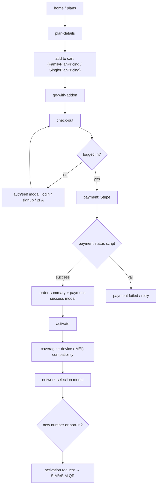

# Site 1 · InfiMobile website — `config/Development`

The public consumer website of the InfiMobile MVNO: browse plans, buy a SIM/eSIM, activate
(new number or port-in), recharge, manage the account. Default site when `ACTIVE_SITE` is unset.

## Facts

| Item | Value |
|---|---|
| Brand / theme | InfiMobile (`config/themes/infimobile.json`) |
| Layout | **top nav** (`navigationType: top`), announcement marquee, footer columns |
| Auth | `required: false` — login is a page/modal (`auth/self`), gating only actions; dashboard page `user-dashboard` |
| Size | 96 pages · 55 modals · 3 drawers · 4 landing pages · 215 scripts · 40 CSS files |
| API contract | 25 backends · 100 APIs |
| Payments | Stripe (embedded checkout / payment element) |
| External scripts | Google Analytics, Meta pixel, Stripe, Mouseflow, Front chat |
| Run | `npm run dev:site` (port 4010) |

## Page groups

| Group | Pages |
|---|---|
| Marketing | `home`, `plans`, `plan-details`, `why-us`, family/student/streaming/heavy-data plan pages, `become-a-partner`, `become-a-reseller`, `refer-a-friend`, `media`, `news`, `faqs`, `landing-page-1..7` |
| Buy | `cart-page`, `cart-drawer`, `go-with-addon`, `check-out`, `payment`, `order`, `order-summary` |
| Activate | `activate`, `check_coverage`, `compatible`, `network-selection`, `choose-how-you-like-to-connect`, `activation-third`, `trial-number-portin`, `change-carrier` |
| Account | `auth/self`, `two-factor-auth`, `2fa-opt-validation`, `forgot-password`, `reset-password`, `user-dashboard`, `account-profile`, `wallet`, `load-wallet`, `recharge`, `usage-history`, `order-history`, `transaction-history`, `track-orders` |
| Self-service | `sim-replacement`, `change-mobile-number`, `caller-id-change`, `update-address`, `disable-auto-renewal`, `refund`, `raise-ticket`, `track-tickets`, `support` |
| Legal | `terms-and-conditions`, `privacy-policy`, `911-disclosure` |

## Main customer journey

## Things I can talk about here

- Transaction number row hidden via `modelAttrs.display` on `global.transactionToken` for auto-renewals.
- IMEI-2 checkbox bug (stale merge in the interceptor) — engine-level fix.
- Front chat init race: call `show` only in `onInitCompleted`.
- Network-selection cards equalised with `flex: 1 1 0; min-width: 0`.
