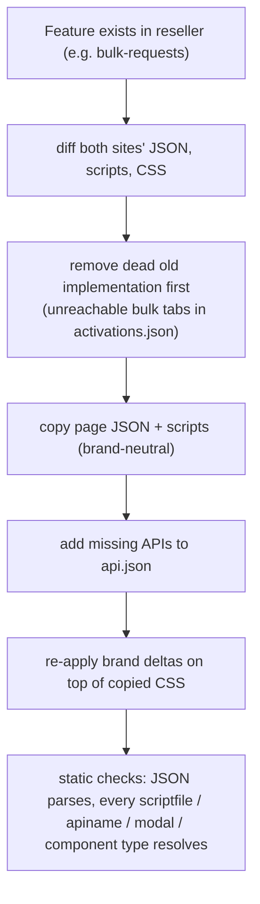
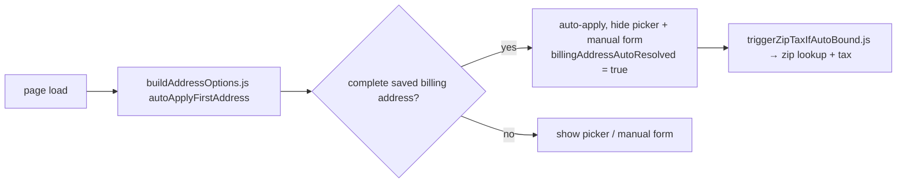

# Site 4 · Xmobee Reseller Portal — `config/xmobee-reseller`

The Xmobee brand's reseller portal. Started as a copy of the InfiMobile reseller portal and
has grown more screens: physical stock requests, retailer pricing/commissions, split reports and
customer tools.

## Facts

| Item | Value |
|---|---|
| Brand / theme | Xmobee |
| Layout | side nav + topbar, light/dark toggle |
| Auth | `required: true`, `initialPage: login`, `landingPage: dashboard` |
| Roles | Reseller Aggregator · Reseller Retailer · Reseller Staff |
| Size | 53 pages · 39 modals · 221 scripts · 25 CSS files |
| API contract | 22 backends · 116 APIs |
| Run | `npm run dev:xmobee-reseller` (port 4013) |

## Pages beyond the InfiMobile portal

| Area | Extra pages |
|---|---|
| Stock | `stock-request-physical` |
| Pricing | `staff-retail-pricing`, `retailer-pricing`, `retailer-commissions` |
| Reports | `reports-wallet-credit`, `reports-wallet-debit`, `reports-activations`, `reports-stock-balance`, `reports-commissions`, `reports-commission-transfers` |
| Customer tools | `customer-tools-trial-port`, `customer-tools-sim-swap`, `customer-tools-port-check`, `customer-tools-device-check` |

## Porting a feature between the two portals

## Saved billing address auto-bind (activations / recharge / load-wallet)

