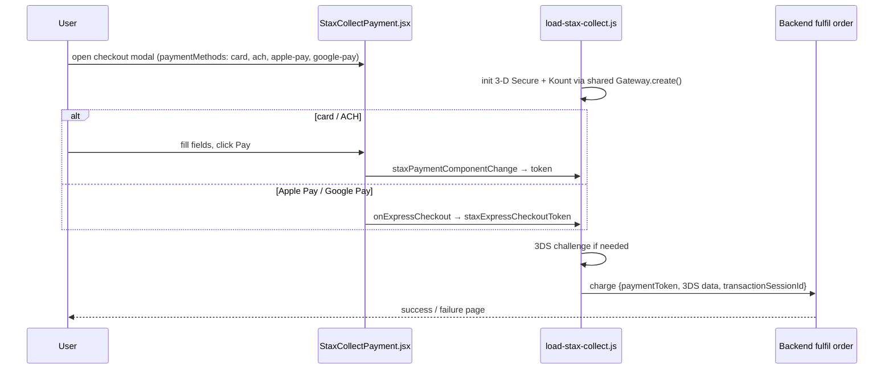

# Site 3 · Xmobee website — `config/xmobee`

The second brand's consumer website. Structurally a sibling of the InfiMobile website (same
page set, same flows), with its own branding, a light-default theme with a dark toggle, and a
different payment gateway.

## Facts

| Item | Value |
|---|---|
| Brand / theme | Xmobee (`config/themes/xmobee.json`) |
| Layout | top nav; theme toggle opted in via `header.topbar.theme.enabled` |
| Theme | light by default, `[data-rp-theme="dark"]` block in `css/theme-tokens.css` |
| Auth | `required: false`, login at `auth/self` |
| Size | 97 pages · 58 modals · 2 drawers · 3 landing pages · 225 scripts · 43 CSS files |
| API contract | 23 backends · 105 APIs |
| Payments | **NMI / Stax** (`staxCollectPayment`): card, ACH, Apple Pay, Google Pay, 3-D Secure, Kount session |
| Extra pages | `international-calling`, `login-page` |
| Run | `npm run dev:xmobee` (port 4012) |

## Checkout with NMI (Stax)

## Talking points

- "Same engine, different payment component — chosen per page in JSON."
- "Express-checkout tokens are already approved, so they skip the Pay-button gate."
- "Kount failure never blocks the charge; the session id is just omitted."
